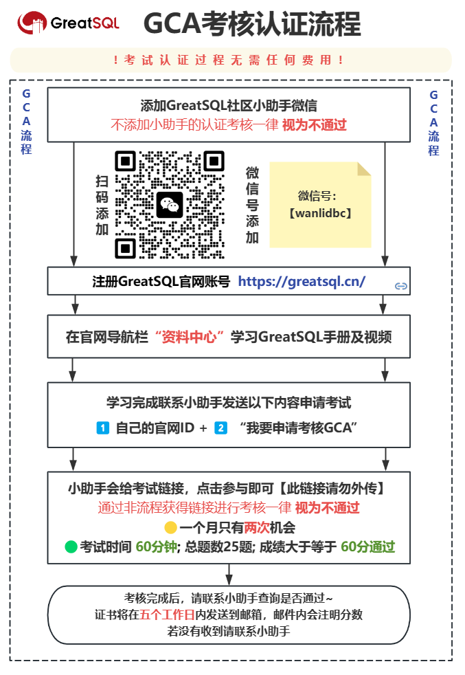
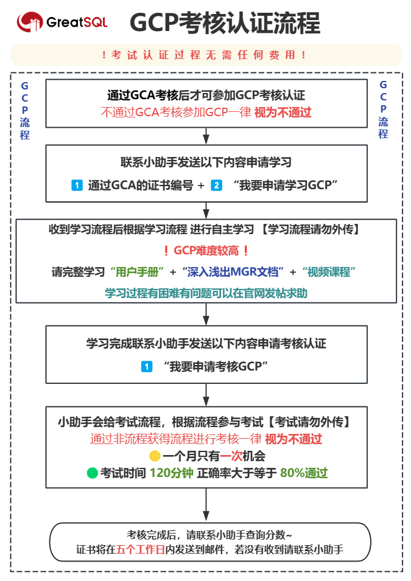

# 认证人员名单
GreatSQL社区开放GCA与GCP双等级认证课程，课程全面覆盖GreatSQL的安装、使用、优化、安全高可用等方面，包含构建主从和MGR架构，优化提升性能，安全增强配置，SQL兼容性改造，备份恢复和高可用架构搭建等实用内容，且认证免费。

## 认证简介

目前GreatSQL社区培训认证体系（GreatSQL Certified）共有两个等级，分别是**GreatSQL认证数据库专员**（GreatSQL Certified Associate，简称**GCA）**和**GreatSQL认证数据库专家**（GreatSQL Certified Professional，简称**GCP**），需先获取GCA认证之后才可参加GCP认证。

## 认证流程

> 请仔细阅读考核认证流程，有问题随时联系小助手

### GCA考核认证流程

### GCP考核认证流程

## 认证FAQ

### 1.认证需要付费吗？

郑重声明，GCA 和 GCP 等级的考核认证流程完全免费，决不收取任何费用。如果您在考核过程中收到任何需要付费的信息，请您立即保留证据，及时联系 GreatSQL 社区小助手进行反馈。

### 2.怎么算通过？

GCA 和 GCP 等级考核之间的难易程度存在一定差异:

GCA 考核难度相对较低，总题数：25题；25题不定项选择题；总分为100分，只要获得60分即可顺利通过。这是对数据库基础知识与基本操作技能的一个检验，目的在于鼓励更多学习者能够参与考核并获得认证。

而 GCP 考核难度较高，总题数：70题；45题不定项选择题；25题判断题；总分230分，需分数达到184分（既正确率>=80%）通过考核。这对数据库管理与运维技能有较高要求，是对实际工作能力的全面检验。

### 3.证书怎么发放？

在考核过程中，我们在试卷会收集您的邮箱信息。如果您顺利通过考核，证书会在五个工作日内发送到您留存的邮箱。如果超过五个工作日您仍未收到证书，请及时联系我们的小助手。我们会认真核查并尽快为您处理证书问题。

### 4.认证可以考几次？

我们衷心希望您能够真正地认识和了解 GreatSQL 这个开源免费数据库，并掌握使用与操作的技能。考证的目的在于检验实际能力，而不应仅为获得证书而来做无意义的重复考试。为此，我们决定对考核次数作出一定调整:

- GCA 等级认证一个月仅限考试两次
- GCP 等级认证一个月仅限考试一次

这些限制会因情况而定，目的在于保证考试的公正性和考证的价值。感谢您的理解与支持，让考核回归本质，共同提升数据库技术与应用水平。祝学习进步!

## 认证通过名单

通过GCA等级考核人员名单（1~100）：

| 序号 | 姓名  | 证书编号           | 序号 | 姓名  | 证书编号           |
| ---- | ----- | ------------------ | ---- | ----- | ------------------ |
| 1    | 张*   | GCA-DBA-2024232751 | 51   | 董*飞 | GCA-DBA-2024125327 |
| 2    | 严*   | GCA-DBA-2024362392 | 52   | 朱*明 | GCA-DBA-2024154326 |
| 3    | 傅*樑 | GCA-DBA-2024201540 | 53   | 孙*   | GCA-DBA-2024200746 |
| 4    | 刘*福 | GCA-DBA-2024312060 | 54   | 武*   | GCA-DBA-2024205533 |
| 5    | 韦*   | GCA-DBA-2024497488 | 55   | 王*超 | GCA-DBA-2024206144 |
| 6    | 陈*   | GCA-DBA-2024171580 | 56   | 王*全 | GCA-DBA-2024400695 |
| 7    | 汪*阳 | GCA-DBA-2024170490 | 57   | 周*峰 | GCA-DBA-2024402524 |
| 8    | 王*   | GCA-DBA-2024254621 | 58   | 高*   | GCA-DBA-2024421596 |
| 9    | 李*侠 | GCA-DBA-2024315648 | 59   | 张*   | GCA-DBA-2024427113 |
| 10   | 林*嘉 | GCA-DBA-2024367964 | 60   | 蒋*峰 | GCA-DBA-2024203130 |
| 11   | 江*槿 | GCA-DBA-2024328560 | 61   | 范*辉 | GCA-DBA-2024215251 |
| 12   | 王*   | GCA-DBA-2024909189 | 62   | 赵*前 | GCA-DBA-2024220611 |
| 13   | 徐*   | GCA-DBA-2024352316 | 63   | 陈*   | GCA-DBA-2024225379 |
| 14   | 宋*富 | GCA-DBA-2024408525 | 64   | 沈*   | GCA-DBA-2024230706 |
| 15   | 王*军 | GCA-DBA-2024153179 | 65   | 徐*荣 | GCA-DBA-2024155235 |
| 16   | 苏*荣 | GCA-DBA-2024298793 | 66   | 杨*宁 | GCA-DBA-2024156875 |
| 17   | 乔*东 | GCA-DBA-2024300050 | 67   | 张*   | GCA-DBA-2024151026 |
| 18   | 田*   | GCA-DBA-2024300755 | 68   | 宋*兵 | GCA-DBA-2024277985 |
| 19   | 赵*星 | GCA-DBA-2024301378 | 69   | 郭*雷 | GCA-DBA-2024219471 |
| 20   | 张*   | GCA-DBA-2024302071 | 70   | 郇*虎 | GCA-DBA-2024225155 |
| 21   | 赵*   | GCA-DBA-2024383657 | 71   | 褚*成 | GCA-DBA-2024229492 |
| 22   | 贾*特 | GCA-DBA-2024205972 | 72   | 雷*霆 | GCA-DBA-2024235904 |
| 23   | 赵*皓 | GCA-DBA-2024131072 | 73   | 陈*丽 | GCA-DBA-2024240720 |
| 24   | 李*红 | GCA-DBA-2024137218 | 74   | 叶*旸 | GCA-DBA-2024245331 |
| 25   | 计*   | GCA-DBA-2024138075 | 75   | 陈*钦 | GCA-DBA-2024251300 |
| 26   | 王*硕 | GCA-DBA-2024138790 | 76   | 刘*宝 | GCA-DBA-2024256032 |
| 27   | 肖*飞 | GCA-DBA-2024151349 | 77   | 王*娇 | GCA-DBA-2024260542 |
| 28   | 关*娥 | GCA-DBA-2024156059 | 78   | 李*杰 | GCA-DBA-2024265806 |
| 29   | 李*   | GCA-DBA-2024318663 | 79   | 崔*   | GCA-DBA-2024266207 |
| 30   | 徐*   | GCA-DBA-2024324866 | 80   | 汤*霞 | GCA-DBA-2024420383 |
| 31   | 肖*   | GCA-DBA-2024329601 | 81   | 杜*朝 | GCA-DBA-2024420985 |
| 32   | 张*   | GCA-DBA-2024339552 | 82   | 万*好 | GCA-DBA-2024395063 |
| 33   | 刘*   | GCA-DBA-2024345286 | 83   | 邓*阳 | GCA-DBA-2024386984 |
| 34   | 周*欢 | GCA-DBA-2024350281 | 84   | 陈*聪 | GCA-DBA-2024373322 |
| 35   | 张*   | GCA-DBA-2024355528 | 85   | 张*   | GCA-DBA-2024338054 |
| 36   | 廖*康 | GCA-DBA-2024360327 | 86   | 史*真 | GCA-DBA-2024339732 |
| 37   | 李*   | GCA-DBA-2024364995 | 87   | 周*军 | GCA-DBA-2024350342 |
| 38   | 王*   | GCA-DBA-2024370371 | 88   | 吴*开 | GCA-DBA-2024358958 |
| 39   | 张*娟 | GCA-DBA-2024374986 | 89   | 古*   | GCA-DBA-2024368379 |
| 40   | 汤*   | GCA-DBA-2024379991 | 90   | 王*欢 | GCA-DBA-2024373712 |
| 41   | 沈*宇 | GCA-DBA-2024385179 | 91   |       |                    |
| 42   | 齐*   | GCA-DBA-2024389728 | 92   |       |                    |
| 43   | 陈*   | GCA-DBA-2024394793 | 93   |       |                    |
| 44   | 张*   | GCA-DBA-2024399727 | 94   |       |                    |
| 45   | 张*   | GCA-DBA-2024404365 | 95   |       |                    |
| 46   | 陈*超 | GCA-DBA-2024408806 | 96   |       |                    |
| 47   | 谢*慧 | GCA-DBA-2024414602 | 97   |       |                    |
| 48   | 杨*刚 | GCA-DBA-2024420048 | 98   |       |                    |
| 49   | 刘*丞 | GCA-DBA-2024424953 | 99   |       |                    |
| 50   | 张*玉 | GCA-DBA-2024176663 | 100  |       |                    |

通过GCP等级考核人员名单：

| 序号 | 姓名  | 证书编号           |
| ---- | ----- | ------------------ |
| 1    | 宋*兵 | GCP-DBA-2024368620 |
| 2    | 周*欢 | GCP-DBA-2024132675 |
| 3    | 朱*明 | GCP-DBA-2024140181 |
| 4    | 肖*   | GCP-DBA-2024361897 |
| 5    | 万*好 | GCP-DBA-2024368029 |
| 6    | 严*   | GCP-DBA-2024151099 |
| 7    | 李*红 | GCP-DBA-2024157227 |

**问题反馈**
---

- [问题反馈 gitee](https://gitee.com/GreatSQL/GreatSQL-Manual/issues)

**联系我们**
---

扫码关注微信公众号

