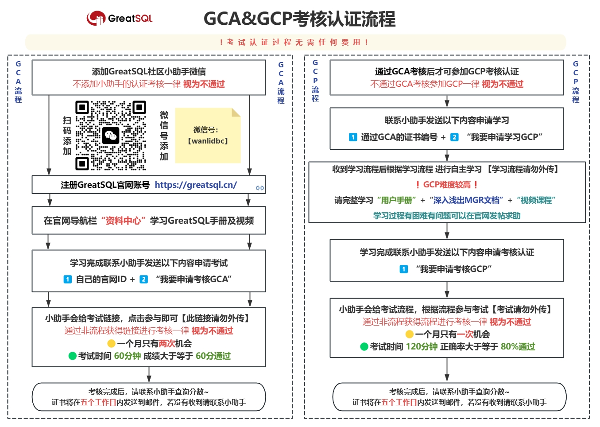

# 认证人员名单
GreatSQL社区开放GCA与GCP双等级认证课程，课程全面覆盖GreatSQL的安装、使用、优化、安全高可用等方面，包含构建主从和MGR架构，优化提升性能，安全增强配置，SQL兼容性改造，备份恢复和高可用架构搭建等实用内容，且认证免费。

## 认证简介

目前GreatSQL社区培训认证体系（GreatSQL Certified）共有两个等级，分别是**GreatSQL认证数据库专员**（GreatSQL Certified Associate，简称**GCA）**和**GreatSQL认证数据库专家**（GreatSQL Certified Professional，简称**GCP**），需先获取GCA认证之后才可参加GCP认证。

## 认证通过名单

通过GCA等级考核人员名单：

| 序号 | 姓名  | 证书编号           | 通过时间 |
| ---- | ----- | ------------------ | -------- |
| 1    | 张*   | GCA-DBA-2024232751 | 2024/1/2 |
| 2    | 严*超 | GCA-DBA-2024362392 | 2024/1/2 |
| 3    | 傅*樑 | GCA-DBA-2024201540 | 2024/1/3 |
| 4    | 刘*福 | GCA-DBA-2024312060 | 2024/1/3 |
| 5    | 韦*   | GCA-DBA-2024497488 | 2024/1/3 |
| 6    | 陈*   | GCA-DBA-2024171580 | 2024/1/3 |
| 7    | 汪*阳 | GCA-DBA-2024170490 | 2024/1/4 |
| 8    | 王*   | GCA-DBA-2024254621 | 2024/1/5 |
| 9    | 李*侠 | GCA-DBA-2024315648 | 2024/1/5 |
| 10   | 林*嘉 | GCA-DBA-2024367964 | 2024/1/5 |
| 11   | 江*槿 | GCA-DBA-2024328560 | 2024/1/5 |
| 12   | 王*   | GCA-DBA-2024909189 | 2024/1/5 |
| 13   | 徐*   | GCA-DBA-2024352316 | 2024/1/5 |
| 14   | 宋*富 | GCA-DBA-2024408525 | 2024/1/5 |
| 15   | 王*军 | GCA-DBA-2024153179 | 2024/1/5 |
| 16   | 苏*荣 | GCA-DBA-2024298793 | 2024/1/5 |
| 17   | 乔*东 | GCA-DBA-2024300050 | 2024/1/6 |
| 18   | 田*   | GCA-DBA-2024300755 | 2024/1/6 |
| 19   | 赵*星 | GCA-DBA-2024301378 | 2024/1/6 |
| 20   | 张*   | GCA-DBA-2024302071 | 2024/1/6 |
| 21   | 赵*   | GCA-DBA-2024383657 | 2024/1/8 |

通过GCP等级考核人员名单：

| 序号 | 姓名 | 证书编号 | 通过时间 |
| ---- | ---- | -------- | -------- |
|      |      |          |          |
|      |      |          |          |

## 认证流程

> 请仔细阅读考核认证流程，有问题随时联系小助手

## 认证FAQ

### 1.认证需要付费吗？

我们郑重声明，GCA 和 GCP 等级的考核认证流程完全免费，决不收取任何费用。如果您在考核过程中收到任何需要付费的信息，请您立即保留证据，及时联系 GreatSQL 社区小助手进行反馈。

### 2.怎么算通过？

GCA 和 GCP 等级考核之间的难易程度存在一定差异:

GCA 考核难度相对较低，总分为100分,只要获得60分即可顺利通过。这是对数据库基础知识与基本操作技能的一个检验,目的在于鼓励更多学习者能够参与考核并获得认证。

而 GCP 考核难度较高，需要正确率达到80%才可通过考核。这对数据库管理与运维技能有较高要求，是对实际工作能力的全面检验。

### 3.证书怎么发放？

在考核过程中，我们在试卷会收集您的邮箱信息。如果您顺利通过考核，证书会在五个工作日内发送到您留存的邮箱。如果超过五个工作日您仍未收到证书，请及时联系我们的小助手。我们会认真核查并尽快为您处理证书问题。

### 4.认证可以考几次？

我们衷心希望您能够真正地认识和了解 GreatSQL 这个开源免费数据库，并掌握使用与操作的技能。考证的目的在于检验实际能力，而不应仅为获得证书而来做无意义的重复考试。为此，我们决定对考核次数作出一定调整:

- GCA 等级认证一个月仅限考试两次
- GCP 等级认证一个月仅限考试一次

这些限制会因情况而定，目的在于保证考试的公正性和考证的价值。感谢您的理解与支持，让考核回归本质，共同提升数据库技术与应用水平。祝学习进步!

**问题反馈**
---

- [问题反馈 gitee](https://gitee.com/GreatSQL/GreatSQL-Manual/issues)

**联系我们**
---

扫码关注微信公众号

