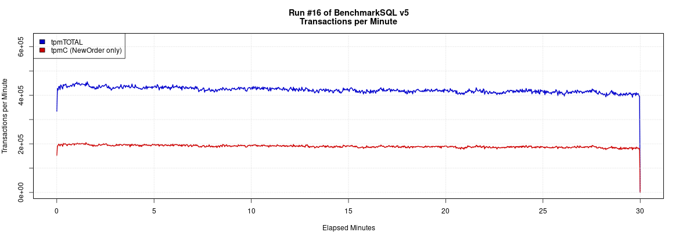

# BenchmarkSQL 性能测试

BenchmarkSQL 是一个开源的 Java 应用程序，用于评估数据库系统在 OLTP 场景下的性能，它是符合 TPC-C 基准压力测试的工具。它最初由 HammerDB 的作者开发，后来由 Cloud V LLC 维护。

TPC-C 模型是模拟一个商品批发公司的销售模型，这个模型涵盖了一个批发公司面向客户对一系列商品进行销售的过程，这包括管理订单，管理库存，管理账号收支等操作。这些操作涉及到仓库、商品、客户、订单等概念，围绕这些概念，构造了数据表格，以及相应的数据库操作。

BenchmarkSQL 支持 MySQL（Percona、GreatSQL）、PostgreSQL、Oracle、SQL Server 等。

## 主要特性
- **标准化的测试**：基于 TPC-C 和 TPC-E 的标准基准测试，提供了一套公平的测试方案。
- **可扩展性**：支持多客户端并发测试，可以根据需要调整测试规模。
- **详细的报告**：测试完成后生成详细的性能报告，包括事务吞吐量、延迟、资源使用情况等。
- **跨平台**：由于基于 Java，BenchmarkSQL 可以在多种操作系统上运行。

## 如何使用 BenchmarkSQL 测试 GreatSQL

下面以 CentOS 8.x x86_64 环境为例，介绍如何安装配置使用 BenchmarkSQL。

### 1. 准备环境
- **下载 BenchmarkSQL**：在[这里下载 BenchmarkSQL 官方最新版本](https://sourceforge.net/projects/benchmarksql/files/)。

这里开个分支，可以选择下载[GreatSQL社区修改后的 BenchmarkSQL 分支版本](https://gitee.com/GreatSQL/benchmarksql)，其好处有几点：

- 无需再做一次下面提到的修改调整；
- 增加支持MySQL/GreatSQL数据库；
- 增加MySQL连接驱动mysql-connector-j-8.0.33.jar；
- 优化bmsql_oorder表，增加o_c_id单列索引；
- 修改runDatabaseBuild.sh中的AFTER_LOAD的动作，无需再创建索引外键等操作。

可以用 git 客户端将代码下载到本地：

```bash
$ cd /usr/local
$ git clone https://gitee.com/GreatSQL/benchmarksql.git
$ cd benchmarksql
```
之后就可以跳过下方提到的修改 src 目录下几个 java 文件以及 `tableCreates.sql` 这个SQL脚本，直接从修改 `props.mysql` 配置文件开始。

回到原生 BenchmarkSQL 的路线上，下载完 BenchmarkSQL 压缩包后，解压缩放在 /usr/local 目录下

```bash
$ cd /usr/local
$ curl -OL -o benchmarksql-5.0.zip "https://jaist.dl.sourceforge.net/project/benchmarksql/benchmarksql-5.0.zip?viasf=1"
$ unzip benchmarksql-5.0.zip
$ cd benchmarksql-5.0
$ ls
build.xml  doc  HOW-TO-RUN.txt  lib  README.md  run  src
```

- **安装 Java**：BenchmarkSQL 需要 Java 运行环境，确保系统中安装了 JDK 8 或更高版本。

此外，还要安装 Apache Ant，它是一个将软件编译、测试、部署等步骤联系在一起加以自动化的一个工具。用于编译 Benchmark SQL。

```bash
yum install -y java-1.8.0-openjdk ant
```

配置 Apache-Ant 的环境变量：

```bash
echo 'export ANT_HOME=/usr/share/ant-1.9.4' >> ~/.bash_profile
echo 'export PATH=${ANT_HOME}/bin:$PATH' >> ~/.bash_profile
source ~/.bash_profile
```

检查 Java 运行环境是否可用：

```bash
$ java -version
openjdk version "1.8.0_312"
OpenJDK Runtime Environment (build 1.8.0_312-b07)
OpenJDK 64-Bit Server VM (build 25.312-b07, mixed mode)

$ ant -version
Apache Ant(TM) version 1.10.5 compiled on June 24 2019
```

### 2. 配置 BenchmarkSQL

1. 修改 `src/client/jTPCC.java` 文件 119 行附近，增加 MySQL/GreatSQL 数据库相关内容。

```java
117         if (iDB.equals("firebird"))
118             dbType = DB_FIREBIRD;
119         else if (iDB.equals("mysql"))
120             dbType = DB_MYSQL;
121         else if (iDB.equals("oracle"))
122             dbType = DB_ORACLE;
123         else if (iDB.equals("postgres"))
124             dbType = DB_POSTGRES;
```

修改 `src/client/jTPCCConfig.java` 文件 17 行附近，增加 MySQL/GreatSQL 数据库类型。

```java
 16     public final static int     DB_UNKNOWN = 0,
 17                                 DB_FIREBIRD = 1,
 18                                 DB_MYSQL = 4,
 19                                 DB_ORACLE = 2,
 20                                 DB_POSTGRES = 3;
```

2. 修改 `src/client/jTPCCConnection.java` 文件 225 行附近，在 SQL 子查询增加 `AS L` 别名。

```java
211             default:
212                 stmtStockLevelSelectLow = dbConn.prepareStatement(
213                     "SELECT count(*) AS low_stock FROM (" +
214                     "    SELECT s_w_id, s_i_id, s_quantity " +
215                     "        FROM bmsql_stock " +
216                     "        WHERE s_w_id = ? AND s_quantity < ? AND s_i_id IN (" +
217                     "            SELECT ol_i_id " +
218                     "                FROM bmsql_district " +
219                     "                JOIN bmsql_order_line ON ol_w_id = d_w_id " +
220                     "                 AND ol_d_id = d_id " +
221                     "                 AND ol_o_id >= d_next_o_id - 20 " +
222                     "                 AND ol_o_id < d_next_o_id " +
223                     "                WHERE d_w_id = ? AND d_id = ? " +
224                     "        ) " +
225                     "    ) AS L");
226                 break;
```

3. 编辑一份适合 MySQL/GreatSQL 的表 DDL 文件。 

```bash
cd /usr/local/benchmarksql-5.0/run
cp -rf sql.common/ sql.mysql
```

编辑 `sql.mysql/tableCreates.sql` 文件，对每个表都加上使用 InnoDB 引擎的声明，以及每个表都要有显式主键的定义。此外，还要对 `bmsql_oorder` 表额外增加一个索引，根据对测试过程中产生的慢查询日志进行分析，增加该索引可有效提升测试性能。

```sql
create table bmsql_config (
  cfg_name    varchar(30) primary key,
  cfg_value   varchar(50)
) engine = innodb;

create table bmsql_warehouse (
  w_id        integer   not null,
  w_ytd       decimal(12,2),
  w_tax       decimal(4,4),
  w_name      varchar(10),
  w_street_1  varchar(20),
  w_street_2  varchar(20),
  w_city      varchar(20),
  w_state     char(2),
  w_zip       char(9),
  primary key (w_id)
) engine = innodb;

create table bmsql_district (
  d_w_id       integer       not null,
  d_id         integer       not null,
  d_ytd        decimal(12,2),
  d_tax        decimal(4,4),
  d_next_o_id  integer,
  d_name       varchar(10),
  d_street_1   varchar(20),
  d_street_2   varchar(20),
  d_city       varchar(20),
  d_state      char(2),
  d_zip        char(9),
  primary key (d_w_id, d_id)
) engine = innodb;

create table bmsql_customer (
  c_w_id         integer        not null,
  c_d_id         integer        not null,
  c_id           integer        not null,
  c_discount     decimal(4,4),
  c_credit       char(2),
  c_last         varchar(16),
  c_first        varchar(16),
  c_credit_lim   decimal(12,2),
  c_balance      decimal(12,2),
  c_ytd_payment  decimal(12,2),
  c_payment_cnt  integer,
  c_delivery_cnt integer,
  c_street_1     varchar(20),
  c_street_2     varchar(20),
  c_city         varchar(20),
  c_state        char(2),
  c_zip          char(9),
  c_phone        char(16),
  c_since        timestamp,
  c_middle       char(2),
  c_data         varchar(500),
  primary key (c_w_id, c_d_id, c_id)
) engine = innodb;

create table bmsql_history (
  hist_id  integer AUTO_INCREMENT,
  h_c_id   integer,
  h_c_d_id integer,
  h_c_w_id integer,
  h_d_id   integer,
  h_w_id   integer,
  h_date   timestamp,
  h_amount decimal(6,2),
  h_data   varchar(24),
  primary key (hist_id,h_w_id)
) engine = innodb;

create table bmsql_new_order (
  no_w_id  integer   not null,
  no_d_id  integer   not null,
  no_o_id  integer   not null,
  primary key (no_w_id, no_d_id, no_o_id)
) engine = innodb;

create table bmsql_oorder (
  o_w_id       integer      not null,
  o_d_id       integer      not null,
  o_id         integer      not null,
  o_c_id       integer,
  o_carrier_id integer,
  o_ol_cnt     integer,
  o_all_local  integer,
  o_entry_d    timestamp,
  primary key (o_w_id, o_d_id, o_id),
  k1 (o_c_id)
) engine = innodb;

create table bmsql_order_line (
  ol_w_id         integer   not null,
  ol_d_id         integer   not null,
  ol_o_id         integer   not null,
  ol_number       integer   not null,
  ol_i_id         integer   not null,
  ol_delivery_d   timestamp,
  ol_amount       decimal(6,2),
  ol_supply_w_id  integer,
  ol_quantity     integer,
  ol_dist_info    char(24),
  primary key (ol_w_id, ol_d_id, ol_o_id, ol_number)
) engine = innodb;

create table bmsql_item (
  i_id     integer      not null,
  i_name   varchar(24),
  i_price  decimal(5,2),
  i_data   varchar(50),
  i_im_id  integer,
  primary key (i_id)
) engine = innodb;

create table bmsql_stock (
  s_w_id       integer       not null,
  s_i_id       integer       not null,
  s_quantity   integer,
  s_ytd        integer,
  s_order_cnt  integer,
  s_remote_cnt integer,
  s_data       varchar(50),
  s_dist_01    char(24),
  s_dist_02    char(24),
  s_dist_03    char(24),
  s_dist_04    char(24),
  s_dist_05    char(24),
  s_dist_06    char(24),
  s_dist_07    char(24),
  s_dist_08    char(24),
  s_dist_09    char(24),
  s_dist_10    char(24),
  primary key (s_w_id, s_i_id)
) engine = innodb;
```

4. 修改 `run/runDatabaseBuild.sh` 文件 17 行附近，定义数据加载结束时的后续工作，去掉创建外键操作。

```bash
 17 #AFTER_LOAD="indexCreates foreignKeys extraHistID buildFinish"
 18 AFTER_LOAD="indexCreates buildFinish"
```

5. 修改 `run/funcs.sh` 文件 31 和 54 行附近，添加 MySQL/GreatSQL 数据库类型。

```bash
 28         firebird)
 29             cp="../lib/firebird/*:../lib/*"
 30             ;;
 31         mysql)
 32             cp="../lib/mysql/*:../lib/*"
 33             ;;
 34         oracle)
...
 53 case "$(getProp db)" in
 54     firebird|mysql|oracle|postgres)
 55         ;;
```

访问 [MySQL官网下载站](https://downloads.mysql.com/archives/c-j/)，下载 MySQL 驱动 jar 包：

```bash
$ cd /usr/local/benchmarksql-5.0/lib
$ mkdir -p mysql
$ cd mysql
$ curl -OL -o mysql-connector-j-8.0.33.tar.gz https://downloads.mysql.com/archives/get/p/3/file/mysql-connector-j-8.0.33.tar.gz
$ tar xf mysql-connector-j-8.0.33.tar.gz mysql-connector-j-8.0.33/mysql-connector-j-8.0.33.jar
$ mv mysql-connector-j-8.0.33/mysql-connector-j-8.0.33.jar .
$ pwd
/usr/local/benchmarksql-5.0/lib/mysql

$ ls -l
-rw-r--r-- 1 root root 2481560 Mar  8  2023 mysql-connector-j-8.0.33.jar
```

如果还是用较早版本的驱动（例如 *mysql-connector-java-8.0.30.jar*），可能会有类似下面的提示：

```log
Loading class `com.mysql.jdbc.Driver'. This is deprecated. The new driver class is `com.mysql.cj.jdbc.Driver'. The driver is automatically registered via the SPI and manual loading of the driver class is generally unnecessary.
```

6. 重新编译修改后的源码。

```bash
$ cd /usr/local/benchmarksql-5.0
$ ant
Buildfile: /usr/local/benchmarksql-5.0/build.xml

init:

compile:
    [javac] Compiling 11 source files to /usr/local/benchmarksql-5.0/build

dist:
      [jar] Building jar: /usr/local/benchmarksql-5.0/dist/BenchmarkSQL-5.0.jar

BUILD SUCCESSFUL
Total time: 0 seconds
```

7. 编辑配置文件 `run/props.greatsql`，配置 GreatSQL 数据库的连接信息，例如数据库地址、端口、用户名和密码等。

参考下方内容，编辑 `/usr/local/benchmarksql-5.0/run/props.greatsql` 文件：
```ini
db=mysql
driver=com.mysql.jdbc.Driver
conn=jdbc:mysql://localhost:3306/bmsql?useServerPrepStmts=false&prepStmtCacheSize=250&allowPublicKeyRetrieval=true&useSSL=false&serverTimezone=GMT&useLocalSessionState=true&maintainTimeStats=false&useUnicode=true&characterEncoding=utf8&rewriteBatchedStatements=true&cacheResultSetMetadata=true&metadataCacheSize=1024&useConfigs=maxPerformance
user=bmsql
password=bmsql

warehouses=1000
loadWorkers=32

terminals=32
runTxnsPerTerminal=0
runMins=10
limitTxnsPerMin=0

terminalWarehouseFixed=true

newOrderWeight=45
paymentWeight=43
orderStatusWeight=4
deliveryWeight=4
stockLevelWeight=4

resultDirectory=my_result_%tY-%tm-%td_%tH%tM%tS
osCollectorScript=./misc/os_collector_linux.py
osCollectorInterval=1
```

主要参数说明
- `db=mysql`，指定数据库类型。
- `driver=com.mysql.jdbc.Driver`，指定驱动程序文件，这里是 MySQL JDBC 驱动。
- `conn`, `user`, `password`，指定 GreatSQL 数据库连接IP、端口、账号名、密码、默认数据库等。
- `warehouses`，指定仓库数，仓库数决定性能测试的成绩。对于高配服务器（32C96G以上），建议至少 1000 仓或更高。
- `loadWorkers`，指定加载数据时的并发数。如果是高配服务器，该值可以设置大一些，例如 100，一般和服务器的逻辑 CPU 核数一样即可。过高的并发可能会导致内存消耗太快，出现报错，导致数据加载需要重新进行。
- `terminals`，指定性能压测时的并发数。建议并发数不要高于服务器的逻辑 CPU 核数。否则可能产生过多锁等待。
- `runTxnsPerTerminal`，指定每个终端执行的事务数量。如果该参数配置为非0时，则 `runMins` 参数必须设置为0。
- `runMins`，指定性能测试持续的时间（分钟）。如果该值设置为非0值时，runTxnsPerTerminal参数必须设置为0。时间越久，越能考验数据库的性能和稳定性。建议不要少于 10 分钟，生产环境中机器建议不少于 1 小时。
- `limitTxnsPerMin`，每分钟事务总数限制，该参数主要控制每分钟处理的事务数，事务数受 `terminals` 参数的影响，`limitTxnsPerMin/terminals` 运算后结果值必须是正整数。
- `terminalWarehouseFixed`，终端和仓库的绑定模式，设置为 **true** 时可以运行 4.x 兼容模式，意思为每个终端都有一个固定的仓库。设置为 **false** 时可以均匀的使用数据库整体配置。TPC-C 规则要求每个终端都必须有一个绑定的仓库，所以一般使用默认值 **true**。
- 下面五个值的总和必须等于100，默认值为：45, 43, 4, 4，4 ，与 TPC-C 测试定义的比例一致，实际操作过程中，可以调整比重来适应各种场景。
  - `newOrderWeight=45`，新订单事务占总事务的45%。
  - `paymentWeight=43`，支付订单事务占总事务的43%。
  - `orderStatusWeight=4`，订单状态事务占总事务的4%。
  - `deliveryWeight=4`，到货日期事务占总事务的4%。
  - `stockLevelWeight=4`，查看现存货品的事务占总事务的4%。
- `resultDirectory`，压测期间收集系统性能数据的目录。
- `osCollectorScript`，操作系统性能收集脚本。
- `osCollectorInterval`，操作系统收集操作间隔（单位：秒），默认为1秒。
- `osCollectorSSHAddr`，需要收集系统性能的主机。
- `osCollectorDevices`，操作系统中被收集服务器的网卡名称和磁盘名称。

### 3. 运行 BenchmarkSQL 测试

- **初始化数据库**

创建测试数据库，相应的账户，以及授权：

```sql
greatsql> CREATE DATABASE bmsql;
greatsql> CREATE USER bmsql IDENTIFIED BY 'bmsql';
greatsql> GRANT ALL ON bmsql.* TO bmsql;
greatsql> SHOW GRANTS FOR bmsql;
+--------------------------------------------------+
| Grants for bmsql@%                               |
+--------------------------------------------------+
| GRANT USAGE ON *.* TO `bmsql`@`%`                |
| GRANT ALL PRIVILEGES ON `bmsql`.* TO `bmsql`@`%` |
+--------------------------------------------------+
```

运行 `run/runDatabaseBuild.sh`，创建测试数据表并填充数据。

```bash
$ cd /usr/local/benchmarksql-5.0/run
$ ./runDatabaseBuild.sh ./props.greatsql

# ------------------------------------------------------------
# Loading SQL file ./sql.mysql/tableCreates.sql
# ------------------------------------------------------------
Loading class `com.mysql.jdbc.Driver'. This is deprecated. The new driver class is `com.mysql.cj.jdbc.Driver'. The driver is automatically registered via the SPI and manual loading of the driver class is generally unnecessary.
create table bmsql_config (
cfg_name    varchar(30) primary key,
cfg_value   varchar(50)
);
...
Starting BenchmarkSQL LoadData

driver=com.mysql.jdbc.Driver
Loading class `com.mysql.jdbc.Driver'. This is deprecated. The new driver class is `com.mysql.cj.jdbc.Driver'. The driver is automatically registered via the SPI and manual loading of the driver class is generally unnecessary.
conn=jdbc:mysql://localhost:3306/bmsql?useServerPrepStmts=false&prepStmtCacheSize=250&allowPublicKeyRetrieval=true&useSSL=false&serverTimezone=GMT&useLocalSessionState=true&maintainTimeStats=false&useUnicode=true&characterEncoding=utf8&rewriteBatchedStatements=true&cacheResultSetMetadata=true&metadataCacheSize=1024&useConfigs=maxPerformance
user=bmsql
password=***********
warehouses=5
loadWorkers=2
fileLocation (not defined)
csvNullValue (not defined - using default 'NULL')

Worker 000: Loading ITEM
Worker 001: Loading Warehouse      1
Worker 000: Loading ITEM done
...
# ------------------------------------------------------------
# Loading SQL file ./sql.mysql/indexCreates.sql
# ------------------------------------------------------------
...
# ------------------------------------------------------------
# Loading SQL file ./sql.mysql/buildFinish.sql
# ------------------------------------------------------------
Loading class `com.mysql.jdbc.Driver'. This is deprecated. The new driver class is `com.mysql.cj.jdbc.Driver'. The driver is automatically registered via the SPI and manual loading of the driver class is generally unnecessary.
-- ----
-- Extra commands to run after the tables are created, loaded,
-- indexes built and extra's created.
-- ----
```

测试数据加载完毕。

::: tip 小贴士
如果安装的Java运行时版本（JRE）太旧的话，可能会有类似下面的报错信息

```log
# ------------------------------------------------------------
# Loading SQL file ./sql.mysql/tableCreates.sql
# ------------------------------------------------------------
Error: A JNI error has occurred, please check your installation and try again
Exception in thread "main" java.lang.UnsupportedClassVersionError: ExecJDBC has been compiled by a more recent version of the Java Runtime (class file version 61.0), this version of the Java Runtime only recognizes class file versions up to 52.0
    at java.lang.ClassLoader.defineClass1(Native Method)
    at java.lang.ClassLoader.defineClass(ClassLoader.java:756)
    at java.security.SecureClassLoader.defineClass(SecureClassLoader.java:142)
    at java.net.URLClassLoader.defineClass(URLClassLoader.java:473)
    at java.net.URLClassLoader.access$100(URLClassLoader.java:74)
    at java.net.URLClassLoader$1.run(URLClassLoader.java:369)
    at java.net.URLClassLoader$1.run(URLClassLoader.java:363)
    at java.security.AccessController.doPrivileged(Native Method)
    at java.net.URLClassLoader.findClass(URLClassLoader.java:362)
    at java.lang.ClassLoader.loadClass(ClassLoader.java:418)
    at sun.misc.Launcher$AppClassLoader.loadClass(Launcher.java:352)
    at java.lang.ClassLoader.loadClass(ClassLoader.java:351)
    at sun.launcher.LauncherHelper.checkAndLoadMain(LauncherHelper.java:621)
```

这种情况下，升级Java版本即可，可参考下面的操作：

```bash
# 先卸载旧版本
$ yum remove -y java-1.8.0-openjdk

# 搜索其他新版本
$ yum search java*openjdk
java-1.8.0-openjdk.x86_64 : OpenJDK 8 Runtime Environment
java-11-openjdk.x86_64 : OpenJDK 11 Runtime Environment
java-17-openjdk.x86_64 : OpenJDK 17 Runtime Environment

# 安装新版本
$ yum install -y java-17-openjdk.x86_64
```

再次编译java代码：

```bash
$ cd /usr/local/benchmarksql-5.0
$ ant
```

这样应该就可以了。
:::

2. 修改GreatSQL事务隔离级别

在开始压测之前，要确保先把GreatSQL数据库修改事务隔离级别为RC：

```sql
greatsql> SET GLOBAL transaction_isolation="READ-COMMITTED";
```

同时修改 *my.cnf* 中的参数：

```ini
[mysqld]
transaction_isolation="READ-COMMITTED"
```

这是因为在默认的RR隔离级别中，对new_order表的事务读如果不显式加上`FOR SHARE`或`FOR UPDATE`锁，则可能会导致事务过程中数据被删除，造成事务失败。

在Oracle和PostgreSQL的默认事务隔离级别为RC，为了参考对标，故要求修改GreatSQL的事务隔离级别也为RC。

如果一定要在RR级别下测试的话，请手动修改`src/client/jTPCCConnection.java`文件第234行，在末尾加上`FOR SHARE`，例如：

```ini
229         // PreparedStatements for DELIVERY_BG
230         stmtDeliveryBGSelectOldestNewOrder = dbConn.prepareStatement(
231                 "SELECT no_o_id " +
232                 "    FROM bmsql_new_order " +
233                 "    WHERE no_w_id = ? AND no_d_id = ? " +
234                 "    ORDER BY no_o_id ASC FOR SHARE");
```
之后回到benchmarksql根目录，重新执行`ant`进行编译代码即可。

3. 运行测试

运行 `bin/runBenchmark.sh` 来开始压力测试。

::: tip 提示
1. 运行 BenchmarkSQL 压测时，OSCollector 组件需要用到 Python 2.x，因此还需要先安装 Python 2.x（执行 `yum install -y python2`）。

2. 如果设置的 terminals 参数值较大的话，也就是压测并发数较大时，可能比较容易发生行锁等待超时，这时可以适当加大 GreatSQL 中的 `innodb_lock_wait_timeout` 参数值（例如 `SET GLOBAL innodb_lock_wait_timeout = 60`）。
:::

```bash
$ cd /usr/local/benchmarksql-5.0/run
$ ./runBenchmark.sh ./props.greatsql

[main] INFO   jTPCC : Term-00,
[main] INFO   jTPCC : Term-00, +-------------------------------------------------------------+
[main] INFO   jTPCC : Term-00,      BenchmarkSQL v5.0
[main] INFO   jTPCC : Term-00, +-------------------------------------------------------------+
[main] INFO   jTPCC : Term-00,  (c) 2003, Raul Barbosa
[main] INFO   jTPCC : Term-00,  (c) 2004-2016, Denis Lussier
[main] INFO   jTPCC : Term-00,  (c) 2016, Jan Wieck
[main] INFO   jTPCC : Term-00, +-------------------------------------------------------------+
[main] INFO   jTPCC : Term-00,
[main] INFO   jTPCC : Term-00, db=mysql
[main] INFO   jTPCC : Term-00, driver=com.mysql.jdbc.Driver
[main] INFO   jTPCC : Term-00, conn=jdbc:mysql://localhost:3306/bmsql?useServerPrepStmts=false&prepStmtCacheSize=250&allowPublicKeyRetrieval=true&useSSL=false&serverTimezone=GMT&useLocalSessionState=true&maintainTimeStats=false&useUnicode=true&characterEncoding=utf8&rewriteBatchedStatements=true&cacheResultSetMetadata=true&metadataCacheSize=1024&useConfigs=maxPerformance
[main] INFO   jTPCC : Term-00, user=bmsql
...
[main] INFO   jTPCC : Term-00, copied ./props.greatsql to my_result_2024-08-16_095115/run.properties
[main] INFO   jTPCC : Term-00, created my_result_2024-08-16_095115/data/runInfo.csv for runID 9
[main] INFO   jTPCC : Term-00, writing per transaction results to my_result_2024-08-16_095115/data/result.csv
[main] INFO   jTPCC : Term-00, osCollectorScript=./misc/os_collector_linux.py
...
Term-00, Running Average tpmTOTAL: 421384.59    Current tpmTOTAL: 83449452    Memory Usage: 1814MB / 3135MB
[Thread-15] INFO   jTPCC : Term-00,
[Thread-15] INFO   jTPCC : Term-00,
[Thread-15] INFO   jTPCC : Term-00, Measured tpmC (NewOrders) = 189675.86
[Thread-15] INFO   jTPCC : Term-00, Measured tpmTOTAL = 421368.54
[Thread-15] INFO   jTPCC : Term-00, Session Start     = 2024-08-16 10:40:10
[Thread-15] INFO   jTPCC : Term-00, Session End       = 2024-08-16 11:10:10
[Thread-15] INFO   jTPCC : Term-00, Transaction Count = 12641575
```

上述测试结果中
- `Measured tpmC (NewOrders)`，表示每分钟执行的事务数（只统计NewOrders事务）。
- `Measured tpmTOTAL`，表示每分钟平均执行事务数（所有事务）。
- `Transaction Count`，表示总事务数。

最终的性能测试结果是以 `Measured tpmC (NewOrders)` 指标为准，也即通常所说的 **tpmC**（平均每分钟事务数）。

3. 清理数据库

测试完成后，运行 `bin/unDatabaseDestroy.sh` 来清理测试数据库。

```bash
$ cd /usr/local/benchmarksql-5.0/run
$ ./runDatabaseDestroy.sh ./props.greatsql

# ------------------------------------------------------------
# Loading SQL file ./sql.mysql/tableDrops.sql
# ------------------------------------------------------------
Loading class `com.mysql.jdbc.Driver'. This is deprecated. The new driver class is `com.mysql.cj.jdbc.Driver'. The driver is automatically registered via the SPI and manual loading of the driver class is generally unnecessary.
drop table bmsql_config;
drop table bmsql_new_order;
drop table bmsql_order_line;
drop table bmsql_oorder;
drop table bmsql_history;
drop table bmsql_customer;
drop table bmsql_stock;
drop table bmsql_item;
drop table bmsql_district;
drop table bmsql_warehouse;
drop sequence bmsql_hist_id_seq;
```

### 4. 查看结果

测试完成后，会生成测试结果文件，包括事务吞吐量、延迟、CPU 和内存使用情况等信息。

```bash
$ cd /usr/local/benchmarksql-5.0/run
$ ls -ltr | grep my_result
drwxr-xr-x 3 root root   40 Aug 16 09:51 my_result_2024-08-16_095115
$ cd my_result_2024-08-16_095115
$ ls -l
drwxr-xr-x. 2 root root  103 Aug 16 10:10 data
-rw-r--r--. 1 root root 1002 Aug 16 10:10 run.properties

$ ls -l data/
-rw-r--r--. 1 root root    15910 Aug 16 10:15 blk_md127.csv
-rw-r--r--. 1 root root    15268 Aug 16 10:15 net_em1.csv
-rw-r--r--. 1 root root 35529136 Aug 16 10:15 result.csv
-rw-r--r--. 1 root root      218 Aug 16 10:10 runInfo.csv
-rw-r--r--. 1 root root    34612 Aug 16 10:15 sys_info.csv
```

可以利用 `run/generateReport.sh` 生成图形化测试报告。

在此之前，需要先安装 R 语言运行环境。

```bash
yum install -y epel-release
yum makecache 
yum install -y R
```

生成测试报告：

```bash
$ cd /usr/local/benchmarksql-5.0/run
$ ./generateReport.sh ./my_result_2024-08-16_104010

Generating my_result_2024-08-16_104010/tpm_nopm.png ...  OK
Generating my_result_2024-08-16_104010/latency.png ... OK
Generating my_result_2024-08-16_104010/cpu_utilization.png ... OK
Generating my_result_2024-08-16_104010/dirty_buffers.png ... OK
Generating my_result_2024-08-16_104010/blk_md127_iops.png ... OK
Generating my_result_2024-08-16_104010/blk_md127_kbps.png ... OK
Generating my_result_2024-08-16_104010/net_em1_iops.png ... OK
Generating my_result_2024-08-16_104010/net_em1_kbps.png ... OK
Generating my_result_2024-08-16_104010/report.html ... OK

$ ls my_result_2024-08-16_104010/

blk_md127_iops.png  cpu_utilization.png  dirty_buffers.png  net_em1_iops.png  report.html     tpm_nopm.png
blk_md127_kbps.png  data                 latency.png        net_em1_kbps.png  run.properties
```

之后就可以在浏览器中打开测试报告了，就像这样：




## 总结

BenchmarkSQL 是一个强大且灵活的工具，用于评估数据库系统在 OLTP 场景下的性能。通过正确配置和优化，你可以得到数据库在特定工作负载下的详尽性能报告，这对于性能调优和容量规划非常有帮助。


**扫码关注微信公众号**


