# GreatSQL vs MySQL TPC-C 性能测试

**GreatSQL TPC-C 性能测试报告**

**（2025 年 10 月 28 日）**

**GreatSQL 社区**

## 【文档声明】

GreatSQL 社区提醒您在阅读或使用本文档之前仔细阅读、充分理解本法律声明各条款的内容。如果您阅读或使用本文档，您的阅读或使用行为将被视为对本声明全部内容的认可。您应当通过 GreatSQL 社区网站或 GreatSQL 社区提供的其他授权通道下载、获取本文档，且仅能用于自身的合法合规的业务活动。本文档的内容视为 GreatSQL 社区的保密信息，您应当严格遵守保密义务；未经 GreatSQL 社区事先书面同意，您不得向任何第三方披露本手册内容或提供给任何第三方使用。

未经 GreatSQL 社区事先书面许可，任何单位、公司或个人不得擅自摘抄、翻译、复制本文档内容的部分或全部，不得以任何方式或途径进行替换和宣传。

由于产品版本升级、调整或其他原因，本文档内容有可能变更。GreatSQL 社区保留在没有任何通知或者提示下对本文档的内容进行修改的权利，并在 GreatSQL 社区授权通道中不定期发布更新后的用户文档。您应当实时关注用户文档的版本变更并通过 GreatSQL 社区授权渠道下载、获取最新版的用户文档。

本文档仅作为用户使用 GreatSQL 社区产品及服务的参考性指引。GreatSQL 社区在现有技术的基础上尽最大努力提供相应的介绍及操作指引，但 GreatSQL 社区在此明确声明对本文档内容的准确性、完整性、适用性、可靠性等不作任何明示或暗示的保证。任何单位、公司或个人因为下载、使用或信赖本文档而发生任何差错或经济损失的，GreatSQL 社区不承担任何法律责任。在任何情况下，GreatSQL 社区均不对任何间接性、后果性、惩戒性、偶然性、特殊性或刑罚性的损害，包括用户使用或信赖本文档而遭受的利润损失，承担责任（即使 GreatSQL 社区已被告知该等损失的可能性）。

GreatSQL 社区文档中所有内容，包括但不限于图片、架构设计、页面布局、文字描述，均由 GreatSQL 社区和/或其关联公司依法拥有其知识产权，包括但不限于商标权、专利权、著作权、商业秘密等。非经 GreatSQL 社区和/或其关联公司书面同意，任何人不得擅自使用、修改、复制、公开替换、改变、散布、发行或公开发表 GreatSQL 社区网站、产品程序或内容。此外，未经 GreatSQL 社区事先书面同意，任何人不得为了任何营销、广告、促销或其他目的使用、公布或复制 GreatSQL 社区的名称（包括但不限于单独为或以组合形式包含“GreatSQL 社区”、“GreatSQL”等 GreatSQL 社区和/或其关联公司品牌，上述品牌的附属标志及图案或任何类似公司名称、商号、商标、产品或服务名称、域名、图案标示、标志、标识或通过特定描述使第三方能够识别 GreatSQL 社区和/或其关联公司）。

如若发现本文档存在任何错误，请与 GreatSQL 社区取得直接联系。

GreatSQL社区官网：[https://greatsql.cn](https://greatsql.cn)。

##  概述

本次测试针对 GreatSQL 数据库基于 [BenchmarkSQL](./3-4-benchmarksql.md) 的标准 TPC-C 场景的测试。

BenchmarkSQL 是一个开源的 Java 应用程序，用于评估数据库系统在 OLTP 场景下的性能，它是符合 TPC-C 基准压力测试的工具。它最初由 HammerDB 的作者开发，后来由 Cloud V LLC 维护。

TPC-C 模型是模拟一个商品批发公司的销售模型，这个模型涵盖了一个批发公司面向客户对一系列商品进行销售的过程，这包括管理订单，管理库存，管理账号收支等操作。这些操作涉及到仓库、商品、客户、订单等概念，围绕这些概念，构造了数据表格，以及相应的数据库操作。

BenchmarkSQL 支持 MySQL（Percona、GreatSQL）、PostgreSQL、Oracle、SQL Server 等。

GreatSQL 数据库是一款 **开源免费** 数据库，可在普通硬件上满足金融级应用场景，具有 **高可用**、**高性能**、**高兼容**、**高安全** 等特性，可作为 MySQL 或 Percona 的理想可选替换。

下文中提到的 **ibp** 是指 *innodb_buffer_pool_size* 参数简写。

## 测试结果

从本次测试的结果来看，可以得到以下几点结论：

**本次测试结果表明：GreatSQL 8.4.4-4 比 MySQL 8.4.4 性能提升 13%~36% 不等，性能更稳定，且延迟也更小。**

以上结论，仅基于本次测试的几个场景的总结。

MySQL 8.4.4 vs GreatSQL 8.4.4-4 性能数据对比（去掉最高和最低两个数据后求平均值）：

|  | ibp128g-32th	| ibp128g-64th	| ibp256g-32th	| ibp256g-64th |
| :--- | :--- | :--- | :--- | :--- |
|MySQL 8.4.4	 | 280041.12  | 498345.31 | 275587.43 | 465716.99 |
|GreatSQL 8.4.4-4| 381572.51  | 563634.77 | 327745.89 | 565273.27 |
|GreatSQL 8.4.4-4 性能提升| 36.26%	  | 13.10%	    | 18.93%  |	21.38%    |

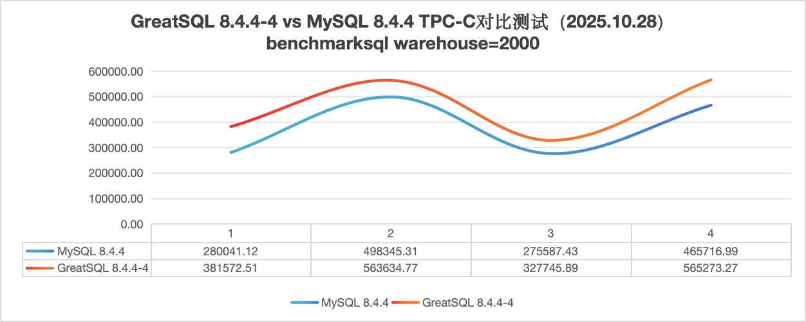

测试环境：

| 配置 | 备注 | 
|   ---    | --- |
| 操作系统 | OS：CentOS Linux release 8.5.2111<br/>内核：4.18.0-240.el8.x86_64 |
| CPU      | Intel(R) Xeon(R) Gold 6238 CPU @ 2.10GHz * 4                              |
| 内存     | 256G                                                                      |
| 磁盘     | INTEL SSDPE2KE032T8                                      |
| 数据库   | GreatSQL 8.4.4-4 Revision d73de75905d<br/>MySQL 8.4.4 Community Server       |
| 测试工具 | BenchmakrSQL 5.0 |
| 测试数据量 | warehouses = 2000 （测试数据库初始化后物理大小约 182 GB）|


## 测试结果详细数据

### ibp=128G，并发32线程

|  | MySQL | GreatSQL |
|:---| :--- | :--- |
| 第1轮  | 286969.41  | 382516.68 |
| 第2轮  | 279723.36  | 382302.13 |
| 第3轮  | 280372.18  | 381040.98 |
| 第4轮  | 274132.02  | 381374.43 |
| 第5轮  | 280027.81  | 378869.58 |
| 平均值 | 280244.956 | 381220.76 |

- IBP=128G & 32并发模式下，GreatSQL vs MySQL 压测 tpmC 平均值对比

**提示**：下图是将5次结果中最高及最低值去掉后求平均值的结果，下同。


- GreatSQL vs MySQL 压测过程中tpmC曲线图（第一个图GreatSQL，第二个图MySQL，下同）

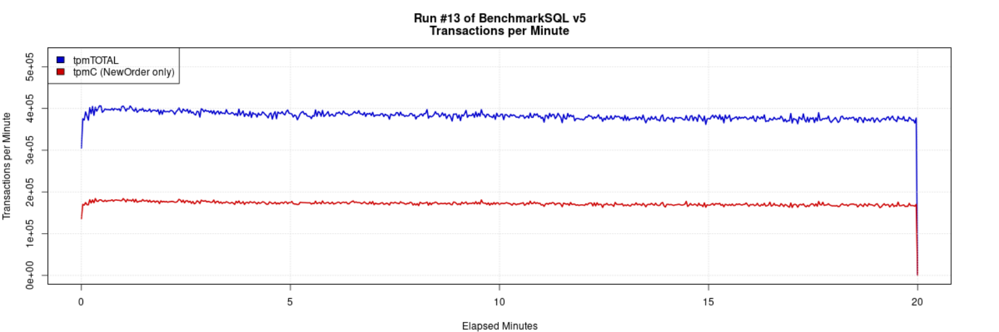

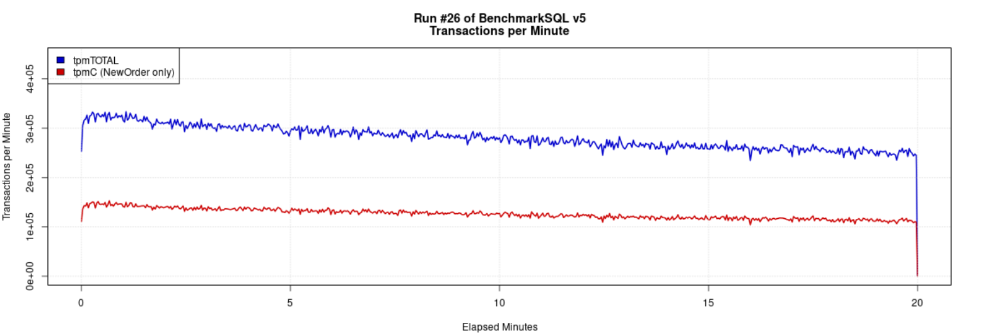

- GreatSQL vs MySQL 压测过程中Latency曲线图

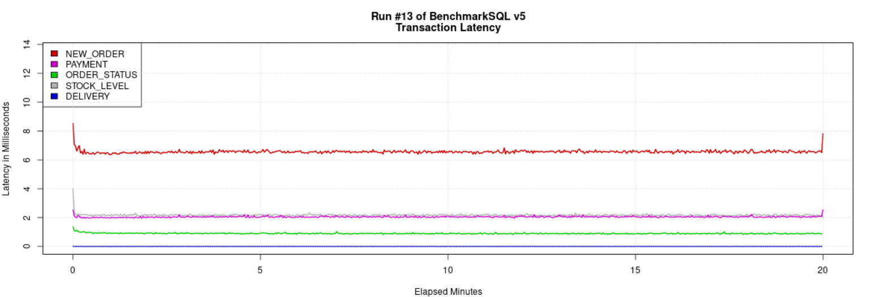

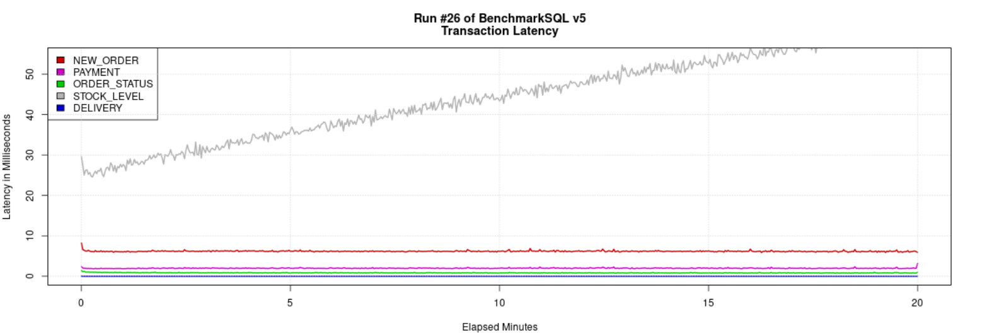

### ibp=128G，并发64线程

|  | MySQL | GreatSQL |
|:---| :--- | :--- |
| 第1轮  | 506900.77 | 566486.67  |
| 第2轮  | 512427.77 | 579877.81  |
| 第3轮  | 491107.14 | 555160.13  |
| 第4轮  | 487895.74 | 569257.52  |
| 第5轮  | 497028.03 | 546783.18  |
| 平均值 | 499071.89 | 563513.062 |

- IBP=128G & 64并发模式下，GreatSQL vs MySQL 压测 tpmC 平均值对比

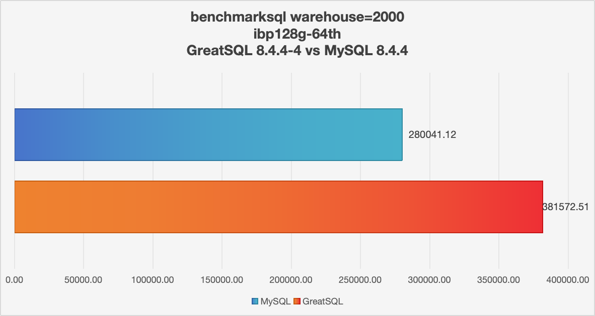

GreatSQL vs MySQL 压测过程中tpmC曲线图

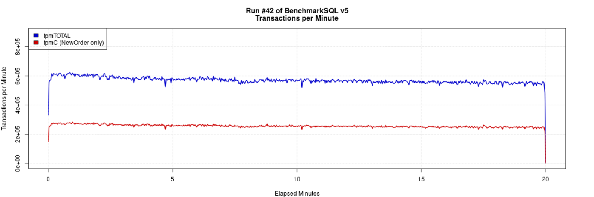

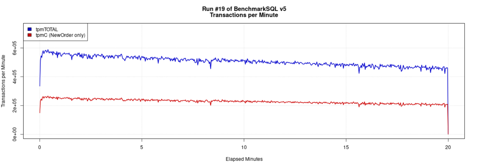

GreatSQL vs MySQL 压测过程中Latency曲线图

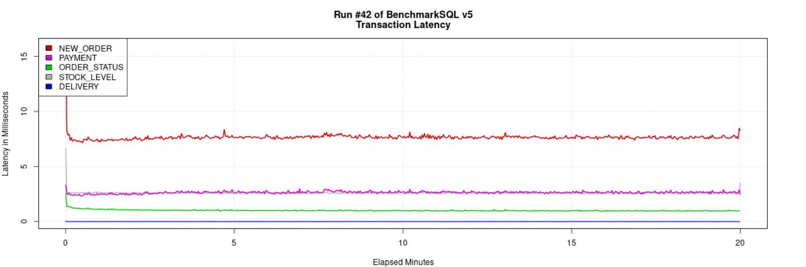

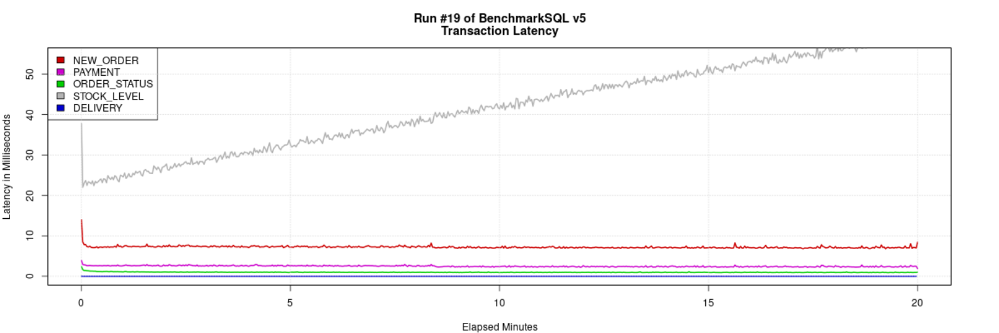

### ibp=256G，并发32线程

|  | MySQL | GreatSQL |
|:---| :--- | :--- |
| 第1轮  | 276821.06  | 333481.77  |
| 第2轮  | 283915.16  | 328236.77  |
| 第3轮  | 276522.46  | 324354.07  |
| 第4轮  | 270659.67  | 330646.82  |
| 第5轮  | 273418.77  | 308513.04  |
| 平均值 | 276267.424 | 325046.494 |

- IBP=256G & 32并发模式下，GreatSQL vs MySQL 压测 tpmC 平均值对比


GreatSQL vs MySQL 压测过程中tpmC曲线图

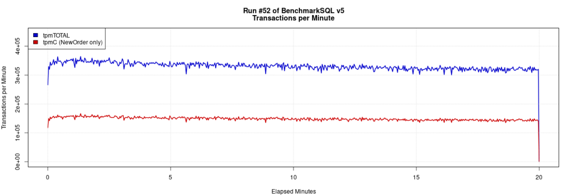

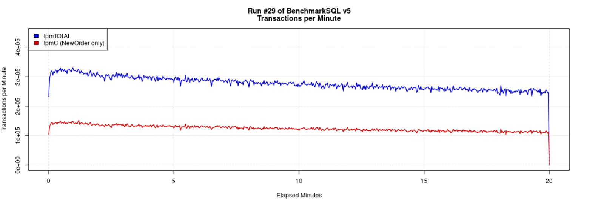

GreatSQL vs MySQL 压测过程中Latency曲线图

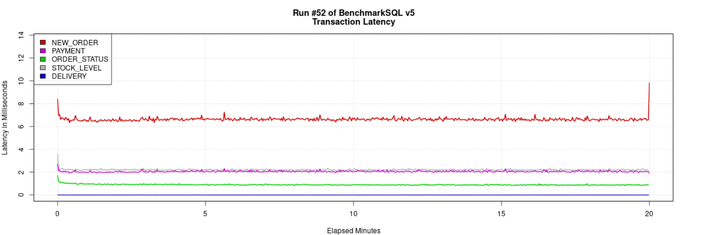

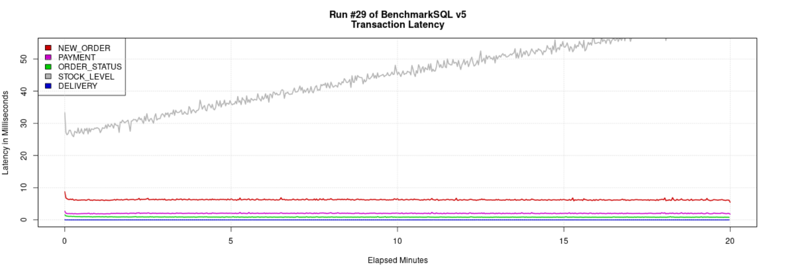

### ibp=256G，并发64线程

|  | MySQL | GreatSQL |
|:---| :--- | :--- |
| 第1轮  | 475981.6	  | 568142.02  |
| 第2轮  | 481056.84  | 573354.02  |
| 第3轮  | 466132.71  | 558700.58  |
| 第4轮  | 455036.67  | 560343.33  |
| 第5轮  | 451479.67  | 567334.47  |
| 平均值 | 465937.498 | 565574.884 |

- IBP=256G & 64并发模式下，GreatSQL vs MySQL 压测 tpmC 平均值对比


GreatSQL vs MySQL 压测过程中tpmC曲线图

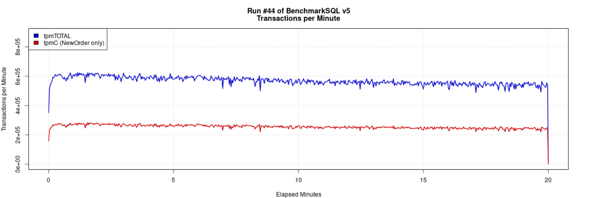

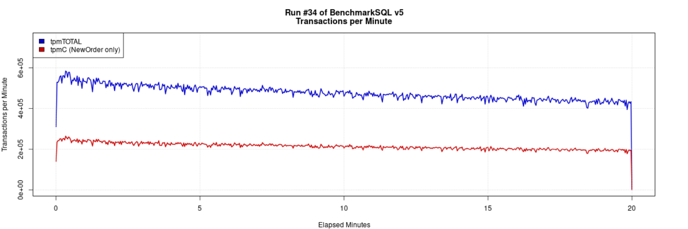

GreatSQL vs MySQL 压测过程中Latency曲线图

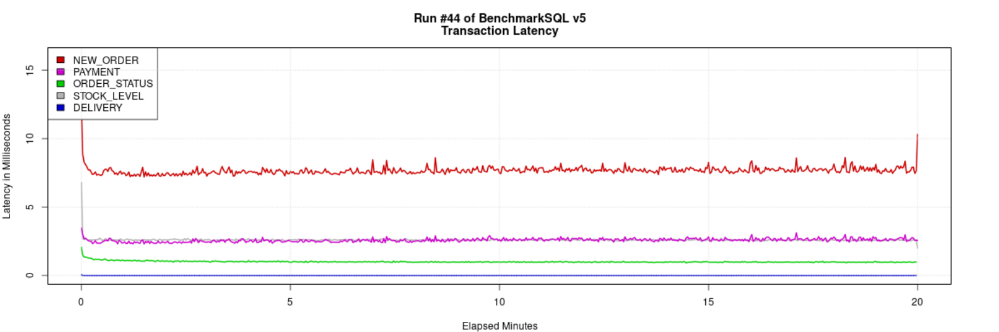

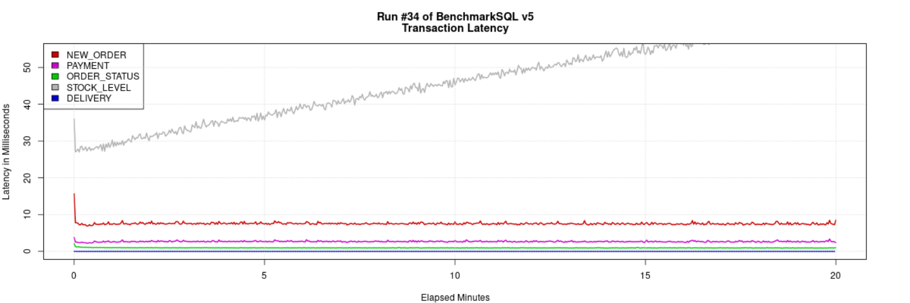

## 附录

### 测试步骤

参考手册内容 [BenchmarkSQL 性能测试](./3-4-benchmarksql.md)，执行 TPC-C 压测，详细过程不赘述。

### 测试工具

BenchmarkSQL 5.0。

相应代码仓库：[https://gitee.com/GreatSQL/benchmarksql](https://gitee.com/GreatSQL/benchmarksql)。

### 测试模式

- 利用BenchmarkSQL构造测试数据，设置参数 warehouses=2000。
- 测试数据库初始大小约182G。
- 因为没有额外测试机，BenchmarkSQL测试程序和MySQL/GreatSQL数据库服务运行在同一台服务器上。
- 测试过程中只修改 innodb_buffer_pool_size 参数分别为：128G 和 256G。
- 测试过程中开启Binlog及双1模式，其余主要参数详见后面描述。

### BenchmarkSQL相关参数如下

```ini
warehouses=2000
loadWorkers=128

terminals=32
//terminals=64
runTxnsPerTerminal=0
runMins=20
limitTxnsPerMin=0

terminalWarehouseFixed=true

report-on-new-line=0
table-engine=innodb

newOrderWeight=45
paymentWeight=43
orderStatusWeight=4
deliveryWeight=4
stockLevelWeight=4
```

### 数据库主要相关参数配置

```ini
[mysqld]
user=mysql
port=3306
server_id=3306
basedir=/usr/local/GreatSQL
#basedir=/usr/local/mysql
datadir=/data/GreatSQL
socket=/data/GreatSQL/mysql.sock
pid-file=mysql.pid
character-set-server=UTF8MB4
skip_name_resolve=ON
default_time_zone="+8:00"
bind_address="0.0.0.0"
secure_file_priv=/data/GreatSQL
mysql_native_password=ON

# Performance
lock_wait_timeout=3600
open_files_limit=65535
back_log=1024
max_connections=1024
max_connect_errors=1000000
table_open_cache=4096
table_definition_cache=2048
sort_buffer_size=4M
join_buffer_size=4M
read_buffer_size=8M
read_rnd_buffer_size=4M
bulk_insert_buffer_size=64M
thread_cache_size=768
interactive_timeout=600
wait_timeout=600
tmp_table_size=96M
max_heap_table_size=96M
max_allowed_packet=64M
loose-net_buffer_shrink_interval=180
sql_generate_invisible_primary_key=ON
loose-lock_ddl_polling_mode=ON
loose-lock_ddl_polling_runtime=200

# Logs
log_timestamps=SYSTEM
log_error=error.log
log_error_verbosity=3
slow_query_log=ON
log_slow_extra=ON
slow_query_log_file=slow.log
long_query_time=0.01
log_queries_not_using_indexes=ON
log_throttle_queries_not_using_indexes=60
min_examined_row_limit=100
log_slow_admin_statements=ON
log_slow_replica_statements=ON
loose-log_slow_verbosity=FULL
log_bin=binlog
binlog_format=ROW
sync_binlog=1
binlog_cache_size=4M
max_binlog_cache_size=6G
max_binlog_size=1G
loose-binlog_space_limit=500G
binlog_rows_query_log_events=ON
binlog_expire_logs_seconds=604800
binlog_checksum=CRC32
binlog_order_commits=OFF
gtid_mode=ON
enforce_gtid_consistency=ON

# Replication
relay-log=relaylog
relay_log_recovery=ON
replica_parallel_type=LOGICAL_CLOCK
replica_parallel_workers=16
replica_preserve_commit_order=ON
replica_checkpoint_period=2
loose-rpl_read_binlog_speed_limit=100

# InnoDB
innodb_buffer_pool_size=128G
innodb_buffer_pool_instances=24
innodb_data_file_path=ibdata1:12M:autoextend
innodb_flush_log_at_trx_commit=1
innodb_log_buffer_size=64M
innodb_redo_log_capacity=16G
innodb_doublewrite_files=2
innodb_doublewrite_pages=128
innodb_max_undo_log_size=4G
innodb_io_capacity=40000
innodb_io_capacity_max=80000
innodb_open_files=65534
innodb_flush_method=O_DIRECT
innodb_use_fdatasync=ON
innodb_lru_scan_depth=4000
innodb_lock_wait_timeout=10
innodb_rollback_on_timeout=ON
innodb_print_all_deadlocks=ON
innodb_online_alter_log_max_size=4G
innodb_print_ddl_logs=ON
innodb_status_file=ON
innodb_status_output=OFF
innodb_status_output_locks=ON
innodb_sort_buffer_size=64M
innodb_adaptive_hash_index=OFF
innodb_numa_interleave=OFF
innodb_spin_wait_delay=20
loose-innodb_print_lock_wait_timeout_info=ON
innodb_change_buffering=none
loose-kill_idle_transaction=300
loose-innodb_data_file_async_purge=ON
```
###  测试环境

**服务器详细信息**

- 1. 操作系统

```bash
$ cat /etc/os-release

NAME="CentOS Linux"
VERSION="8"
ID="centos"
ID_LIKE="rhel fedora"
VERSION_ID="8"
PLATFORM_ID="platform:el8"
PRETTY_NAME="CentOS Linux 8"
ANSI_COLOR="0;31"
CPE_NAME="cpe:/o:centos:centos:8"
HOME_URL="https://centos.org/"
BUG_REPORT_URL="https://bugs.centos.org/"
CENTOS_MANTISBT_PROJECT="CentOS-8"
CENTOS_MANTISBT_PROJECT_VERSION="8"
```

- 2. CPU

```bash
$ lscpu

Architecture:        x86_64
CPU op-mode(s):      32-bit, 64-bit
Byte Order:          Little Endian
CPU(s):              176
On-line CPU(s) list: 0-175
Thread(s) per core:  2
Core(s) per socket:  22
Socket(s):           4
NUMA node(s):        1
Vendor ID:           GenuineIntel
BIOS Vendor ID:      Intel
CPU family:          6
Model:               85
Model name:          Intel(R) Xeon(R) Gold 6238 CPU @ 2.10GHz
BIOS Model name:     Intel(R) Xeon(R) Gold 6238 CPU @ 2.10GHz
Stepping:            7
CPU MHz:             2799.999
CPU max MHz:         3700.0000
CPU min MHz:         1000.0000
BogoMIPS:            4200.00
Virtualization:      VT-x
L1d cache:           32K
L1i cache:           32K
L2 cache:            1024K
L3 cache:            30976K
NUMA node0 CPU(s):   0-175
Flags:               fpu vme de pse tsc msr pae mce cx8 apic sep mtrr pge mca cmov pat pse36 clflush dts acpi mmx fxsr sse sse2 ss ht tm pbe syscall nx pdpe1gb rdtscp lm constant_tsc art arch_perfmon pebs bts rep_good nopl xtopology nonstop_tsc cpuid aperfmperf pni pclmulqdq dtes64 monitor ds_cpl vmx smx est tm2 ssse3 sdbg fma cx16 xtpr pdcm pcid dca sse4_1 sse4_2 x2apic movbe popcnt tsc_deadline_timer aes xsave avx f16c rdrand lahf_lm abm 3dnowprefetch cpuid_fault epb cat_l3 cdp_l3 invpcid_single intel_ppin ssbd mba ibrs ibpb stibp ibrs_enhanced tpr_shadow vnmi flexpriority ept vpid ept_ad fsgsbase tsc_adjust bmi1 hle avx2 smep bmi2 erms invpcid cqm mpx rdt_a avx512f avx512dq rdseed adx smap clflushopt clwb intel_pt avx512cd avx512bw avx512vl xsaveopt xsavec xgetbv1 xsaves cqm_llc cqm_occup_llc cqm_mbm_total cqm_mbm_local dtherm ida arat pln pts pku ospke avx512_vnni md_clear flush_l1d arch_capabilities
```

- 3. 内存

```bash
$ free -ht
              total        used        free      shared  buff/cache   available
Mem:          251Gi       146Gi       1.7Gi        17Mi       102Gi       102Gi
Swap:         4.0Gi       318Mi       3.7Gi
Total:        255Gi       146Gi       5.4Gi
```

- 4. 磁盘

磁盘设备型号

```bash
$ nvme list

Node             SN                   Model                                    Namespace Usage                      Format           FW Rev
---------------- -------------------- ---------------------------------------- --------- -------------------------- ---------------- --------
/dev/nvme0n1          PHLN018200FD3P2BGN   INTEL SSDPE2KE032T8                      1           3.20  TB /   3.20  TB    512   B +  0 B   VDV10152
```

磁盘挂载参数、文件系统、ioscheduler

```bash
$ df -hT | grep /ssd1
/dev/nvme0n1        xfs       3.0T  682G  2.3T  23% /ssd1

$ mount | grep ssd1
/dev/nvme0n1 on /ssd1 type xfs (rw,noatime,nodiratime,seclabel,attr2,inode64,logbufs=8,logbsize=32k,noquota)

$ cat /sys/block/nvme0n1/queue/scheduler
[mq-deadline] kyber bfq none
```

NVMe SSD设备简单测速

```bash
$ dd oflag=direct if=/dev/zero of=./zero bs=1M count=20480

20480+0 records in
20480+0 records out
21474836480 bytes (21 GB, 20 GiB) copied, 11.389 s, 1.9 GB/s
```

- 5. 服务器关闭 NUMA 设置

```bash
$ cat /etc/default/grub

GRUB_TIMEOUT=5
GRUB_DISTRIBUTOR="$(sed 's, release .*$,,g' /etc/system-release)"
GRUB_DEFAULT=saved
GRUB_DISABLE_SUBMENU=true
GRUB_TERMINAL_OUTPUT="console"
GRUB_CMDLINE_LINUX="crashkernel=auto resume=/dev/mapper/cl-swap rd.lvm.lv=cl/root rd.lvm.lv=cl/swap numa=off"
GRUB_DISABLE_RECOVERY="true"
GRUB_ENABLE_BLSCFG=true

$ dmesg | grep -i numa

[    0.000000] Command line: BOOT_IMAGE=(hd0,gpt2)/vmlinuz-4.18.0-240.el8.x86_64 root=/dev/mapper/cl-root ro crashkernel=auto resume=/dev/mapper/cl-swap rd.lvm.lv=cl/root rd.lvm.lv=cl/swap numa=off
[    0.000000] NUMA turned off
[    0.000000] Kernel command line: BOOT_IMAGE=(hd0,gpt2)/vmlinuz-4.18.0-240.el8.x86_64 root=/dev/mapper/cl-root ro crashkernel=auto resume=/dev/mapper/cl-swap rd.lvm.lv=cl/root rd.lvm.lv=cl/swap numa=off
```

## 参考资料

- [TPC-C官网](https://www.tpc.org/tpcc/)
- [GreatSQL安装指南](../4-install-guide/0-install-guide.md)
- [BenchmarkSQL 性能测试](./3-4-benchmarksql.md)

**扫码关注微信公众号**


