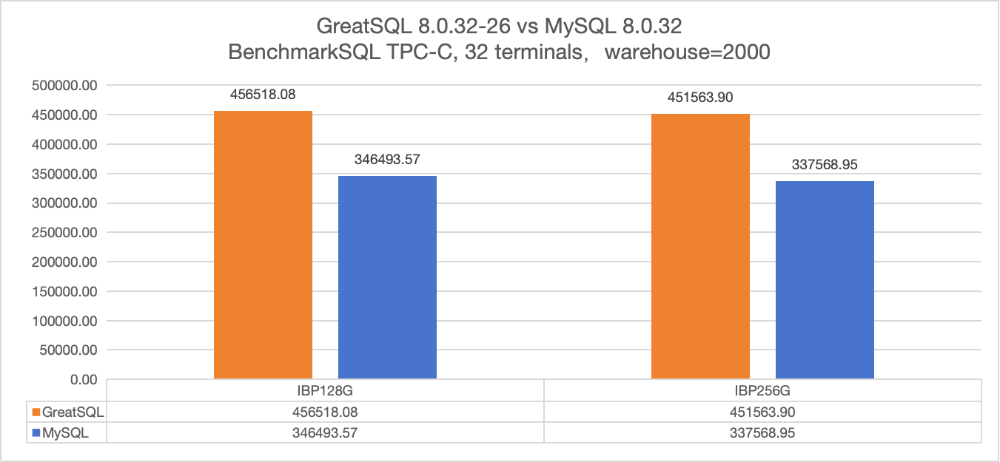
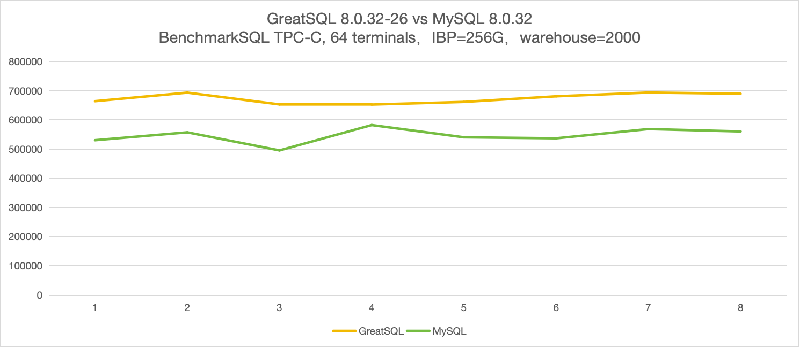

# GreatSQL vs MySQL TPC-C 性能测试

**GreatSQL TPC-C 性能测试报告**

**（2024 年 8 月 28 日）**

**GreatSQL 社区**

## 【文档声明】

GreatSQL 社区提醒您在阅读或使用本文档之前仔细阅读、充分理解本法律声明各条款的内容。如果您阅读或使用本文档，您的阅读或使用行为将被视为对本声明全部内容的认可。您应当通过 GreatSQL 社区网站或 GreatSQL 社区提供的其他授权通道下载、获取本文档，且仅能用于自身的合法合规的业务活动。本文档的内容视为 GreatSQL 社区的保密信息，您应当严格遵守保密义务；未经 GreatSQL 社区事先书面同意，您不得向任何第三方披露本手册内容或提供给任何第三方使用。

未经 GreatSQL 社区事先书面许可，任何单位、公司或个人不得擅自摘抄、翻译、复制本文档内容的部分或全部，不得以任何方式或途径进行替换和宣传。

由于产品版本升级、调整或其他原因，本文档内容有可能变更。GreatSQL 社区保留在没有任何通知或者提示下对本文档的内容进行修改的权利，并在 GreatSQL 社区授权通道中不定期发布更新后的用户文档。您应当实时关注用户文档的版本变更并通过 GreatSQL 社区授权渠道下载、获取最新版的用户文档。

本文档仅作为用户使用 GreatSQL 社区产品及服务的参考性指引。GreatSQL 社区在现有技术的基础上尽最大努力提供相应的介绍及操作指引，但 GreatSQL 社区在此明确声明对本文档内容的准确性、完整性、适用性、可靠性等不作任何明示或暗示的保证。任何单位、公司或个人因为下载、使用或信赖本文档而发生任何差错或经济损失的，GreatSQL 社区不承担任何法律责任。在任何情况下，GreatSQL 社区均不对任何间接性、后果性、惩戒性、偶然性、特殊性或刑罚性的损害，包括用户使用或信赖本文档而遭受的利润损失，承担责任（即使 GreatSQL 社区已被告知该等损失的可能性）。

GreatSQL 社区文档中所有内容，包括但不限于图片、架构设计、页面布局、文字描述，均由 GreatSQL 社区和/或其关联公司依法拥有其知识产权，包括但不限于商标权、专利权、著作权、商业秘密等。非经 GreatSQL 社区和/或其关联公司书面同意，任何人不得擅自使用、修改、复制、公开替换、改变、散布、发行或公开发表 GreatSQL 社区网站、产品程序或内容。此外，未经 GreatSQL 社区事先书面同意，任何人不得为了任何营销、广告、促销或其他目的使用、公布或复制 GreatSQL 社区的名称（包括但不限于单独为或以组合形式包含“GreatSQL 社区”、“GreatSQL”等 GreatSQL 社区和/或其关联公司品牌，上述品牌的附属标志及图案或任何类似公司名称、商号、商标、产品或服务名称、域名、图案标示、标志、标识或通过特定描述使第三方能够识别 GreatSQL 社区和/或其关联公司）。

如若发现本文档存在任何错误，请与 GreatSQL 社区取得直接联系。

GreatSQL社区官网：[https://greatsql.cn](https://greatsql.cn)。

##  概述

本次测试针对 GreatSQL 数据库基于 [BenchmarkSQL](./3-4-benchmarksql.md) 的标准 TPC-C 场景的测试。

BenchmarkSQL 是一个开源的 Java 应用程序，用于评估数据库系统在 OLTP 场景下的性能，它是符合 TPC-C 基准压力测试的工具。它最初由 HammerDB 的作者开发，后来由 Cloud V LLC 维护。

TPC-C 模型是模拟一个商品批发公司的销售模型，这个模型涵盖了一个批发公司面向客户对一系列商品进行销售的过程，这包括管理订单，管理库存，管理账号收支等操作。这些操作涉及到仓库、商品、客户、订单等概念，围绕这些概念，构造了数据表格，以及相应的数据库操作。

BenchmarkSQL 支持 MySQL（Percona Server for MySQL、GreatSQL）、PostgreSQL、Oracle、SQL Server 等。

GreatSQL 数据库是一款 **开源免费** 数据库，可在普通硬件上满足金融级应用场景，具有 **高可用**、**高性能**、**高兼容**、**高安全** 等特性，可作为 MySQL 或 Percona Server for MySQL 的理想可选替换。

##  测试环境

| 配置 | 备注 | 
|   ---    | --- |
| 操作系统 | OS：CentOS Linux release 7.9.2009 (Core)<br/>内核：3.10.0-1160.el7.x86_64 |
| CPU      | Intel(R) Xeon(R) Gold 6238 CPU @ 2.10GHz * 4                              |
| 内存     | 377G                                                                      |
| 磁盘     | Dell Express Flash CD5 3.84T SFF * 2                                      |
| 数据库   | GreatSQL 8.0.32-26 GreatSQL, Release 26, Revision a68b3034c3d<br/>MySQL 8.0.32 MySQL Community Server        |
| 测试工具 | BenchmakrSQL 5.0 |
| 测试数据量 | warehouses = 2000 （测试数据库初始化后物理大小约 182 GB）|

**服务器详细信息**

- 1. 操作系统

```bash
$ cat /etc/os-release

NAME="CentOS Linux"
VERSION="7 (Core)"
ID="centos"
ID_LIKE="rhel fedora"
VERSION_ID="7"
PRETTY_NAME="CentOS Linux 7 (Core)"
ANSI_COLOR="0;31"
CPE_NAME="cpe:/o:centos:centos:7"
HOME_URL="https://www.centos.org/"
BUG_REPORT_URL="https://bugs.centos.org/"

CENTOS_MANTISBT_PROJECT="CentOS-7"
CENTOS_MANTISBT_PROJECT_VERSION="7"
REDHAT_SUPPORT_PRODUCT="centos"
REDHAT_SUPPORT_PRODUCT_VERSION="7"
```

- 2. CPU

```bash
$ lscpu

Architecture:          x86_64
CPU op-mode(s):        32-bit, 64-bit
Byte Order:            Little Endian
CPU(s):                176
On-line CPU(s) list:   0-175
Thread(s) per core:    2
Core(s) per socket:    22
Socket(s):             4
NUMA node(s):          1
Vendor ID:             GenuineIntel
CPU family:            6
Model:                 85
Model name:            Intel(R) Xeon(R) Gold 6238 CPU @ 2.10GHz
Stepping:              7
CPU MHz:               2799.957
CPU max MHz:           3700.0000
CPU min MHz:           1000.0000
BogoMIPS:              4200.00
Virtualization:        VT-x
L1d cache:             32K
L1i cache:             32K
L2 cache:              1024K
L3 cache:              30976K
NUMA node0 CPU(s):     0-175
Flags:                 fpu vme de pse tsc msr pae mce cx8 apic sep mtrr pge mca cmov pat pse36 clflush dts acpi mmx fxsr sse sse2 ss ht tm pbe syscall nx pdpe1gb rdtscp lm constant_tsc art arch_perfmon pebs bts rep_good nopl xtopology nonstop_tsc aperfmperf eagerfpu pni pclmulqdq dtes64 monitor ds_cpl vmx smx est tm2 ssse3 sdbg fma cx16 xtpr pdcm pcid dca sse4_1 sse4_2 x2apic movbe popcnt tsc_deadline_timer aes xsave avx f16c rdrand lahf_lm abm 3dnowprefetch epb cat_l3 cdp_l3 invpcid_single intel_ppin intel_pt ssbd mba ibrs ibpb stibp ibrs_enhanced tpr_shadow vnmi flexpriority ept vpid fsgsbase tsc_adjust bmi1 hle avx2 smep bmi2 erms invpcid rtm cqm mpx rdt_a avx512f avx512dq rdseed adx smap clflushopt clwb avx512cd avx512bw avx512vl xsaveopt xsavec xgetbv1 cqm_llc cqm_occup_llc cqm_mbm_total cqm_mbm_local dtherm ida arat pln pts pku ospke avx512_vnni md_clear spec_ctrl intel_stibp flush_l1d arch_capabilities
```

- 3. 内存

```bash
$ free -ht
              total        used        free      shared  buff/cache   available
Mem:           377G        159G        3.4G         67M        214G        215G
Swap:          4.0G        230M        3.8G
Total:         381G        159G        7.1G
```

- 4. 磁盘

磁盘设备型号

```bash
$ nvme list

Node             SN                   Model                                    Namespace Usage                      Format           FW Rev
---------------- -------------------- ---------------------------------------- --------- -------------------------- ---------------- --------
/dev/nvme0n1     70L0A03YTAHR         Dell Express Flash CD5 3.84T SFF         1           3.24  TB /   3.84  TB    512   B +  0 B   1.1.1
/dev/nvme1n1     11D0A0C3TAHR         Dell Express Flash CD5 3.84T SFF         1           3.24  TB /   3.84  TB    512   B +  0 B   1.2.0
```

磁盘挂载参数、文件系统、ioscheduler

```bash
$ df -hT | grep /ssd1
/dev/md127              xfs       7.0T  2.5T  4.6T  35% /ssd1

$ mount | grep ssd1
/dev/md127 on /ssd1 type xfs (rw,noatime,nodiratime,seclabel,attr2,inode64,sunit=1024,swidth=2048,noquota)

$ cat /sys/block/md127/queue/scheduler
none
```

NVMe SSD设备简单测速

```bash
$ dd oflag=direct if=/dev/zero of=./zero bs=1M count=20480

20480+0 records in
20480+0 records out
21474836480 bytes (21 GB) copied, 12.0639 s, 1.8 GB/s
```

- 5. 服务器关闭 NUMA 设置

```bash
$ cat /etc/default/grub

GRUB_TIMEOUT=5
GRUB_DISTRIBUTOR="$(sed 's, release .*$,,g' /etc/system-release)"
GRUB_DEFAULT=saved
GRUB_DISABLE_SUBMENU=true
GRUB_TERMINAL_OUTPUT="console"
GRUB_CMDLINE_LINUX="crashkernel=auto spectre_v2=retpoline rd.lvm.lv=centos/root rd.lvm.lv=centos/swap rhgb quiet numa=off"
GRUB_DISABLE_RECOVERY="true"

$ dmesg | grep -i numa
[    0.000000] Command line: BOOT_IMAGE=/vmlinuz-3.10.0-1160.el7.x86_64 root=/dev/mapper/centos-root ro crashkernel=auto spectre_v2=retpoline rd.lvm.lv=centos/root rd.lvm.lv=centos/swap rhgb quiet LANG=en_US.UTF-8 numa=off
[    0.000000] NUMA turned off
```

## 测试结果

从本次测试的结果来看，可以得到以下几点结论：

1. 无论innodb_buffer_pool_size（以下简称IBP）是否充足，GreatSQL 8.0.32-26 的 TPC-C 测试性能都高于 MySQL 8.0.32。
2. **在并发 32 客户端测试中，GreatSQL 8.0.32-26 的 TPC-C 测试性能相对 MySQL 8.0.32 提升 30%+**。
3. **在并发 64 客户端测试中，GreatSQL 8.0.32-26 的 TPC-C 测试性能相对 MySQL 8.0.32 提升约 20%**。
4. GreatSQL 8.0.32-26 比 MySQL 8.0.32 在 TPC-C 测试中性能表现更好，也更稳定（测试过程中性能表现稳定，抖动小）。
5. GreatSQL 8.0.32-26 vs MySQL 8.0.32 在 TPC-C 测试中性能数据对比如下表所示
  - GreatSQL 8.0.32-26 vs MySQL 8.0.32 并发 32 客户端 BenchmarkSQL TPC-C 测试结果对比

  | tpmC | IBP = 128G | IBP = 256G | 
  | :--- | ---: | ---: |
  | GreatSQL 8.0.32-26 | 456518.08 | 451563.90 |
  | MySQL 8.0.32 | 346493.57 | 337568.95 |
  | GreatSQL 性能提升 | 31.75% | 33.77% |

  
  
  - GreatSQL 8.0.32-26 vs MySQL 8.0.32 并发 64 客户端 BenchmarkSQL TPC-C 测试结果对比

  | tpmC | IBP = 128G | IBP = 256G | 
  | :--- | ---: | ---: |
  | GreatSQL 8.0.32-26 | 686652.31 | 677036.36 |
  | MySQL 8.0.32 | 573634.69 | 554112.65 |
  | GreatSQL 性能提升 | 19.70% | 22.18% |
  
  

## 详细测试数据

### 并发 32 客户端 TPC-C 测试数据

总共测试 8 轮，每轮测试持续 20 分钟。

- IBP = 128G

| IBP = 128G | Round 1 | Round 2 | Round 3 | Round 4 | Round 5 | Round 6 | Round 7 | Round 8 |
| :--- | ---: | ---: | ---: | ---: | ---: | ---: | ---: | ---: |
| GreatSQL 8.0.32-26 | 450620.65 | 456953.65 | 419828.7 | 459993.95 | 459402.05 | 455620.10 | 414715.60 | 418527.60 |
| MySQL 8.0.32 | 343997.05 | 345936.55 | 324826.95 | 352615.80 | 352121.45 | 348762.30 | 335528.25 | 319743.10 |


- IBP = 256G

| IBP = 256G | Round 1 | Round 2 | Round 3 | Round 4 | Round 5 | Round 6 | Round 7 | Round 8 |
| :--- | ---: | ---: | ---: | ---: | ---: | ---: | ---: | ---: |
| GreatSQL 8.0.32-26 | 452826.00 | 449903.40 | 451065.25 | 453021.50 | 451434.85 | 450367.00 | 450668.80 | 448747.20 |
| MySQL 8.0.32 | 339873.70 | 311245.45 | 339739.45 | 344684.40 | 329512.20 | 332257.85 | 331289.35 | 306099.75 |


### 并发 32 客户端 TPC-C 测试数据曲线图

- GreatSQL 8.0.32-26 with 32-terminals & IBP=128G


- MySQL 8.0.32 with 32-terminals & IBP=128G


- GreatSQL 8.0.32-26 with 32-terminals & IBP=256G


- MySQL 8.0.32 with 32-terminals & IBP=256G


### 并发 64 客户端 TPC-C 测试数据

总共测试 8 轮，每轮测试持续 20 分钟。

- IBP = 128G

| IBP = 128G | Round 1 | Round 2 | Round 3 | Round 4 | Round 5 | Round 6 | Round 7 | Round 8 |
| :--- | ---: | ---: | ---: | ---: | ---: | ---: | ---: | ---: |
| GreatSQL 8.0.32-26 | 644678.45 | 661334.00 | 695643.15 | 695282.70 | 697940.00 | 678463.00 | 698050.35 | 679853.00 |
| MySQL 8.0.32 | 588542.00 | 601269.00 | 551370.40 | 572702.75 | 573581.35 | 562770.30 | 542034.95 | 565207.05 |


- IBP = 256G

| IBP = 256G | Round 1 | Round 2 | Round 3 | Round 4 | Round 5 | Round 6 | Round 7 | Round 8 |
| :--- | ---: | ---: | ---: | ---: | ---: | ---: | ---: | ---: |
| GreatSQL 8.0.32-26 | 664553.00 | 693832.95 | 653430.00 | 653009.20 | 662021.00 | 681223.00 | 694121.40 | 690073.20 |
| MySQL 8.0.32 | 530745.10 | 557727.85 | 495667.35 | 582648.00 | 540697.10 | 537221.80 | 568941.60 | 560807.10 |



### 并发 64 客户端 TPC-C 测试数据曲线图

- GreatSQL 8.0.32-26 with 64-terminals & IBP=128G


- MySQL 8.0.32 with 64-terminals & IBP=128G


- GreatSQL 8.0.32-26 with 64-terminals & IBP=256G


- MySQL 8.0.32 with 64-terminals & IBP=256G


### 小结

从上面的测试数据以及多个曲线图中可以看出几点：
1. 当 IBP 充足（IBP=256G）时，GreatSQL 8.0.32-26 在 TPC-C 测试中整体性能表现更平稳。
2. 当 IBP不足（IBP=128G）时，可能个别时候测试结果表现甚至要比 IBP 充足时要更好，但整体性能表现不够平稳，波动较大。
3. 无论 IBP 充足与否，MySQL 8.0.32 的性能表现波动幅度都比 GreatSQL 8.0.32-26 更大，随着压测持续时间越长，其性能下降越厉害。

## 测试步骤

参考手册内容 [BenchmarkSQL 性能测试](./3-4-benchmarksql.md)，执行 TPC-C 压测，详细过程不赘述。

## 附录
### 测试工具

BenchmarkSQL 5.0，下载地址：[https://sourceforge.net/projects/benchmarksql/files/](https://sourceforge.net/projects/benchmarksql/files/)

### 测试模式/参数

- BenchmarkSQL相关参数如下

```ini
warehouses=2000
loadWorkers=128

terminals=32
//terminals=64
runTxnsPerTerminal=0
runMins=20
limitTxnsPerMin=0

terminalWarehouseFixed=true

report-on-new-line=0
table-engine=innodb

newOrderWeight=45
paymentWeight=43
orderStatusWeight=4
deliveryWeight=4
stockLevelWeight=4
```

- 数据库初始化后总大小约182G。

```bash
$ du -sch /data/GreatSQL/bmsql/
182G	/data/GreatSQL/bmsql/
182G	total
```

- 由于测试资源有限，BenchmarkSQL 和 mysqld 运行在同一台服务器上，因此 BenchmarkSQL 的并发连接数控制为 32 和 64，没有设置更大，并利用 taskset 限定CPU资源。

```bash
$ cat bmsql-taskset.sh

ps -ef|grep -v grep|grep java
bmsql_pid=`ps -ef|grep -v grep|grep java|awk '{print $2}'`
taskset -pc 111-175 ${bmsql_pid} && taskset -pc ${bmsql_pid}

ps -ef|grep -v grep|grep mysqld
mysqld_pid=`ps -ef|grep -v grep|grep mysqld|awk '{print $2}'`
taskset -pc 0-110 ${mysqld_pid} && taskset -pc ${mysqld_pid}
```

- 由于测试资源有限，本次只测试单机模式，没有测试主从复制及 MGR 等场景。

### 数据库主要相关参数配置

```ini
[mysqld]
skip_name_resolve = ON
default_time_zone = "+8:00"
lock_wait_timeout = 3600
open_files_limit    = 65535
back_log = 1024
max_connections = 1024
max_connect_errors = 1000000
table_open_cache = 2048
table_definition_cache = 2048
sort_buffer_size = 4M
join_buffer_size = 4M
read_buffer_size = 8M
read_rnd_buffer_size = 4M
bulk_insert_buffer_size = 64M
thread_cache_size = 768
tmp_table_size = 96M
max_heap_table_size = 96M
max_allowed_packet = 64M
sql_generate_invisible_primary_key = ON

log_bin = binlog
binlog_format = ROW
sync_binlog = 1
binlog_cache_size = 4M
max_binlog_cache_size = 6G
max_binlog_size = 1G
binlog_checksum = CRC32
gtid_mode = ON
enforce_gtid_consistency = ON

innodb_buffer_pool_size = 128G
innodb_buffer_pool_instances = 24
innodb_data_file_path = ibdata1:12M:autoextend
innodb_flush_log_at_trx_commit = 1
innodb_log_buffer_size = 32M
innodb_redo_log_capacity = 16G
innodb_doublewrite_files = 2
innodb_max_undo_log_size = 4G
innodb_io_capacity = 40000
innodb_io_capacity_max = 80000
innodb_open_files = 65534
innodb_flush_method = O_DIRECT
innodb_lru_scan_depth = 4000
innodb_lock_wait_timeout = 120
innodb_rollback_on_timeout = ON
innodb_print_all_deadlocks = ON
innodb_online_alter_log_max_size = 4G
innodb_print_ddl_logs = ON
innodb_status_file = ON
innodb_status_output = OFF
innodb_status_output_locks = ON
innodb_sort_buffer_size = 64M
innodb_adaptive_hash_index = OFF
innodb_numa_interleave = OFF
innodb_spin_wait_delay = 20

performance_schema = OFF
```

### 参考资料

- [TPC-C官网](https://www.tpc.org/tpcc/)
- [GreatSQL安装指南](../4-install-guide/0-install-guide.md)
- [BenchmarkSQL 性能测试](./3-4-benchmarksql.md)


**扫码关注微信公众号**


