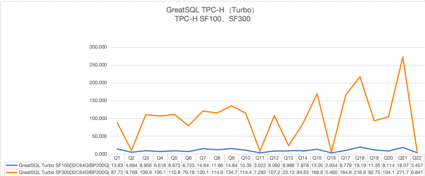

# GreatSQL TPC-H（Turbo引擎）性能测试报告
---

**GreatSQL TPC-H（Turbo引擎）性能测试报告**

**（2025年3月05日）**

**GreatSQL 社区**

## 【文档声明】

GreatSQL 社区提醒您在阅读或使用本文档之前仔细阅读、充分理解本法律声明各条款的内容。如果您阅读或使用本文档，您的阅读或使用行为将被视为对本声明全部内容的认可。您应当通过 GreatSQL 社区网站或 GreatSQL 社区提供的其他授权通道下载、获取本文档，且仅能用于自身的合法合规的业务活动。本文档的内容视为 GreatSQL 社区的保密信息，您应当严格遵守保密义务；未经 GreatSQL 社区事先书面同意，您不得向任何第三方披露本手册内容或提供给任何第三方使用。

未经 GreatSQL 社区事先书面许可，任何单位、公司或个人不得擅自摘抄、翻译、复制本文档内容的部分或全部，不得以任何方式或途径进行替换和宣传。

由于产品版本升级、调整或其他原因，本文档内容有可能变更。GreatSQL 社区保留在没有任何通知或者提示下对本文档的内容进行修改的权利，并在 GreatSQL 社区授权通道中不定期发布更新后的用户文档。您应当实时关注用户文档的版本变更并通过 GreatSQL 社区授权渠道下载、获取最新版的用户文档。

本文档仅作为用户使用 GreatSQL 社区产品及服务的参考性指引。GreatSQL 社区在现有技术的基础上尽最大努力提供相应的介绍及操作指引，但 GreatSQL 社区在此明确声明对本文档内容的准确性、完整性、适用性、可靠性等不作任何明示或暗示的保证。任何单位、公司或个人因为下载、使用或信赖本文档而发生任何差错或经济损失的，GreatSQL 社区不承担任何法律责任。在任何情况下，GreatSQL 社区均不对任何间接性、后果性、惩戒性、偶然性、特殊性或刑罚性的损害，包括用户使用或信赖本文档而遭受的利润损失，承担责任（即使 GreatSQL 社区已被告知该等损失的可能性）。

GreatSQL 社区文档中所有内容，包括但不限于图片、架构设计、页面布局、文字描述，均由 GreatSQL 社区和/或其关联公司依法拥有其知识产权，包括但不限于商标权、专利权、著作权、商业秘密等。非经 GreatSQL 社区和/或其关联公司书面同意，任何人不得擅自使用、修改、复制、公开替换、改变、散布、发行或公开发表 GreatSQL 社区网站、产品程序或内容。此外，未经 GreatSQL 社区事先书面同意，任何人不得为了任何营销、广告、促销或其他目的使用、公布或复制 GreatSQL 社区的名称（包括但不限于单独为或以组合形式包含“GreatSQL 社区”、“GreatSQL”等 GreatSQL 社区和/或其关联公司品牌，上述品牌的附属标志及图案或任何类似公司名称、商号、商标、产品或服务名称、域名、图案标示、标志、标识或通过特定描述使第三方能够识别 GreatSQL 社区和/或其关联公司）。

如若发现本文档存在任何错误，请与 GreatSQL 社区取得直接联系。

GreatSQL社区官网：[https://greatsql.cn](https://greatsql.cn)。

##  概述

本次测试针对GreatSQL数据库基于标准 TPC-H 场景的测试。

TPC-H（商业智能计算测试）是美国交易处理效能委员会（TPC，TransactionProcessing Performance Council）组织制定的用来模拟决策支持类应用的一个测试集。目前，学术界和工业界普遍采用 TPC-H 来评价决策支持技术方面应用的性能。这种商业测试可以全方位评测系统的整体商业计算综合能力，对厂商的要求更高，同时也具有普遍的商业实用意义，目前在银行信贷分析和信用卡分析、电信运营分析、税收分析、烟草行业决策分析中都有广泛的应用，TPC-H 查询包含八张数据表和 22 条复杂 SQL 查询，大多数查询包含多表联接（JOIN）、子查询和聚合查询等。

GreatSQL 数据库是一款 **开源免费** 数据库，可在普通硬件上满足金融级应用场景，具有 **高可用**、**高性能**、**高兼容**、**高安全** 等特性，可作为 MySQL 或 Percona 的理想可选替换。

##  测试环境信息

| 配置 | 备注 | 
|   ---    | --- |
| 操作系统 | OS：CentOS Linux release 7.9.2009 (Core)<br/>内核：3.10.0-1160.el7.x86_64 |
| CPU      | Intel(R) Xeon(R) Gold 6238 CPU @ 2.10GHz * 4                              |
| 内存     | 251G                                                                      |
| 磁盘     | INTEL SSDPE2KE032T8                                                       |
| 数据库   | GreatSQL 8.0.32-27, Release 27, Revision xxxxxxxxxxx                      |

**服务器详细信息**

- 1. 操作系统

```bash
$ cat /etc/os-release

NAME="CentOS Linux"
VERSION="7 (Core)"
ID="centos"
ID_LIKE="rhel fedora"
VERSION_ID="7"
PRETTY_NAME="CentOS Linux 7 (Core)"
ANSI_COLOR="0;31"
CPE_NAME="cpe:/o:centos:centos:7"
HOME_URL="https://www.centos.org/"
BUG_REPORT_URL="https://bugs.centos.org/"

CENTOS_MANTISBT_PROJECT="CentOS-7"
CENTOS_MANTISBT_PROJECT_VERSION="7"
REDHAT_SUPPORT_PRODUCT="centos"
REDHAT_SUPPORT_PRODUCT_VERSION="7"
```

- 2. CPU

```bash
$ lscpu

Architecture:          x86_64
CPU op-mode(s):        32-bit, 64-bit
Byte Order:            Little Endian
CPU(s):                176
On-line CPU(s) list:   0-175
Thread(s) per core:    2
Core(s) per socket:    22
Socket(s):             4
NUMA node(s):          4
Vendor ID:             GenuineIntel
CPU family:            6
Model:                 85
Model name:            Intel(R) Xeon(R) Gold 6238 CPU @ 2.10GHz
Stepping:              7
CPU MHz:               1000.012
CPU max MHz:           3700.0000
CPU min MHz:           1000.0000
BogoMIPS:              4200.00
Virtualization:        VT-x
L1d cache:             32K
L1i cache:             32K
L2 cache:              1024K
L3 cache:              30976K
NUMA node0 CPU(s):     0,4,8,12,16,20,24,28,32,36,40,44,48,52,56,60,64,68,72,76,80,84,88,92,96,100,104,108,112,116,120,124,128,132,136,140,144,148,152,156,160,164,168,172
NUMA node1 CPU(s):     1,5,9,13,17,21,25,29,33,37,41,45,49,53,57,61,65,69,73,77,81,85,89,93,97,101,105,109,113,117,121,125,129,133,137,141,145,149,153,157,161,165,169,173
NUMA node2 CPU(s):     2,6,10,14,18,22,26,30,34,38,42,46,50,54,58,62,66,70,74,78,82,86,90,94,98,102,106,110,114,118,122,126,130,134,138,142,146,150,154,158,162,166,170,174
NUMA node3 CPU(s):     3,7,11,15,19,23,27,31,35,39,43,47,51,55,59,63,67,71,75,79,83,87,91,95,99,103,107,111,115,119,123,127,131,135,139,143,147,151,155,159,163,167,171,175
Flags:                 fpu vme de pse tsc msr pae mce cx8 apic sep mtrr pge mca cmov pat pse36 clflush dts acpi mmx fxsr sse sse2 ss ht tm pbe syscall nx pdpe1gb rdtscp lm constant_tsc art arch_perfmon pebs bts rep_good nopl xtopology nonstop_tsc aperfmperf eagerfpu pni pclmulqdq dtes64 monitor ds_cpl vmx smx est tm2 ssse3 sdbg fma cx16 xtpr pdcm pcid dca sse4_1 sse4_2 x2apic movbe popcnt tsc_deadline_timer aes xsave avx f16c rdrand lahf_lm abm 3dnowprefetch epb cat_l3 cdp_l3 invpcid_single intel_ppin intel_pt ssbd mba ibrs ibpb stibp ibrs_enhanced tpr_shadow vnmi flexpriority ept vpid fsgsbase tsc_adjust bmi1 hle avx2 smep bmi2 erms invpcid rtm cqm mpx rdt_a avx512f avx512dq rdseed adx smap clflushopt clwb avx512cd avx512bw avx512vl xsaveopt xsavec xgetbv1 cqm_llc cqm_occup_llc cqm_mbm_total cqm_mbm_local dtherm ida arat pln pts pku ospke avx512_vnni md_clear spec_ctrl intel_stibp flush_l1d arch_capabilities
```

- 3. 内存

```bash
$ free -ht
              total        used        free      shared  buff/cache   available
Mem:           251G        167G         22G        7.2M         61G         82G
Swap:          4.0G        1.1G        2.9G
Total:         255G        168G         24G
```

- 4. 磁盘

磁盘设备型号

```bash
$ nvme list
Node             SN                   Model                                    Namespace Usage                      Format           FW Rev
---------------- -------------------- ---------------------------------------- --------- -------------------------- ---------------- --------
/dev/nvme0n1     PHLN018200FD3P2BGN   INTEL SSDPE2KE032T8                      1           3.20  TB /   3.20  TB    512   B +  0 B   VDV10152
```

磁盘挂载参数、文件系统

```bash
$ df -hT | grep ssd
/dev/nvme0n1            xfs       3.0T  1.5T  1.5T  49% /ssd2
```

NVMe SSD设备简单测速

```bash
$ dd oflag=direct if=/dev/zero of=./zero bs=1M count=20480

20480+0 records in
20480+0 records out
21474836480 bytes (21 GB) copied, 8.69131 s, 2.5 GB/s
```

**提示**：在下面运行TPC-H测试时，设置了Turbo引擎最大可使用的内存及线程数。

```sql
SET GLOBAL turbo_memory_limit=68719476736;
SET GLOBAL turbo_worker_threads=32;
```

##  测试表结构和数据量

各表数据量对比：

|表名|TPC-H SF100数据量|TPC-H SF300数据量|备注|
| ---       | ---      | ---       | ---        | 
|region     |5         |5          |地区信息    |
|nation     |25        |25         |国家表      |
|supplier   |1000000   |3000000    |供应商信息  |
|part       |20000000  |60000000   |零件表      |
|customer   |15000000  |45000000   |消费者表    |
|partsupp   |80000000  |240000000  |配件供应表  |
|orders     |150000000 |450000000  |订单表      |
|lineitem   |600037902 |1799989091 |订单明细表  |

各表结构关系如下图所示：


##  测试结果

GreatSQL 8.0.32-27中新增的高性能并行查询引擎Turbo，使得其在实时TPC-H性能测试表现明显优于MySQL社区版、Percona Server MySQL、MariaDB等数据库。

在TPC-H SF100场景下，运行完全部22个TPC-H查询SQL总耗时为**214.951秒**。在TPC-H SF300场景下，运行完全部22个TPC-H查询SQL总耗时为**2241.448秒**。

每条SQL详细耗时如下：

| TPC-H Query（Turbo） |GreatSQL TPC-H SF100（32C64G）耗时（秒）|GreatSQL TPC-H SF300（32C64G）耗时（秒）|
| ---   | ---    | ---      |
|Q1    | 13.839    | 87.722    |
|Q2    | 4.684        | 9.769        |
|Q3    | 8.956        | 109.921    |
|Q4    | 6.618        | 106.168    |
|Q5    | 8.673        | 110.856    |
|Q6    | 6.723        | 79.182    |
|Q7    | 14.645    | 120.183    |
|Q8    | 11.669    | 114.955    |
|Q9    | 14.845    | 134.707    |
|Q10    | 10.359    | 114.493    |
|Q11    | 3.022        | 7.282        |
|Q12    | 8.092        | 107.227    |
|Q13    | 8.988        | 23.133    |
|Q14    | 7.878        | 84.632    |
|Q15    | 13.051    | 168.845    |
|Q16    | 2.934        | 5.460        |
|Q17    | 9.779        | 164.819    |
|Q18    | 19.197    | 216.600    |
|Q19    | 11.355    | 92.757    |
|Q20    | 8.114        | 104.129    |
|Q21    | 18.073    | 271.767    |
|Q22    | 3.457        | 6.841        |
|总耗时    | **214.951**    | **2241.448**    |

GreatSQL TPC-H（Turbo）SF100 vs SF300（32C64G）对比示意图如下



##  测试步骤
### 安装 GreatSQL
请参考GreatSQL手册内容：[安装指南](../4-install-guide/0-install-guide.md)，完成GreatSQL安装。

### 生成 TPC-H 测试数据
请参考GreatSQL手册内容：[TPC-H性能测试](./3-2-benchmark-tpch.md)，完成TPC-H工具编译安装。

运行 TPC-H `dbgen` 工具，生成数据文件，一共会生成 8 个表对应的 tbl 数据文件，例如：

```bash
$ ./dbgen -vf -s 100
...

$ ls -l *tbl

-rw-r--r-- 1 root root  2463490271 Sep 26 09:20 customer.tbl
-rw-r--r-- 1 root root 79579694556 Sep 26 09:20 lineitem.tbl
-rw-r--r-- 1 root root        2224 Sep 26 09:20 nation.tbl
-rw-r--r-- 1 root root 17793116301 Sep 26 09:20 orders.tbl
-rw-r--r-- 1 root root 12209211160 Sep 26 09:20 partsupp.tbl
-rw-r--r-- 1 root root  2453234158 Sep 26 09:20 part.tbl
-rw-r--r-- 1 root root         389 Sep 26 09:20 region.tbl
-rw-r--r-- 1 root root   142869803 Sep 26 09:20 supplier.tbl
```

也可以参考 [pdbgen.sh](https://gitee.com/GreatSQL/tpch/blob/greatsql-8.0.32-27/pdbgen.sh) 脚本做法，并行生成测试数据。

### 创建 TPC-H 测试数据库表并导入数据

参考GreatSQL社区提供的TPC-H数据库表初始化脚本：[tpch-create-table.sql](https://gitee.com/GreatSQL/GreatSQL-Doc/blob/master/tpch/3.0.1/tpch-create-table.sql)，完成TPC-H测试数据库表创建。

```bash
$ mysql -f < tpch-create-table.sql

$ mysqlshow tpch100

Database: tpch100
+----------+
|  Tables  |
+----------+
| customer |
| lineitem |
| nation   |
| orders   |
| part     |
| partsupp |
| region   |
| revenue0 |
| supplier |
+----------+
```

利用GreatSQL的 **[parallel load data特性](../5-enhance/5-1-highperf-parallel-load.md)** 并行导入TPC-H测试数据。

需要先修改GreatSQL选项`secure_file_priv`设置，指向上述 workdir 所在目录，重启GreatSQL使之生效。

参考GreatSQL社区提供的并发导入脚本：[load-data-parallel.sh](https://gitee.com/GreatSQL/GreatSQL-Doc/blob/master/tpch/3.0.1/load-data-parallel.sh)，完成数据导入。

也可以参考 [pload.sh](https://gitee.com/GreatSQL/tpch/blob/greatsql-8.0.32-27/pload.sh) 脚本做法，并行导入数据。

**提示**：运行`LOAD DATA`导入数据时，可能会在 `tmpdir` 产生临时文件，因此要保证 `tmpdir` 有足够的剩余可用磁盘空间。

### 确认Turbo引擎设置

数据导入完成后，在开始运行TPC-H测试前，要先加载Turbo引擎，并修改可用内存及并发线程数等相关设置。

1. 安装Turbo引擎

```sql
INSTALL PLUGIN turbo SONAME 'turbo.so';
```

2. 查看Turbo引擎已安装成功

```sql
greatsql> SELECT * FROM information_schema.PLUGINS WHERE PLUGIN_NAME='turbo'\G
*************************** 1. row ***************************
           PLUGIN_NAME: turbo
        PLUGIN_VERSION: 0.1
         PLUGIN_STATUS: ACTIVE
           PLUGIN_TYPE: QUERY PLAN
   PLUGIN_TYPE_VERSION: 1.0
        PLUGIN_LIBRARY: turbo.so
PLUGIN_LIBRARY_VERSION: 1.11
         PLUGIN_AUTHOR: GreatOpenSource
    PLUGIN_DESCRIPTION: turbo query plan
        PLUGIN_LICENSE: GPL
           LOAD_OPTION: ON
```

3. 修改可用内存及并发线程数等相关设置

```sql
greatsql> SET GLOBAL turbo_memory_limit=68719476736;
greatsql> SET GLOBAL turbo_worker_threads=32;
```

### 执行 TPC-H 测试

执行[GreatSQL社区提供的Turbo引擎专用TPC-H性能测试脚本](https://gitee.com/GreatSQL/tpch/tree/greatsql-8.0.32-27/queries-turbo)，完成测试，并记录各个SQL的耗时。

该测试脚本大概工作模式如下：

1. 总共有22个查询SQL，每个查询SQL分别执行。

2. 每个查询SQL先运行2次完成数据预热。

3. 每个SQL再执行3次，每次执行SQL都会记录其起止时间，及其耗时，如下面例所示：

```bash
[2023-09-27 01:38:45] BEGIN RUN TPC-H Q1 1 times
[2023-09-27 01:38:46] TPC-H Q1 END, COST: 1.301s


[2023-09-27 01:38:46] BEGIN RUN TPC-H Q1 2 times
[2023-09-27 01:38:47] TPC-H Q1 END, COST: 0.787s
```

上述结果中的 COST: 1.301s ，即为本SQL的运行耗时：1.301秒。

4. 继续执行下一个查询SQL，直至22个查询SQL全部执行完毕。

可以参考自动化执行脚本 [run-tpch.sh](https://gitee.com/GreatSQL/tpch/blob/greatsql-8.0.32-27/run-tpch.sh) 的做法，修改几个参数后即可自动执行。

**提示**：在运行`tpch_queries_11.sql`这个SQL脚本时，需要根据数据量大小调整第17-20行相关的参数。例如当测试数据量是SF100时，调整成如下

```sql
SELECT /*+ SET_VAR(turbo_enable=ON) SET_VAR(turbo_cost_threshold=0) */ /*+ Q11 */
    ps_partkey,
    sum(ps_supplycost * ps_availqty) AS value
FROM
    partsupp,
    supplier,
    nation
WHERE
    ps_suppkey = s_suppkey
    AND s_nationkey = n_nationkey
    AND n_name = 'GERMANY'
GROUP BY
    ps_partkey
HAVING
    sum(ps_supplycost * ps_availqty) > (
        SELECT
            /* sum(ps_supplycost * ps_availqty) * 0.0001000000 /* SF1 */
            /* sum(ps_supplycost * ps_availqty) * 0.0000100000 /* SF10 */
            sum(ps_supplycost * ps_availqty) * 0.0000010000 /* SF100 */
            /* sum(ps_supplycost * ps_availqty) * 0.0000001000 /* SF1000 */
        FROM
            partsupp,
            supplier,
            nation
        WHERE
            ps_suppkey = s_suppkey
            AND s_nationkey = n_nationkey
            AND n_name = 'GERMANY')
ORDER BY
    value DESC;
```

##  附录
### 创建测试表DDL

```sql
-- DROP DATABASE IF EXISTS tpch;
-- CREATE DATABASE IF NOT EXISTS tpch DEFAULT CHARACTER SET latin1;
-- USE tpch;

drop table if exists nation;
create table nation  ( n_nationkey  integer not null,
                                n_name       char(25) not null,
                                n_regionkey  integer not null,
                                n_comment    varchar(152),
                                primary key(n_nationkey),
                                key nation_fk1 (n_regionkey) );

drop table if exists region;
create table region  ( r_regionkey  integer not null,
                                r_name       char(25) not null,
                                r_comment    varchar(152),
                                primary key(r_regionkey) );

drop table if exists part;
create table part  ( p_partkey     integer not null,
                                p_name        varchar(55) not null,
                                p_mfgr        char(25) not null,
                                p_brand       char(10) not null,
                                p_type        varchar(25) not null,
                                p_size        integer not null,
                                p_container   char(10) not null,
                                p_retailprice decimal(15,2) not null,
                                p_comment     varchar(23) not null,
                                primary key(p_partkey) );

drop table if exists supplier;
create table supplier ( s_suppkey     integer not null,
                                s_name        char(25) not null,
                                s_address     varchar(40) not null,
                                s_nationkey   integer not null,
                                s_phone       char(15) not null,
                                s_acctbal     decimal(15,2) not null,
                                s_comment     varchar(101) not null,
                                primary key(s_suppkey),
                                key supplier_fk1 (s_nationkey) );

drop table if exists partsupp;
create table partsupp ( ps_partkey     integer not null,
                                ps_suppkey     integer not null,
                                ps_availqty    integer not null,
                                ps_supplycost  decimal(15,2)  not null,
                                ps_comment     varchar(199) not null,
                                primary key(ps_partkey,ps_suppkey),
                                key partsupp_fk1 (ps_suppkey),
                                key partsupp_fk2 (ps_partkey) );


drop table if exists customer;
create table customer ( c_custkey     integer not null,
                                c_name        varchar(25) not null,
                                c_address     varchar(40) not null,
                                c_nationkey   integer not null,
                                c_phone       char(15) not null,
                                c_acctbal     decimal(15,2)   not null,
                                c_mktsegment  char(10) not null,
                                c_comment     varchar(117) not null,
                                primary key(c_custkey),
                                key customer_fk1 (c_nationkey) );

drop table if exists orders;
create table orders  ( o_orderkey       integer not null,
                                o_custkey        integer not null,
                                o_orderstatus    char(1) not null,
                                o_totalprice     decimal(15,2) not null,
                                o_orderdate      date not null,
                                o_orderpriority  char(15) not null,
                                o_clerk          char(15) not null,
                                o_shippriority   integer not null,
                                o_comment        varchar(79) not null,
                                primary key(o_orderkey),
                                key orders_fk1 (o_custkey) );

drop table if exists lineitem;
create table lineitem ( l_orderkey    integer not null,
                                l_partkey     integer not null,
                                l_suppkey     integer not null,
                                l_linenumber  integer not null,
                                l_quantity    decimal(15,2) not null,
                                l_extendedprice  decimal(15,2) not null,
                                l_discount    decimal(15,2) not null,
                                l_tax         decimal(15,2) not null,
                                l_returnflag  char(1) not null,
                                l_linestatus  char(1) not null,
                                l_shipdate    date not null,
                                l_commitdate  date not null,
                                l_receiptdate date not null,
                                l_shipinstruct char(25) not null,
                                l_shipmode     char(10) not null,
                                l_comment      varchar(44) not null,
                                primary key(l_orderkey,l_linenumber),
                                key lineitem_fk1 (l_orderkey) ,
                                key lineitem_fk2 (l_partkey,l_suppkey) );
```

### 22条TPC-H测试SQL

```sql
-- tpch_queries_1.sql
SELECT /*+ SET_VAR(turbo_enable=ON) SET_VAR(turbo_cost_threshold=0) */ /*+ Q1 */
    l_returnflag,
    l_linestatus,
    sum(l_quantity) AS sum_qty,
    sum(l_extendedprice) AS sum_base_price,
    sum(l_extendedprice * (1 - l_discount)) AS sum_disc_price,
    sum(l_extendedprice * (1 - l_discount) * (1 + l_tax)) AS sum_charge,
    avg(l_quantity) AS avg_qty,
    avg(l_extendedprice) AS avg_price,
    avg(l_discount) AS avg_disc,
    count(*) AS count_order
FROM
    lineitem
WHERE
    l_shipdate <= CAST('1998-09-02' AS date)
GROUP BY
    l_returnflag,
    l_linestatus
ORDER BY
    l_returnflag,
    l_linestatus;


-- tpch_queries_2.sql
SELECT /*+ SET_VAR(turbo_enable=ON) SET_VAR(turbo_cost_threshold=0) */ /*+ Q2 */
    s_acctbal,
    s_name,
    n_name,
    p_partkey,
    p_mfgr,
    s_address,
    s_phone,
    s_comment
FROM
    part,
    supplier,
    partsupp,
    nation,
    region
WHERE
    p_partkey = ps_partkey
    AND s_suppkey = ps_suppkey
    AND p_size = 15
    AND p_type LIKE '%BRASS'
    AND s_nationkey = n_nationkey
    AND n_regionkey = r_regionkey
    AND r_name = 'EUROPE'
    AND ps_supplycost = (
        SELECT
            min(ps_supplycost)
        FROM
            partsupp,
            supplier,
            nation,
            region
        WHERE
            p_partkey = ps_partkey
            AND s_suppkey = ps_suppkey
            AND s_nationkey = n_nationkey
            AND n_regionkey = r_regionkey
            AND r_name = 'EUROPE')
ORDER BY
    s_acctbal DESC,
    n_name,
    s_name,
    p_partkey
LIMIT 100;


-- tpch_queries_3.sql
SELECT /*+ SET_VAR(turbo_enable=ON) SET_VAR(turbo_cost_threshold=0) */ /*+ Q3 */
    l_orderkey,
    sum(l_extendedprice * (1 - l_discount)) AS revenue,
    o_orderdate,
    o_shippriority
FROM
    customer,
    orders,
    lineitem
WHERE
    c_mktsegment = 'BUILDING'
    AND c_custkey = o_custkey
    AND l_orderkey = o_orderkey
    AND o_orderdate < CAST('1995-03-15' AS date)
    AND l_shipdate > CAST('1995-03-15' AS date)
GROUP BY
    l_orderkey,
    o_orderdate,
    o_shippriority
ORDER BY
    revenue DESC,
    o_orderdate
LIMIT 10;


-- tpch_queries_4.sql
SELECT /*+ SET_VAR(turbo_enable=ON) SET_VAR(turbo_cost_threshold=0) */ /*+ Q4 */
    o_orderpriority,
    count(*) AS order_count
FROM
    orders
WHERE
    o_orderdate >= CAST('1993-07-01' AS date)
    AND o_orderdate < CAST('1993-10-01' AS date)
    AND EXISTS (
        SELECT
            *
        FROM
            lineitem
        WHERE
            l_orderkey = o_orderkey
            AND l_commitdate < l_receiptdate)
GROUP BY
    o_orderpriority
ORDER BY
    o_orderpriority;


-- tpch_queries_5.sql
SELECT /*+ SET_VAR(turbo_enable=ON) SET_VAR(turbo_cost_threshold=0) */ /*+ Q5 */
    n_name,
    sum(l_extendedprice * (1 - l_discount)) AS revenue
FROM
    customer,
    orders,
    lineitem,
    supplier,
    nation,
    region
WHERE
    c_custkey = o_custkey
    AND l_orderkey = o_orderkey
    AND l_suppkey = s_suppkey
    AND c_nationkey = s_nationkey
    AND s_nationkey = n_nationkey
    AND n_regionkey = r_regionkey
    AND r_name = 'ASIA'
    AND o_orderdate >= CAST('1994-01-01' AS date)
    AND o_orderdate < CAST('1995-01-01' AS date)
GROUP BY
    n_name
ORDER BY
    revenue DESC;


-- tpch_queries_6.sql
SELECT /*+ SET_VAR(turbo_enable=ON) SET_VAR(turbo_cost_threshold=0) */ /*+ Q6 */
    sum(l_extendedprice * l_discount) AS revenue
FROM
    lineitem
WHERE
    l_shipdate >= CAST('1994-01-01' AS date)
    AND l_shipdate < CAST('1995-01-01' AS date)
    AND l_discount BETWEEN 0.05
    AND 0.07
    AND l_quantity < 24;


-- tpch_queries_7.sql
SELECT /*+ SET_VAR(turbo_enable=ON) SET_VAR(turbo_cost_threshold=0) */ /*+ Q7 */
    supp_nation,
    cust_nation,
    l_year,
    sum(volume) AS revenue
FROM (
    SELECT
        n1.n_name AS supp_nation,
        n2.n_name AS cust_nation,
        extract(year FROM l_shipdate) AS l_year,
        l_extendedprice * (1 - l_discount) AS volume
    FROM
        supplier,
        lineitem,
        orders,
        customer,
        nation n1,
        nation n2
    WHERE
        s_suppkey = l_suppkey
        AND o_orderkey = l_orderkey
        AND c_custkey = o_custkey
        AND s_nationkey = n1.n_nationkey
        AND c_nationkey = n2.n_nationkey
        AND ((n1.n_name = 'FRANCE'
                AND n2.n_name = 'GERMANY')
            OR (n1.n_name = 'GERMANY'
                AND n2.n_name = 'FRANCE'))
        AND l_shipdate BETWEEN CAST('1995-01-01' AS date)
        AND CAST('1996-12-31' AS date)) AS shipping
GROUP BY
    supp_nation,
    cust_nation,
    l_year
ORDER BY
    supp_nation,
    cust_nation,
    l_year;


-- tpch_queries_8.sql
SELECT /*+ SET_VAR(turbo_enable=ON) SET_VAR(turbo_cost_threshold=0) */ /*+ Q8 */
    o_year,
    sum(
        CASE WHEN nation = 'BRAZIL' THEN
            volume
        ELSE
            0
        END) / sum(volume) AS mkt_share
FROM (
    SELECT
        extract(year FROM o_orderdate) AS o_year,
        l_extendedprice * (1 - l_discount) AS volume,
        n2.n_name AS nation
    FROM
        part,
        supplier,
        lineitem,
        orders,
        customer,
        nation n1,
        nation n2,
        region
    WHERE
        p_partkey = l_partkey
        AND s_suppkey = l_suppkey
        AND l_orderkey = o_orderkey
        AND o_custkey = c_custkey
        AND c_nationkey = n1.n_nationkey
        AND n1.n_regionkey = r_regionkey
        AND r_name = 'AMERICA'
        AND s_nationkey = n2.n_nationkey
        AND o_orderdate BETWEEN CAST('1995-01-01' AS date)
        AND CAST('1996-12-31' AS date)
        AND p_type = 'ECONOMY ANODIZED STEEL') AS all_nations
GROUP BY
    o_year
ORDER BY
    o_year;


-- tpch_queries_9.sql
SELECT /*+ SET_VAR(turbo_enable=ON) SET_VAR(turbo_cost_threshold=0) */ /*+ Q9 */
    nation,
    o_year,
    sum(amount) AS sum_profit
FROM (
    SELECT
        n_name AS nation,
        extract(year FROM o_orderdate) AS o_year,
        l_extendedprice * (1 - l_discount) - ps_supplycost * l_quantity AS amount
    FROM
        part,
        supplier,
        lineitem,
        partsupp,
        orders,
        nation
    WHERE
        s_suppkey = l_suppkey
        AND ps_suppkey = l_suppkey
        AND ps_partkey = l_partkey
        AND p_partkey = l_partkey
        AND o_orderkey = l_orderkey
        AND s_nationkey = n_nationkey
        AND p_name LIKE '%green%') AS profit
GROUP BY
    nation,
    o_year
ORDER BY
    nation,
    o_year DESC;


-- tpch_queries_10.sql
SELECT /*+ SET_VAR(turbo_enable=ON) SET_VAR(turbo_cost_threshold=0) */ /*+ Q10 */
    c_custkey,
    c_name,
    sum(l_extendedprice * (1 - l_discount)) AS revenue,
    c_acctbal,
    n_name,
    c_address,
    c_phone,
    c_comment
FROM
    customer,
    orders,
    lineitem,
    nation
WHERE
    c_custkey = o_custkey
    AND l_orderkey = o_orderkey
    AND o_orderdate >= CAST('1993-10-01' AS date)
    AND o_orderdate < CAST('1994-01-01' AS date)
    AND l_returnflag = 'R'
    AND c_nationkey = n_nationkey
GROUP BY
    c_custkey,
    c_name,
    c_acctbal,
    c_phone,
    n_name,
    c_address,
    c_comment
ORDER BY
    revenue DESC
LIMIT 20;


-- tpch_queries_11.sql
SELECT /*+ SET_VAR(turbo_enable=ON) SET_VAR(turbo_cost_threshold=0) */ /*+ Q11 */
    ps_partkey,
    sum(ps_supplycost * ps_availqty) AS value
FROM
    partsupp,
    supplier,
    nation
WHERE
    ps_suppkey = s_suppkey
    AND s_nationkey = n_nationkey
    AND n_name = 'GERMANY'
GROUP BY
    ps_partkey
HAVING
    sum(ps_supplycost * ps_availqty) > (
        SELECT
            sum(ps_supplycost * ps_availqty) * 0.0001000000 /* SF1 */
            /* sum(ps_supplycost * ps_availqty) * 0.0000100000 /* SF10 */
            /* sum(ps_supplycost * ps_availqty) * 0.0000010000 /* SF100 */
            /* sum(ps_supplycost * ps_availqty) * 0.0000001000 /* SF1000 */
        FROM
            partsupp,
            supplier,
            nation
        WHERE
            ps_suppkey = s_suppkey
            AND s_nationkey = n_nationkey
            AND n_name = 'GERMANY')
ORDER BY
    value DESC;


-- tpch_queries_12.sql
SELECT /*+ SET_VAR(turbo_enable=ON) SET_VAR(turbo_cost_threshold=0) */ /*+ Q12 */
    l_shipmode,
    sum(
        CASE WHEN o_orderpriority = '1-URGENT'
            OR o_orderpriority = '2-HIGH' THEN
            1
        ELSE
            0
        END) AS high_line_count,
    sum(
        CASE WHEN o_orderpriority <> '1-URGENT'
            AND o_orderpriority <> '2-HIGH' THEN
            1
        ELSE
            0
        END) AS low_line_count
FROM
    orders,
    lineitem
WHERE
    o_orderkey = l_orderkey
    AND l_shipmode IN ('MAIL', 'SHIP')
    AND l_commitdate < l_receiptdate
    AND l_shipdate < l_commitdate
    AND l_receiptdate >= CAST('1994-01-01' AS date)
    AND l_receiptdate < CAST('1995-01-01' AS date)
GROUP BY
    l_shipmode
ORDER BY
    l_shipmode;


-- tpch_queries_13.sql
SELECT /*+ SET_VAR(turbo_enable=ON) SET_VAR(turbo_cost_threshold=0) */ /*+ Q13 */
    c_count,
    count(*) AS custdist
FROM (
    SELECT
        c_custkey,
        count(o_orderkey)
    FROM
        customer
    LEFT OUTER JOIN orders ON c_custkey = o_custkey
    AND o_comment NOT LIKE '%special%requests%'
GROUP BY
    c_custkey) AS c_orders (c_custkey,
        c_count)
GROUP BY
    c_count
ORDER BY
    custdist DESC,
    c_count DESC;


-- tpch_queries_14.sql
SELECT /*+ SET_VAR(turbo_enable=ON) SET_VAR(turbo_cost_threshold=0) */ /*+ Q14 */
    100.00 * sum(
        CASE WHEN p_type LIKE 'PROMO%' THEN
            l_extendedprice * (1 - l_discount)
        ELSE
            0
        END) / sum(l_extendedprice * (1 - l_discount)) AS promo_revenue
FROM
    lineitem,
    part
WHERE
    l_partkey = p_partkey
    AND l_shipdate >= date '1995-09-01'
    AND l_shipdate < CAST('1995-10-01' AS date);


-- tpch_queries_15.sql
SELECT /*+ SET_VAR(turbo_enable=ON) SET_VAR(turbo_cost_threshold=0) */ /*+ Q15 */
    s_suppkey,
    s_name,
    s_address,
    s_phone,
    total_revenue
FROM
    supplier,
    (
        SELECT
            l_suppkey AS supplier_no,
            sum(l_extendedprice * (1 - l_discount)) AS total_revenue
        FROM
            lineitem
        WHERE
            l_shipdate >= CAST('1996-01-01' AS date)
            AND l_shipdate < CAST('1996-04-01' AS date)
        GROUP BY
            supplier_no) revenue0
WHERE
    s_suppkey = supplier_no
    AND total_revenue = (
        SELECT
            max(total_revenue)
        FROM (
            SELECT
                l_suppkey AS supplier_no,
                sum(l_extendedprice * (1 - l_discount)) AS total_revenue
            FROM
                lineitem
            WHERE
                l_shipdate >= CAST('1996-01-01' AS date)
                AND l_shipdate < CAST('1996-04-01' AS date)
            GROUP BY
                supplier_no) revenue1)
ORDER BY
    s_suppkey;


-- tpch_queries_16.sql
SELECT /*+ SET_VAR(turbo_enable=ON) SET_VAR(turbo_cost_threshold=0) */ /*+ Q16 */
    p_brand,
    p_type,
    p_size,
    count(DISTINCT ps_suppkey) AS supplier_cnt
FROM
    partsupp,
    part
WHERE
    p_partkey = ps_partkey
    AND p_brand <> 'Brand#45'
    AND p_type NOT LIKE 'MEDIUM POLISHED%'
    AND p_size IN (49, 14, 23, 45, 19, 3, 36, 9)
    AND ps_suppkey NOT IN (
        SELECT
            s_suppkey
        FROM
            supplier
        WHERE
            s_comment LIKE '%Customer%Complaints%')
GROUP BY
    p_brand,
    p_type,
    p_size
ORDER BY
    supplier_cnt DESC,
    p_brand,
    p_type,
    p_size;


-- tpch_queries_17.sql
SELECT /*+ SET_VAR(turbo_enable=ON) SET_VAR(turbo_cost_threshold=0) */ /*+ Q17 */
    sum(l_extendedprice) / 7.0 AS avg_yearly
FROM
    lineitem,
    part
WHERE
    p_partkey = l_partkey
    AND p_brand = 'Brand#23'
    AND p_container = 'MED BOX'
    AND l_quantity < (
        SELECT
            0.2 * avg(l_quantity)
        FROM
            lineitem
        WHERE
            l_partkey = p_partkey);


-- tpch_queries_18.sql
SELECT /*+ SET_VAR(turbo_enable=ON) SET_VAR(turbo_cost_threshold=0) */ /*+ Q18 */
    c_name,
    c_custkey,
    o_orderkey,
    o_orderdate,
    o_totalprice,
    sum(l_quantity)
FROM
    customer,
    orders,
    lineitem
WHERE
    o_orderkey IN (
        SELECT
            l_orderkey
        FROM
            lineitem
        GROUP BY
            l_orderkey
        HAVING
            sum(l_quantity) > 300)
    AND c_custkey = o_custkey
    AND o_orderkey = l_orderkey
GROUP BY
    c_name,
    c_custkey,
    o_orderkey,
    o_orderdate,
    o_totalprice
ORDER BY
    o_totalprice DESC,
    o_orderdate
LIMIT 100;


-- tpch_queries_19.sql
SELECT /*+ SET_VAR(turbo_enable=ON) SET_VAR(turbo_cost_threshold=0) */ /*+ Q19 */
    sum(l_extendedprice * (1 - l_discount)) AS revenue
FROM
    lineitem,
    part
WHERE (p_partkey = l_partkey
    AND p_brand = 'Brand#12'
    AND p_container IN ('SM CASE', 'SM BOX', 'SM PACK', 'SM PKG')
    AND l_quantity >= 1
    AND l_quantity <= 1 + 10
    AND p_size BETWEEN 1 AND 5
    AND l_shipmode IN ('AIR', 'AIR REG')
    AND l_shipinstruct = 'DELIVER IN PERSON')
    OR (p_partkey = l_partkey
        AND p_brand = 'Brand#23'
        AND p_container IN ('MED BAG', 'MED BOX', 'MED PKG', 'MED PACK')
        AND l_quantity >= 10
        AND l_quantity <= 10 + 10
        AND p_size BETWEEN 1 AND 10
        AND l_shipmode IN ('AIR', 'AIR REG')
        AND l_shipinstruct = 'DELIVER IN PERSON')
    OR (p_partkey = l_partkey
        AND p_brand = 'Brand#34'
        AND p_container IN ('LG CASE', 'LG BOX', 'LG PACK', 'LG PKG')
        AND l_quantity >= 20
        AND l_quantity <= 20 + 10
        AND p_size BETWEEN 1 AND 15
        AND l_shipmode IN ('AIR', 'AIR REG')
        AND l_shipinstruct = 'DELIVER IN PERSON');


-- tpch_queries_20.sql
SELECT /*+ SET_VAR(turbo_enable=ON) SET_VAR(turbo_cost_threshold=0) */ /*+ Q20 */
    s_name,
    s_address
FROM
    supplier,
    nation
WHERE
    s_suppkey IN (
        SELECT
            ps_suppkey
        FROM
            partsupp
        WHERE
            ps_partkey IN (
                SELECT
                    p_partkey
                FROM
                    part
                WHERE
                    p_name LIKE 'forest%')
                AND ps_availqty > (
                    SELECT
                        0.5 * sum(l_quantity)
                    FROM
                        lineitem
                    WHERE
                        l_partkey = ps_partkey
                        AND l_suppkey = ps_suppkey
                        AND l_shipdate >= CAST('1994-01-01' AS date)
                        AND l_shipdate < CAST('1995-01-01' AS date)))
            AND s_nationkey = n_nationkey
            AND n_name = 'CANADA'
        ORDER BY
            s_name;


-- tpch_queries_21.sql
SELECT /*+ SET_VAR(turbo_enable=ON) SET_VAR(turbo_cost_threshold=0) */ /*+ Q21 */
    s_name,
    count(*) AS numwait
FROM
    supplier,
    lineitem l1,
    orders,
    nation
WHERE
    s_suppkey = l1.l_suppkey
    AND o_orderkey = l1.l_orderkey
    AND o_orderstatus = 'F'
    AND l1.l_receiptdate > l1.l_commitdate
    AND EXISTS (
        SELECT
            *
        FROM
            lineitem l2
        WHERE
            l2.l_orderkey = l1.l_orderkey
            AND l2.l_suppkey <> l1.l_suppkey)
    AND NOT EXISTS (
        SELECT
            *
        FROM
            lineitem l3
        WHERE
            l3.l_orderkey = l1.l_orderkey
            AND l3.l_suppkey <> l1.l_suppkey
            AND l3.l_receiptdate > l3.l_commitdate)
    AND s_nationkey = n_nationkey
    AND n_name = 'SAUDI ARABIA'
GROUP BY
    s_name
ORDER BY
    numwait DESC,
    s_name
LIMIT 100;


-- tpch_queries_22.sql
SELECT /*+ SET_VAR(turbo_enable=ON) SET_VAR(turbo_cost_threshold=0) */ /*+ Q22 */
    cntrycode,
    count(*) AS numcust,
    sum(c_acctbal) AS totacctbal
FROM (
    SELECT
        substring(c_phone FROM 1 FOR 2) AS cntrycode,
        c_acctbal
    FROM
        customer
    WHERE
        substring(c_phone FROM 1 FOR 2) IN ('13', '31', '23', '29', '30', '18', '17')
        AND c_acctbal > (
            SELECT
                avg(c_acctbal)
            FROM
                customer
            WHERE
                c_acctbal > 0.00
                AND substring(c_phone FROM 1 FOR 2) IN ('13', '31', '23', '29', '30', '18', '17'))
            AND NOT EXISTS (
                SELECT
                    *
                FROM
                    orders
                WHERE
                    o_custkey = c_custkey)) AS custsale
GROUP BY
    cntrycode
ORDER BY
    cntrycode;
```

### 参考资料

- TPC-H官网：[http://www.tpc.org/tpch](http://www.tpc.org/tpch)
- GreatSQL安装指南：[https://greatsql.cn/docs/4-install-guide/0-install-guide.html](https://greatsql.cn/docs/4-install-guide/0-install-guide.html)
- TPC-H性能测试指南：[https://greatsql.cn/docs/10-optimize/3-2-benchmark-tpch.html](https://greatsql.cn/docs/10-optimize/3-2-benchmark-tpch.html)
- TPC-H性能测试工具包：[https://gitee.com/GreatSQL/tpch](https://gitee.com/GreatSQL/tpch)

**扫码关注微信公众号**


