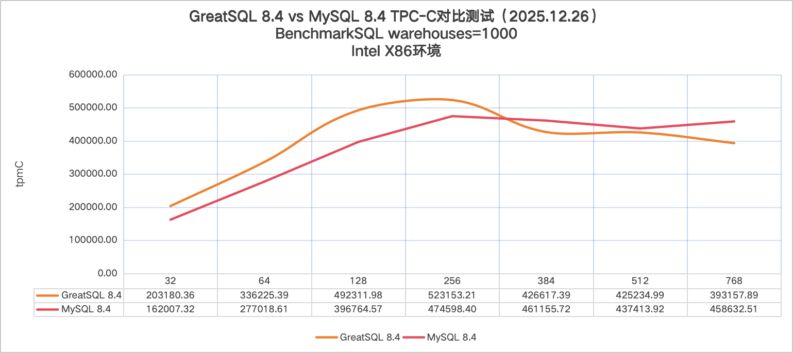
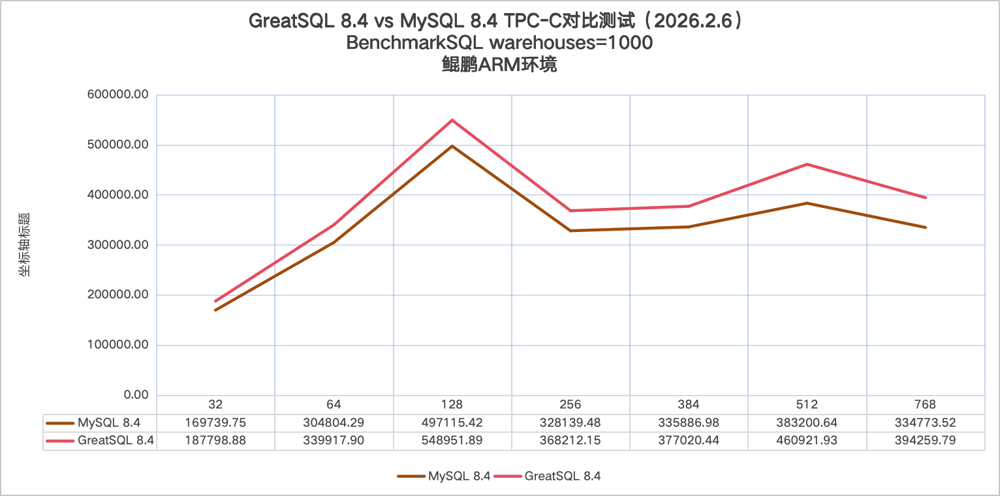
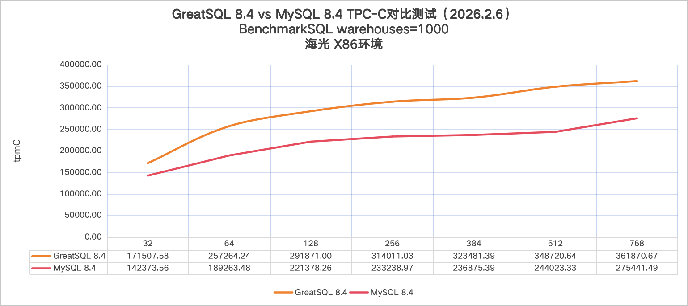
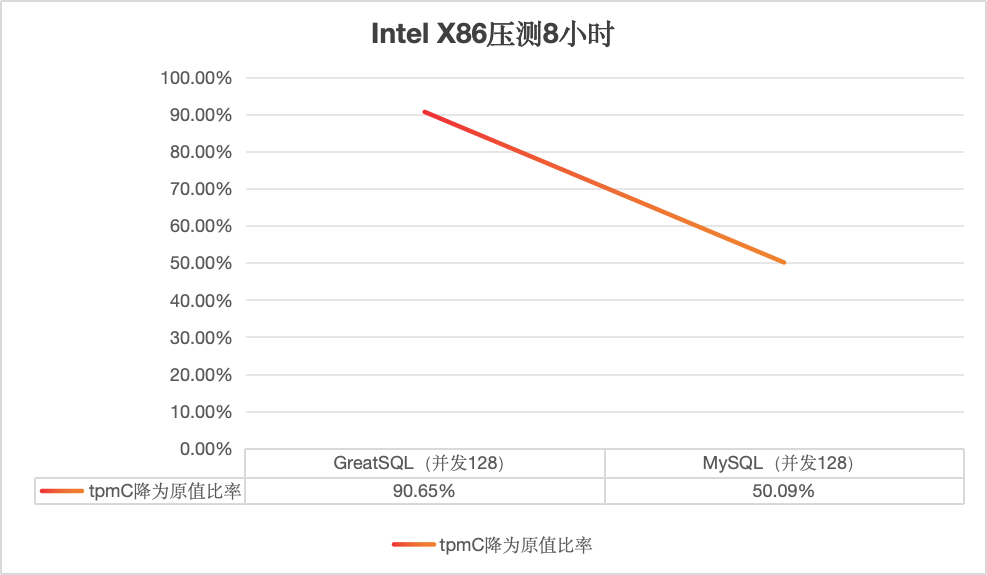
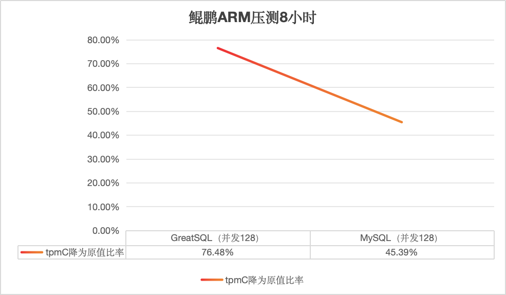
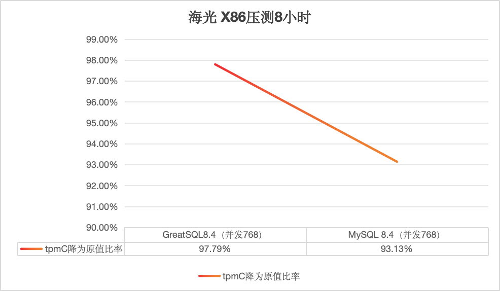

# GreatSQL vs MySQL TPC-C 性能测试（2026.2.6）

**GreatSQL TPC-C 性能测试报告**

**（2026年2月6日）**

**GreatSQL 社区**

## 1.【文档声明】

GreatSQL 社区提醒您在阅读或使用本文档之前仔细阅读、充分理解本法律声明各条款的内容。如果您阅读或使用本文档，您的阅读或使用行为将被视为对本声明全部内容的认可。您应当通过 GreatSQL 社区网站或 GreatSQL 社区提供的其他授权通道下载、获取本文档，且仅能用于自身的合法合规的业务活动。本文档的内容视为 GreatSQL 社区的保密信息，您应当严格遵守保密义务；未经 GreatSQL 社区事先书面同意，您不得向任何第三方披露本手册内容或提供给任何第三方使用。

未经 GreatSQL 社区事先书面许可，任何单位、公司或个人不得擅自摘抄、翻译、复制本文档内容的部分或全部，不得以任何方式或途径进行替换和宣传。

由于产品版本升级、调整或其他原因，本文档内容有可能变更。GreatSQL 社区保留在没有任何通知或者提示下对本文档的内容进行修改的权利，并在 GreatSQL 社区授权通道中不定期发布更新后的用户文档。您应当实时关注用户文档的版本变更并通过 GreatSQL 社区授权渠道下载、获取最新版的用户文档。

本文档仅作为用户使用 GreatSQL 社区产品及服务的参考性指引。GreatSQL 社区在现有技术的基础上尽最大努力提供相应的介绍及操作指引，但 GreatSQL 社区在此明确声明对本文档内容的准确性、完整性、适用性、可靠性等不作任何明示或暗示的保证。任何单位、公司或个人因为下载、使用或信赖本文档而发生任何差错或经济损失的，GreatSQL 社区不承担任何法律责任。在任何情况下，GreatSQL 社区均不对任何间接性、后果性、惩戒性、偶然性、特殊性或刑罚性的损害，包括用户使用或信赖本文档而遭受的利润损失，承担责任（即使 GreatSQL 社区已被告知该等损失的可能性）。

GreatSQL 社区文档中所有内容，包括但不限于图片、架构设计、页面布局、文字描述，均由 GreatSQL 社区和/或其关联公司依法拥有其知识产权，包括但不限于商标权、专利权、著作权、商业秘密等。非经 GreatSQL 社区和/或其关联公司书面同意，任何人不得擅自使用、修改、复制、公开替换、改变、散布、发行或公开发表 GreatSQL 社区网站、产品程序或内容。此外，未经 GreatSQL 社区事先书面同意，任何人不得为了任何营销、广告、促销或其他目的使用、公布或复制 GreatSQL 社区的名称（包括但不限于单独为或以组合形式包含“GreatSQL 社区”、“GreatSQL”等 GreatSQL 社区和/或其关联公司品牌，上述品牌的附属标志及图案或任何类似公司名称、商号、商标、产品或服务名称、域名、图案标示、标志、标识或通过特定描述使第三方能够识别 GreatSQL 社区和/或其关联公司）。

如若发现本文档存在任何错误，请与 GreatSQL 社区取得直接联系。

GreatSQL社区官网：[https://greatsql.cn](https://greatsql.cn)。

## 2. 概述

本次测试针对 GreatSQL 数据库基于 [BenchmarkSQL](./3-4-benchmarksql.md) 的标准 TPC-C 场景的测试。

BenchmarkSQL 是一个开源的 Java 应用程序，用于评估数据库系统在 OLTP 场景下的性能，它是符合 TPC-C 基准压力测试的工具。它最初由 HammerDB 的作者开发，后来由 Cloud V LLC 维护。

TPC-C 模型是模拟一个商品批发公司的销售模型，这个模型涵盖了一个批发公司面向客户对一系列商品进行销售的过程，这包括管理订单，管理库存，管理账号收支等操作。这些操作涉及到仓库、商品、客户、订单等概念，围绕这些概念，构造了数据表格，以及相应的数据库操作。

BenchmarkSQL 支持 MySQL（Percona、GreatSQL）、PostgreSQL、Oracle、SQL Server 等。

GreatSQL 数据库是一款 **开源免费** 数据库，可在普通硬件上满足金融级应用场景，具有 **高可用**、**高性能**、**高兼容**、**高安全** 等特性，可作为 MySQL 或 Percona 的理想可选替换。

下文中提到的 **ibp** 是指 *innodb_buffer_pool_size* 参数简写。

本次测试的目的：对GreatSQL 8.4.4-4（简称GreatSQL）、MySQL 8.4.4（简称MySQL）进行TPC-C性能测试，对比这两个数据库分别在Intel X86和鲲鹏ARM平台下不同的性能表现。

## 3. 测试结果

从本次测试的结果来看，可以得到以下几点结论：

1. 总体而言，GreatSQL相对MySQL的性能能提升相当可观，最高可提升42%，绝大多数并发场景下提升10%起。

2. GreatSQL相对MySQL的性能抖动更小，tpmC和Latency数据都更平稳。

3. 在经过8小时连续压测后，在Intel X86平台下，GreatSQL的tpmC降为原来的90%；在鲲鹏ARM平台降为原来的76%；在海光X86平台降为原来的97%；而MySQL则相应分别降为原来的50%、45%、93%；证明GreatSQL相对MySQL的稳定性更优秀可靠。

以上结论，仅基于本次测试场景的总结。

TPC-C性能对比图如下所示：

- Intel X86下的对比图



- 鲲鹏ARM下的对比图



- 海光X86下的对比图



- 测试服务器信息

|        | Intel X86                                                           | 鲲鹏ARM |                                                                 海光X86 |
| :---   | :---                                                                | :--- | :--- |
| 服务端 | Dell R840<br/>Intel 6238 x 4, 共176核；256Gi内存；Nvme SSD, 3TB * 1 | Huawei TS200-2280 V2<br/>Kunpeng 920 7270Z x 2, 共256核；内存：2TB内存；存储：Nvme SSD, 3TB | 海光7490<br/>Hygon C86-4G (OPN:7490) * 2，共256核；内存：1.5GB；存储：Nvme SSD, 3TB |
| 客户端 | Dell R840<br/>Intel 6238 x 4, 共176核；377Gi内存；Nvme SSD, 3TB * 1 | Huawei TS200-2280 V2<br/>Kunpeng 920 7270Z x 2, 共128核；内存：2TB内存；存储：Nvme SSD, 3TB | Huawei TS200-2280<br/>Kunpeng 920 x 2, 共128核；内存：470G；存储：Nvme SSD, 8TB     |

- 测试模式

| 数据库     | - GreatSQL-8.4.4-4-Linux-glibc2.28<br/> - mysql-8.4.4-linux-glibc2.17 |
| :---       | :--- |
| 测试工具   | BenchmakrSQL 5.0 |
| 测试数据量 | warehouses = 1000<br/> 测试数据库初始化后物理大小约 90GB |

## 4. 测试结果详细数据
### 4.1 Intel X86 平台测试数据

1. GreatSQL 8.4.4-4
- innodbbufferpool_size=180G
- 只启用NUMA，未进行网卡中断绑定，双1模式+开slow log+pfs

| 并发数  | 32         | 64         | 128        | 256        | 384        | 512        | 768        |
|---------|------------|------------|------------|------------|------------|------------|------------|
| Round 1 | 203076.76  | 332984.55  | 488054.97  | 523207.42  | 479477.02  | 428375.64  | 433399.25  |
| Round 2 | 203682.18  | 334184.79  | 491608.93  | 526782.45  | 493533.43  | 439765.11  | 437654.64  |
| Round 3 | 203949.17  | 335139.59  | 492393.93  | 527856.68  | 493442.13  | 443816.97  | 438641.8   |
| Round 4 | 204570.76  | 338542.96  | 493886.09  | 528678.41  | 494862.84  | 448130.37  | 440079.64  |
| Round 5 | 205584.63  | 340275.05  | 495615.97  | 528902.13  | 497487.42  | 475308.81  | 442050.52  |
| Avg     | **204172.76** | **336225.39** | **492311.98** | **527085.42** | **491760.57** | **447079.38** | **438365.17** |

2. MySQL 8.4.4
- innodbbufferpool_size=180G
- 只启用NUMA，未进行网卡中断绑定，双1模式+开slow log+pfs

| 并发数  | 32         | 64         | 128        | 256        | 384        | 512        | 768        |
|---------|------------|------------|------------|------------|------------|------------|------------|
| Round 1 | 156110.47  | 262799.11  | 385478.94  | 459070.91  | 442072.99  | 414013.36  | 442050.52  |
| Round 2 | 162735.65  | 276969.75  | 389364.69  | 463834.48  | 455029.77  | 427281.38  | 442050.52  |
| Round 3 | 162765.30  | 277795.95  | 394744.22  | 480302.58  | 464610.22  | 442331.82  | 442050.52  |
| Round 4 | 163458.46  | 282947.50  | 401869.24  | 484189.69  | 471868.69  | 451571.49  | 442050.52  |
| Round 5 | 164966.72  | 284580.72  | 412365.76  | 485594.32  | 472196.95  | 451871.54  | 442050.52  |
| Avg     | **162007.32** | **277018.61** | **396764.57** | **474598.40** | **461155.72** | **437413.92** | **442050.52** |

| GreatSQL作为基数对比（并发数）  | 32 | 64 | 128     | 256     | 384     | 512     | 768     |
|-----------------------|---------|---------|---------|---------|---------|---------|---------|
| 对比MySQL             | **26.03%** | **21.37%** | **24.08%** | **11.06%** | **6.64%** | **2.21%** | **-4.42%** |

结论：**X86平台下，GreatSQL在大部分并发场景下表现比MySQL要更好，tpmC最好成绩高出26%；只在并发768时表现比MySQL略差**。

### 4.2 鲲鹏ARM 平台测试数据

1. GreatSQL 8.4.4-4
- innodb_buffer_pool_size=180G
- 启用NUMA和网卡中断绑定，双1模式+开slow log+pfs

| 并发数  | 32         | 64         | 128        | 256        | 384        | 512        | 768        |
|---------|------------|------------|------------|------------|------------|------------|------------|
| Round 1 | 179402.52  | 336006.71  | 543341.77  | 341168.62  | 375060.08  | 449849.11  | 388444.04  |
| Round 2 | 187574.45  | 338985.38  | 547766.34  | 342307.33  | 375826.13  | 457579.96  | 391517.38  |
| Round 3 | 189302.81  | 339620.65  | 549039.52  | 342867.17  | 376617.37  | 460930.00  | 392838.51  |
| Round 4 | 190417.68  | 341710.79  | 549561.12  | 344120.32  | 377824.86  | 466876.29  | 396247.13  |
| Round 5 | 192296.94  | 343265.96  | 555050.69  | 470597.33  | 379773.78  | 469374.28  | 402251.89  |
| Avg     | **187798.88** | **339917.90** | **548951.89** | **368212.15** | **377020.44** | **460921.93** | **394259.79** |

2. MySQL 8.4.4
- innodb_buffer_pool_size=180G
- 启用NUMA和网卡中断绑定，双1模式+开slow log+pfs. 

| 并发数  | 32         | 64         | 128        | 256        | 384        | 512        | 768        |
|---------|------------|------------|------------|------------|------------|------------|------------|
| Round 1 | 168770.24  | 302410.89  | 491520.78  | 323778.25  | 333552.38  | 381161.67  | 331701.16  |
| Round 2 | 169072.51  | 302682.72  | 495234.28  | 324030.23  | 335690.91  | 382482.97  | 331718.13  |
| Round 3 | 169587.21  | 304935.51  | 496005.96  | 328414.69  | 335796.34  | 383243.77  | 333856.2   |
| Round 4 | 170617.79  | 306967.69  | 497659.32  | 328608.03  | 336111.10  | 383485.45  | 337922.5   |
| Round 5 | 170650.99  | 307024.62  | 505156.74  | 335866.19  | 338284.19  | 385629.35  | 338669.63  |
| Avg     | **169739.75** | **304804.29** | **497115.42** | **328139.48** | **335886.98** | **383200.64** | **334773.52** |


| GreatSQL作为基数对比（并发数）  | 32 | 64 | 128     | 256     | 384     | 512     | 768     |
|-----------------------|---------|---------|---------|---------|---------|---------|---------|
| 对比MySQL             | **10.64%** | **11.52%** | **10.43%** | **12.21%** | **12.25%** | **20.28%** | **17.77%** |

结论：**鲲鹏ARM平台下，GreatSQL在所有并发场景下表现都比MySQL更好，tpmC成绩高10% ~ 20%，相当可观**。

### 4.3 海光X86平台测试数据

1. GreatSQL 8.4.4-4
- innodb_buffer_pool_size=180G
- 启用NUMA和网卡中断绑定，双1模式+开slow log+pfs

markdown
| 并发数  | 32         | 64         | 128        | 256        | 384        | 512        | 768        |
|---------|------------|------------|------------|------------|------------|------------|------------|
| Round 1 | 168524.44  | 255680.34  | 290356.06  | 311072.19  | 321101.23  | 347455.66  | 360110.57  |  
| Round 2 | 170183.16  | 256274.21  | 291327.54  | 312782.24  | 323003.83  | 348087.80  | 361023.74  |  
| Round 3 | 171818.62  | 256281.18  | 291431.13  | 313190.33  | 323746.99  | 348500.71  | 362370.74  |  
| Round 4 | 172745.97  | 256427.47  | 292701.34  | 315635.62  | 324770.95  | 348694.18  | 362629.10  |  
| Round 5 | 174265.70  | 261658.00  | 293538.94  | 317374.76  | 324783.94  | 350864.86  | 363219.18  |  
| Avg | **171507.58** | **257264.24** | **291871.00** | **314011.03** | **323481.39** | **348720.64** | **361870.67** |

2. MySQL 8.4.4
- innodb_buffer_pool_size=180G
- 启用NUMA和网卡中断绑定，双1模式+开slow log+pfs. 

| 并发数  | 32       | 64       | 128      | 256      | 384      | 512      | 768      |
|-------- |----------|----------|----------|----------|----------|----------|----------|
| Round 1 | 138301.42 | 186540.58 | 213010.6 | 225025.92 | 228769.95 | 237837.16 | 270922.83 |
| Round 2 | 141695.6 | 186810.06 | 218952.19 | 227999.09 | 233709.03 | 241560.59 | 271462.62 |
| Round 3 | 143576.76 | 186837.71 | 220611.91 | 232451.64 | 237996.87 | 244398.16 | 274278.95 |
| Round 4 | 143699.59 | 192074.73 | 224645.8 | 237100.89 | 239518.31 | 247889.31 | 276113.28 |
| Round 5 | 144594.43 | 194054.31 | 229670.81 | 243617.29 | 244382.8 | 248431.44 | 284429.78 |
| Avg | **142373.56** | **189263.48** | **221378.26** | **233238.97** | **236875.39** | **244023.33** | **275441.49** |

| GreatSQL作为基数对比（并发数）  | 32 | 64 | 128     | 256     | 384     | 512     | 768     |
|-----------------------|---------|---------|---------|---------|---------|---------|---------|
| 对比MySQL             | **20.46%** | **35.93%** | **31.84%** | **34.63%** | **36.56%** | **42.90%** | **31.38%** |


结论：**海光X86平台下，GreatSQL在所有并发场景下表现都比MySQL更好，tpmC成绩高20% ~ 42%，相当可观**。

**提示**：在各平台环境下各并发时的tpmC及Latency曲线请查看 **[报告全文](https://gitee.com/GreatSQL/GreatSQL-Doc/blob/master/Presentations/41、benchmarksql-greatsql84-vs-mysql84-tpcc-wh1000-report-20260206.pdf)**。

### 4.4 运行8小时后的tpmC变化

#### 4.4.1 Intel X86平台

|                    | 运行20分钟(tpmC) | 运行8小时(tpmC) | tpmC下降值 | 降为原值比率 | 初始表空间 | 8小时后表空间 | 表空间增长比率 | 事务总数 |
|--------------------|------------------|-----------------|------------|--------------|------------|---------------|----------------|----------|
| GreatSQL（并发256）| 523153.21        | 474228.51       | 48924.70   | 90.65%       | 90G        | 350G          | 388.89%        | 505879211|
| MySQL（并发256）   | 474598.40        | 237711.26       | 236887.14  | 50.09%       | 90G        | 222G          | 246.67%        | 253552583|

tpmC对比图



#### 4.4.2 鲲鹏ARM平台

|                    | 运行20分钟(tpmC) | 运行8小时(tpmC) | tpmC下降值 | 降为原值比率 | 初始表空间 | 8小时后表空间 | 表空间增长比率 | 事务总数  |
|---------------------|------------------|-----------------|------------|--------------|------------|---------------|----------------|----------|
| GreatSQL（并发128） | 548951.89        | 419824.97       | 129126.92  | 76.48%       | 90G        | 320G          | 255.56%        | 447823234|
| MySQL（并发128）    | 497115.42        | 225635.72       | 271479.70  | 45.39%       | 90G        | 218G          | 142.22%        | 240701779|

tpmC对比图



#### 4.4.3 海光X86平台

|                    | 运行20分钟(tpmC) | 运行8小时(tpmC) | tpmC下降值 | 降为原值比率 | 初始表空间 | 8小时后表空间 | 表空间增长比率 | 事务总数 |
|---------------------|------------------|-----------------|-----------|--------------|------------|---------------|----------------|----------|
| GreatSQL（并发768） | 361870.67        | 353889.88       | 7980.79   | 97.79%       | 90G        | 286G          | 217.78%        | 377483276|
| MySQL（并发768）    | 275441.49        | 256531.68       | 18909.810 | 93.13%       | 90G        | 233G          | 158.89%        | 273629874|

tpmC对比图



**提示**：在各平台环境下持续压测8小时后的tpmC及Latency曲线请查看 **[报告全文](https://gitee.com/GreatSQL/GreatSQL-Doc/blob/master/Presentations/41、benchmarksql-greatsql84-vs-mysql84-tpcc-wh1000-report-20260206.pdf)**。

## 5. 附录

### 5.1 测试步骤

参考手册内容 [BenchmarkSQL 性能测试](./3-4-benchmarksql.md)，执行 TPC-C 压测，详细过程不赘述。

### 5.2 测试工具

BenchmarkSQL 5.0。

相应代码仓库：[https://gitee.com/GreatSQL/benchmarksql](https://gitee.com/GreatSQL/benchmarksql)。

### 5.3 测试模式

- 利用BenchmarkSQL构造测试数据，设置参数 warehouses=1000。
- 测试数据库初始大小约90G。
- 服务器端开启NUMA，并设置innodb_numa_interleave=ON（8.4版本下默认开启）。
- 鲲鹏ARM环境中对网卡中断进行绑定操作，绑定脚本内容见下方服务端详细信息。
- 测试过程中开启Binlog及双1模式，其余主要参数详见后面描述。

### 5.4 BenchmarkSQL相关参数如下

```ini
conn=jdbc:mysql://DBIP:3306/bmsql?useServerPrepStmts=false&prepStmtCacheSize=250&allowPublicKeyRetrieval=true&useSSL=false&serverTimezone=GMT&useLocalSessionState=true&maintainTimeStats=false&useUnicode=true&characterEncoding=utf8&rewriteBatchedStatements=true&cacheResultSetMetadata=true&metadataCacheSize=1024&useConfigs=maxPerformance
warehouses=2000
loadWorkers=128

terminals=32
//terminals=32\64\128\256\384\512\768
runTxnsPerTerminal=0
runMins=20
limitTxnsPerMin=0

terminalWarehouseFixed=true

report-on-new-line=0
table-engine=innodb

newOrderWeight=45
paymentWeight=43
orderStatusWeight=4
deliveryWeight=4
stockLevelWeight=4
```

### 5.5 数据库主要相关参数配置

```ini
[mysqld]
user=mysql
port=3306
server_id=3306
basedir=/usr/local/GreatSQL
#basedir=/usr/local/mysql
datadir=/data/GreatSQL
socket=/data/GreatSQL/mysql.sock
pid-file=mysql.pid
character-set-server=UTF8MB4
skip_name_resolve=ON
default_time_zone="+8:00"
bind_address="0.0.0.0"
secure_file_priv=/data/GreatSQL
mysql_native_password=ON

# Performance
lock_wait_timeout=3600
open_files_limit=65535
back_log=1024
max_connections=1024
max_connect_errors=1000000
table_open_cache=4096
table_definition_cache=2048
sort_buffer_size=4M
join_buffer_size=4M
read_buffer_size=8M
read_rnd_buffer_size=4M
bulk_insert_buffer_size=64M
thread_cache_size=768
interactive_timeout=600
wait_timeout=600
tmp_table_size=96M
max_heap_table_size=96M
max_allowed_packet=64M
loose-net_buffer_shrink_interval=180
sql_generate_invisible_primary_key=ON
loose-lock_ddl_polling_mode=ON
loose-lock_ddl_polling_runtime=200

# Logs
log_timestamps=SYSTEM
log_error=error.log
log_error_verbosity=3
slow_query_log=ON
log_slow_extra=ON
slow_query_log_file=slow.log
long_query_time=0.01
log_queries_not_using_indexes=ON
log_throttle_queries_not_using_indexes=60
min_examined_row_limit=100
log_slow_admin_statements=ON
log_slow_replica_statements=ON
loose-log_slow_verbosity=FULL
log_bin=binlog
binlog_format=ROW
sync_binlog=1
binlog_cache_size=4M
max_binlog_cache_size=6G
max_binlog_size=1G
loose-binlog_space_limit=500G
binlog_rows_query_log_events=ON
binlog_expire_logs_seconds=604800
binlog_checksum=CRC32
binlog_order_commits=OFF
gtid_mode=ON
enforce_gtid_consistency=ON

# Replication
relay-log=relaylog
relay_log_recovery=ON
replica_parallel_type=LOGICAL_CLOCK
replica_parallel_workers=16
replica_preserve_commit_order=ON
replica_checkpoint_period=2
loose-rpl_read_binlog_speed_limit=100

# InnoDB
innodb_buffer_pool_size=180G
innodb_buffer_pool_instances=24
innodb_data_file_path=ibdata1:12M:autoextend
innodb_flush_log_at_trx_commit=1
innodb_log_buffer_size=64M
innodb_redo_log_capacity=16G
innodb_doublewrite_files=64
innodb_doublewrite_pages=64
innodb_max_undo_log_size=4G
innodb_io_capacity=40000
innodb_io_capacity_max=80000
innodb_open_files=65534
innodb_flush_method=O_DIRECT
innodb_use_fdatasync=ON
innodb_lru_scan_depth=4000
innodb_lock_wait_timeout=10
innodb_rollback_on_timeout=ON
innodb_print_all_deadlocks=ON
innodb_online_alter_log_max_size=4G
innodb_print_ddl_logs=OFF
innodb_status_file=ON
innodb_status_output=OFF
innodb_status_output_locks=ON
innodb_sort_buffer_size=64M
innodb_adaptive_hash_index=OFF
innodb_numa_interleave=ON
innodb_spin_wait_delay=6
innodb_spin_wait_pause_multiplier=50
innodb_sync_spin_loops=30
loose-innodb_print_lock_wait_timeout_info=OFF
innodb_change_buffering=none
loose-kill_idle_transaction=300
loose-innodb_data_file_async_purge=ON
```

**提示**：在各平台环境下各并发时的tpmC及Latency曲线请查看 **[报告全文](https://gitee.com/GreatSQL/GreatSQL-Doc/blob/master/Presentations/41、benchmarksql-greatsql84-vs-mysql84-tpcc-wh1000-report-20260206.pdf)**。

## 参考资料

- [TPC-C官网](https://www.tpc.org/tpcc/)
- [GreatSQL安装指南](../4-install-guide/0-install-guide.md)
- [BenchmarkSQL 性能测试](./3-4-benchmarksql.md)

**扫码关注微信公众号**


