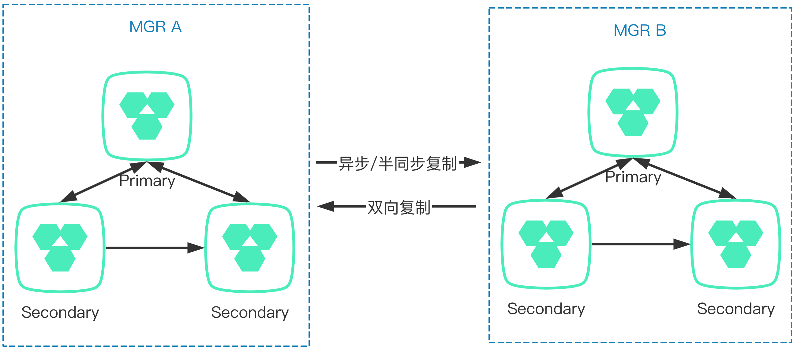

# FAQ - 基于MGR的架构方案
---

本文内容主要是MGR架构方案相关的FAQ。

## 1. GreatSQL支持读写分离吗
可以利用MySQL Router来实现读写分离。

## 2. MGR支持读负载均衡吗
支持的。可以在MGR集群的前端挂载MySQL Router，即可实现读负载均衡。

## 3. MGR支持写负载均衡吗
不支持。由于MGR采用shared nothing模式，每个节点都存储全量数据，因此所有写入每个节点都要再应用一次。

## 4. 两个MGR集群间还可以构建主从复制关系吗
首先，答案是肯定的，可以的。

其次，为了保障MGR的数据安全性，对不同角色节点的要求是这样的：
- 在单主模式（Single-Primary）时，从节点（Secondary）不能同时作为Master-Slave的从节点（Slave）
- 在单主模式时，主节点（Primary）可以同时作为M-S的从节点（Slave）
- 在多主模式时，任何节点可以作为MS的从节点（Slave）。提醒：强烈建议不要使用多主模式
- 要求都是InnoDB表，且没有数据冲突（例如数据重复、数据不存在等），没有使用外键
- 节点重启时，注意要先启动MGR服务，再启动M-S服务。这时候可以设置 `group_replication_start_on_boot=ON` 和 `skip_slave_start=ON` 予以保证

在这两个MGR集群间的主从复制可以采用异步复制，也可以采用半同步复制，主要取决于两个集群间的网络延迟情况及架构设计方案。这时候，整体架构方案类似下面这样：

-

在这个架构下，两个MGR集群间是相互独立的，如果前端挂载MySQL Router的话，需要单独创建对应的连接。

如果担心MGR节点因为发生切换，只要原来指向的Master没有退出MGR集群，则这个主从复制关系还是存在的，不受影响。如果担心原来的Master节点退出MGR集群而导致复制中断，则可以采用MySQL 8.0.22后推出的新特性 **Async Replication Auto failover** 来解决，把各节点都加到复制源中，可以参考下面的资料：
- [金融应用场景下跨数据中心的MGR架构方案](https://mp.weixin.qq.com/s/A3yJUz6DNvCgIfqD78t_qQ)
- [Switching Sources and Replicas with Asynchronous Connection Failover](https://dev.mysql.com/doc/refman/8.0/en/replication-asynchronous-connection-failover.html)
- [视频：MGR是如何保障数据一致性的](https://www.bilibili.com/video/BV1NT4y1R7Zi)

## 5. MGR可以像主从复制那样只启动两个节点吗
MGR在初始化启动时，是可以只启动两个节点，甚至只有一个节点，但是这样就失去MGR的意义了。**因为只要少于三个节点，就没办法进行多数派投票**，当发生网络故障等情况时，无法投票确认哪些节点该被踢出集群。

如果是为了节省服务器成本，则可以选用 GreatSQL 8.0.25-16 及以上版本，它支持仲裁节点角色，可以用一个低配服务器来运行，也就是几乎可以用接近于两台服务器的成本来运行
一个三节点的MGR集群。详情参考：[1.1 新增仲裁节点（投票节点）角色](https://gitee.com/GreatSQL/GreatSQL-Doc/blob/master/relnotes/changes-greatsql-8-0-25-16-20220516.md#11-%E6%96%B0%E5%A2%9E%E4%BB%B2%E8%A3%81%E8%8A%82%E7%82%B9%E6%8A%95%E7%A5%A8%E8%8A%82%E7%82%B9%E8%A7%92%E8%89%B2)。

## 6. MySQL Router可以配置在MGR主从节点间轮询吗
MySQL Router通过两个端口来区分读写服务请求，默认是 6446端口提供读写服务，6447端口提供只读服务。
在单主模式下，读写服务只会连接到Primary节点。对于读写服务端口，可选的策略有以下两种：
- first-available，只连接第一个可用节点
- round-robin（默认），在多个主节点间轮询

只读服务默认是对所有Secondary节点轮询。对于只读服务端口，可选的策略有以下3种：
- first-available，只连第一个可用节点
- round-robin，在所有可用Secondary节点间轮询，如果所有Secondary节点都不可用时，只读服务则不可用，不会连接到Primary节点
- round-robin-with-fallback（默认），在所有Secondary节点间轮询，跳过不可用节点。如果所有Secondary节点都不可用时，会再连接到Primary节点

现在我们知道了，MySQL Router只有在所有Secondary节点都不可用时，才会去连接Primary节点读数据，无法做到在发起只读请求时，同时连接主从节点。

更多关于 MySQL Router 可用的策略请参见文档 **[routing_strategy参数/选项](https://dev.mysql.com/doc/mysql-router/8.0/en/mysql-router-conf-options.html#option_mysqlrouter_routing_strategy)**。

**问题反馈**
---
- [问题反馈 gitee](https://gitee.com/GreatSQL/GreatSQL-Manual/issues)

**联系我们**
---

扫码关注微信公众号

