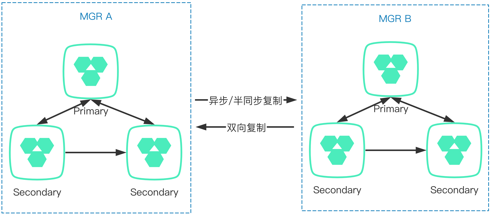

# FAQ - 基于MGR的架构方案
---

## 1. GreatSQL 支持读写分离吗
可以利用 MySQL Router 来实现读写分离。

也可以利用 GreatSQL MGR 支持对读写节点、只读节点分别绑定 VIP 特性实现读写分离需求，详见：[GreatSQL 高可用特性之内置动态 VIP](../5-enhance/5-2-ha-mgr-vip.md)。

## 2. MGR 支持读负载均衡吗
支持的。可以在 MGR 集群的前端挂载 MySQL Router，即可实现读负载均衡。

## 3. MGR 支持写负载均衡吗
不支持。由于 MGR 采用 shared nothing 模式，每个节点都存储全量数据，因此所有写入每个节点都要再应用一次。

## 4. 两个 MGR 集群间还可以构建主从复制关系吗
首先，答案是肯定的，可以的。

其次，为了保障 MGR 的数据安全性，对不同角色节点的要求是这样的：
- 在单主模式（Single-Primary）时，从节点（Secondary）不能同时作为 Master-Slave 的从节点（Slave）
- 在单主模式时，主节点（Primary）可以同时作为 M-S 的从节点（Slave）
- 在多主模式时，任何节点可以作为 M-S 的从节点（Slave）。提醒：强烈建议不要使用多主模式
- 要求都是 InnoDB 表，且没有数据冲突（例如数据重复、数据不存在等），没有使用外键
- 节点重启时，注意要先启动 MGR 服务，再启动 M-S 服务。这时候可以设置 `group_replication_start_on_boot=ON` 和 `skip_replica_start=ON` 予以保证

在这两个 MGR 集群间的主从复制可以采用异步复制，也可以采用半同步复制，主要取决于两个集群间的网络延迟情况及架构设计方案。这时候，整体架构方案类似下面这样：

在这个架构下，两个 MGR 集群间是相互独立的，如果前端挂载 MySQL Router 的话，需要单独创建对应的连接。

如果担心 MGR 节点因为发生切换，只要原来指向的 Master 没有退出 MGR 集群，则这个主从复制关系还是存在的，不受影响。如果担心原来的 Master 节点退出 MGR 集群而导致复制中断，则可以采用 MySQL 8.0.22 后推出的新特性 **Async Replication Auto failover** 来解决，把各节点都加到复制源中，可以参考下面的资料：
- [金融应用场景下跨数据中心的MGR架构方案](https://mp.weixin.qq.com/s/A3yJUz6DNvCgIfqD78t_qQ)
- [Switching Sources and Replicas with Asynchronous Connection Failover](https://dev.mysql.com/doc/refman/8.0/en/replication-asynchronous-connection-failover.html)
- [视频：MGR是如何保障数据一致性的](https://www.bilibili.com/video/BV1NT4y1R7Zi)

## 5. MGR 可以像主从复制那样只启动两个节点吗
MGR 在初始化启动时，是可以只启动两个节点，甚至只有一个节点，但是这样就失去 MGR 的意义了。**因为只要少于三个节点，就没办法进行多数派投票**，当发生网络故障等情况时，无法投票确认哪些节点该被踢出集群。

如果是为了节省服务器成本，则可以选用 GreatSQL 8.0.25-16 及以上版本，它支持仲裁节点角色，可以用一个低配服务器来运行，也就是几乎可以用接近于两台服务器的成本来运行一个三节点的 MGR 集群。详情参考：[新增仲裁节点（投票节点）角色](../5-enhance/5-2-ha-mgr-arbitrator.md)。

## 6. MySQL Router 可以配置在 MGR 主从节点间轮询吗
MySQL Router 通过两个端口来区分读写服务请求，默认是 6446 端口提供读写服务，6447 端口提供只读服务。
在单主模式下，读写服务只会连接到 Primary 节点。对于读写服务端口，可选的策略有以下两种：
- first-available，只连接第一个可用节点
- round-robin（默认），在多个主节点间轮询

只读服务默认是对所有 Secondary 节点轮询。对于只读服务端口，可选的策略有以下 3 种：
- first-available，只连第一个可用节点
- round-robin，在所有可用 Secondary 节点间轮询，如果所有 Secondary 节点都不可用时，只读服务则不可用，不会连接到 Primary 节点
- round-robin-with-fallback（默认），在所有 Secondary 节点间轮询，跳过不可用节点。如果所有 Secondary 节点都不可用时，会再连接到 Primary 节点

现在我们知道了，MySQL Router 只有在所有 Secondary 节点都不可用时，才会去连接 Primary 节点读数据，无法做到在发起只读请求时，同时连接主从节点。

更多关于 MySQL Router 可用的策略请参见文档 **[routing_strategy 参数/选项](https://dev.mysql.com/doc/mysql-router/8.0/en/mysql-router-conf-options.html#option_mysqlrouter_routing_strategy)**。

## 7. 可以用 MySQL Shell 来管理 GreatSQL MGR 集群吗

只要大版本一样就可以，例如用 MySQL Shell 8.0.32 版本管理 GreatSQL 8.0.32-24/8.0.32-25 版本构建的 MGR 集群都可以。

要注意的是，当 GreatSQL MGR 集群中存在 Arbitrator（仲裁）节点时，MySQL Shell 无法识别，这时只能使用 GreatSQL Shell 来管理了。

更具体内容可以参考：[手动构建的 GreatSQL MGR 集群（含仲裁节点）如何用 shell 接管](https://greatsql.cn/thread-503-1-1.html)。

## 8. 为什么推荐单主架构的 MGR，为何不推荐多主架构呢

简单说，单主更简单，性能更好。

多主更复杂，性能更差，且容易造成多节点写入引发事务冲突，需要在应用端配合做好控制，比如区分不同业务在不同节点写入。

## 9. 为什么在配置 MGR 时，建议加上 report_host 选项

有两个原因。

1. 因为 MGR 节点成员所在服务器可能有多个不同主机名，这时为了避免发生混淆或重复，需要在每个服务器上编辑 `/etc/hosts` 设置好相应的主机名，或者设置 `report_host` 选项。

2. 如果想使用 GreatSQL 的动态绑定 VIP 特性，也需要依赖 `report_host` 设置，详见：[内置动态 VIP](../5-enhance/5-2-ha-mgr-vip.md)。

**扫码关注微信公众号**

