# 通过 GUI 客户端连接
---

通过 GUI 客户端连接需要修改用户的当前主机配置信息。

```sql
greatsql> SELECT Host,User FROM mysql.user; 
+-----------+------------------+
| Host      | User             |
+-----------+------------------+
| localhost | root             |
| localhost | mysql.infoschema |
| localhost | mysql.session    |
| localhost | mysql.sys        |
+-----------+------------------+
4 rows in set (0.00 sec)
```

`Host` 列指定了允许用户登录所使用的IP

- 如果 user=root, Host=192.168.1.1，表示 root 用户通过 *192.168.1.1* 的客户端去访问 
- 如果 user=root, Host=localhost，表示只能通过本机客户端去访问
- 如果 Host=192.168.1.%，*%* 为通配符，表示 *192.168.1.%* 网段的客户端都可以连接
- 如果 Host=% ，表示所有IP都有连接权限

> 不建议修改root用户的Host！
>
> 建议新建一个用于远程连接用户授权。

创建一个新用户`greatsql`，密码为`GreatSQL@2024`，该用户拥有和root同权，并支持远程连接

```sql
greatsql> CREATE USER 'greatsql'@'%' IDENTIFIED BY 'GreatSQL@2024';
```

这里`%`表示允许该用户从任何主机连接，使用`GRANT`语句赋予`newuser`与`root`相同的权限，并刷新权限

```sql
greatsql> GRANT ALL PRIVILEGES ON *.* TO 'greatsql'@'%' WITH GRANT OPTION;
greatsql> FLUSH PRIVILEGES;
```

> 但是，请注意，赋予用户与`root`相同的权限可能会带来安全风险。确保你了解这些风险，并只在必要时这样做。

在接下来的示例中，都采用`greatsql`用户进行连接

### 使用 Navicat 连接

下载安装 Navicat 过程省略，Navicat 工具需要付费，若有需要可以使用试用版

打开Navicat工具，点击左上角`连接`，并选择`MySQL`

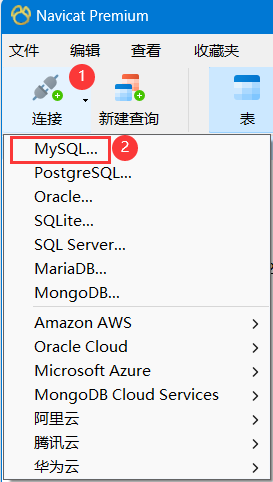

填入连接名(自定义即可)，主机为GreatSQL所在的机器IP，端口号默认为3306，用户名采用上文创建的`greatsql`用户，密码为`GreatSQL@2024`

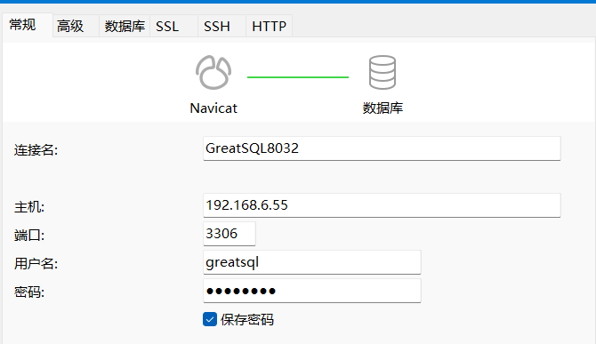

填写完成后，点击左下角`测试连接`，如果提示`连接成功`点击右下角`确认`即可

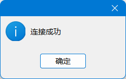

至此，使用 Navicat 连接 GreatSQL 服务器完成。

### 使用 MySQL workbench 连接

打开 MySQL workbench 工具，点击`+`号

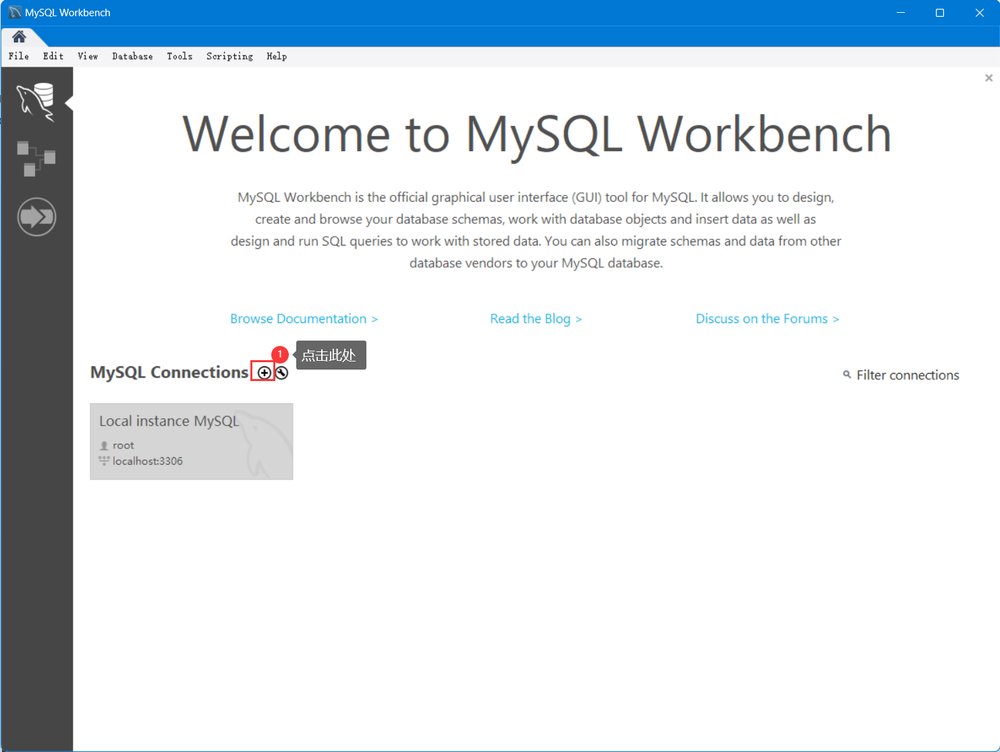

填入连接名(自定义即可)，主机为GreatSQL所在的机器IP，端口号默认为3306，用户名采用上文创建的`greatsql`用户，密码填入需要点击`Store in Vault`弹出窗口后填入密码`GreatSQL@2024`

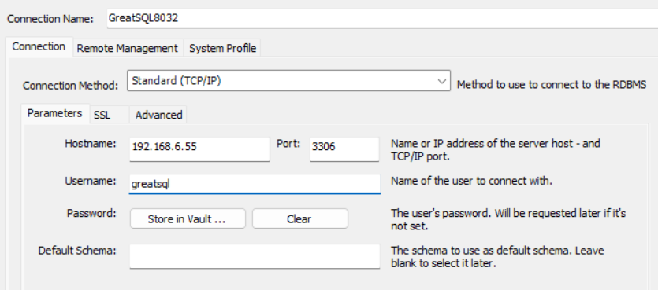

填写完成后，点击`Test Connection`测试连接，提示`Successfully made the MySQL connection`表示成功连接

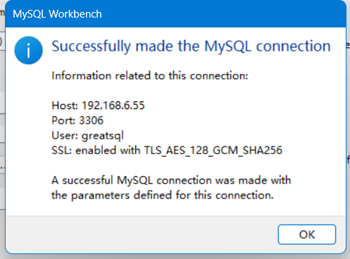

在主页也可看到连接信息，双击就可以进入GreatSQL客户端操作

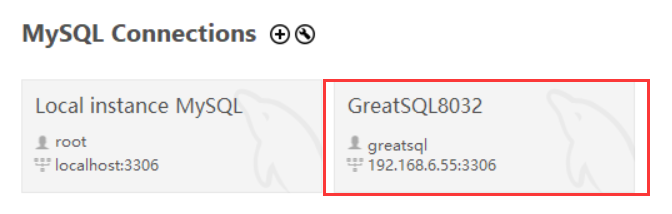

至此，使用 MySQL workbench 连接 GreatSQL 服务器完成。

### 使用 ATOMDB 连接

ATOMDB™ 数据库管理客户端是一款服务广大开发者的工具软件，可以让开发者方便地执行查询，创建和管理数据库，支持管理市场上主流的数据库管理系统

下载并安装 ATOMDB

- https://atomdb.com/product/download.html

打开 ATOMDB 工具，点击左上角`File`，选择`New project`，此时会弹出填写项目名称，这里按自己需求填写即可

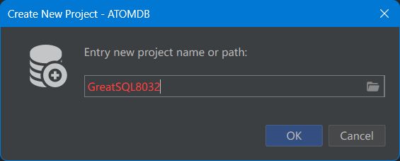

新建完成后，点击添加数据源

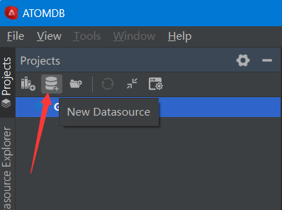

选择GreatDB，点击Next即可

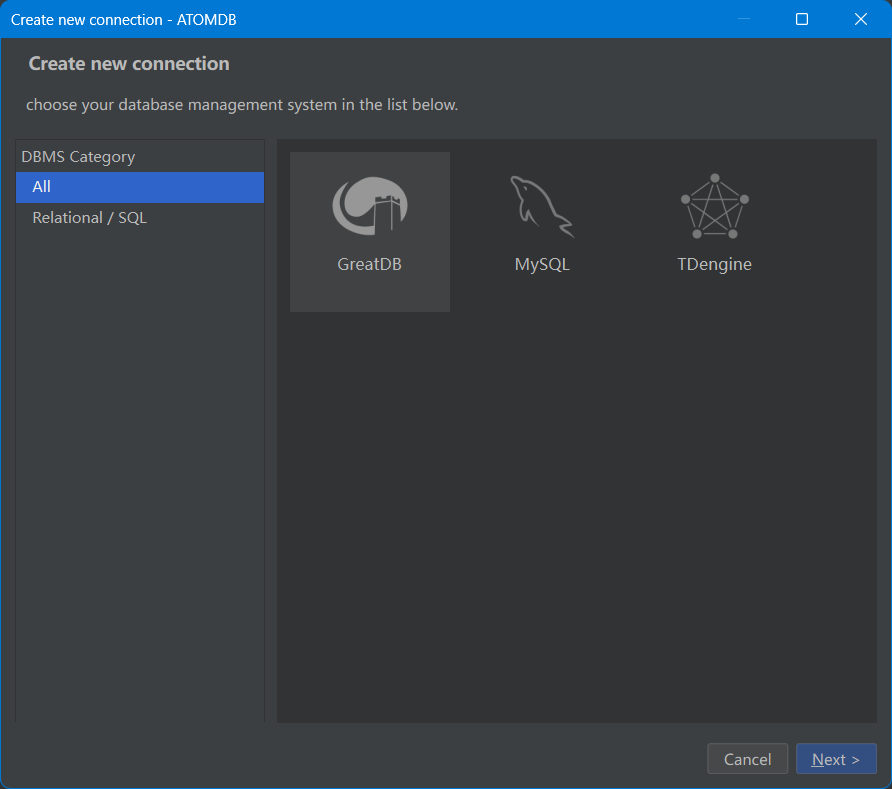

填入连接名(自定义即可)，主机为GreatSQL所在的机器IP，端口号默认为3306，用户名采用上文创建的`greatsql`用户，密码填入`GreatSQL@2024`，点击`test`

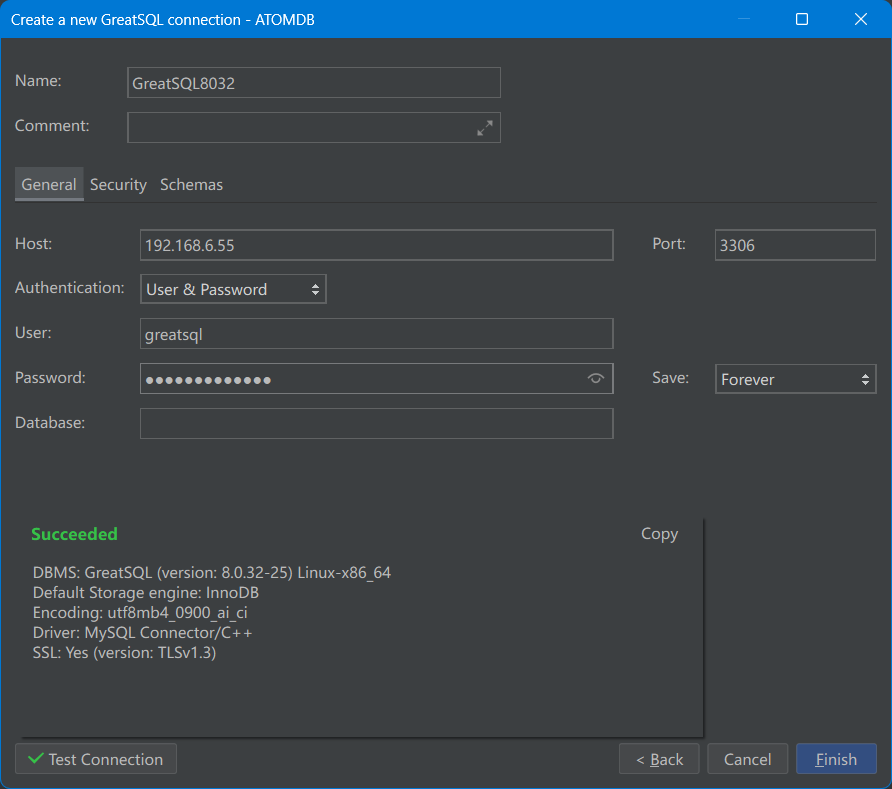

至此，使用 ATOMDB 连接 GreatSQL 服务器完成。


**扫码关注微信公众号**


