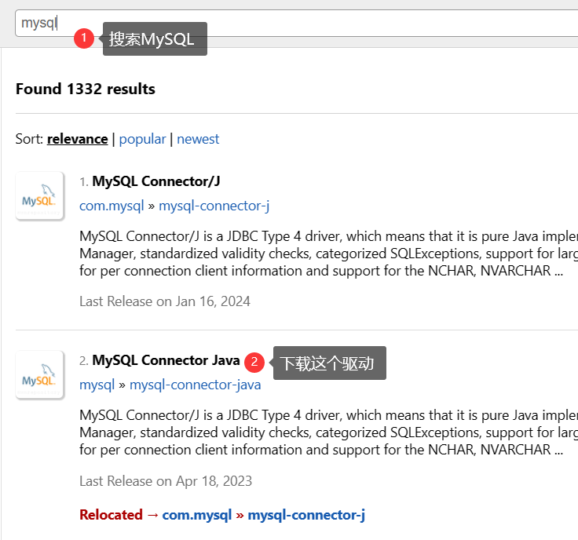
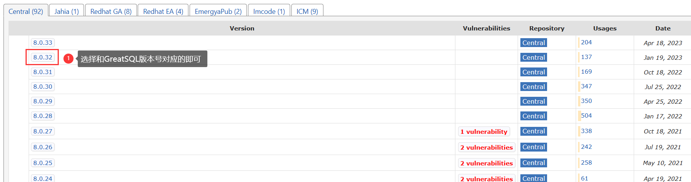
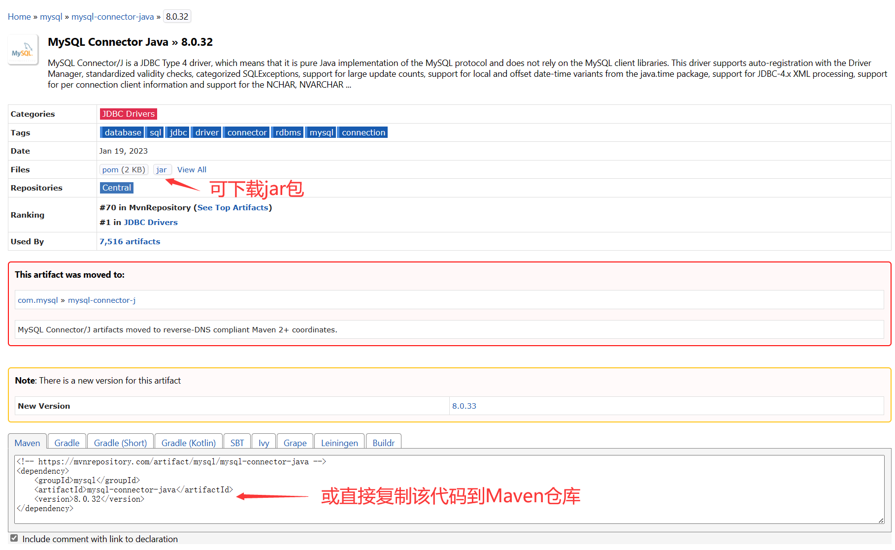

# 选择驱动连接

## 使用Java连接

前置条件

- 已安装 GreatSQL 数据库。
- 已安装 JDK 和 Maven。
- 已安装 IntelliJ IDEA。

### 示例

前往Maven官网：https://mvnrepository.com/

搜索MySQL下载MySQL/GreatSQL对应的驱动包



点击`MySQL Connector Java`进入后选择与GreatSQL版本对应的驱动即可



进入对应的驱动版本内

- 1.可下载用于连接的jar包
- 2.或直接复制下方Meven代码到Meven仓库中



如果使用的是 **Maven**，请将以下内容添加到你的 `<dependencies></dependencies>`中

```java
<dependency>
    <groupId>mysql</groupId>
    <artifactId>mysql-connector-java</artifactId>
    <version>8.0.32</version>
</dependency>
```

接着在 `application.properties` 文件中填入 URL 信息

```java
jdbc:mysql://host:port/schema_name?useSSL=false&serverTimezone=Asia/Shanghai&user=$user_name&password=$password&characterEncoding=UTF-8
```

- `host`：提供 GreatSQL 数据库连接 IP

- `port`：填写 GreatSQL 数据库连接端口

- `schema_name`：访问的数据库名称
- `useSSL=false`：不加密链接，在8.0版本以上都需要添加
- `&serverTimezone=Asia/Shanghai`：中国上海时效

- `user_name`：连接的用户名

- `password`：连接的密码

- `characterEncoding`：字符编码，默认为UTF-8

## 使用Golang连接

前置条件

- 已安装 GreatSQL 数据库。
- 已安装 GO。

### 示例

在Go项目中`import`中导入包

```go
import (
	"database/sql"
	"fmt"
	_ "github.com/go-sql-driver/mysql" // 空导入
	"log"
)
```

填写数据库连接信息

```go
const (
	username = "root"
	password = "GreatSQL@2024"
	hostname = "127.0.0.1:3306"
	dbname   = "employees"
)
```

- `user`：连接的用户名

- `password`：连接的密码
- `host`：提供 GreatSQL 数据库连接 IP

- `dbname`：要连接的数据库名

在`main`函数中添加如下代码

```go
func main() {
	// 构建数据库连接字符串
	dataSourceName := fmt.Sprintf("%s:%s@tcp(%s)/%s", username, password, hostname, dbname)
	// 连接数据库
	db, err := sql.Open("GreatSQL", dataSourceName)
	if err != nil {
		log.Fatal(err)
	}
 
	defer db.Close() // 延迟关闭
 
	// 测试连接
	// Ping() 方法会尝试向数据库发送一个简单的查询，以检查数据库是否能够正常响应。
	// 如果连接有效，Ping() 方法将不会返回错误；否则，它将返回相应的错误信息。
	if err = db.Ping(); err != nil {
		log.Fatal(err)
	}
 
	fmt.Println("Connected to the database!")
}
```

输出`Connected to the database!`即为连接GreatSQL成功

## 使用Python连接

前置条件

- 已安装 GreatSQL 数据库。
- 已安装 Python。

### 示例

在Python项目中使用`pip`命令安装驱动

```python
$ pip install mysql-connector-python
```

并在代码中创建数据库连接

```bash
db = mysql.connector.connect(
    host="localhost",
    user="root",
    password="GreatSQL@2024",
    database="employees"
)
```

- `host`：提供 GreatSQL 数据库连接 IP

- `user`：连接的用户名

- `password`：连接的密码

- `database`：要连接的数据库名

以下是一个简单的示例代码

```python
import mysql.connector

# 创建数据库连接
db = mysql.connector.connect(
    host="localhost",
    user="root",
    password="GreatSQL@2024",
    database="employees"
)

# 创建游标对象
cursor = db.cursor()

# 创建一个名为"python_greatsql"的数据表
cursor.execute("CREATE TABLE python_greatsql (id INT AUTO_INCREMENT PRIMARY KEY, name VARCHAR(255), address VARCHAR(255))")

# 插入记录
sql = "INSERT INTO python_greatsql (name, address) VALUES (%s, %s)"
values = [("KAiTO", "ABC"), ("GreatSQL", "EFG")]
cursor.executemany(sql, values)
db.commit()

# 查询记录
cursor.execute("SELECT * FROM python_greatsql")
results = cursor.fetchall()
for row in results:
    print(row)

# 更新记录
sql = "UPDATE python_greatsql SET address = %s WHERE name = %s"
values = ("HIJ", "GreatSQL")
cursor.execute(sql, values)
db.commit()

# 删除记录
sql = "DELETE FROM python_greatsql WHERE name = %s"
values = ("KAITO",)
cursor.execute(sql, values)
db.commit()

# 关闭游标和数据库连接
cursor.close()
db.close()
```

- **[问题反馈 gitee](https://gitee.com/GreatSQL/GreatSQL-Manual/issues)**

- **扫码关注微信公众号**


