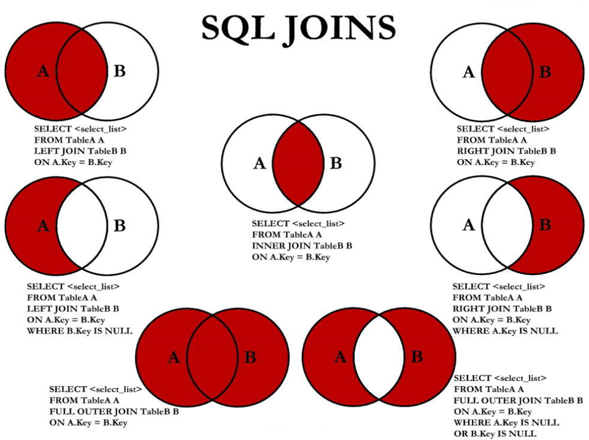

# 多表查询

本节将使用 [文档约定](./12-dev-guide.md) 中提到的样例数据库
- employee data (large dataset, includes data and test/verification suite)
- world database
- sakila database


应用程序在查询时，常需整合多张表的数据。这时，利用JOIN语句能轻松将多表数据融合，实现高效的数据检索。

多表查询是关系型数据库中最重要的操作之一，也是最复杂的。先来一张图，看看多表查询的类型



由上图可知，多表查询分为七种：
- 内连接（INNER JOIN）【图中】
- 左外连接（LEFT OUTER JOIN）【左上图】
- 左外连接排除B部分（LEFT OUTER JOIN EXCLUDING B）【左中图】
- 右外连接（RIGHT OUTER JOIN）【右上图】
- 右外连接排除A部分（RIGHT OUTER JOIN EXCLUDING A）【右中图】
- 全连接（FULL JOIN）【左下图】
- 全外连接（FULL OUTER JOIN）【右下图】

接下来，逐一讲解每种多表查询。

## 内连接（INNER JOIN）

内连接基本语法格式如下：
```sql
SELECT * FROM A INNER JOIN B ON A.key = B.key;
```
伪代码如下：
```sql
SELECT 字段列表
  FROM A表 INNER JOIN B表
  ON 关联条件
  WHERE 其他子句;
```
例如，简单的内连接（INNER JOIN）查询，用于连接 `city` 表和 `country` 表，并基于这两个表之间的共同字段（即city表的CountryCode字段和country表的Code字段）来获取数据。
```sql
SELECT     
  city.Name AS CityName,  
  country.Name AS CountryName  
FROM city    
  INNER JOIN country   
  ON city.CountryCode = country.Code
  LIMIT 5;
```

::: details 查看运行结果
```sql
+----------------+-------------+
| CityName       | CountryName |
+----------------+-------------+
| Oranjestad     | Aruba       |
| Kabul          | Afghanistan |
| Qandahar       | Afghanistan |
| Herat          | Afghanistan |
| Mazar-e-Sharif | Afghanistan |
+----------------+-------------+
5 rows in set (0.00 sec)
```
:::

再举一个较复杂的例子：

三表连接，查询 `city` 表、`country` 表和 `countrylanguage` 表，并基于这三个表之间的共同字段（即city表的
CountryCode字段和country表的Code字段，以及countrylanguage表的CountryCode字段）来获取数据。

查询出来的就是城市对应的国家中，是否为官方语言。
```sql
greatsql> SELECT   
    city.Name AS CityName,  
    country.Name AS CountryName,  
    countrylanguage.Language  
FROM   
    city  
INNER JOIN   
    country ON city.CountryCode = country.Code  
INNER JOIN   
    countrylanguage ON country.Code = countrylanguage.CountryCode  
WHERE   
    countrylanguage.IsOfficial = 'T' -- 假设我们只关心是否为官方语言
LIMIT 5;
```

::: details 查看运行结果
```sql
+----------------+-------------+----------+
| CityName       | CountryName | Language |
+----------------+-------------+----------+
| Oranjestad     | Aruba       | Dutch    |
| Kabul          | Afghanistan | Dari     |
| Qandahar       | Afghanistan | Dari     |
| Herat          | Afghanistan | Dari     |
| Mazar-e-Sharif | Afghanistan | Dari     |
+----------------+-------------+----------+
5 rows in set (0.01 sec)
```
:::

## 左外连接（LEFT OUTER JOIN）
左外连接基本语法格式如下：
```sql
SELECT * FROM A LEFT JOIN B ON A.key = B.key;
```
伪代码如下：
```sql
SELECT 字段列表
  FROM A表 LEFT JOIN B表
  ON 关联条件
  WHERE 其他子句;
```

当使用左外连接时，你会从左边的表中选择所有的记录，并只选择与右边表匹配的记录。如果右边的表中没有匹配的记录，则结果集中对应的字段将包含 NULL 值。

例如简单的一个左外连接查询，用于连接 `city` 表和 `country` 表，并基于这两个表之间的共同字段（即city表的CountryCode字段和country表的Code字段）来获取数据。
```sql
SELECT   
    city.Name AS CityName,
    country.Name AS CountryName  
FROM   
    city  
LEFT JOIN country 
  ON city.CountryCode = country.Code
  LIMIT 5;
```

::: details 查看运行结果
```sql
+----------------+-------------+
| CityName       | CountryName |
+----------------+-------------+
| Kabul          | Afghanistan |
| Qandahar       | Afghanistan |
| Herat          | Afghanistan |
| Mazar-e-Sharif | Afghanistan |
| Amsterdam      | Netherlands |
+----------------+-------------+
5 rows in set (0.01 sec)
```
:::

再举一个较复杂的例子：

在world数据库的city、country和countrylanguage三张表的情况下，做一个左外连接来获取所有城市及其对应的国家和官方语言
```sql
SELECT city.name AS 城市名称,
       country.name AS 国家名称,
       countrylanguage.language AS 官方语言,
       countrylanguage.percentage AS 说官方语言的人的百分比
FROM country
  INNER JOIN city ON country.capital = city.id
  INNER JOIN countrylanguage ON country.code = countrylanguage.countrycode
  WHERE countrylanguage.isofficial = 'T'
  LIMIT 5;
```

::: details 查看运行结果
```sql
+--------------+--------------+--------------+-----------------------------------+
| 城市名称      | 国家名称     | 官方语言      | 说官方语言的人的百分比             |
+--------------+--------------+--------------+-----------------------------------+
| Oranjestad   | Aruba        | Dutch        |                               5.3 |
| Kabul        | Afghanistan  | Dari         |                              32.1 |
| Kabul        | Afghanistan  | Pashto       |                              52.4 |
| The Valley   | Anguilla     | English      |                               0.0 |
| Tirana       | Albania      | Albaniana    |                              97.9 |
+--------------+--------------+--------------+-----------------------------------+
5 rows in set (0.00 sec)
```
:::
### 左外连接排除B部分
若要排除B部分，则在WHRER语句中添加`IS NULL`条件，如下：
```sql
SELECT * FROM A LEFT JOIN B ON A.key = B.key WHRER IS NULL;
```
例如查询没有对应国家的城市
```sql
SELECT   
    city.Name AS CityName,  
    country.Name AS CountryName  
FROM   
    city  
LEFT JOIN   
    country ON city.CountryCode = country.Code  
WHERE   
    country.Code IS NULL;
```

查询结果如下：
```sql
Empty set (0.01 sec)
```
表明每个城市都有对应的国家。

插入一条数据，测试该语句是否可以查询到为NULL的数据
```sql
-- 取消原表中NOT NULL约束
greatsql> ALTER TABLE city MODIFY COLUMN CountryCode CHAR(3)
  CHARACTER SET utf8mb4 COLLATE utf8mb4_0900_ai_ci;

-- 插入一条数据，该数据没有对应国家
greatsql> INSERT INTO CITY VALUES(4080, 'greatsql', NULL, 'GREATSQL', 6666);
```
执行结果如下：
```sql
greatsql> SELECT city.Name AS CityName,country.Name AS CountryName
  FROM city LEFT JOIN country 
  ON city.CountryCode = country.Code  
  WHERE country.Code IS NULL;
+----------+-------------+
| CityName | CountryName |
+----------+-------------+
| greatsql | NULL        |
+----------+-------------+
1 row in set (0.00 sec)
```
测试完成后还原数据
```sql
-- 删除这条插入的数据
greatsql> DELETE FROM CITY WHERE ID=4080;

-- 还原原表中NOT NULL约束
greatsql> ALTER TABLE city MODIFY COLUMN CountryCode CHAR(3)
  CHARACTER SET utf8mb4 COLLATE utf8mb4_0900_ai_ci NOT NULL;
```

## 右外连接（RIGHT OUTER JOIN）
右外连接基本语法格式如下：
```sql
SELECT * FROM A RIGHT JOIN B ON A.key = B.key;
```
伪代码如下：
```sql
SELECT 字段列表
  FROM A表 RIGHT JOIN B表
  ON 关联条件
  WHERE 其他子句;
```
当使用右外连接时，你会从右边的表中选择所有的记录，并只选择与左边表匹配的记录。如果左边的表中没有匹配的记录，则结果集中对应的字段将包含 NULL 值。

例如，查询每个国家的城市
```sql
SELECT   
    country.Name AS CountryName,  
    city.Name AS CityName  
FROM   
    country  
RIGHT JOIN   
    city ON country.Code = city.CountryCode
LIMIT 5;
```

::: details 查看运行结果
```sql
+-------------+----------------+
| CountryName | CityName       |
+-------------+----------------+
| Afghanistan | Kabul          |
| Afghanistan | Qandahar       |
| Afghanistan | Herat          |
| Afghanistan | Mazar-e-Sharif |
| Netherlands | Amsterdam      |
+-------------+----------------+
5 rows in set (0.01 sec)
```
:::

### 右外连接排除A部分
若要排除A部分，则在WHRER语句中添加`IS NULL`条件，如下：
```sql
SELECT * FROM A RIGHT JOIN B ON A.key = B.key WHRER IS NULL;
```
例如查询没有对应城市的国家
```sql
SELECT   
    country.Name AS CountryName,  
    city.Name AS CityName  
FROM   
    country  
RIGHT JOIN   
    city ON country.Code = city.CountryCode
WHERE 
    city.CountryCode IS NULL;
```

查询结果如下：
```sql
Empty set (0.01 sec)
```
表明每个国家都有对应的城市

插入一条数据，测试该语句是否可以查询到为NULL的数据
```sql
-- 取消原表中NOT NULL约束
greatsql> ALTER TABLE city MODIFY COLUMN CountryCode CHAR(3)
  CHARACTER SET utf8mb4 COLLATE utf8mb4_0900_ai_ci;

-- 插入一条数据，该数据没有对应国家
greatsql> INSERT INTO CITY VALUES(4080,'greatsql',NULL,'GREATSQL',6666);
```
执行结果如下：
```sql
greatsql> SELECT country.Name AS CountryName,city.Name AS CityName  
  FROM country RIGHT JOIN city 
  ON country.Code = city.CountryCode
  WHERE city.CountryCode IS NULL;
+-------------+----------+
| CountryName | CityName |
+-------------+----------+
| NULL        | greatsql |
+-------------+----------+
1 row in set (0.00 sec)
```

测试完成后还原数据
```sql
-- 删除这条插入的数据
greatsql> DELETE FROM CITY WHERE ID=4080;

-- 还原原表中NOT NULL约束
greatsql> ALTER TABLE city MODIFY COLUMN CountryCode CHAR(3)
  CHARACTER SET utf8mb4 COLLATE utf8mb4_0900_ai_ci NOT NULL;
```
## 全连接
在GreatSQL中，全连接是用左外的A `UNION` 右外的B 查询结果合并而成。

格式如下：
```sql
SELECT 字段列表
  FROM A表 LEFT JOIN B表
  ON 关联条件
  WHERE 等其他子句

UNION 

SELECT 字段列表
  FROM A表 RIGHT JOIN B表
  ON 关联条件
  WHERE 等其他子句;
```

例如使用GreatSQL来实现一个类似全连接的效果，查询city和country表，获取所有城市和它们对应的国家（如果有的话），以及没有对应城市的国家（如果有的话）：
```sql
-- 使用UNION组合左连接和右连接的结果来实现全连接的效果  
SELECT   
    city.Name AS CityName,  
    country.Name AS CountryName  
FROM   
    city  
LEFT JOIN   
    country ON city.CountryCode = country.Code  

UNION  
  
SELECT   
    NULL AS CityName, -- 或者使用一个特定的值来表示这是没有城市的国家  
    country.Name AS CountryName  
FROM   
    country  
LEFT JOIN   
    city ON country.Code = city.CountryCode
LIMIT 5;
```

::: details 查看运行结果
```sql
+----------------+-------------+
| CityName       | CountryName |
+----------------+-------------+
| Kabul          | Afghanistan |
| Qandahar       | Afghanistan |
| Herat          | Afghanistan |
| Mazar-e-Sharif | Afghanistan |
| Amsterdam      | Netherlands |
+----------------+-------------+
5 rows in set (0.00 sec)
```
:::

### 全外连接
全外连接既使用左外的 (A -  A∩B) `UNION` 右外的 (B - A∩B) 查询结果合并而成。
语法格式如下：
```sql
SELECT 字段列表
  FROM A表 LEFT JOIN B表
  ON 关联条件
  WHERE 从表关联字段 IS NULL AND 等其他子句

UNION

SELECT 字段列表
  FROM A表 RIGHT JOIN B表
  ON 关联条件
  WHERE 从表关联字段 IS NULL AND 等其他子句
```

例如查询每个国家的城市，以及没有对应城市的国家：
```sql
greatsql> SELECT   
    city.Name AS CityName,  
    country.Name AS CountryName  
FROM city LEFT JOIN country 
ON city.CountryCode = country.Code
WHERE country.Code IS NULL

UNION  
  
SELECT   
    NULL AS CityName, -- 或者使用一个特定的值来表示这是没有城市的国家  
    country.Name AS CountryName  
FROM country LEFT JOIN city 
ON country.Code = city.CountryCode
WHERE country.Code IS NULL
LIMIT 5;
```

查询结果如下：
```sql
Empty set (0.01 sec)
```
表明没有国家没有对应城市。

插入一条数据，测试该语句是否可以查询到为NULL的数据
```sql
-- 取消原表中NOT NULL约束
greatsql> ALTER TABLE city MODIFY COLUMN CountryCode CHAR(3)
  CHARACTER SET utf8mb4 COLLATE utf8mb4_0900_ai_ci;

-- 插入一条数据，该数据没有对应国家
greatsql> INSERT INTO CITY VALUES(4080,'greatsql',NULL,'GREATSQL',6666);
```
执行结果如下：
```sql
greatsql> SELECT   
    city.Name AS CityName,  
    country.Name AS CountryName  
FROM city LEFT JOIN country 
ON city.CountryCode = country.Code
WHERE country.Code IS NULL

UNION  
  
SELECT   
    NULL AS CityName, -- 或者使用一个特定的值来表示这是没有城市的国家  
    country.Name AS CountryName  
FROM country LEFT JOIN city 
ON country.Code = city.CountryCode
WHERE country.Code IS NULL
LIMIT 5;
+----------+-------------+
| CityName | CountryName |
+----------+-------------+
| greatsql | NULL        |
+----------+-------------+
1 row in set (0.05 sec)
```

测试完成后还原数据
```sql
-- 删除这条插入的数据
greatsql> DELETE FROM CITY WHERE ID=4080;

-- 还原原表中NOT NULL约束
greatsql> ALTER TABLE city MODIFY COLUMN CountryCode CHAR(3)
  CHARACTER SET utf8mb4 COLLATE utf8mb4_0900_ai_ci NOT NULL;
```

**扫码关注微信公众号**


