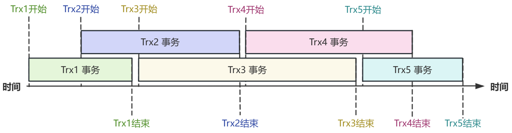

# 事务并发及锁机制
---

[[toc]]

本节介绍事务并发控制、不同事务读以及锁机制等相关内容。

## 简介

MySQL/GreatSQL事务支持 MVCC（Multi-Version Concurrency Control，多版本并发控制），基于 MVCC 机制实现 Consistent Nonlocking Reads（一致性非锁定读），利用 MVCC 和 row-level locking（行锁）实现事务并发控制。

MVCC 机制是数据库管理系统中一种用于实现事务并发控制的技术，它通过保存历史版本来支持多个事务同时进行读写操作，从而提高了数据库的并发性能和事务隔离性。

事务一致性读是通过读版本和数据版本来保证的，通过读取版本号，返回小于读取版本号的所有已提交事务数据，这个过程无需加锁，从而实现一致性非锁定读。

和其他数据库不同，InnoDB 是基于索引实现行锁机制，因此在锁控制行为上也会有所不同。

## MVCC

MySQL/GreatSQL InnoDB引擎的 MVCC 机制是通过在 [Undo Log（撤销日志）](../2-about-greatsql/4-6-greatsql-undo-log.md) 中保存历史版本来支持并发事务的读写操作，提高了数据库的性能和事务隔离性，使得读操作不会阻塞写操作。

对于不同的事务版本，需要为这种数据多版本来定义语义，保证用户看到一个一致的数据库状态，即数据的一致性快照。

在InnoDB中，利用 trx_id（事务ID）来判读事务多版本可见性，如下图所示



如上图所示，前后共有5个事务，它们之间相互的可见性分别是

- Trx5可看到Trx1、Trx2、Trx3修改的数据，看不到Trx4修改的数据
- Trx4可看到Trx1、Trx2修改的数据，看不到Trx3修改的数据
- Trx3可看到Trx1修改的数据，看不到Trx2修改的数据
- Trx2可看到自己事务中的数据，看不到Trx1修改的数据

## 事务读

先理解几个概念
1. **快照**：由基于某个时间点的一组 InnoDB 内部活跃事务构建而成的列表，用于实现 MVCC 机制来确保事务的一致性和隔离性。
2. **一致性非锁定读**：读取数据时无需加锁，通过 MVCC 机制实现读取数据的一致性，确保读取到的数据在整个事务期间保持一致性。
3. **当前读**：在读取数据时直接读取最新版本的数据，不使用 MVCC 机制，可能会造成读取到未提交或已提交但未提交的数据变化，当前读通常需要加锁。
4. **半一致性读**：semi-consistent read，一种用于UPDATE语句的读操作，它是 READ COMMITTED 和一致读取的组合。

下面用几个例子来演示并说明上述几个不同概念

### RR 级别事务读机制

问题1：RR 隔离级别下，什么时候开始创建快照

- 实验1
```sql
---------------------------------------------------------------------------------------------------------------------------------------
                          trx1                                      │                      trx2
---------------------------------------------------------------------------------------------------------------------------------------
greatsql> SET SESSION TRANSACTION ISOLATION LEVEL REPEATABLE READ;  │greatsql> SET SESSION TRANSACTION ISOLATION LEVEL REPEATABLE READ;
greatsql> BEGIN;                                                    │greatsql> BEGIN;
                                                                    │
greatsql> SELECT * FROM city WHERE ID = 3;                          │
+----+-------+-------------+----------+------------+                │
| ID | Name  | CountryCode | District | Population |                │
+----+-------+-------------+----------+------------+                │
|  3 | Herat | AFG         | Herat    |     186800 |                │
+----+-------+-------------+----------+------------+                │
                                                                    │
greatsql> UPDATE city SET Population=206800 WHERE ID = 3;           │
---------------------------------------------------------------------------------------------------------------------------------------
                                                                    │/* trx2在trx1更新（但尚未提交）后发起，还是读取到旧数据 */
                                                                    │greatsql> SELECT * FROM city WHERE ID=3;
                                                                    │+----+-------+-------------+----------+------------+
                                                                    │| ID | Name  | CountryCode | District | Population |
                                                                    │+----+-------+-------------+----------+------------+
                                                                    │|  3 | Herat | AFG         | Herat    |     186800 |
                                                                    │+----+-------+-------------+----------+------------+
```

- 实验2
```sql
---------------------------------------------------------------------------------------------------------------------------------------
                          trx1                                      │                      trx2
---------------------------------------------------------------------------------------------------------------------------------------
greatsql> SET SESSION TRANSACTION ISOLATION LEVEL REPEATABLE READ;  │greatsql> SET SESSION TRANSACTION ISOLATION LEVEL REPEATABLE READ;
greatsql> BEGIN;                                                    │greatsql> BEGIN;
greatsql> SELECT * FROM city WHERE ID = 3;                          │
+----+-------+-------------+----------+------------+                │
| ID | Name  | CountryCode | District | Population |                │
+----+-------+-------------+----------+------------+                │
|  3 | Herat | AFG         | Herat    |     186800 |                │
+----+-------+-------------+----------+------------+                │
                                                                    │
greatsql> UPDATE city SET Population=206800 WHERE ID = 3;           │
greatsql> COMMIT;                                                   │
---------------------------------------------------------------------------------------------------------------------------------------
                                                                    │/* trx2在trx1提交后才发起SELECT，可以读取到已提交后的最新数据 */
                                                                    │greatsql> SELECT * FROM city WHERE ID=3;
                                                                    │+----+-------+-------------+----------+------------+
                                                                    │| ID | Name  | CountryCode | District | Population |
                                                                    │+----+-------+-------------+----------+------------+
                                                                    │|  3 | Herat | AFG         | Herat    |     206800 |
                                                                    │+----+-------+-------------+----------+------------+
```

- 实验3

```sql
---------------------------------------------------------------------------------------------------------------------------------------
                          trx1                                      │                      trx2
---------------------------------------------------------------------------------------------------------------------------------------
greatsql> SET SESSION TRANSACTION ISOLATION LEVEL REPEATABLE READ;  │greatsql> SET SESSION TRANSACTION ISOLATION LEVEL REPEATABLE READ;
greatsql> BEGIN;                                                    │greatsql> BEGIN;
greatsql> SELECT * FROM city WHERE ID = 3;                          │greatsql> SELECT * FROM city WHERE ID=3;
+----+-------+-------------+----------+------------+                │+----+-------+-------------+----------+------------+
| ID | Name  | CountryCode | District | Population |                │| ID | Name  | CountryCode | District | Population |
+----+-------+-------------+----------+------------+                │+----+-------+-------------+----------+------------+
|  3 | Herat | AFG         | Herat    |     186800 |                │|  3 | Herat | AFG         | Herat    |     186800 |
+----+-------+-------------+----------+------------+                │+----+-------+-------------+----------+------------+
                                                                    │
greatsql> UPDATE city SET Population=206800 WHERE ID = 3;           │
greatsql> COMMIT;                                                   │
------------------------------------------------------------------------------------------------------------------------------------
                                                                    │/*trx1提交后，依然读到快照版本，即为“可重复读”*/
                                                                    │+----+-------+-------------+----------+------------+
                                                                    │| ID | Name  | CountryCode | District | Population |
                                                                    │+----+-------+-------------+----------+------------+
                                                                    │|  3 | Herat | AFG         | Herat    |     186800 |
                                                                    │+----+-------+-------------+----------+------------+
                                                                    │
                                                                    │/*加上 FOR UPDATE 后，是当前读，可读取到最新版本*/
                                                                    │greatsql> SELECT * FROM city WHERE ID=3 FOR UPDATE;
                                                                    │+----+-------+-------------+----------+------------+
                                                                    │| ID | Name  | CountryCode | District | Population |
                                                                    │+----+-------+-------------+----------+------------+
                                                                    │|  3 | Herat | AFG         | Herat    |     206800 |
                                                                    │+----+-------+-------------+----------+------------+
                                                                    │
                                                                    │/*去掉 FOR UPDATE 后，恢复可重复读*/
                                                                    │greatsql> SELECT * FROM city WHERE ID=3;
                                                                    │+----+-------+-------------+----------+------------+
                                                                    │| ID | Name  | CountryCode | District | Population |
                                                                    │+----+-------+-------------+----------+------------+
                                                                    │|  3 | Herat | AFG         | Herat    |     186800 |
                                                                    │+----+-------+-------------+----------+------------+
```

从上面的几个实验，可以得到几个结论
1. RR 隔离级别下，第一个读请求发起时才创建快照。
2. RR 隔离级别下，创建快照后，事务中都是基于快照实现可重复读。
3. RR 隔离级别下，发起当前读时就可以读取到已提交的最新数据。

### RC 级别事务读机制

问题2：RC 隔离级别下，什么时候开始创建快照

- 实验1

```sql
---------------------------------------------------------------------------------------------------------------------------------------
                          session1                                  │                      session2
---------------------------------------------------------------------------------------------------------------------------------------
greatsql> SELECT * FROM city WHERE ID = 3;                          │greatsql> SET SESSION TRANSACTION ISOLATION LEVEL READ COMMITTED;
+----+-------+-------------+----------+------------+                │
| ID | Name  | CountryCode | District | Population |                │greatsql> BEGIN;
+----+-------+-------------+----------+------------+                │greatsql> SELECT * FROM city WHERE ID=3;
|  3 | Herat | AFG         | Herat    |     186800 |                │+----+-------+-------------+----------+------------+
+----+-------+-------------+----------+------------+                │| ID | Name  | CountryCode | District | Population |
                                                                    │+----+-------+-------------+----------+------------+
                                                                    │|  3 | Herat | AFG         | Herat    |     186800 |
                                                                    │+----+-------+-------------+----------+------------+
---------------------------------------------------------------------------------------------------------------------------------------
greatsql> UPDATE city SET Population=196800 WHERE ID = 3;           │/* session1采用自动提交模式 */
                                                                    │/* session1更新后，session2中立刻能读取到 */
                                                                    │
                                                                    │greatsql> SELECT * FROM city WHERE ID=3;
                                                                    │+----+-------+-------------+----------+------------+
                                                                    │| ID | Name  | CountryCode | District | Population |
                                                                    │+----+-------+-------------+----------+------------+
                                                                    │|  3 | Herat | AFG         | Herat    |     196800 |
                                                                    │+----+-------+-------------+----------+------------+
---------------------------------------------------------------------------------------------------------------------------------------
greatsql> UPDATE city SET Population=206800 WHERE ID = 3;           │greatsql> SELECT * FROM city WHERE ID=3;
                                                                    │+----+-------+-------------+----------+------------+
                                                                    │| ID | Name  | CountryCode | District | Population |
                                                                    │+----+-------+-------------+----------+------------+
                                                                    │|  3 | Herat | AFG         | Herat    |     206800 |
                                                                    │+----+-------+-------------+----------+------------+
                                                                    │
---------------------------------------------------------------------------------------------------------------------------------------
greatsql> UPDATE city SET Population=216800 WHERE ID = 3;           │greatsql> SELECT * FROM city WHERE ID=3;
                                                                    │+----+-------+-------------+----------+------------+
                                                                    │| ID | Name  | CountryCode | District | Population |
                                                                    │+----+-------+-------------+----------+------------+
                                                                    │|  3 | Herat | AFG         | Herat    |     216800 |
                                                                    │+----+-------+-------------+----------+------------+
```

从上面的实验可以得到结论：**在 RC 隔离级别下，事务每次SELECT都能获取到最新已提交事务数据**。


### 半一致性读

半一致性读（semi-consistent read）是在 InnoDB 引擎中特有的，它一种用于UPDATE语句的读操作，是 READ COMMITTED 和一致读取的组合。

UPDATE 语句如果读到一行已经加锁的记录，此时返回该记录（已提交的）最新版本，会再次判断此版本是否满足 UPDATE 的 WHERE 条件。若满足条件，则该记录需要被更新，则会重新发起一次读操作，此时会读取行的最新版本，并对其加锁。

事务中半一致性读发生的条件有
- 事务隔离级别小于等于 RC，即 RU、RC 两个隔离级别，或者innodb_locks_unsafe_for_binlog = 1 时（8.0之后废弃该选项）
- 并且只能是 UPDATE请求（不支持 INSERT 和 DELETE 等请求）

下面用几个案例来演示半一致性读的特性，在本案例中，采用在文档 [事务控制](./12-6-1-trx-control.md) 中创建的 trx.t1 表

- 实验1

```sql
---------------------------------------------------------------------------------------------------------------------------------------
                          trx1                                      │                      trx2
---------------------------------------------------------------------------------------------------------------------------------------
greatsql> SET SESSION TRANSACTION ISOLATION LEVEL READ COMMITTED;   │greatsql> SET SESSION TRANSACTION ISOLATION LEVEL READ COMMITTED;
greatsql> BEGIN;                                                    │greatsql> BEGIN;
                                                                    │
greatsql> SELECT * FROM t1 WHERE c2 = 'row3' FOR UPDATE;            │
+----+----+------+                                                  │
| id | c1 | c2   |                                                  │
+----+----+------+                                                  │
|  3 |  3 | row3 |                                                  │
+----+----+------+                                                  │
---------------------------------------------------------------------------------------------------------------------------------------
                                                                    │/* trx1中 WHERE 条件没有索引，因此会锁住所有记录 */
                                                                    │/* 但是trx2的 UPDATE 请求并没有被阻塞 */
                                                                    │greatsql> UPDATE t1 SET c2 = 'row22' WHERE ID=2;
                                                                    │Query OK, 1 row affected (0.00 sec)
                                                                    │Rows matched: 1  Changed: 1  Warnings: 0
```

- 实验2

```sql
---------------------------------------------------------------------------------------------------------------------------------------
                          session1                                  │                      session2
---------------------------------------------------------------------------------------------------------------------------------------
greatsql> SET SESSION TRANSACTION ISOLATION LEVEL READ COMMITTED;   │greatsql> SET SESSION TRANSACTION ISOLATION LEVEL READ COMMITTED;
greatsql> BEGIN;                                                    │greatsql> BEGIN;
greatsql> SELECT * FROM t1 WHERE c2 = 'row3' FOR UPDATE;            │
+----+----+------+                                                  │/* session2 中修改行锁等待超时阈值 */
| id | c1 | c2   |                                                  │greatsql> set innodb_lock_wait_timeout=5;
+----+----+------+                                                  │
|  3 |  3 | row3 |                                                  │
+----+----+------+                                                  │
------------------------------------------------------------------------------------------------------------------------------------
                                                                    │/* session2 会被阻塞直至行锁等待超时 */
                                                                    │/* 因为是 DELETE 不是 UPDATE，不符合半一致性读条件 */
                                                                    │greatsql> DELETE FROM t1 WHERE c2='row2';
                                                                    │ERROR 1205 (HY000): Lock wait timeout exceeded; try restarting transact
                                                                    │ion
```


## 锁机制

### 简介

MySQL/GreatSQL 中常用的存储引擎是 InnoDB 和 MyISAM，前者支持表锁、行锁，而后者只支持表锁。

除了表锁、行锁外，还有全局读锁（`FLUSH TABLES WITH READ LOCK`）、备份锁（`LOCK INSTANCE FOR BACKUP`）、元数据锁（`Metadata LOCK`）、自增锁（`AUTO_INCREMENT Lock`）等多种锁。

在这里重点介绍 InnoDB 行锁，上述其他锁请参考以下几部分MySQL手册内容
- [FLUSH TABLES WITH READ LOCK](https://dev.mysql.com/doc/refman/8.0/en/flush.html#flush-tables-with-read-lock)
- [LOCK INSTANCE FOR BACKUP](https://dev.mysql.com/doc/refman/8.0/en/lock-instance-for-backup.html)
- [Metadata Locking](https://dev.mysql.com/doc/refman/8.0/en/metadata-locking.html)
- [LOCK TABLES](https://dev.mysql.com/doc/refman/8.0/en/lock-tables.html)
- [InnoDB AUTO_INCREMENT Lock Modes](https://dev.mysql.com/doc/refman/8.0/en/innodb-auto-increment-handling.html#innodb-auto-increment-lock-modes)

### InnoDB 锁机制

每个数据库都有自己独特的行锁实现机制，并没有绝对最优解，合适即可。

InnoDB 行锁是基于索引实现的，这种实现方式和其他数据库系统不太一样，因此一些加锁行为也会表现不一样。

基于索引加锁的另一个意思是，当申请加锁时，如果没有可利用的索引时，则无法利用索引过滤符合条件的记录，只能进行全表扫描，也意味着所有记录都会被被加上行锁，其结果几乎等同于加上表锁；当然了，二者还是有所不同的，加锁的代价也不一样。

InnoDB 行锁模式有
- **共享锁（S Lock）**，允许同时申请S锁，不冲突。
- **排他锁（X Lock）**，不允许和其他锁同时申请，和任何其他锁都会产生互斥。

InnoDB 还支持多粒度锁，允许行锁和表锁并存，为此引入意向锁（Intention Lock）。意向锁页分为两种：
- **意向共享锁（IS Lock）**，表示事务想要获取表中某些行的 S Lock，此时需要对表加 IS Lock。
- **意向排他锁（IX Lock）**，表示事务想要获取表中某几行的 X Lock，此时需要对表加 IX Lock。

有了意向锁后，意味着可以支持更细粒度加锁方式，例如：
- 当表被加上意向锁时，表明表中某些行也被加上行锁；
- 当想要对某些行加 X Lock 时，需要先对表先加上 IX Lock，再对这些行加 X Lock。

InnoDB 表的锁兼容模式如下表所示：

|   |IS |IX | S | X |
|---|---|---|---|---|
|IS |✅ |✅ |✅ |❌ |
|IX |✅ |✅ |❌ |❌ |
|S  |✅ |❌ |✅ |❌ |
|X  |❌ |❌ |❌ |❌ |

综上，可以看到其兼容模式为：
- 意向锁之间互相兼容；
- 表 IX Lock与所有行级锁（无论 S 还是 X Lock）互斥；
- 表 IS Lock与行级S Lock兼容，与行级 X Lock 互斥；
- X Lock 和所有锁都不兼容。

表级意向锁可以用于表锁和行锁冲突时快速判断。试想下，如果没有表级意向锁，在申请表锁时需要遍历所有行，判断是否有行锁冲突；有了意向锁后就只需要判断是否存在冲突即可，极其高效。

### 不同索引的加锁区别

InnoDB 中在不同事务隔离级别下，加锁行为也有所不同，InnoDB 行锁加锁范围有以下几种：
- **Record Lock（`LOCK_REC_NOT_GAP`）**，记录锁，只锁定某条记录本身，不包含其前后的间隙（GAP）。
- **Gap Lock（`LOCK_GAP`）**，间隙锁，锁定一个范围（通常是指两条记录中间的那个间隙，或者是某条记录前后的间隙）。
- **Next-Key Lock（`LOCK_ORDINARY`）**，普通锁（通常也叫下一键锁），上述两种锁的结合，它会相关记录本身，以及符合条件的间隙范围。其目的是解决事务幻读问题。
- **Insert Intention Lock（`LOCK_INSERT_INTENTION`）**，意向插入锁，它是一种特殊的间隙锁，它保证了存在并发插入或更新时的安全性，两个事务同时持有插入意向锁时，二者之间不会互相阻塞，但会被记录级别的排他锁阻塞。

在默认的 **[RR（Repeatable Read） 隔离级别](./12-6-2-trx-isolation.md)** 下，条件等值查询（如 `WHERE id = ?`）场景下，默认的加锁方式为：
- 如果 id 列是主键索引，则加 `LOCK_REC_NOT_GAP` 锁。
- 如果 id 列是唯一约束索引，则加 `LOCK_REC_NOT_GAP` 锁。
- 如果 id 列是普通辅助索引，则加 `LOCK_ORDINARY` 锁。
- 如果 id 列没有索引，则是全表所有记录都加 `LOCK_ORDINARY` 锁。

在 **[RC（Read Committed） 隔离级别](./12-6-2-trx-isolation.md)** 下，条件等值查询（如 `WHERE id = ?`）场景下，默认的加锁方式为：
- 不管 id 列是主键索引，还是唯一约束索引，抑或普通辅助索引，都加 `LOCK_REC_NOT_GAP` 锁。
- 如果 id 列上没有索引，则是全表所有记录都加 `LOCK_REC_NOT_GAP` 锁，并且在必要时还会降级，参考前面提到的 **[半一致性读](#半一致性读)**。

最后，在涉及到外键约束检查或唯一性约束检查时，需要先加 `LOCK_ORDINARY|LOCK_S` 锁，检查完毕后，再转换成其他相应的锁。

下面，创建一个测试表并写入数据，分别演示几种不同场景下的加锁区别。

```sql
greatsql> CREATE DATABASE trx;
greatsql> USE trx;
greatsql> CREATE TABLE `t1` (
  `id` int unsigned NOT NULL AUTO_INCREMENT,
  `c1` int unsigned NOT NULL DEFAULT '0',
  `c2` int unsigned NOT NULL DEFAULT '0',
  `c3` varchar(20) NOT NULL DEFAULT '',
  PRIMARY KEY (`id`),
  UNIQUE KEY `k1` (`c1`),
  KEY `k2` (`c2`)
) ENGINE=InnoDB

greatsql> INSERT INTO t1 VALUES (1,1,1,'row1'),(2,2,2,'row2'),(3,3,3,'row3'),(4,4,4,'row4'),(5,5,5,'row5'),(6,6,6,'row6');
greatsql> SELECT * FROM t1;
+----+----+----+------+
| id | c1 | c2 | c3   |
+----+----+----+------+
|  1 |  1 |  1 | row1 |
|  2 |  2 |  2 | row2 |
|  3 |  3 |  3 | row3 |
|  4 |  4 |  4 | row4 |
|  5 |  5 |  5 | row5 |
|  6 |  6 |  6 | row6 |
+----+----+----+------+
```

- 场景1：主键列 + 等值条件

```sql
greatsql> BEGIN;
greatsql> SELECT * FROM t1 WHERE id = 3 FOR UPDATE;
+----+----+----+------+
| id | c1 | c2 | c3   |
+----+----+----+------+
|  3 |  3 |  3 | row3 |
+----+----+----+------+

greatsql> SELECT ENGINE_LOCK_ID,OBJECT_NAME,INDEX_NAME,LOCK_TYPE,LOCK_MODE,LOCK_STATUS,LOCK_DATA from performance_schema.data_locks;
+----------------------------------------+-------------+------------+-----------+---------------+-------------+-----------+
| ENGINE_LOCK_ID                         | OBJECT_NAME | INDEX_NAME | LOCK_TYPE | LOCK_MODE     | LOCK_STATUS | LOCK_DATA |
+----------------------------------------+-------------+------------+-----------+---------------+-------------+-----------+
| 139691667119480:1113:139691596764208   | t1          | NULL       | TABLE     | IX            | GRANTED     | NULL      | <- 表级IX锁
| 139691667119480:51:4:4:139691596761216 | t1          | PRIMARY    | RECORD    | X,REC_NOT_GAP | GRANTED     | 3         | <- id = 3 上加 LOCK_REC_NOT_GAP|X
+----------------------------------------+-------------+------------+-----------+---------------+-------------+-----------+
```

从上述查询结果可以看到，除了行锁外，还有个表级IX锁，分别解释如下

  - `ENGINE_LOCK_ID`，锁唯一标识符；
  - `OBJECT_NAME`，锁定对象，此处为表 `t1`；
  - `INDEX_NAME`，加锁的索引，如果是表锁、MDL锁则为 NULL；所以这里分别是 NULL 和 PRIMARY；
  - `LOCK_TYPE`，锁类型，分别为 TABLE 和 RECORD；
  - `LOCK_MODE`，锁模式，分别为 表IX锁 和 行级 LOCK_REC_NOT_GAP|X；
  - `LOCK_STATUS`，锁状态，GRANTED 表示已获得；如果是 PENDING 意为等待中，即该加锁请求被阻塞；
  - `LOCK_DATA`，锁定的数据，如果是表锁、MDL锁则为 NULL；如果是行锁，则表示其锁定的那行记录值，此处为 3。

结论1："主键列 + 等值条件" 加 LOCK_REC_NOT_GAP 锁。

- 场景2：唯一约束索引列 + 等值条件

```sql
greatsql> BEGIN;
greatsql> SELECT * FROM t1 WHERE c1 = 3 FOR UPDATE;
+----+----+----+------+
| id | c1 | c2 | c3   |
+----+----+----+------+
|  3 |  3 |  3 | row3 |
+----+----+----+------+

greatsql> SELECT ENGINE_LOCK_ID,OBJECT_NAME,INDEX_NAME,LOCK_TYPE,LOCK_MODE,LOCK_STATUS,LOCK_DATA from performance_schema.data_locks;
+----------------------------------------+-------------+------------+-----------+---------------+-------------+-----------+
| ENGINE_LOCK_ID                         | OBJECT_NAME | INDEX_NAME | LOCK_TYPE | LOCK_MODE     | LOCK_STATUS | LOCK_DATA |
+----------------------------------------+-------------+------------+-----------+---------------+-------------+-----------+
| 139691667119480:1115:139691596764208   | t1          | NULL       | TABLE     | IX            | GRANTED     | NULL      | <- 表级IX锁
| 139691667119480:53:5:4:139691596761216 | t1          | k1         | RECORD    | X,REC_NOT_GAP | GRANTED     | 3, 3      | <- c1 = 3 上加 LOCK_REC_NOT_GAP|X
| 139691667119480:53:4:4:139691596761560 | t1          | PRIMARY    | RECORD    | X,REC_NOT_GAP | GRANTED     | 3         | <- id = 3 上加 LOCK_REC_NOT_GAP|X
+----------------------------------------+-------------+------------+-----------+---------------+-------------+-----------+
```

可以看到有以下几个锁：
  - 表 t1 加 IX 锁；
  - 唯一约束辅助索引 k1 在 c1 = 3 这行记录上加 LOCK_REC_NOT_GAP|X 锁；锁定的记录是 (3,3)，这是因为所有辅助索引都要包含主键列值；
  - 主键索引 PRIMARY 在 id = 3 这行记录上加 LOCK_REC_NOT_GAP|X 锁。

结论2："唯一约束辅助索引列 + 等值条件"，除了在符合条件的记录加上 LOCK_REC_NOT_GAP 锁之外，还要回溯到主键索引并加 LOCK_REC_NOT_GAP 锁。


- 场景3：普通辅助索引列 + 等值条件

```sql
greatsql> BEGIN;
greatsql> SELECT * FROM t1 WHERE c2 = 3 FOR UPDATE;
+----+----+----+------+
| id | c1 | c2 | c3   |
+----+----+----+------+
|  3 |  3 |  3 | row3 |
+----+----+----+------+

greatsql> SELECT ENGINE_LOCK_ID,OBJECT_NAME,INDEX_NAME,LOCK_TYPE,LOCK_MODE,LOCK_STATUS,LOCK_DATA from performance_schema.data_locks;
+----------------------------------------+-------------+------------+-----------+---------------+-------------+-----------+
| ENGINE_LOCK_ID                         | OBJECT_NAME | INDEX_NAME | LOCK_TYPE | LOCK_MODE     | LOCK_STATUS | LOCK_DATA |
+----------------------------------------+-------------+------------+-----------+---------------+-------------+-----------+
| 139691667119480:1115:139691596764208   | t1          | NULL       | TABLE     | IX            | GRANTED     | NULL      | <- 表级IX锁
| 139691667119480:53:6:4:139691596761216 | t1          | k2         | RECORD    | X             | GRANTED     | 3, 3      | <- c2 = 3 上加 LOCK_ORDINARY|X
| 139691667119480:53:4:4:139691596761560 | t1          | PRIMARY    | RECORD    | X,REC_NOT_GAP | GRANTED     | 3         | <- id = 3 上加 LOCK_REC_NOT_GAP|X
| 139691667119480:53:6:5:139691596761904 | t1          | k2         | RECORD    | X,GAP         | GRANTED     | 4, 4      | <- c2 = 4 前面的间隙加 LOCK_GAP|X
+----------------------------------------+-------------+------------+-----------+---------------+-------------+-----------+
```

可以看到有以下几个锁：
  - 表 t1 加 IX 锁；
  - 主键索引 PRIMARY 在 id = 3 这行记录上加 LOCK_REC_NOT_GAP|X 锁；
  - 辅助索引 k2 在 c2 = 3 这行记录上加 LOCK_ORDINARY|X 锁（除了 c2 = 3 这行记录之外，还包括 c2 = 3 前面的GAP）；
  - 辅助索引 k2 在 c2 = 4 前面的间隙加 LOCK_GAP|X 锁。

结论3："普通辅助索引列 + 等值条件"，除了在符合条件的记录加上 LOCK_ORDINARY 锁之外，还要回溯到主键索引并加 LOCK_REC_NOT_GAP 锁。

- 场景4：无索引列 + 等值条件

```sql
greatsql> BEGIN;
greatsql> SELECT * FROM t1 WHERE c3 = 'row3' FOR UPDATE;
+----+----+----+------+
| id | c1 | c2 | c3   |
+----+----+----+------+
|  3 |  3 |  3 | row3 |
+----+----+----+------+

greatsql> SELECT ENGINE_LOCK_ID,ENGINE_TRANSACTION_ID,OBJECT_NAME,INDEX_NAME,LOCK_TYPE,LOCK_MODE,LOCK_STATUS,LOCK_DATA from performance_schema.data_locks;
+-----------------------------------------+-----------------------+-------------+------------+-----------+-----------+-------------+------------------------+
| ENGINE_LOCK_ID                          | ENGINE_TRANSACTION_ID | OBJECT_NAME | INDEX_NAME | LOCK_TYPE | LOCK_MODE | LOCK_STATUS | LOCK_DATA              |
+-----------------------------------------+-----------------------+-------------+------------+-----------+-----------+-------------+------------------------+
| 139691667119480:1113:139691596764208    |                  2728 | t1          | NULL       | TABLE     | IX        | GRANTED     | NULL                   | <- 表级IX锁
| 139691667119480:51:4:1:139691596761216  |                  2728 | t1          | PRIMARY    | RECORD    | X         | GRANTED     | supremum pseudo-record | <- 所有记录都加 LOCK_ORDINARY|X
| 139691667119480:51:4:2:139691596761216  |                  2728 | t1          | PRIMARY    | RECORD    | X         | GRANTED     | 1                      |
| 139691667119480:51:4:4:139691596761216  |                  2728 | t1          | PRIMARY    | RECORD    | X         | GRANTED     | 3                      |
| 139691667119480:51:4:5:139691596761216  |                  2728 | t1          | PRIMARY    | RECORD    | X         | GRANTED     | 4                      |
| 139691667119480:51:4:6:139691596761216  |                  2728 | t1          | PRIMARY    | RECORD    | X         | GRANTED     | 5                      |
| 139691667119480:51:4:7:139691596761216  |                  2728 | t1          | PRIMARY    | RECORD    | X         | GRANTED     | 6                      |
| 139691667119480:51:4:12:139691596761216 |                  2728 | t1          | PRIMARY    | RECORD    | X         | GRANTED     | 2                      |
+-----------------------------------------+-----------------------+-------------+------------+-----------+-----------+-------------+------------------------+
8 rows in set (0.00 sec)
```

可以看到有以下几个锁：
  - 表 t1 加 IX 锁；
  - 所有行记录都加上 LOCK_ORDINARY|X 锁；
  - 包括虚拟最大记录（supremum pseudo-record）前面的那个间隙也加上 LOCK_GAP|X 锁。

结论4："无索引列 + 等值条件"，所有记录都会被加锁。

更多场景的加锁方式请自行参考上面的方法进行实验和观测。

### 行锁等待定位

当申请对某些数据行加锁时，如果这些数据已上锁，且锁类型是互斥的，这是申请加锁的请求就会被阻塞，进入等待状态，称之为 "行锁等待"；如果行锁等待时间较长（默认行锁等待时长是 50 秒，即 `innodb_lock_wait_timeout` 默认值为 50），有时候会被误称为 "死锁"，实际上这是 "长时间锁等待"，而 "死锁" 是另一种状态，在下面会解释。

下面演示一个请求加锁被阻塞，产生锁等待的场景：

```sql
-------------------------------------------------------------------------------------------------------------------------
                              trx1                     │                      trx2
-------------------------------------------------------------------------------------------------------------------------
greatsql> BEGIN;                                       │greatsql> BEGIN;
                                                       │greatsql> SELECT * FROM t1 WHERE id = 3 FOR UPDATE;
                                                       │+----+----+----+------+
                                                       │| id | c1 | c2 | c3   |
greatsql> set innodb_lock_wait_timeout=10;             │+----+----+----+------+
                                                       │|  3 |  3 |  3 | row3 |
                                                       │+----+----+----+------+
-------------------------------------------------------------------------------------------------------------------------
greatsql> SELECT * FROM t1 WHERE id = 3 FOR UPDATE;    │/* trx1 中请求行锁被阻塞，超过10秒后提示超时 */ 
                                                       │/* 查询当前的行锁等待状态 */
                                                       │greatsql> SELECT * FROM performance_schema.data_lock_waits\G
ERROR 1205 (HY000): Lock wait timeout exceeded;        │*************************** 1. row ***************************
 try restarting transaction                            │                          ENGINE: INNODB
                                                       │       REQUESTING_ENGINE_LOCK_ID: 139691667119480:53:4:4:139691596761216 <- 请求的行锁ID
                                                       │REQUESTING_ENGINE_TRANSACTION_ID: 2791   <- 请求行锁的事务ID
                                                       │            REQUESTING_THREAD_ID: 162    <- 请求行锁的内部线程ID（这个不是PROCESSLIST里看到的ID）
                                                       │             REQUESTING_EVENT_ID: 21     <- 请求行锁的事件ID
                                                       │REQUESTING_OBJECT_INSTANCE_BEGIN: 139691596761216  <- 请求行锁的内存地址
                                                       │         BLOCKING_ENGINE_LOCK_ID: 139691667120328:53:4:4:139691596767392  <- 持有的行锁ID
                                                       │  BLOCKING_ENGINE_TRANSACTION_ID: 2789   <- 持有行锁的事务ID
                                                       │              BLOCKING_THREAD_ID: 163    <- 持有行锁的内部线程ID
                                                       │               BLOCKING_EVENT_ID: 21     <- 持有行锁的事件ID 
                                                       │  BLOCKING_OBJECT_INSTANCE_BEGIN: 139691596767392  <- 持有行锁的内存地址
```

上面这种观测方式并不直观，可以改成下面这种方式：

```sql
---------------------------------------------------------------------------------------------------------------------
                              trx1                     │                      trx2
---------------------------------------------------------------------------------------------------------------------
greatsql> BEGIN;                                       │greatsql> BEGIN;
                                                       │greatsql> SELECT * FROM t1 WHERE id = 3 FOR UPDATE;
                                                       │+----+----+----+------+
                                                       │| id | c1 | c2 | c3   |
                                                       │+----+----+----+------+
                                                       │|  3 |  3 |  3 | row3 |
                                                       │+----+----+----+------+
                                                       │1 row in set (0.00 sec)
---------------------------------------------------------------------------------------------------------------------
greatsql> SELECT * FROM t1 WHERE id = 3 FOR UPDATE;    │
                                                       │greatsql> SELECT * FROM sys.innodb_lock_waits\G
ERROR 1205 (HY000): Lock wait timeout exceeded;        │*************************** 1. row ***************************
try restarting transaction                             │                wait_started: 2024-05-07 01:23:59   <- 锁等待开始时间
                                                       │                    wait_age: 00:00:09     <- 锁等待时长
                                                       │               wait_age_secs: 9            <- 锁等待时长
                                                       │                locked_table: `trx`.`t1`   <- 发生锁等待的表
                                                       │         locked_table_schema: trx
                                                       │           locked_table_name: t1
                                                       │      locked_table_partition: NULL
                                                       │   locked_table_subpartition: NULL
                                                       │                locked_index: PRIMARY      <- 加锁的索引
                                                       │                 locked_type: RECORD       <- 锁类型
                                                       │              waiting_trx_id: 2794         <- 被阻塞的事务ID
                                                       │         waiting_trx_started: 2024-05-07 01:23:59
                                                       │             waiting_trx_age: 00:00:09
                                                       │     waiting_trx_rows_locked: 1            <- 被阻塞事务中锁定的行数
                                                       │   waiting_trx_rows_modified: 0            <- 被阻塞事务中修改的行数
                                                       │                 waiting_pid: 91           <- 被阻塞事务对应的PROCESSLIST ID
                                                       │               waiting_query: SELECT * FROM t1 WHERE id = 3 FOR UPDATE   <- 被阻塞的SQL
                                                       │             waiting_lock_id: 139691667119480:53:4:4:139691596761216
                                                       │           waiting_lock_mode: X,REC_NOT_GAP   <- 被阻塞的锁模式 LOCK_REC_NOT_GAP|X
                                                       │             blocking_trx_id: 2793         <- 持有锁的事务ID
                                                       │                blocking_pid: 92
                                                       │              blocking_query: SELECT * FROM sys.innodb_lock_waits   <- 持有锁的那个连接正在执行的SQL
                                                       │            blocking_lock_id: 139691667120328:53:4:4:139691596767392
                                                       │          blocking_lock_mode: X,REC_NOT_GAP
                                                       │        blocking_trx_started: 2024-05-07 01:23:53
                                                       │            blocking_trx_age: 00:00:15
                                                       │    blocking_trx_rows_locked: 1
                                                       │  blocking_trx_rows_modified: 0
                                                       │     sql_kill_blocking_query: KILL QUERY 92   <- 解锁方式1
                                                       │sql_kill_blocking_connection: KILL 92         <- 解锁方式2
```

在上例中，最后给出了两种解锁方式，但通常只有方式2才管用，因为 `KILL QUERY` 只会杀掉当前正在运行的 SQL 请求，而通常这个 SQL 请求并不是产生锁等待的原因。采用方式2解锁的话，会使得持有锁的那个连接被断开，相应的事务都会被回滚，参考：[回滚事务](./12-6-1-trx-control.md#回滚事务)。

### 行锁观测监控

当数据库中存在太多锁等待时，可能会造成业务系统响应非常慢，用户体验非常差。锁等待太多，更容易发生死锁。过多锁等待，也会导致服务器的CPU消耗过大等问题。

因此，需要关注当前的行锁等待发生情况，如果有较严重的问题要及时介入干预。

可以执行下面的 SQL 命令，列出当前行锁等待或持有锁太多的事务：

```sql
greatsql> SELECT * FROM information_schema.INNODB_TRX WHERE
  trx_lock_structs >= 5 OR    -- 超过5把锁
  trx_rows_locked >= 100 OR   -- 超过100行被锁
  trx_rows_modified >= 100 OR -- 超过100行被修改
  TIME_TO_SEC(TIMEDIFF(NOW(),trx_started)) > 100;    -- 事务活跃超过100秒
```

另外，也要关注下面两个行锁统计信息：

```sql
greatsql> SELECT * FROM performance_schema.global_status WHERE 
  VARIABLE_NAME IN ('Innodb_row_lock_current_waits', 'Innodb_row_lock_time_avg');
+-------------------------------+----------------+
| VARIABLE_NAME                 | VARIABLE_VALUE |
+-------------------------------+----------------+
| Innodb_row_lock_current_waits | 0              |   <- 当前行锁等待数量，如果大于 0 通常就需要关注
| Innodb_row_lock_time_avg      | 11709          |   <- 平均行锁等待耗时（毫秒），如果大于10（毫秒）通常就需要关注
+-------------------------------+----------------+
```

通过监控锁等待现状，可以及时发现和处理等待时间过久的事务，避免引发雪崩效应。

### 死锁

之所以发生死锁，是因为对锁资源的请求造成了死循环，产生了回路。例如，事务 A 已获得对数据 R1 的行锁 L1，事务 B 已获得对数据 R2 的行锁 L2，接着事务 A 想要请求对数据 R2 的行锁 L21，此时会被阻塞（因为 R2 已被 B 持有）；与此同时，事务 B 想要请求对数据 R1 的行锁 L12，这就造成了死循环，形成死锁。

在 InnoDB 中默认会自动检测死锁（选项 `innodb_deadlock_detect` 默认值为 **ON**），并回滚其中一个事务，释放锁资源，以便另一个事务可以继续进行。还可以设置 `innodb_print_all_deadlocks = ON`，使得 InnoDB 总是把发生过的死锁信息打印到 `error_log` 中，方便后续排查分析。

下面是一个经典的死锁案例：

```sql
---------------------------------------------------------------------------------------------------------------------
                              trx1                     │                      trx2
---------------------------------------------------------------------------------------------------------------------
greatsql> begin;                                       │greatsql> begin;
                                                       │/* trx1 和 trx2 分别请求 id = 1 和 id = 3 两个行锁 */
greatsql> select * from t1 where id = 1 for update;    │greatsql> select * from t1 where id = 3 for update;
+----+----+----+------+                                │+----+----+----+------+
| id | c1 | c2 | c3   |                                │| id | c1 | c2 | c3   |
+----+----+----+------+                                │+----+----+----+------+
|  1 |  1 |  1 | row1 |                                │|  3 |  3 |  3 | row3 |
+----+----+----+------+                                │+----+----+----+------+
                                                       │
                                                       │/* trx1 请求 id = 3 的行锁，被阻塞 */  
greatsql> select * from t1 where id = 3 for update;    │
+----+----+----+------+                                │/* trx2 请求 id = 1 的行锁，立即触发死锁，trx2被回滚 */
| id | c1 | c2 | c3   |                                │greatsql> select * from t1 where id = 1 for update;
+----+----+----+------+                                │ERROR 1213 (40001): Deadlock found when trying to get lock;
|  3 |  3 |  3 | row3 |                                │try restarting transaction
+----+----+----+------+                                │
1 row in set (3.91 sec)                                │
```

查看死锁日志，结果如下：

```sql
greatsql> SHOW ENGINE INNODB STATUS\G
...
------------------------
LATEST DETECTED DEADLOCK
------------------------
2024-05-07 02:49:59 139691190978304
*** (1) TRANSACTION:
TRANSACTION 2796, ACTIVE 12 sec starting index read
mysql tables in use 1, locked 1
LOCK WAIT 3 lock struct(s), heap size 1128, 2 row lock(s)
MySQL thread id 91, OS thread handle 139690606827264, query id 8562 localhost root statistics
select * from t1 where id = 3 for update

*** (1) HOLDS THE LOCK(S):
RECORD LOCKS space id 53 page no 4 n bits 80 index PRIMARY of table `trx`.`t1` trx id 2796 lock_mode X locks rec but not gap
Record lock, heap no 2 PHYSICAL RECORD: n_fields 6; compact format; info bits 0
 0: len 4; hex 00000001; asc     ;;
 1: len 6; hex 000000000ac9; asc       ;;
 2: len 7; hex 02000000cb0151; asc       Q;;
 3: len 4; hex 00000001; asc     ;;
 4: len 4; hex 00000001; asc     ;;
 5: len 4; hex 726f7731; asc row1;;


*** (1) WAITING FOR THIS LOCK TO BE GRANTED:
RECORD LOCKS space id 53 page no 4 n bits 80 index PRIMARY of table `trx`.`t1` trx id 2796 lock_mode X locks rec but not gap waiting
Record lock, heap no 4 PHYSICAL RECORD: n_fields 6; compact format; info bits 0
 0: len 4; hex 00000003; asc     ;;
 1: len 6; hex 000000000ac9; asc       ;;
 2: len 7; hex 02000000cb0197; asc        ;;
 3: len 4; hex 00000003; asc     ;;
 4: len 4; hex 00000003; asc     ;;
 5: len 4; hex 726f7733; asc row3;;


*** (2) TRANSACTION:
TRANSACTION 2795, ACTIVE 28 sec starting index read
mysql tables in use 1, locked 1
LOCK WAIT 3 lock struct(s), heap size 1128, 2 row lock(s)
MySQL thread id 92, OS thread handle 139691129067264, query id 8563 localhost root statistics
select * from t1 where id = 1 for update

*** (2) HOLDS THE LOCK(S):
RECORD LOCKS space id 53 page no 4 n bits 80 index PRIMARY of table `trx`.`t1` trx id 2795 lock_mode X locks rec but not gap
Record lock, heap no 4 PHYSICAL RECORD: n_fields 6; compact format; info bits 0
 0: len 4; hex 00000003; asc     ;;
 1: len 6; hex 000000000ac9; asc       ;;
 2: len 7; hex 02000000cb0197; asc        ;;
 3: len 4; hex 00000003; asc     ;;
 4: len 4; hex 00000003; asc     ;;
 5: len 4; hex 726f7733; asc row3;;


*** (2) WAITING FOR THIS LOCK TO BE GRANTED:
RECORD LOCKS space id 53 page no 4 n bits 80 index PRIMARY of table `trx`.`t1` trx id 2795 lock_mode X locks rec but not gap waiting
Record lock, heap no 2 PHYSICAL RECORD: n_fields 6; compact format; info bits 0
 0: len 4; hex 00000001; asc     ;;
 1: len 6; hex 000000000ac9; asc       ;;
 2: len 7; hex 02000000cb0151; asc       Q;;
 3: len 4; hex 00000001; asc     ;;
 4: len 4; hex 00000001; asc     ;;
 5: len 4; hex 726f7731; asc row1;;

*** WE ROLL BACK TRANSACTION (2)
```
从上面的输出结果中并不能直接发现死锁发生的原因，因此通常需要先观察死锁发生的规律，在经常发生死锁的时间段内短时间设置 `general_log = ON` 启用 `general log`，记录那个时间段所有的请求，待到死锁发生后再关闭 `general log`。

也可以通过分析应用程序代码来推测死锁发生时的用户请求 SQL，通过后期模拟来推断验证。

通常来说，偶尔发生死锁很正常，并不用太担心，除非是频繁产生死锁才需要特别关注。

在应用端，也应该针对死锁情况的检测判断，当捕捉到发生死锁时，应用端可以尝试再次提交事务，或者告知用户发生死锁，让用户来自行选择是否重试提交事务。

如果在个别应用场景下，不希望 InnoDB 启用自动检测死锁，可以设置 `innodb_deadlock_detect = OFF`，不过这样一来，可能会有更多的行锁等待发生，此时应该适当调低行锁等待时间（修改选项 `innodb_lock_wait_timeout`），通常建议不超过 5-10 秒钟。


**问题反馈**
---
- [问题反馈 gitee](https://gitee.com/GreatSQL/GreatSQL-Manual/issues)


**联系我们**
---

扫码关注微信公众号


