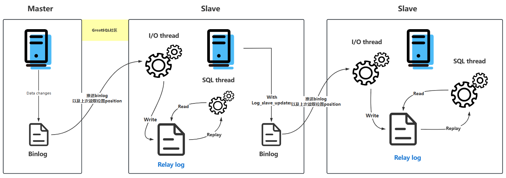

# Relay Log（中继日志）

## 什么是中继日志（Relay Log）

**中继日志**`（Relay Log）`**只在主从服务器架构的从服务器上存在**。从服务器`（Slave）`为了与主服务器`(Master)`保持一致，要从主服务器读取二进制日志的内容，并且把读取到的信息写入**本地的日志文件**中，这个从服务器本地的日志文件就叫**中继日志**。然后，从服务器读取中继日志，并根据中继日志的内容对从服务器的数据进行更新，完成主从服务器的**数据同步**。

搭建好主从服务器之后，中继日志默认会保存在从服务器的数据目录下。

文件名的格式是：`从服务器名 - relay-bin.序号`。中继日志还有一个索引文件：`从服务器名 - relay-bin.index`，用来定位当前正在使用的中继日志。



从服务器I/O线程将主服务器的二进制日志(Binlog)读取过来记录到从服务器本地文件，然后从服务器SQL线程会读取中继日志的内容并应用到从服务器，从而使从服务器和主服务器的数据保持一致。

## 中继日志的作用

中继日志用于主从服务器架构中，从服务器用来存放主服务器二进制日志内容的一个中间文件。从服务器通过读取中继日志的内容，来同步主服务器上的操作。

中继日志是连接 Master(主服务器)和 Slave(从服务器)的信息，它是复制的核心，I/O线程将来自Master的Binlog存储到中继日志中，中继日志充当缓冲，这样Master不必等待Slave执行完成就可以发送下一个Binlog。

## 查看中继日志

中继日志文件的格式与二进制日志文件相同，并且可以 使用 mysqlbinlog 进行读取

```sql
SET TIMESTAMP= 1615352328 /*!*/;
BEGIN
/*!*/;
# at 900
#211413 11:33:46 server id 1 end_log_pos 832 CRC32 0xcc16d651 Table_map:
`kaito`.`test` mapped to number 91
# at 950
#211413 11:33:46 server id 1 end_log_pos 872 CRC32 0x07e4047c Delete_rows: table id
91 flags: STMT_END_F -- server id 1 是主服务器，意思是主服务器删了一行数据
BINLOG '
CD95YBMBAAAAMgAAAEADAAAAAFsAAAAAAAEABGRlbW8ABHRlc3QAAQMAAQEBAFHWFsw=
CD95YCABAAAAKAAAAGgDAAAAAFsAAAAAAAEAAgAB/wABAAAAfATkBw==
'/*!*/;
# at 1000
```

这一段的意思是，主服务器（"server id 1"）对表 kaito.test 进行了 2 步操作：

- 定位到表 kaito.test 编号是 91 的记录，日志位置是 832
- 删除编号是 91 的记录，日志位置是 872

## 相关参数解析

通过语句：`SHOW VARIABLES LIKE '%relay%'` 查看相关的relay的所有相关参数如下：

```sql
greatsql> SHOW VARIABLES LIKE '%relay%';
+---------------------------+---------------------------------------+
| Variable_name             | Value                                 |
+---------------------------+---------------------------------------+
| max_relay_log_size        | 0                                     |
| relay_log                 | kaito-relay-bin                       |
| relay_log_basename        | /var/lib/mysql/kaito-relay-bin        |
| relay_log_index           | /var/lib/mysql/kaito-relay-bin.index  |
| relay_log_info_file       | relay-log.info                        |
| relay_log_info_repository | TABLE                                 |
| relay_log_purge           | ON                                    |
| relay_log_recovery        | OFF                                   |
| relay_log_space_limit     | 0                                     |
| sync_relay_log            | 10000                                 |
| sync_relay_log_info       | 10000                                 |
+---------------------------+---------------------------------------+
11 rows in set (0.00 sec)
```

- `max_relay_log_size：`标记Relay Log 允许的最大值，如果该值为0，则默认值为max_binlog_size(1G)；如果不为0，则max_relay_log_size则为最大的relay_log文件大小；

- `relay_log：`定义relay_log的位置和名称，如果值为空，则默认位置在数据文件的目录（datadir），文件名默认为host_name-relay-bin.nnnnnn

- `relay_log_index：`同relay_log，定义relay_log的位置和名称；一般和relay-log在同一目录

- `relay_log_info_file：`设置relay-log.info的位置和名称（relay-log.info记录Master的binary_log的恢复位置和relay_log的位置）

- `relay_log_purge：`是否自动清空不再需要中继日志时。默认值为1(启用)。

- `relay_log_recovery：`当Slave从库宕机后，假如relay-log损坏了，导致一部分中继日志没有处理，则自动放弃所有未执行的relay-log，并且重新从Master上获取日志，这样就保证了relay-log的完整性。默认情况下该功能是关闭的，将`relay_log_recovery`的值设置为 1时，可在Slave从库上开启该功能，建议开启。

- `relay_log_space_limit：`防止中继日志写满磁盘，这里设置中继日志最大限额。

  - > 注意！但此设置存在主库崩溃，从库中继日志不全的情况，不到万不得已，不推荐使用！

- `sync_relay_log：`这个参数和`sync_binlog`是一样的，当设置为1时，Slave的I/O线程每次接收到Master发送过来的Binlog日志都要写入系统缓冲区，然后刷入Relay Log中继日志里，这样是最安全的，因为在崩溃的时候，你最多会丢失一个事务，但会造成磁盘的大量I/O
  当设置为0时，并不是马上就刷入中继日志里，而是由操作系统决定何时来写入，虽然安全性降低了，但减少了大量的磁盘I/O操作。这个值默认是0，可动态修改，建议采用默认值。

- `sync_relay_log_info：`这个参数和sync_relay_log参数一样，当设置为1时，Slave的I/O线程每次接收到Master发送过来的Binlog日志都要写入系统缓冲区，然后刷入relay-log.info里，这样是最安全的，因为在崩溃的时候，你最多会丢失一个事务，但会造成磁盘的大量I/O。当设置为0时，并不是马上就刷入relay-log.info里，而是由操作系统决定何时来写入，虽然安全性降低了，但减少了大量的磁盘I/O操作。这个值默认是0，可动态修改，建议采用默认值。

以上只是简单的介绍了每个参数的作用，这些参数具体的设置还是需要根据每个用户的实际系统情况进行设置的；


**扫码关注微信公众号**


