# 图解GreatSQL Redo Log(重做日志)

## 前言

**请注意：本文基于 GreatSQL 8.0.25 & GreatSQL 5.7.7-RC版本，在 GreatSQL8.0.30 Redo 发生变化，详情见：** [MySQL 8.0.30动态redo log初探](http://mp.weixin.qq.com/s?__biz=MjM5NzAzMTY4NQ==&mid=2653939142&idx=1&sn=25c8c20017c421024f9c7cdb13b50274&chksm=bd3b7fac8a4cf6ba21f71c628c0c6eb5edbde6ac2152306681e484e06899d3904fa805f7e47f&scene=21#wechat_redirect)

> 事务有4种特性：原子性、一致性、隔离性和持久性（ACID）。那么事务的四种特性到底是基于什么机制实现呢？

- 事务的**隔离性由锁机制**实现。
- 而事务的原子性、一致性和持久性由事务的 **Redo 日志和 Undo 日志**来保证。

`Redo Log`称为**重做日志**，提供再写入操作，恢复提交事务修改的页操作，用来保证事务的持久性。

`UNDO LOG`称为**回滚日志**，回滚行记录到某个特定版本，用来保证事务的原子性、一致性。

> 有的DBA或许会认为 UNDO 是 REDO 的逆过程，其实不然。REDO和UNDO都可以视为是一种恢复操作。

`Redo Log:`是**存储引擎层(InnoDB)生成的日志**，记录的是"物理级别"上的页修改操作，比如页号xx、偏移量yyy写入了’zzz’数据。主要为了**保证数据的可靠性**;

- 提交，由Redo Log来保证事务的持久化。

`Undo Log:`是**存储引擎层(Innodb)生成的日志**，记录的是逻辑操作日志，比如对某一行数据进行了INSERT语句操作，那么Undo Log 就记录一条与之相反的DELETE操作。主要用于事务的回滚(Undo Log 记录的是每个修改操作的逆操作)和一致性非锁定读(Undo Log回滚行记录到某种特定的版本—MVCC，即多版本并发控制)。

## Redo Log日志

InnoDB存储引擎是以**页**为单位来管理存储空间的。在真正访问页面之前需要把在磁盘上的页缓存到内存中的`Buffer Pool`之后才可以访问。所有的变更都必须先更新缓冲池中的数据，然后缓冲池中的脏页会以一定的频率被刷入磁盘（`checkPoint机制`），通过缓冲池来优化CPU和磁盘之间的鸿沟，这样就可以保证整体的性能不会下降太快。

## 为什么需要Redo日志

一方面，缓冲池可以帮助我们消除CPU和磁盘之间的鸿沟，`checkpoint机制`可以保证数据的最终落盘，然而由于`checkpoint`并不是每次变更的时候就触发的，而是`master`线程隔一段时间去处理的。所以最坏的情况就是事务提交后，刚写完缓冲池，数据库宕机了，那么这段数据就是丢失的，无法恢复。

另一方面，事务包含**持久性**的特性，就是说对于一个已经提交的事务，在事务提交后即使系统发生了崩溃，这个事务对数据库中所做的更改也不能丢失。

那么如何保证这个持久性呢？一个简单的做法：在事务提交完成之前把该事务所修改的所有页面都刷新到磁盘，但是这个简单粗暴的做法有些问题:

- **修改量与刷新磁盘工作量严重不成比例**

有时候我们只修改了某个页面中的一个字节，但是我们知道在InnoDB中是以页为单位来进行磁盘IO的，也就是说我们在该事务提交时不得不将一个完整的页面从内存中刷新到磁盘，我们又知道一个页面默认是16KB大小，只修改一个字节就要刷新16KB的数据到磁盘上显然是太小题大做了（这也就是所谓“写放大”的意思）。

- **随机Io刷新较慢**

一个事务可能包含很多语句，即使是一条语句也可能修改许多页面，假如该事务修改的这些页面可能并不相邻，这就意味着在将某个事务修改的Buffer Pool中的页面**刷新到磁盘**时需要进行**很多的随机IO**，随机IO比顺序IO要慢，尤其对于传统的机械硬盘来说。

**另一个解决的思路 ：**我们只是想让已经提交了的事务对数据库中数据所做的修改永久生效，即使后来系统崩溃，在重启后也能把这种修改恢复出来。所以我们其实没有必要在每次事务提交时就把该事务在内存中修改过的全部页面刷新到磁盘，只需要把修改了哪些东西记录一下就好。

> 比如，某个事务将系统表空间中 第**10号**页面中偏移量为 100 处的那个字节的值 **1 改成 2** 。
> 我们只需要记录一下：将第0号表空间的**10号**页面的偏移量为 100 处的值**更新为 2** 。

InnoDB引擎的事务采用了`WAL技术(Write-Ahead Logging)`，这种技术的思想就是先写日志，再写磁盘，只有日志写入成功，才算事务提交成功，这里的日志就是Redo Log。当发生宕机且数据未刷到磁盘的时候，可以通过Redo Log来恢复，保证ACID中的D，这就是Redo Log的作用。

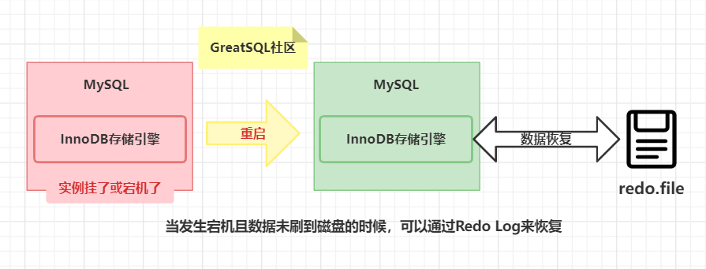

## Redo日志记录了什么

为了应对InnoDB各种各样不同的需求，到GreatSQL 8.0为止，已经有多达 **65** 种的REDO记录。用来记录这不同的信息，恢复时需要判断不同的 REDO 类型，来做对应的解析。根据 REDO 记录不同的作用对象，可以将这65中 REDO 划分为三个大类：

- 作用于Page
- 作用于Space
- 提供额外信息的Logic类型。

## Redo日志的好处、特点

- **好处**

- - Redo日志**降低了刷盘频率**
  - Redo日志**占用的空间非常小**
    存储表空间ID、页号、偏移量以及需要更新的值，所需的存储空间是很小的，刷盘快。

- **特点**

- Redo日志是顺序写入磁盘的
  在执行事务的过程中，每执行一条语句，就可能产生若干条Redo日志，这些日志是按照产生的顺序写入磁盘的，也就是使用顺序IO，效率比随机IO快。

- 事务执行过程中，Redo Log不断记录
  `Redo Log`跟`Binlog`的区别，Redo Log是存储引擎层产生的，而Binlog是数据库层产生的。假设一个事务，对表做10万行的记录插入，在这个过程中，一直不断的往Redo Log顺序记录，而 Binlog 不会记录，直到这个事务提交，才会一次写入到  Binlog 文件中。

## Redo的组成

Redo Log可以简单分为以下两个部分：

- `重做日志的缓冲 (Redo Log Buffer)`
  保存在内存中，是易失的。
  在服务器启动时就向操作系统申请了一大片称之为`Redo Log Buffer`的连续内存空间，翻译成中文就是**Redo日志缓冲区**。这片内存空间被划分成若干个连续的`Redo Log Block`。一个Redo Log Block占用**512字节**大小。

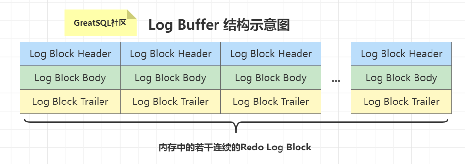

- 参数设置`innodb_log_buffer_size：`

Redo Log Buffer 的大小，默认为 `16M` ，最大值是`4096M`，最小值为 `1M` 。

```sql
greatsql> show variables like '%innodb_log_buffer_size%';
+------------------------+----------+
| Variable_name          | Value    |
+------------------------+----------+
| innodb_log_buffer_size | 16777216 |
+------------------------+----------+
```

- 重做日志文件(Redo Log File)，保存在硬盘中，是持久的。

REDO日志文件如图所示，其中的`ib_logfile0`和`ib_logfile1`即为Redo Log日志。

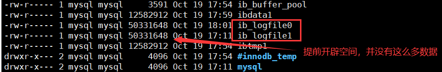

## Redo的整体流程

以一个更新事务为例，Redo Log 流转过程，如下图所示：

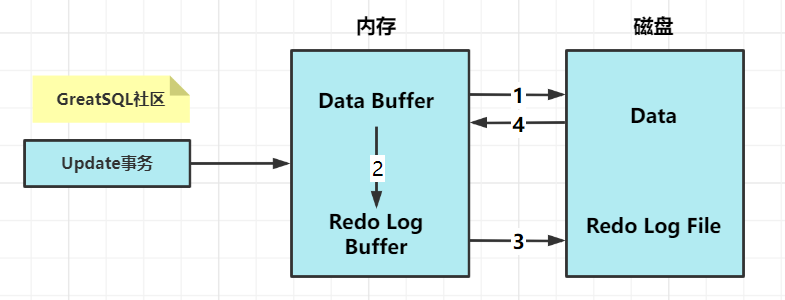

流程说明：

- **第1步：**先将原始数据从磁盘中读入内存中来，修改数据的内存拷贝（上图中箭头1、4方向画反了）
- **第2步：**生成一条重做日志并写入Redo Log Buffer，记录的是数据被修改后的值
- **第3步：**当事务commit时，将Redo Log Buffer中的内容刷新到 Redo Log File，对 Redo Log File采用追加写的方式
- **第4步：**定期将内存中修改的数据刷新到磁盘中

## Redo Log的刷盘策略

Redo Log的写入并不是直接写入磁盘的，InnoDB引擎会在写Redo Log的时候先写`Redo Log Buffer`，之后以**一定的频率**刷入到真正的`Redo Log File`中。这里的一定频率怎么规定的呢？这就是我们要说的刷盘策略。

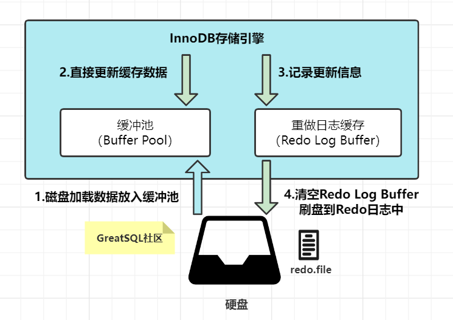

> 问题：什么时候刷盘呢？

有几种场景可能会触发redo log写文件：

- Redo log buffer空间不足时
- 事务提交
- 后台线程
- 做checkpoint
- 实例shutdown时
- binlog切换时

注意，`Redo Log Buffer`刷盘到`Redo Log File`的过程并不是真正的刷到磁盘中去，只是刷入到`文件系统缓存`（page cache）中去（这是现代操作系统为了提高文件写入效率做的一个优化），真正的写入会交给系统自己来决定（比如 page cache 足够大了）。那么对于InnoDB来说就存在一个问题，如果交给系统来同步，同样如果系统宕机，那么数据也丢失了（虽然整个系统宕机的概率还是比较小的）。

针对这种情况，InnoDB给出 `innodb_flush_log_at_trx_commit` 参数，该参数控制 commit 提交事务时，如何将 Redo Log Buffer 中的日志刷新到 Redo Log File 中。它支持三种策略：

- `设置为0 ：`表示每次事务提交时不进行刷盘操作。（系统默认master thread每隔1s进行一次重做日志的同步），事务提交不会触发redo写操作，而是留给后台线程每秒一次的刷盘操作，因此实例crash将最多丢失1秒钟内的事务。
- `设置为1 ：`表示每次事务提交时都将进行同步，刷盘操作（ 默认值 ）,每次事务提交都要做一次fsync，这是最安全的配置，即使宕机也不会丢失事务；
- `设置为2 ：`表示每次事务提交时都只把 Redo Log Buffer 内容写入 page cache，不进行同步。由os自己决定什么时候同步到磁盘文件,则在事务提交时只做write操作，只保证写到系统的page cache，因此实例crash不会丢失事务，但宕机则可能丢失事务；

下图表示了不同配置值的持久化程度：

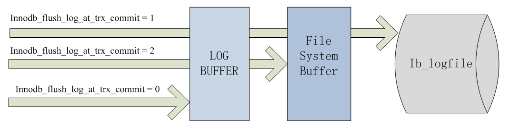
显然对性能的影响是随着持久化程度的增加而增加的。通常我们建议在日常场景将该值设置为 1 ，但在系统高峰期临时修改成 2 以应对大负载。

```sql
#查看刷盘策略
greatsql> show variables like 'innodb_flush_log_at_trx_commit';
+--------------------------------+-------+
| Variable_name                  | Value |
+--------------------------------+-------+
| innodb_flush_log_at_trx_commit | 1     |
+--------------------------------+-------+
1 row in set (0.00 sec)
```

另外，InnoDB存储引擎有一个后台线程，**每隔1秒**，就会把 Redo Log Buffer 中的内容写到文件系统缓存( page cache )，然后调用刷盘操作。

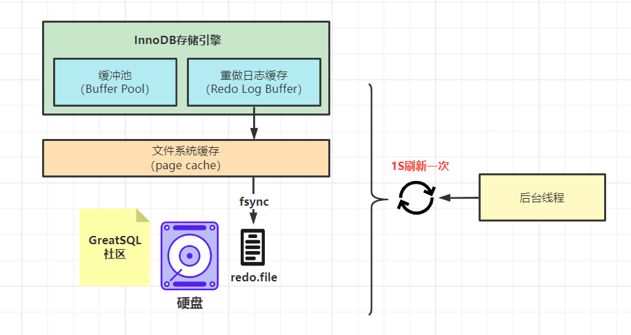

也就是说，一个没有提交事务的Redo Log记录，也可能会刷盘。因为在事务执行过程Redo Log记录是会写入Redo Log Buffer 中，这些Redo Log记录会被**后台线程刷盘**。

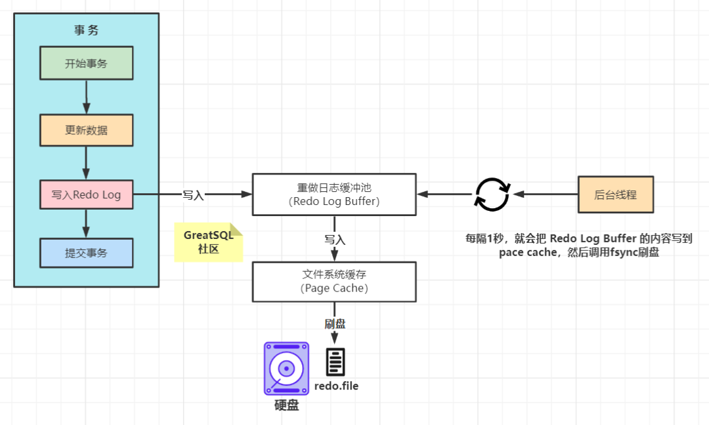

除了后台线程每秒`1次`的轮询操作，还有一种情况，当`Redo Log Buffer`占用的空间即将达到`innodb_log_buffer_size`(这个参数默认是16M)的一半的时候，后台线程会主动刷盘。

## 写入Redo Log Buffer 过程

### 1.Mini-Transaction

GreatSQL把对底层页面中的一次原子访问的过程称之为一个`Mini-Transaction`，简称`mtr`，比如，向某个索引对应的B+树中插入一条记录的过程就是一个`Mini-Transaction`。一个所谓的mtr可以包含一组Redo日志，在进行崩溃恢复时这一组Redo日志作为一个不可分割的整体。

一个事务可以包含若干条语句，每一条语句其实是由若干个 mtr 组成，每一个 mtr 又可以包含若干条Redo日志，画个图表示它们的关系就是这样：


### 2.Redo 日志写入Log Buffer

向`log buffer`中写入Redo日志的过程是顺序的，也就是先往前边的block中写，当该block的空闲空间用完之后再往下一个block中写。当我们想往`log buffer`中写入Redo日志时，第一个遇到的问题就是应该写在哪个block的哪个偏移量处，所以InnoDB的设计者特意提供了一个称之为`buf_free`的全局变量，该变量指明后续写入的Redo日志应该写入到`log buffer`中的哪个位置，如图所示:

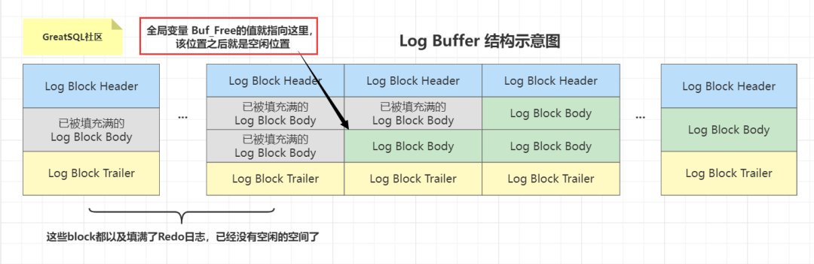

一个 mtr 执行过程中可能产生若干条Redo日志，**这些Redo日志是一个不可分割的组**，所以其实并不是每生成一条Redo日志，就将其插入到log buffer中，而是每个 mtr 运行过程中产生的日志先暂时存到一个地方，当该 mtr 结束的时候，将过程中产生的一组Redo日志再全部复制到log buffer中。我们现在假设有两个名为T1、T2的事务，每个事务都包含2个 mtr ，我们给这几个 mtr 命名一下:

- 事务`T1`的两个 `mtr` 分别称为`mtr_T1_1`和`mtr_T1_2`。
- 事务`T2`的两个 `mtr` 分别称为`mtr_T2_1`和`mtr_T2_2`。

每个 mtr 都会产生一组Redo日志，用示意图来描述一下这些 mtr 产生的日志情况：

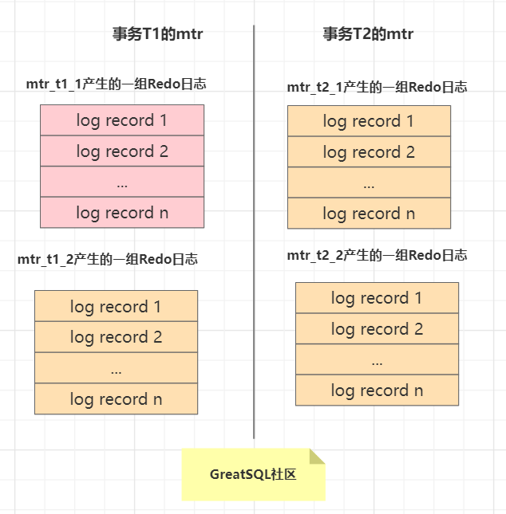

不同的事务可能是 `并发` 执行的，所以 `T1` 、 `T2` 之间的 `mtr` 可能是 `交替执行` 的。每当一个mtr执行完成时，伴随该mtr生成的一组Redo日志就需要被复制到log buffer中，也就是说不同事务的mtr可能是交替写入log buffer的，我们画个示意图(为了美观，我们把一个mtr中产生的所有的Redo日志当作一个整体来画):

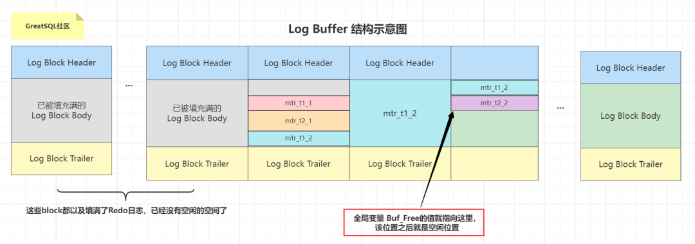

有的mtr产生的Redo日志量非常大，比如mtr_t1_2产生的Redo日志占用空间比较大，占用了3个block来存储。

### 3. Redo Log Block的结构图

一个Redo Log Block是由**日志头**、**日志体**、**日志尾**组成。日志头占用**12字节**，日志尾占用**4字节**，所以一个block真正能存储的数据就是`512-12-4=496字节`。

- 为什么一个block设计成512字节?
  这个和磁盘的扇区有关，机械磁盘默认的扇区就是512字节，如果你要写入的数据大于512字节，那么要写入的扇区肯定不止一个，这时就要涉及到盘片的转动，找到下一个扇区，假设现在需要写入两个扇区A和B，如果扇区A写入成功，而扇区B写入失败，那么就会出现**非原子性**的写入，而如果每次只写入和扇区的大小一样的512字节，那么每次的写入都是原子性的。

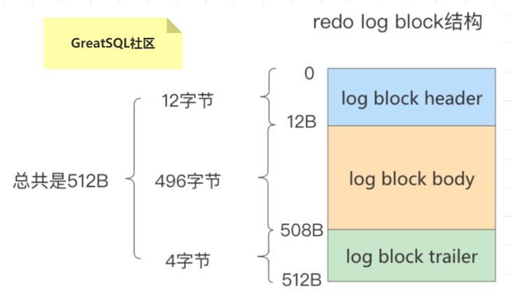

真正的Redo日志都是存储到占用`496`字节大小的`log block body`中，图中的`log block header`和`logblock trailer`存储的是一些管理信息。我们来看看这些所谓的管理信息都有什么。

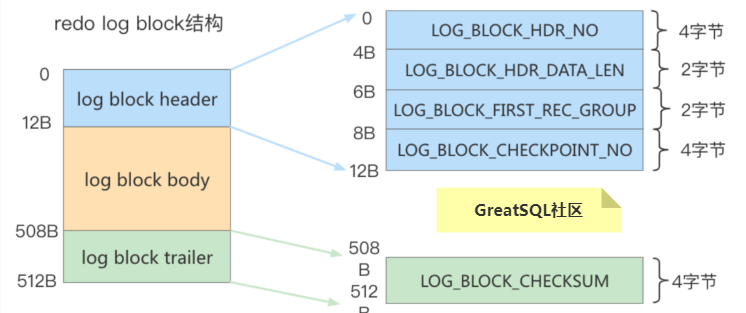

- `log block header`的属分别如下：

- - `LOG_BLOCK_HDR_NO:`log buffer是由log block组成，在内部log buffer就好似一个数组，因此LOG_BLOCK_HDR_NO用来标记这个数组中的位置。其是递增并且循环使用的，占用4个字节，但是由于第一位用来判断是否是flush bit,所以最大的值为2G。
  - `LOG_BLOCK_HDR_DATA_LEN:`表示block中已经使用了多少字节，初始值为`12`(因为log block body从第12个字节处开始）。随着往block中写入的Redo日志越来也多，本属性值也跟着增长。如果`log block body`已经被全部写满，那么本属性的值被设置为512。
  - `LOG_BLOCK_FIRST_REC_GROUP:`一条Redo日志也可以称之为一条Redo日志记录（Redo Log Record),一个 mtr 会生产多条Redo日志记录，这些Redo日志记录被称之为一个`Redo日志记录组（Redo Log Recordgroup)`。`LOG_BLOCK_FIRST_REC_GROUP`就代表该block中第一个mtr生成的Redo日志记录组的偏移量（其实也就是这个block里第一个mtr生成的第一条Redo日志的偏移量）。如果该值的大小和`LOG_BLOCK_HDR_DATA_LEN`相同，则表示当前log block不包含新的日志。
  - `LOG_BLOCK_CHECKPOINT_NO:`占用4字节，表示该log block最后被写入时的`checkpoint`。

- `log block trailer` 中属性的意思如下：

- - `LOG_BLOCK_CHECKSUM:`表示block的校验值，用于正确性校验（其值和LOG_BLOCK_HDR_NO相同）,我们暂时不关心它。

### Redo Log File

相关参数设置

- `innodb_log_group_home_dir ：`指定 Redo Log 文件组所在的路径，默认值为`./`，表示在数据库的数据目录下。GreatSQL的默认数据目录（ `/var/lib/mysql` ）下默认有两个名为 `ib_logfile0` 和`ib_logfile1` 的文件，log buffer中的日志默认情况下就是刷新到这两个磁盘文件中。此Redo日志文件位置还可以修改。
- `innodb_log_files_in_group：`指明Redo Log File的个数，命名方式如：ib_logfile0，iblogfile1…iblogfilen。默认2个，最大100个。

```sql
greatsql> show variables like 'innodb_log_files_in_group';
+---------------------------+-------+
| Variable_name             | Value |
+---------------------------+-------+
| innodb_log_files_in_group | 2     |
+---------------------------+-------+
#ib_logfile0
#ib_logfile1
```

- `innodb_flush_log_at_trx_commit：`控制 Redo Log 刷新到磁盘的策略，默认为1。
- `innodb_log_file_size：`单个 Redo Log 文件设置大小，默认值为 48M 。最大值为512G，注意最大值指的是整个 Redo Log 系列文件之和，即`（innodb_log_files_in_group * innodb_log_file_size ）`不能大于最大值512G。

```sql
greatsql> show variables like 'innodb_log_file_size';
+----------------------+----------+
| Variable_name        | Value    |
+----------------------+----------+
| innodb_log_file_size | 50331648 |
+----------------------+----------+
```

根据业务修改其大小，以便容纳较大的事务。编辑my.cnf文件并重启数据库生效，如下所示

```bash
$ vim /etc/my.cnf
innodb_log_file_size=200M  
```

> 在数据库实例更新比较频繁的情况下，可以适当加大 Redo Log 组数和大小。但也不推荐 Redo Log 设置过大，在GreatSQL崩溃恢复时会重新执行REDO日志中的记录。

### 日志文件组

从上边的描述中可以看到，磁盘上的`Redo`日志文件不只一个，而是以一个`日志文件组`的形式出现的。这些文件以`ib_logfile[数字]`（数字可以是0、1、2…）的形式进行命名，每个的Redo日志文件大小都是一样的。

在将Redo日志写入日志文件组时，是从`ib_logfile0`开始写，如果`ib_logfile0`写满了，就接着`ib_logfile1`写。同理,`ib_logfile1`.写满了就去写`ib_logfile2`，依此类推。如果写到最后一个文件该咋办?那就重新转到`ib_logfile0`继续写，所以整个过程如下图所示:

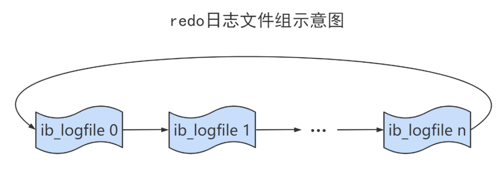

总共的Redo日志文件大小其实就是：`innodb_log_file_size × innodb_log_files_in_group` 。

采用循环使用的方式向Redo日志文件组里写数据的话，会导致后写入的Redo日志覆盖掉前边写的Redo日志？当然！所以InnoDB的设计者提出了`checkpoint`的概念。

### checkpoint

在整个日志文件组中还有两个重要的属性，分别是write pos、checkpoint

- `write pos`是当前记录的位置，一边写一边后移
- `checkpoint`是当前要擦除的位置，也是往后推移

每次刷盘Redo Log记录到日志文件组中，write pos位置就会后移更新。每次GreatSQL加载日志文件组恢复数据时，会清空加载过的Redo Log记录，并把 checkpoint后移更新。write pos和checkpoint之间的还空着的部分可以用来写入新的Redo Log记录。

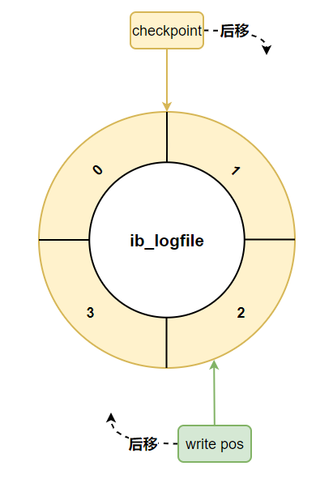

如果 write pos 追上 checkpoint ，表示 **日志文件组** 满了，这时候不能再写入新的 Redo Log 记录，GreatSQL 得停下来，清空一些记录，把 checkpoint 推进一下。

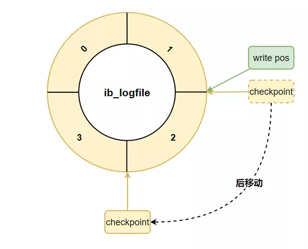

## 结尾

由于Redo LOG的内容知识过于庞大，由于篇幅限制，本文只做浅析，这边推荐几篇文章（详见参考文章），感兴趣的同学可以继续深入学习研究。

**问题反馈**
---

- [问题反馈 gitee](https://gitee.com/GreatSQL/GreatSQL-Manual/issues)


**联系我们**
---

扫码关注微信公众号


