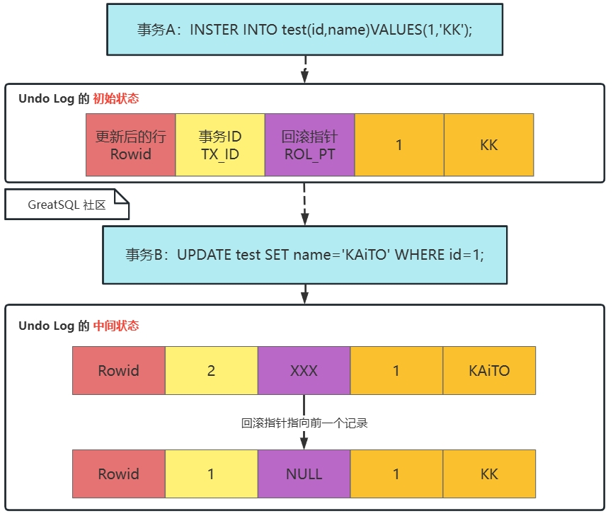
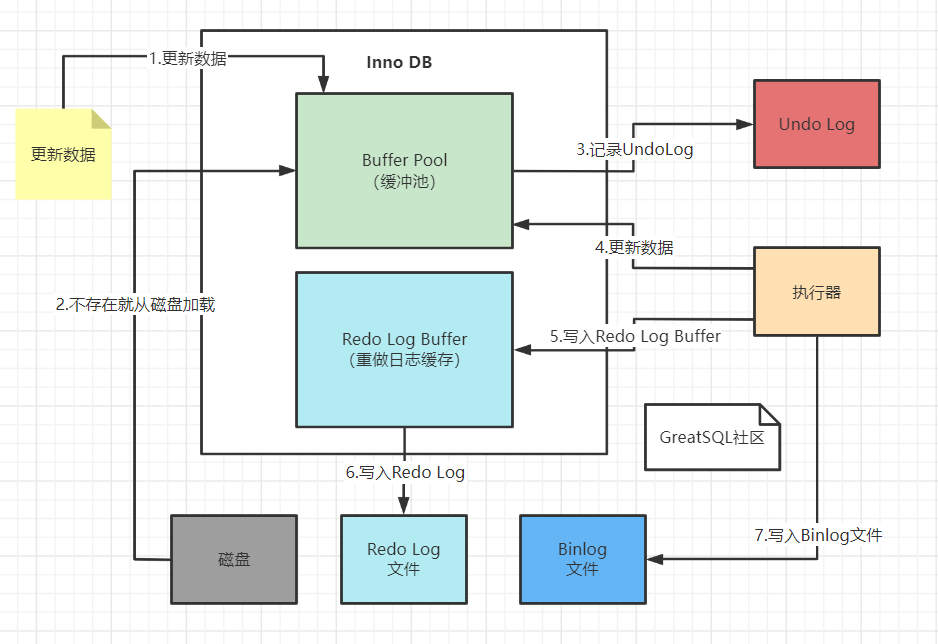

# Undo Log（撤销日志）

## 什么是 Undo Log

Undo Log（撤销日志）是 InnoDB 存储引擎用来保证事务的一致性和隔离性的关键组件。当事务执行中修改用户数据时，InnoDB 会将修改前的数据记录到撤销日志中，以便在事务回滚时或数据库崩溃时能够撤销其所做的修改。Undo Log 还是 InnoDB 实现 [MVCC（多版本并发控制）机制](../12-dev-guide/12-6-3-trx-mvcc-and-locking.md#mvcc) 的基础，使得读取操作可以看到事务开始时的数据库状态，而不受并发写操作的影响。

## Undo Log 的作用

事务需要保证**原子性**（ACID 中的 Atomic），也就是事务中的操作要么全部完成，要么什么也不做。但有时候事务执行过程中会出现一些情况，比如：

1. 事务执行过程中可能遇到各种错误，比如服务器本身的错误，操作系统错误，甚至是突然断电导致的错误。

2. 在事务执行过程中执行 `ROLLBACK` 语句结束当前事务。

以上情况出现，就需要把对数据库的修改撤销，重置回原先的样子，这个过程称之为回滚（rollback）。

每当要对数据库进行修改时（主要是 `INSERT, DELETE, UPDATE` 等操作），都需要把事务回滚时所需的东西记下来。比如:

- 如果是插入一条新记录，则至少要把这条记录的主键值记下来，回滚时只需把这个主键值对应的记录删掉就好了；对于 `INSERT` 操作，回滚时对应 `DELETE` 操作。
- 如果是删除一条旧记录，则要把整条记录数据全部记下来，回滚时再把由这条记录重新写回到表中；对于 `DELETE` 操作，回滚时对应 `INSERT` 操作。
- 如果是修改一条记录，则要把这条记录修改前的数据都记录下来，回滚时再把这条记录更新为旧值就；对于 `UPDATE` 操作，回滚时对应反向 `UPDATE` 操作。

这些为了事务回滚而记录的数据，在数据库中称之为 **撤销日志** 或 **回滚日志**，在本文统称为 **Undo Log**。

> 只读操作 `SELECT` 并不会修何用户数据，所以它不需要记录相应的 Undo 日志。

## Undo 表空间

Undo Log 是由回滚段（rollback segment）管理的，回滚段存在于 Undo 表空间（undo tablespace）以及全局临时表空间（global temporary tablespace）中。

普通用户表上的事务产生的 Undo Log 会分配到 Undo 表空间中；而用户自定义临时表上的事务产生的 Undo Log 则分配到全局临时表空间中，二者不同。

Undo 表空间包括 Undo Log 文件，是 Undo Log 的集合，Undo Log 中包含有关如何撤消事务对聚集索引记录的最新更改的信息。

### 默认 Undo 表空间

在 8.0 版本以前，Undo 表空间是存储在系统表空间中的，从 8.0 版本开始独立出来。

GreatSQL 数据库初始化时，默认先初始化 *2* 个 Undo 表空间，InnoDB 要求最少要有 *2* 个 Undo 表空间以确保支持 Undo 表空间自动截断（truncation）操作。

初始化默认创建的 *2* 个 Undo 表空间文件位于 `innodb_undo_directory` 参数定义的位置，如果它未定义，则等于 `datadir`。这 *2* 个默认的 Undo 表空间文件名为 *undo_001*、*undo_002*，相应的表空间名为 *innodb_undo_001*、*innodb_undo_002*：

### 在线创建/删除 Undo 表空间

在运行过程中，随着大事务、长事务的出现，可能会导致 Undo 表空间不断增长。为了避免单个 Undo 表空间文件增长过多，可以在线创建新的 Undo 表空间，例如：

```sql
greatsql> CREATE UNDO TABLESPACE greatsql_undo_001 ADD DATAFILE 'greatsql_undo_001.ibu';
```

用户自行创建的 Undo 表空间文件必须以 *.ibu* 为后缀，暂不支持自定义文件相对路径，但支持自定义绝对路径，且绝对路径必须在 `innodb_directory` 定义的范围内。

在 GreatSQL 启动过程中，InnoDB 会扫描 `innodb_directory` 参数定义的所有目录及其子目录，确认是否有 Undo 表空间文件。参数 `innodb_data_home_dir, innodb_undo_directory, datadir` 定义的目录，也都会被追加到 `innodb_directory` 扫描范围内。

> 虽然在启动过程中 InnoDB 会自动扫描发现所有的 Undo 表空间文件，但请不要随意移动这些文件，避免影响 crash recovery 工作。

从 8.0.14 开始，管理员通过 `CREATE UNDO TABLESPACE` 创建的 Undo 表空间，可以通过 `DROP UNDO TABLESPACE` 来删除，前提是这个 Undo 表空间是空的（没被使用）。

在删除之前，需要先将打算删除的 Undo 表空间设置为 inactive（不活跃），就不会再有新的事务分配到这个表空间，待到所有活跃事务都结束后，Purge 线程也清理相关的回滚段后，它就可以将其删除了。

```sql
-- 查看当前都有哪些Undo表空间文件
greatsql> SELECT FILE_ID, TABLESPACE_NAME, FILE_NAME, STATUS FROM INFORMATION_SCHEMA.FILES
          WHERE FILE_TYPE LIKE 'UNDO LOG';
+------------+-------------------+-------------------------+--------+
| FILE_ID    | TABLESPACE_NAME   | FILE_NAME               | STATUS |
+------------+-------------------+-------------------------+--------+
| 4294967279 | innodb_undo_001   | ./undo_001              | NORMAL |
| 4294967278 | innodb_undo_002   | ./undo_002              | NORMAL |
| 4294967023 | greatsql_undo_001 | ./greatsql_undo_001.ibu | NORMAL |
+------------+-------------------+-------------------------+--------+

greatsql> SELECT SPACE, NAME, FILE_SIZE, STATE FROM information_schema.INNODB_TABLESPACES 
          WHERE SPACE_TYPE = 'Undo';
+------------+-------------------+-----------+--------+
| SPACE      | NAME              | FILE_SIZE | STATE  |
+------------+-------------------+-----------+--------+
| 4294967279 | innodb_undo_001   | 134217728 | active |
| 4294967278 | innodb_undo_002   | 117440512 | active |
| 4294967023 | greatsql_undo_001 |  16777216 | active |
+------------+-------------------+-----------+--------+

-- 将 greatsql_undo_001 设置为不活跃后再删除
greatsql> ALTER UNDO TABLESPACE greatsql_undo_001 SET INACTIVE;
greatsql> DROP UNDO TABLESPACE greatsql_undo_001;
```

### 清理 Undo 表空间

InnoDB 支持采用自动和手动两种方法来清理（truncate）Undo 表空间。

- 手动清理

在上面已经演示过手动将 Undo 表空间设置为不活跃状态，并最终删除的过程，不赘述。

- 自动清理

InnoDB 要求至少有两个活跃可用的 Undo 表空间才可以启用自动清理方式，因为当一个 Undo 表空间被清理的时候，至少得有一个活跃可用的。

设置系统参数 `innodb_undo_log_truncate = ON` 即可启用自动清理模式：

```sql
greatsql> SET GLOBAL innodb_undo_log_truncate = ON;
```

在自动清理模式下，一旦有个 Undo 表空间文件大小超过 `innodb_max_undo_log_size` 参数设定的阈值后，就会开始自动清理。参数 `innodb_max_undo_log_size` 可以在线动态调整，默认值 *1GB*。

自动清理按照下面的方式进行工作：

1. 循环扫描每个 Undo 表空间文件，发现是否超过 `innodb_max_undo_log_size` 阈值。

2. 确认该 Undo 表空间中的回滚段是否都处于 inactive 状态，确保不会被分配给新事务。

3. 确认 Purge 线程已清理相关的回滚段，释放相应的 Undo Log。

4. 开始自动清理，并尝试将该 Undo 表空间文件重新初始化为默认大小。

5. 重新将该 Undo 表空间中的回滚段设置为活跃状态，以便分配给新事务。

Purge 线程的主要工作是清空释放 Undo 表空间，默认地，每进行 *128* 次 purge 工作后就会确认是否可以清理 Undo 表空间，这个频率由 `innodb_purge_rseg_truncate_frequency` 参数定义，默认值是 *128*，它可以在线动态调整。

### Undo 表空间相关状态变量

下面几个状态变量可以用来观察 Undo 表空间的使用情况：

```sql
greatsql> SHOW STATUS LIKE 'Innodb_undo_tablespaces%';
+----------------------------------+-------+
| Variable_name                    | Value |
+----------------------------------+-------+
| Innodb_undo_tablespaces_total    | 3     |
| Innodb_undo_tablespaces_implicit | 2     |
| Innodb_undo_tablespaces_explicit | 1     |
| Innodb_undo_tablespaces_active   | 3     |
+----------------------------------+-------+
```

其中分别解释如下：

- `Innodb_undo_tablespaces_total` 全部 Undo 表空间数目。
- `Innodb_undo_tablespaces_implicit` 隐式创建（InnoDB初始化时创建）的 Undo 表空间数目。
- `Innodb_undo_tablespaces_explicit` 显式创建（管理员手动创建）的 Undo 表空间数目。
- `Innodb_undo_tablespaces_active` 当前活跃的 Undo 表空间数目。

## Undo Log 存储机制



如上图，可以看到，Undo Log 里除了存储数据更新前的内容，还需要记录 ROW_ID（6 字节的 DB_ROW_ID 或是聚集索引键值）、TRX_ID（6 字节，事务 ID）、ROLL_PTR（7 字节，回滚段指针）。其中回滚指针总是指向同一条记录的上一个版本，最终会形成一条回滚链，方便找到该条记录的各个历史版本。

## 回滚段与事务的关系

### 回滚段和 Undo Slot

Undo Log 是由回滚段管理的，回滚段存在于 undo 表空间以及全局临时表空间（global temporary tablespace）中。

每个 Undo 表空间和全局临时表空间都分别支持最高 128 个回滚段。参数 `innodb_rollback_segments` 用于定义回滚段的最高数目，默认值和最高值均为 128。

一个回滚段中最多可以支持并行的事务数，取决于该事务同时需要多少个 undo slots，一个回滚段中最大支持的 undo slots 和 InnoDB page size 的关系如下表所示：

| InnoDB Page Size   | 一个回滚段中最多支持的 Undo Slots（InnoDB Page Size / 16）|
| :--- | :--- |
| 4096 (4KB)    | 256   |
| 8192 (8KB)    | 512   |
| 16384 (16KB)  | 1024  |
| 32768 (32KB)  | 2048  |
| 65536 (64KB)  | 4096  |

InnoDB page size 默认为 16 KB，因此一个回滚段里最多可以支持 1024 个 undo slots。

事务中不同的请求类型，会被分配到不同的 undo slot 中：
- 对普通用户表的 `INSERT`，分配到普通表 `insert_undo` slot；
- 对普通用户表的 `UPDATE, DELETE`，分配到普通表 `update_undo` slot；
- 对会话级临时表的 `INSERT`，分配到临时表 `insert_undo` slot；
- 对会话级临时表的 `UPDATE, DELETE`，分配到临时表 `update_undo` slot；

对每种请求类型会分别分配相应的 Undo Log（即每个 Undo Log 都有专属用途）。例如，为普通用户表上的 `INSERT` 操作分配的 Undo Log 也将用于该事务在普通用户表表上执行的所有 `INSERT` 操作，不会再重新申请一个 Undo Log。

普通用户表上的事务产生的 Undo Log 会分配到 Undo 表空间中；而用户自定义临时表上的事务产生的 Undo Log 则分配到全局临时表空间中，二者不同。

基于上述内容，可以知道 InnoDB 支持的最大并发事务数，和 Undo 表空间、回滚段及每个事务复杂度有关系。

以下面几种场景来尝试推断 InnoDB 可以支持的最大并发读写事务数：

| 事务发生的表 | 事务中包含的操作类型 | 最大并发事务数 |
| :--- | :--- | :--- |
|普通表 | 只有 `INSERT` | innodb_page_size / 16 * innodb_rollback_segments * Undo 表空间数目 |
|普通表 | 只有 `UPDATE` 或 `DELETE` | innodb_page_size / 16 * innodb_rollback_segments * Undo 表空间数目 |
|普通表 | 既有 `INSERT`，又有 `UPDATE` 或 `DELETE` | innodb_page_size / 16 / 2 * innodb_rollback_segments * Undo 表空间数目 |
|用户创建的临时表 | 只有 `INSERT` |  innodb_page_size / 16 * innodb_rollback_segments |
|用户创建的临时表 | 只有 `UPDATE` 或 `DELETE` | innodb_page_size / 16 * innodb_rollback_segments |
|用户创建的临时表 | 既有 `INSERT`，又有 `UPDATE` 或 `DELETE` | innodb_page_size / 16 / 2 * innodb_rollback_segments |


> 1. 在 MySQL 5.5 之前的版本（不含 5.5）中，InnoDB 只支持 1 个回滚段，因此它能支持的并发事务数上限为 1024。
> 
> 2. 从 MySQL 5.5 版本开始，InnoDB 支持最大 128 个回滚段，因此它能支持的并发事务数上限提高到了 128*1024=131072。
>
> 3. 参数 `innodb_rollback_segments` 在 8.0 版本以前的旧名为 `innodb_undo_logs`。

### 回滚段与事务

1. 每个事务只会分配到一个回滚段中，一个回滚段在同一时刻可能会服务于多个事务，回滚段和事务是 1对多 的关系。

2. 事务开始时，会分配到一个回滚段，事务过程中数据被修改时，修改前的原始数据会被复制到回滚段。

3. 在回滚段中，会不断填充新事务，直到事务结束或所有的回滚段都被用完。如果出现提示回滚段不够用的情况，就需要适当增加 undo 表空间数目。

4. 回滚段由 Undo 表空间管理，在数据库中可以存在多个活跃 Undo 表空间，但同一时刻只能使用一个 Undo 表空间。

### 事务中 Undo Log 和 Redo Log 协同

假设有 2 条记录，分别为 A=1 和 B=2 ，在事务中分别修改为3、4。以下是 InnoDB 存储引擎在一个事务中 Undo + Redo 协同的简化过程如下：

```sql
1. 开启事务
2．记录 A=1 到 Undo Log
3. 更新 A=3
4．记录 A=3 到 Redo Log
5．记录 B=2 到 Undo Log
6. 更新 B=4
7．记录 B=4 到 Redo Log
8．将 Redo Log 刷新到磁盘
9. 提交事务
```

有以下几种情况：

- 如果是在 1-8 步骤的任意一步之间发生宕机，事务还未来得及提交，该事务就不会真正修改用户数据。
- 如果是在 8-9 之间发生宕机，则会
  - 扫描 Redo Log 进行恢复。
  - 扫描 Undo Log 发现有事务没完成进行回滚。
- 若在9之后系统宕机，内存映射中变更的数据还来不及刷回磁盘，那么系统恢复之后，可以根据Redo Log把数据刷回磁盘。

> InnoDB 在进行 crash recovery 时，会进一步检查 Redo Log 和 Binlog，判断该事务是否同时也已经写了 Binlog，是的话就会再次提交。如果一个事务在 Redo Log 中只处于 Prepare 状态，但 Binlog 还没写成功，那就会回滚。

流程图：

## 相关参数变量

- `innodb_max_undo_log_size`

  用于控制 Undo Log 大小的上限，当 Undo Log 总大小超过此参数设置的阈值时，InnoDB 会开始进行清理，以减少日志大小，避免磁盘空间被耗尽。默认值为 *1GB*，设置过小的值可能导致频繁的 Undo Log 清理，影响性能，一般情况下默认值就够用。

- `innodb_undo_directory`

  用于指定存储 Undo Log 的目录。默认为空，即和 `datadir` 保持一致，一般不做调整。如果有条件，可以考虑把 Undo Log、Redo Log 和 Binlog 等各种日志文件和用户数据存储在独立的高速存储设备上以获得更好的性能。

- `innodb_undo_log_encrypt`

  用于指定是否加密 Undo Log。这在保护敏感数据的安全性方面尤为重要，特别是在磁盘上保存的场景。默认值是 *OFF*，即未启用；设置为 *ON* 表示启用。加密操作会增加 CPU 负载，可能会导致性能下降，特别是在高并发或高 I/O 负载的环境中。可根据实际需要决定是否开启。

- `innodb_undo_log_truncate`
 
  用于控制是否启用自动清理 Undo Log 表空间。默认值为 *ON*，即启用，也建议启用；设置为 *OFF* 表示不启用。启用该参数时，InnoDB 会定期释放未使用的 Undo Log 表空间，从而减少磁盘空间的使用。调整参数 `innodb_purge_rseg_truncate_frequency` 可影响自动清理的频率。 

- `innodb_undo_tablespaces`

  设置 Undo 表空间的个数，最小值和默认值均为 *2*，该参数从 8.0.14 开始建议不再使用。

- `innodb_rollback_segments`

  用于配置每个 Undo 表空间中回滚段的数量。每个回滚段可以同时处理一个或多个事务的 Undo Log 记录。默认值和最大值均为 *128*，最小值为 *1*。增加回滚段数量有助于提升并发事务处理能力，因为更多的事务可以同时写入不同的回滚段，减少了冲突和等待时间；设置过高可能会导致系统资源的浪费，并增加内存和磁盘的开销。一般不做调整。

- `innodb_purge_rseg_truncate_frequency`

  用于控制回滚段清理操作的频率。这个参数决定了清理操作在 purge 操作中是否经常性地进行，以释放空间。默认值和最大值均为 *128*，最小值为 *1*，一般不做调整。频繁的清理操作（较低的数值）会使回滚段迅速释放空间，但可能增加系统的负载和性能开销。


**扫码关注微信公众号**


