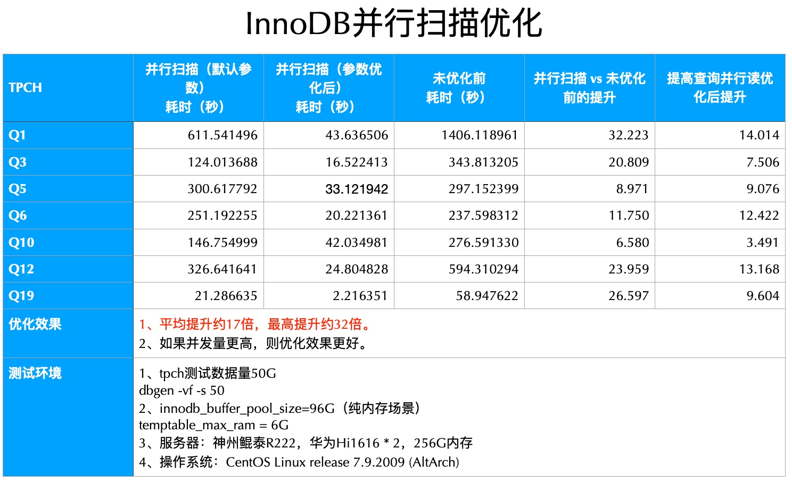

# InnoDB并行查询（InnoDB Parallel Query, InnoDB PQ）
---

## InnoDB PQ简述

根据B+树的特点，可以将B+树划分为若干子树，此时多个线程可以并行扫描同一张InnoDB表的不同部分。

GreatSQL中对执行计划进行多线程改造，每个子线程执行计划与MySQL原始执行计划一致，但每个子线程只需扫描表的部分数据，子线程扫描完成后再进行结果汇总。

通过多线程改造，GreatSQL InnoDB PQ可以充分利用多核资源，提升查询性能。

优化后，GreatSQL在TPC-H测试中表现优异，最高可提升30倍，平均提升15倍。该特性适用于周期性数据汇总报表之类的SAP、财务统计等业务。

下面是在华为鲲鹏Hi1616*2、256G内存、NVMeSSD存储上进行TPC-H 50G的测试结果：



使用限制：

- 暂不支持子查询，可想办法改造成JOIN。

## 启用InnoDB PQ
有两种方式来使用并行查询：

### 设置系统参数
通过全局参数 `force_parallel_execute` 来控制是否启用并行查询；使用全局参数 `parallel_default_dop` 来控制使用多少线程去并行查询。上述参数在使用过程中，随时可以修改，无需重启数据库。

例如，想要开启并行执行，且并发度设置为4，修改 *my.cnf* 配置文件的 *[mysqld]* 区间：
```ini
force_parallel_execute = on;
parallel_default_dop = 4;
```
可以根据实际情况调整 `parallel_cost_threshold` 参数的值，如果设置为0，则所有查询都会使用并行；设置为非0，则只有查询语句的代价估值大于该值的查询才会使用并行。

### 使用hint语法
使用hint语法可以控制单个语句是否进行并行执行。在系统默认关闭并行执行的情况下, 可以使用hint对特定的SQL进行加速。相反地，也可以限制某类SQL进入并行执行。

- `SELECT /*+ PQ */ … FROM …` 使用默认的并发度4进行并行查询。

- `SELECT /*+ PQ(8) */ … FROM …` 使用并发度为8进行并行查询。

- `SELECT /*+ NO_PQ */ … FROM …` 这条语句不使用并行查询。

## 并行查询相关参数、状态变量

### 新增参数
在并行框架中，增加6个并行相关的参数：

| System Variable Name	| force_parallel_execute |
| --- | --- | 
| Variable Scope	| global, session |
| Dynamic Variable	| YES |
| Permitted Values |	ON/OFF |
| Default	| OFF |
| Description	| 设置并行查询的开关，bool值，on/off。默认off，关闭并行查询特性。 |

<br/>

| System Variable Name	| parallel_cost_threshold |
| --- | --- | 
| Variable Scope	| global, session |
| Dynamic Variable	| YES |
| Permitted Values |	[0, ULONG_MAX] |
| Default	| 1000 |
| Description	| 设置SQL语句走并行查询的阈值，只有当查询的估计代价高于这个阈值才会执行并行查询，SQL语句的估计代价低于这个阈值，执行原生的查询过程。 |

<br/>

| System Variable Name	| parallel_default_dop |
| --- | --- | 
| Variable Scope	| global, session |
| Dynamic Variable	| YES |
| Permitted Values |	[0, 1024] |
| Default	| 4 |
| Description	| 设置每个SQL语句的并行查询的最大并发度。<br/>SQL语句的查询并发度会根据表的大小来动态调整，如果表的二叉树太小（表的切片划分数小于并行度），则会根据表的切片划分数来设置该查询的并发度。每一个查询的最大并行度都不会超过parallel_default_dop参数设置的值。<br/>当设置为0时，表示并行度为0，也即不启用并行查询特性。|

<br/>

| System Variable Name	| parallel_max_threads |
| --- | --- | 
| Variable Scope	| global, session |
| Dynamic Variable	| YES |
| Permitted Values |	[0, ULONG_MAX] |
| Default	| 64 |
| Description	| 设置系统中总的并行查询线程数。 |

<br/>

| System Variable Name	| parallel_memory_limit |
| --- | --- | 
| Variable Scope	| global, session |
| Dynamic Variable	| YES |
| Permitted Values |	0 - 4294967295 |
| Default	| 104857600（100MB） |
| Description	| 并行执行时leader线程和worker线程使用的总内存大小上限。<br/>在一个重TP，轻AP的场景里，innodb_buffer_pool_size可以设置为物理内存的50%左右，parallel_memory_limit可以设置为物理内存的20% ~ 30%左右。<br/>当并行执行使用的内存量超过该值时，新的SQL查询将不会进行并行执行。|

<br/>

| System Variable Name	| parallel_queue_timeout |
| --- | --- | 
| Variable Scope	| global, session |
| Dynamic Variable	| YES |
| Permitted Values |	[0, ULONG_MAX] |
| Default	| 0 |
| Description	| 设置系统中并行查询的等待的超时时间，如果系统的资源不够，例如运行的并行查询线程已达到parallel_max_threads的值，并行查询语句将会等待，如果超时后还未获取资源，将会执行原生的查询过程。 <br/>单位：毫秒|

### 新增状态变量
在并行框架中，同时增加了4个状态变量：

- **PQ_threads_running**

global级别，当前正在运行的并行执行的总线程数。

- **PQ_memory_used**

global级别，当前并行执行使用的总内存量。

- **PQ_threads_refused**

global级别，由于总线程数限制，导致未能执行并行执行的查询总数。

- **PQ_memory_refused**

global级别，由于总内存限制，导致未能执行并行执行的查询总数。

## InnoDB PQ和MySQL并行读取有什么不同

从MySQL 8.0.14开始，InnoDB支持并行读取聚集索引，这可以提高CHECK TABLE的性能。但该特性并不适用于辅助索引扫描。`innodb_parallel_read_threads` 选项必须设置为大于1的值才能启用聚集索引并行读取。默认值为4。用于执行并行聚集索引读取的实际线程数由 `innodb_parallel_read_threads` 选项值或要扫描的索引子树数（以较小者为准）决定。

从MySQL 8.0.17开始，聚集索引并行读取支持表分区。

可以看到，MySQL中的并行读取只支持聚集索引，不支持辅助索引，通常只在执行 `CHECK TABLE` 或执行 `COUNT(*)` 基于聚集索引统计数据时才有优化作用。

而GreatSQL InnoDB PQ同时支持聚集索引和辅助索引，尤其是在大表并行查询时优势更明显，因为此时有多个B+树字数，可以支持更高并发度。

GreatSQL InnoDB PQ还支持在线动态启用/关闭，即便是在全局关闭的情况下也可以在某个会话中利用HINT语法单独启用。

例如以TPC-H Q1的查询场景：

```sql
-- 先不使用InnoDB PQ，查看默认执行计划
greatsql> explain SELECT
    ->     l_returnflag,
    ->     l_linestatus,
    ->     sum(l_quantity) AS sum_qty,
    ->     sum(l_extendedprice) AS sum_base_price,
    ->     sum(l_extendedprice * (1 - l_discount)) AS sum_disc_price,
    ->     sum(l_extendedprice * (1 - l_discount) * (1 + l_tax)) AS sum_charge,
    ->     avg(l_quantity) AS avg_qty,
    ->     avg(l_extendedprice) AS avg_price,
    ->     avg(l_discount) AS avg_disc,
    ->     count(*) AS count_order
    -> FROM
    ->     lineitem
    -> WHERE
    ->     l_shipdate <= CAST('1998-09-02' AS date)
    -> GROUP BY
    ->     l_returnflag,
    ->     l_linestatus
    -> ORDER BY
    ->     l_returnflag,
    ->     l_linestatus;
+----+-------------+----------+------------+------+---------------+------+---------+------+----------+----------+----------------------------------------------+
| id | select_type | table    | partitions | type | possible_keys | key  | key_len | ref  | rows     | filtered | Extra                                        |
+----+-------------+----------+------------+------+---------------+------+---------+------+----------+----------+----------------------------------------------+
|  1 | SIMPLE      | lineitem | NULL       | ALL  | NULL          | NULL | NULL    | NULL | 29988970 |    33.33 | Using where; Using temporary; Using filesort |
+----+-------------+----------+------------+------+---------------+------+---------+------+----------+----------+----------------------------------------------+
1 row in set, 1 warning (0.00 sec)

-- 修改innodb_parallel_read_threads=16，并执行Q1查询
greatsql> set global innodb_parallel_read_threads=16;

-- 实际执行Q1 SQL
greatsql> SELECT ...;
4 rows in set (41.45 sec)

-- 启用InnoDB PQ，先修改 parallel_memory_limit 和 innodb_buffer_pool_size 值一样
greatsql> select @@innodb_buffer_pool_size;
+---------------------------+
| @@innodb_buffer_pool_size |
+---------------------------+
|                8589934592 |
+---------------------------+
1 row in set (0.00 sec)

greatsql> set global parallel_memory_limit=8589934592;
Query OK, 0 rows affected (0.00 sec)

-- 添加PQ HINT后再查看执行计划
greatsql> explain SELECT /*+ PQ(16) */ ...;
+----+-------------+-----------+------------+------+---------------+------+---------+------+----------+----------+----------------------------------------------+
| id | select_type | table     | partitions | type | possible_keys | key  | key_len | ref  | rows     | filtered | Extra                                        |
+----+-------------+-----------+------------+------+---------------+------+---------+------+----------+----------+----------------------------------------------+
|  1 | SIMPLE      | <gather2> | NULL       | ALL  | NULL          | NULL | NULL    | NULL | 29988970 |    33.33 | Parallel execute (16 workers)                |
|  2 | SIMPLE      | lineitem  | NULL       | ALL  | NULL          | NULL | NULL    | NULL | 29988970 |    33.33 | Using where; Using temporary; Using filesort |
+----+-------------+-----------+------------+------+---------------+------+---------+------+----------+----------+----------------------------------------------+
2 rows in set, 1 warning (0.04 sec)

-- 实际执行Q1 SQL
greatsql> SELECT /*+ PQ(16) */ ...;
4 rows in set (8.33 sec)
```

可以看到，Q1 SQL执行耗时显著下降，效率至少提升了将近5倍。


## 什么情况下建议启用InnoDB PQ

如果是不加判断条件的全表扫描场景，例如 `SELECT COUNT(*) FROM t1` 或 `SELECT * FROM t1` 这种，就没必要启用InnoDB PQ，而继续使用原生的聚集索引并行读取特性即可。

例如下面的场景：
```sql
-- tpc-h测试库中的orders表
greatsql> SHOW CREATE TABLE orders\G
*************************** 1. row ***************************
       Table: orders
Create Table: CREATE TABLE `orders` (
  `o_orderkey` bigint NOT NULL,
  `o_custkey` bigint NOT NULL,
  `o_orderstatus` char(1) NOT NULL,
  `o_totalprice` decimal(15,2) NOT NULL,
  `o_orderdate` date NOT NULL,
  `o_orderpriority` char(15) NOT NULL,
  `o_clerk` char(15) NOT NULL,
  `o_shippriority` bigint NOT NULL,
  `o_comment` varchar(79) NOT NULL,
  PRIMARY KEY (`o_orderkey`),
  KEY `orders_fk1` (`o_custkey`)
) ENGINE=InnoDB DEFAULT CHARSET=utf8mb4 COLLATE=utf8mb4_0900_ai_ci
1 row in set (0.01 sec)

-- 该表约有1.5亿行数据
greatsql> SHOW TABLE STATUS like 'orders'\G
*************************** 1. row ***************************
           Name: orders
         Engine: InnoDB
        Version: 10
     Row_format: Dynamic
           Rows: 148735762
 Avg_row_length: 164
    Data_length: 24439160832
Max_data_length: 0
   Index_length: 5003739136
      Data_free: 4194304
 Auto_increment: NULL
    Create_time: 2023-12-20 07:09:35
    Update_time: 2023-12-20 07:20:05
     Check_time: NULL
      Collation: utf8mb4_0900_ai_ci
       Checksum: NULL
 Create_options:
        Comment:
1 row in set (0.01 sec)

-- 全表COUNT(*)一般走辅助索引
greatsql> EXPLAIN SELECT COUNT(*) FROM orders\G
*************************** 1. row ***************************
           id: 1
  select_type: SIMPLE
        table: orders
   partitions: NULL
         type: index
possible_keys: NULL
          key: orders_fk1
      key_len: 8
          ref: NULL
         rows: 148735762
     filtered: 100.00
        Extra: Using index
1 row in set, 1 warning (0.00 sec)

-- 耗时约3.5秒
greatsql> SELECT COUNT(*) FROM orders;
+-----------+
| count(*)  |
+-----------+
| 150000000 |
+-----------+
1 row in set (0.44 sec)

-- 利用并行读取特性，强制走主键，耗时并没有显著缩短
greatsql> SELECT COUNT(*) FROM orders FORCE INDEX(PRIMARY);
+-----------+
| count(*)  |
+-----------+
| 150000000 |
+-----------+
1 row in set (0.42 sec)

-- 利用HINT语法启用PQ查询，但COUNT(*)查询时优化器还是采用原来的方式
greatsql> EXPLAIN SELECT /*+ PQ */ COUNT(*) FROM orders\G
*************************** 1. row ***************************
           id: 1
  select_type: SIMPLE
        table: orders
   partitions: NULL
         type: index
possible_keys: NULL
          key: orders_fk1
      key_len: 8
          ref: NULL
         rows: 148735762
     filtered: 100.00
        Extra: Using index
1 row in set, 1 warning (0.00 sec)

greatsql> select /*+ PQ */ count(*) from orders;
+-----------+
| count(*)  |
+-----------+
| 150000000 |
+-----------+
1 row in set (0.47 sec)

greatsql> select /*+ PQ */ count(*) from orders force index(PRIMARY);
+-----------+
| count(*)  |
+-----------+
| 150000000 |
+-----------+
1 row in set (0.43 sec)

-- 把COUNT(*)改成SELECT *就可以利用PQ特性，当前的默认并发度为64（parallel_default_dop = 64）
greatsql> EXPLAIN SELECT /*+ PQ */ * FROM orders\G
*************************** 1. row ***************************
           id: 1
  select_type: SIMPLE
        table: <gather2>
   partitions: NULL
         type: ALL
possible_keys: NULL
          key: NULL
      key_len: NULL
          ref: NULL
         rows: 148735762
     filtered: 100.00
        Extra: Parallel execute (64 workers)
*************************** 2. row ***************************
           id: 2
  select_type: SIMPLE
        table: orders
   partitions: NULL
         type: ALL
possible_keys: NULL
          key: NULL
      key_len: NULL
          ref: NULL
         rows: 148735762
     filtered: 100.00
        Extra: NULL
2 rows in set, 1 warning (0.00 sec)

-- 实际执行全表扫描做对比
-- 启用PQ且并行度为64，进行全表扫描
greatsql> select /*+ PQ */ * into outfile '/opt/tpch/o.txt' from orders;
Query OK, 150000000 rows affected (9 min 54.45 sec)

-- 采用原生聚集索引并行读取方式全表扫描
greatsql> set global innodb_parallel_read_threads=64;
Query OK, 0 rows affected (0.00 sec)

greatsql> set session innodb_parallel_read_threads=64;
Query OK, 0 rows affected (0.00 sec)

greatsql> select * into outfile '/opt/tpch/o1.txt' from orders;
Query OK, 150000000 rows affected (3 min 14.68 sec)

-- 强制走主键并行读取，耗时也差不多
greatsql> select * into outfile '/opt/tpch/o1.txt' from orders force index(PRIMARY);
Query OK, 150000000 rows affected (3 min 14.04 sec)
```
可以看到，在上述 `SELECT * FROM orders` 和 `SELECT COUNT(*) FROM orders` 这两种全表扫描的场景下，强行使用InnoDB PQ HINT并没有达到加速优化效果。

在上述两种场景下，仍旧采用原生默认的执行方式即可。

**延伸阅读**：[innodb_parallel_read_threads](https://dev.mysql.com/doc/refman/8.0/en/innodb-parameters.html#sysvar_innodb_parallel_read_threads)。


**扫码关注微信公众号**


