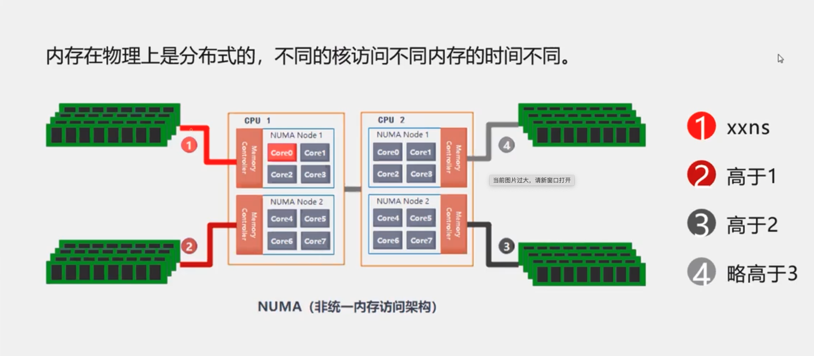
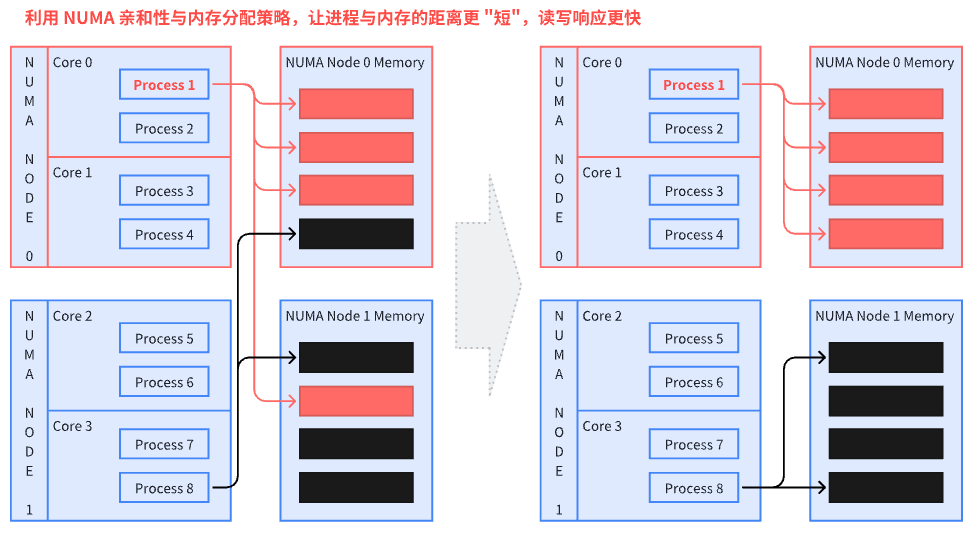
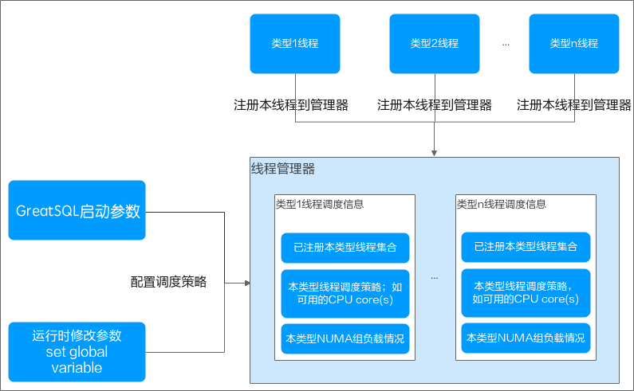
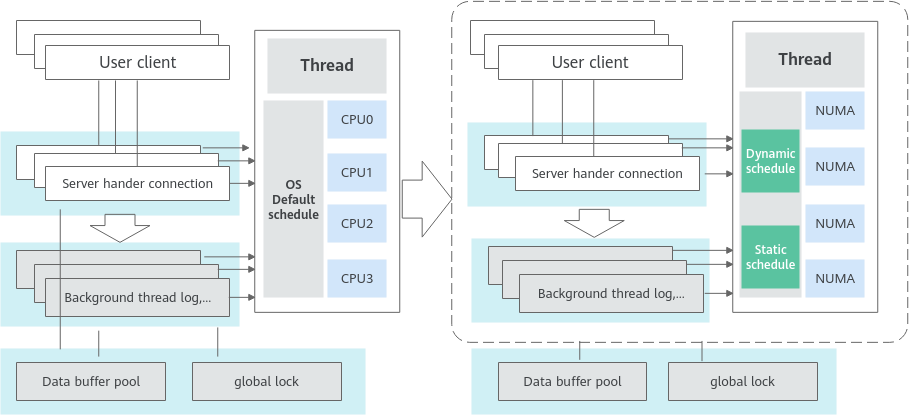

# NUMA 亲和性优化
---

## NUMA 概述
NUMA(Non Uniform Memory Access)即非一致内存访问架构。

传统的 SMP（对称多处理器）中，所有处理器都共享系统总线。因此当处理器的数目增大时，系统总线的竞争冲突加大，系统总线将成为瓶颈。所以目前 SMP 系统的 CPU 数目一般只有数十个，可扩展能力受到极大限制。

利用 NUMA 技术有效结合了 SMP 系统易编程性和 MPP（大规模并行）系统易扩展性的特点，较好解决了 SMP 系统的可扩展性问题，已成为当今高性能服务器的主流体系结构之一。

在 NUMA 架构中，当 Linux 内核收到内存分配的请求时，它会优先从发出请求的 CPU 本地或邻近的内存节点（Node）中寻找空闲内存，这种方式被称作 local allocation。local allocation 能让接下来的内存访问相对底层的物理资源是 local 的，距离更近，效率更高。

在 NUMA 架构中，有多个节点，每个节点可以拥有多个 CPU（每个 CPU 可以具有多个核或线程），在同一个节点内使用共有的内存控制器。因此节点的所有内存对于本节点的所有 CPU 都是等同的，而对于其它节点中的所有 CPU 都是不同的。节点可分为本地节点（Local Node）、邻居节点（Neighbour Node）和远端节点（Remote Node）三种类型。

通过下面两张图可以看出，利用 NUMA 亲和性与内存分配策略，让进程与内存的距离尽量短。这里假设的是内存分配策略已经设定的情况下，通过线程的 NUMA 亲和性来减少跨 NUMA 访问。





想要判断服务器设备的 NUMA 状态，可以通过命令 `numactl --hardware` 来获取信息，Linux 系统通常都是支持的：

```shell
$ numactl --hardware
available: 1 nodes (0)
node 0 cpus: 0 1 2 3 4 5 6 7 8 9 10 11 12 13 14 15 16 17 18 19 20 21 22 23 24 25 26 27 28 29 30 31 32 33 34 35 36 37 38 39 40 41 42 43 44 45 46 47 48 49 50 51 52 53 54 55 56 57 58 59 60 61 62 63 64 65 66 67 68 69 70 71 72 73 74 75 76 77 78 79 80 81 82 83 84 85 86 87 88 89 90 91 92 93 94 95 96 97 98 99 100 101 102 103 104 105 106 107 108 109 110 111 112 113 114 115 116 117 118 119 120 121 122 123 124 125 126 127 128 129 130 131 132 133 134 135 136 137 138 139 140 141 142 143 144 145 146 147 148 149 150 151 152 153 154 155 156 157 158 159 160 161 162 163 164 165 166 167 168 169 170 171 172 173 174 175
node 0 size: 370088 MB
node 0 free: 266009 MB
node distances:
node   0
  0:  10
```

上述结果中看到只有 1 个节点，说明该服务器当前把 NUMA 给关闭了，换一个服务器查看：

```shell
$ numactl --hardware
available: 4 nodes (0-3)
node 0 cpus: 0 1 2 3 4 5 6 7 8 9 10 11 12 13 14 15 16 17 18 19 20 21 22 23 24 25 26 27 28 29 30 31
node 0 size: 130059 MB
node 0 free: 125156 MB
node 1 cpus: 32 33 34 35 36 37 38 39 40 41 42 43 44 45 46 47 48 49 50 51 52 53 54 55 56 57 58 59 60 61 62 63
node 1 size: 130937 MB
node 1 free: 127130 MB
node 2 cpus: 64 65 66 67 68 69 70 71 72 73 74 75 76 77 78 79 80 81 82 83 84 85 86 87 88 89 90 91 92 93 94 95
node 2 size: 130937 MB
node 2 free: 113833 MB
node 3 cpus: 96 97 98 99 100 101 102 103 104 105 106 107 108 109 110 111 112 113 114 115 116 117 118 119 120 121 122 123 124 125 126 127
node 3 size: 130935 MB
node 3 free: 130438 MB
node distances:
node   0   1   2   3
  0:  10  16  32  33
  1:  16  10  25  32
  2:  32  25  10  16
  3:  33  32  16  10
```

可以看到，这个服务器上没有关闭 NUMA，且有 4 个物理 CPU。

## NUMA 亲和性调度优化机制

高并发场景在系统默认的线程调度方式下，用户线程和后台处理线程频繁休眠后唤醒在不同 NUMA 节点的 CPU，这种情况导致 CPU 开销增大，影响整体性能。

在 GreatSQL 中，针对这一问题，对 NUMA 调度进一步进行优化，主要有以下几点：

1. 首先，将线程进行分类，区分用户连接产生的线程，下面称为 "前端用户线程"，以及 InnoDB 引擎的多个 "后台线程"，包括 log checkpointer、log flush 等线程。

2. 考虑到前端用户线程通常较多，因此在设置其亲和性绑定时，最好使其能在各 NUMA 节点间实现负载均衡分配，并减少跨 NUMA 节点的访问。

3. 后台线程建议绑定到固定的逻辑 CPU 上，这样可以减少跨 NUMA 节点访问，提升效率。

4. 在配置时，如果指定的逻辑 CPU 是跨物理 NUMA 节点的，则实际上是可能出现跨 NUMA 访问的。因此尽量设置同一个 NUMA 节点中的逻辑 CPU，从而实现静态绑定。

5. 在程序运行过程中，可以通过修改参数值来重新调整负载均衡状态。但是不建议频繁这么做，因为当线程迁移到其他 NUMA 节点时，实际上也是跨 NUMA 访问的。

通过下面两张图可以看出，GreatSQL 在 NUMA 亲和性调度优化所做的工作。

1. 后台线程：主要是 InnoDB 引擎的 redo log 和 purge 处理逻辑相关。这类线程数量固定，每类线程有各自的线程实例，在 GreatSQL 实例启动时启动，可以通过 NUMA 亲和性设置，使得某类线程仅运行在指定的 CPU 上，实现各类线程 CPU 相互隔离，使其均能得到充分调度，避免成为系统瓶颈。

2. 前端用户线程，其特点是 one-thread-per-connection（每个连接对应一个线程），其数量随连接数变化而变化。前端用户线程在当前会话的生命周期内，只会在同一个 NUMA 节点内的逻辑 CPU 上迁移，而不会跨 NUMA 节点迁移，因此从 data locality 中获益。为了实现组间的负载均衡，新增的前端线程将被调度到负载较小的组上。负载程度通过本组内的会话数反应。



3. 前端用户线程和后台线程休眠后再唤醒时，可能会调度到不同 NUMA 节点的逻辑 CPU 上，线程切换到其它 CPU 引起线程相关资源拷贝，影响整体性能。需要对前端用户线程做动态绑定固定 NUMA 节点的 CPU 以减少跨 NUMA 访问，同时需要保证 CPU 访问的负载均衡，后台线程静态绑定固定 NUMA 节点以减少跨 NUMA 访问，提升后台线程效率。




想要启用 NUMA 亲和性支持，需要依赖操作系统层的 libnuma 库。需要先安装以下依赖包：

```shell
$ yum install -y numactl numactl-devel numactl-libs
```

默认地，GreatSQL 二进制包或 RPM 包都已支持 NUMA 亲和调度优化特性。如果需要用 GreatSQL 源码包编译二进制文件，那么在编译时要加上 `-DWITH_NUMA=ON` 参数，就可以启用 NUMA 亲和调度优化支持。

## 相关参数选项

### 新增系统选项

通过以下几个选项来实现 NUMA 亲和性优化设置。

- `sched_affinity_foreground_thread`

| Property            | Value                                  |
| ------------------- | -------------------------------------- |
| Command-Line Format | sched_affinity_foreground_thread=#     |
| System Variable     | sched_affinity_foreground_thread       |
| Scope               | Global                                 |
| Dynamic             | Yes                                    |
| Type                | String                                 |
| Default value       | NULL                                   |

设置前端用户线程亲和的逻辑 CPU，通过 "," 分割，通过 "-" 表示范围，例如：1,32-63。

当选项值为空时，表示可以在父进程绑定的 CPU 内进行迁移，如果父进程未绑定 CPU，则线程可以在所有 CPU 间迁移。

- `sched_affinity_log_checkpointer`

| Property            | Value                                  |
| ------------------- | -------------------------------------- |
| Command-Line Format | sched_affinity_log_checkpointer=#      |
| System Variable     | sched_affinity_log_checkpointer        |
| Scope               | Global                                 |
| Dynamic             | Yes                                    |
| Type                | String                                 |
| Default value       | NULL                                   |

设置 InnoDB 引擎的 log checkpointer 后台线程亲和的逻辑 CPU，通过 "," 分割，通过 "-" 表示范围，例如：1,32-63。

当选项值为空时，表示可以在父进程绑定的 CPU 内进行迁移，如果父进程未绑定 CPU，则线程可以在所有 CPU 间迁移。

- `sched_affinity_log_flush_notifier`

| Property            | Value                                  |
| ------------------- | -------------------------------------- |
| Command-Line Format | sched_affinity_log_flush_notifier=#    |
| System Variable     | sched_affinity_log_flush_notifier      |
| Scope               | Global                                 |
| Dynamic             | Yes                                    |
| Type                | String                                 |
| Default value       | NULL                                   |

设置 InnoDB 引擎的 log flush notifier 后台线程亲和的逻辑 CPU，通过 "," 分割，通过 "-" 表示范围，例如：1,32-63。

当选项值为空时，表示可以在父进程绑定的 CPU 内进行迁移，如果父进程未绑定 CPU，则线程可以在所有 CPU 间迁移。

- `sched_affinity_log_flusher`

| Property            | Value                                  |
| ------------------- | -------------------------------------- |
| Command-Line Format | sched_affinity_log_flusher=#           |
| System Variable     | sched_affinity_log_flusher             |
| Scope               | Global                                 |
| Dynamic             | Yes                                    |
| Type                | String                                 |
| Default value       | NULL                                   |

设置 InnoDB 引擎的 log flush 后台线程亲和的逻辑 CPU，通过 "," 分割，通过 "-" 表示范围，例如：1,32-63。

当选项值为空时，表示可以在父进程绑定的 CPU 内进行迁移，如果父进程未绑定 CPU，则线程可以在所有 CPU 间迁移。

- `sched_affinity_log_write_notifier`

| Property            | Value                                  |
| ------------------- | -------------------------------------- |
| Command-Line Format | sched_affinity_log_write_notifier=#    |
| System Variable     | sched_affinity_log_write_notifier      |
| Scope               | Global                                 |
| Dynamic             | Yes                                    |
| Type                | String                                 |
| Default value       | NULL                                   |

设置 InnoDB 引擎的 log write notifier 后台线程亲和的逻辑 CPU，通过 "," 分割，通过 "-" 表示范围，例如：1,32-63。

当选项值为空时，表示可以在父进程绑定的 CPU 内进行迁移，如果父进程未绑定 CPU，则线程可以在所有 CPU 间迁移。

- `sched_affinity_log_writer`

| Property            | Value                                  |
| ------------------- | -------------------------------------- |
| Command-Line Format | sched_affinity_log_writer=#            |
| System Variable     | sched_affinity_log_writer              |
| Scope               | Global                                 |
| Dynamic             | Yes                                    |
| Type                | String                                 |
| Default value       | NULL                                   |

设置 InnoDB 引擎的 log write 后台线程亲和的逻辑 CPU，通过 "," 分割，通过 "-" 表示范围，例如：1,32-63。

当选项值为空时，表示可以在父进程绑定的 CPU 内进行迁移，如果父进程未绑定 CPU，则线程可以在所有 CPU 间迁移。

- `sched_affinity_purge_coordinator`

| Property            | Value                                  |
| ------------------- | -------------------------------------- |
| Command-Line Format | sched_affinity_purge_coordinator=#     |
| System Variable     | sched_affinity_purge_coordinator       |
| Scope               | Global                                 |
| Dynamic             | Yes                                    |
| Type                | String                                 |
| Default value       | NULL                                   |

设置 InnoDB 引擎的 purge coordinator 后台线程亲和的逻辑 CPU，通过 "," 分割，通过 "-" 表示范围，例如：1,32-63。

当选项值为空时，表示可以在父进程绑定的 CPU 内进行迁移，如果父进程未绑定 CPU，则线程可以在所有 CPU 间迁移。

- `sched_affinity_numa_aware`

| Property            | Value                                  |
| ------------------- | -------------------------------------- |
| Command-Line Format | sched_affinity_numa_aware=#            |
| System Variable     | sched_affinity_numa_aware              |
| Scope               | Global                                 |
| Dynamic             | Yes                                    |
| Type                | Bool                                   |
| Default value       | False                                  |

设置是否能自动探测感知 NUMA 节点分组变化情况。该选项设置只影响 `sched_affinity_foreground_thread` 选项。

当 `sched_affinity_foreground_thread` 值不为空并且 `sched_affinity_numa_aware = ON` 时，`sched_affinity_foreground_thread` 设置的逻辑 CPU 会根据 NUMA 节点进行自动分组，一个线程只会在其中特定分组的逻辑 CPU 间迁移，不会迁移到其它 NUMA 节点分组。

当 `sched_affinity_foreground_thread` 值不为空并且 `sched_affinity_numa_aware = OFF` 时，`sched_affinity_foreground_thread` 设置的逻辑 CPU 都属于同一个组，这种情况下，线程可能会迁移到其它的 NUMA 节点，影响其性能。

其它 sched_affinity_* 后台线程亲和性选项都不会自动感知 NUMA 节点分组的，后台线程只会在各选项指定的逻辑 CPU 间迁移。

### 应用参考

假定服务器上共有 128 个 CPU cores：

```shell
$ numactl --hardware
available: 4 nodes (0-3)
node 0 cpus: 0 1 2 3 4 5 6 7 8 9 10 11 12 13 14 15 16 17 18 19 20 21 22 23 24 25 26 27 28 29 30 31
node 0 size: 130059 MB
node 0 free: 125156 MB
node 1 cpus: 32 33 34 35 36 37 38 39 40 41 42 43 44 45 46 47 48 49 50 51 52 53 54 55 56 57 58 59 60 61 62 63
node 1 size: 130937 MB
node 1 free: 127130 MB
node 2 cpus: 64 65 66 67 68 69 70 71 72 73 74 75 76 77 78 79 80 81 82 83 84 85 86 87 88 89 90 91 92 93 94 95
node 2 size: 130937 MB
node 2 free: 113833 MB
node 3 cpus: 96 97 98 99 100 101 102 103 104 105 106 107 108 109 110 111 112 113 114 115 116 117 118 119 120 121 122 123 124 125 126 127
node 3 size: 130935 MB
node 3 free: 130438 MB
node distances:
node   0   1   2   3
  0:  10  16  32  33
  1:  16  10  25  32
  2:  32  25  10  16
  3:  33  32  16  10
```

下面是一个设置参考：

```
sched_affinity_numa_aware = ON
sched_affinity_foreground_thread = 0-31,32-63,64-95
sched_affinity_log_writer = 96-100
sched_affinity_log_flusher = 101-104
sched_affinity_log_write_notifier = 105-108
sched_affinity_log_flush_notifier = 109-112
sched_affinity_log_closer = 113-116
sched_affinity_log_checkpointer = 117-120
sched_affinity_purge_coordinator = 121-124
```
通过以上的设置，可以让前端用户线程和后台线程分别绑定不同的物理 CPU 上（不同 NUMA 节点），达到更好的整体性能表现。

### 新增状态变量

- `Sched_affinity_group_capacity`

| Property        | Value                         |
| --------------- | ----------------------------- |
| Status Variable | Sched_affinity_group_capacity |
| Scope           | Global                        |
| Type            | Interger                      |

表示每个 NUMA 节点中的逻辑 CPU 个数。

- `Sched_affinity_group_number`

| Property        | Value                         |
| --------------- | ----------------------------- |
| Status Variable | Sched_affinity_group_number   |
| Scope           | Global                        |
| Type            | Interger                      |

表示 NUMA 的节点个数。

- `Sched_affinity_status`

| Property        | Value                         |
| --------------- | ----------------------------- |
| Status Variable | Sched_affinity_status         |
| Scope           | Global                        |
| Type            | String                        |

表示 NUMA 亲和性的设置状态，以 `log_checkpointer: 1/4` 为例，表示有 1 个 log checkpointer 线程，它可以在 4 个逻辑 CPU 间迁移。

## 约束限制

1. 启用 NUMA 亲和性优化需要依赖 libnuma 库，但 libnuma 库不允许接口调用设置的逻辑 CPU 超出父进程启动时的绑定范围，否则视为有冲突。

2. GreatSQL 实例启动时，如果同时在操作系统层设置了 CPU 绑定策略（例如通过 `taskset / numactl` 设置），则配置的线程亲和性策略不能与之存在冲突。如果发生冲突，GreatSQL 实例启动失败，并记录相应错误日志。

3. GreatSQL 实例运行时，如果要更改线程的 NUMA 亲和性设置，则不能与 GreatSQL 进程启动时已在系统层设置好的 CPU 绑定策略冲突。如果发生冲突，GreatSQL 实例仍继续运行，但线程的 NUMA 亲和性调度将进入 fallback 模式，不再响应内部线程调度请求，并记录相应告警日志。

4. 综上，当 GreatSQL 实例启动后，不应该再在系统层改变 CPU 绑定策略。否则 GreatSQL 实例仍能正常运行，但线程亲和性的负载信息将不再准确，影响调度优化效果。


**问题反馈**
---
- [问题反馈 gitee](https://gitee.com/GreatSQL/GreatSQL-Manual/issues)


**联系我们**
---

扫码关注微信公众号


