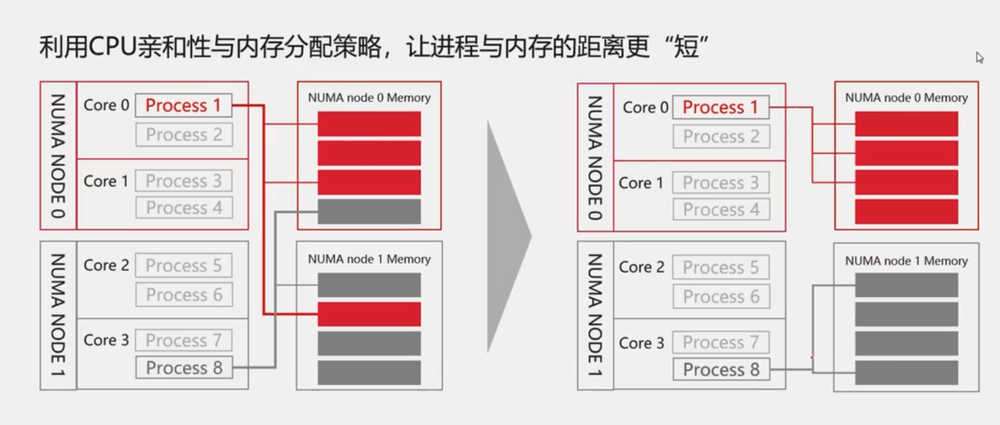
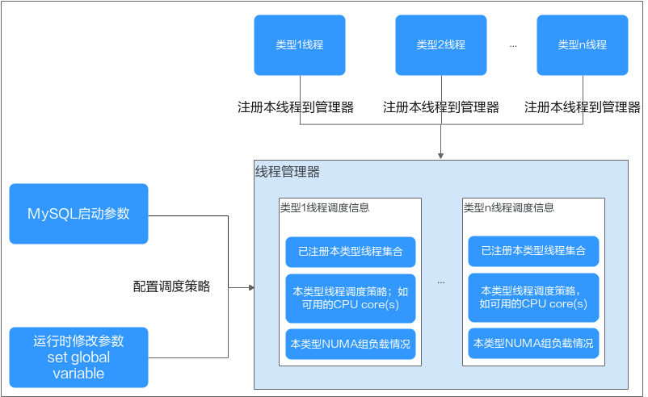

# NUMA调度优化
---

## 1. NUMA概述
NUMA(Non Uniform Memory Access)即非一致内存访问架构。

传统的SMP（对称多处理器）中，所有处理器都共享系统总线，因此当处理器的数目增大时，系统总线的竞争冲突加大，系统总线将成为瓶颈，所以目前SMP系统的CPU数目一般只有数十个，可扩展能力受到极大限制。

NUMA技术有效结合了SMP系统易编程性和MPP（大规模并行）系统易扩展性的特点，较好解决了SMP系统的可扩展性问题，已成为当今高性能服务器的主流体系结构之一。

在NUMA系统中，当Linux内核收到内存分配的请求时，它会优先从发出请求的CPU本地或邻近的内存node中寻找空闲内存，这种方式被称作local allocation，local allocation能让接下来的内存访问相对底层的物理资源是local的。

NUMA具有多个节点(Node)，每个节点可以拥有多个CPU(每个CPU可以具有多个核或线程)，节点内使用共有的内存控制器，因此节点的所有内存对于本节点的所有CPU都是等同的，而对于其它节点中的所有CPU都是不同的。节点可分为本地节点(Local Node)、邻居节点(Neighbour Node)和远端节点(Remote Node)三种类型。

## 2. NUMA调度优化

在GreatSQL中，针对NUMA调度进一步进行优化，主要有以下几点：

1. 将线程进行分类，用户连接产生的线程在绑定cpu cores亲和性时，会考虑到负载均衡来进行NUMA node的分配。在设置亲和性之后，减少了跨NUMA的访问。

2. 后台线程静态绑定cpu cores，减少跨NUMA访问，提升后台线程效率。如果配置的值是跨NUMA node，则也可能出现跨NUMA访问。尽量将配置的值设置为同一个NUMA node，从而达到静态绑定的作用。

3. 在程序的运行过程中，可以通过修改参数值来重新生成负载均衡的状态。但是不建议频繁使用，因为当线程迁移到其他NUMA node后，会出现跨NUMA访问内存。

通过下面两张图可以看出，利用cpu亲和性与内存分配策略，让进程与内存的距离尽量短。这里假设的是内存分配策略已经设定的情况下，通过线程的cpu亲和性来减少跨NUMA的访问。




## 3. 配置选项

想要启用NUMA亲和性支持，需要依赖操作系统层的libnuma库。需要先安装以下依赖包：
```
$ yum install -y numactl numactl-devel numactl-libs
```

这些配置选项是global级别，可在配置文件、启动参数或运行时设置。其中参数：

1. `sched_affinity_numa_aware`：表示是否可以感知numa_node分组，当设置为ON，并且 `sched_affinity_foreground_thread` 不为空，则 `sched_affinity_foreground_thread` 设置的cpu cores会根据numa_node进行分组，而一个会话所在的线程只会在其中特定组的cores间迁移。当设置为OFF时，`sched_affinity_foreground_thread` 中的设定的cores，都属于同一个组，也就是不分组。这种情况下，线程是可能迁移到其他其他的numa node。

2. `sched_affinity_foreground_thread`：这里设定的是用户线程亲和的cpu cores。数值是通过“,”分割，通过“-”表示范围，比如：1,32-63。可以理解为动态numa node调用。

3. 其他参数类似。但是这些其他参数，都是不分组的，相当于同一个组。通过合理的值，比如数值只属于同一个numa node，可以理解为静态绑定。

```
sched_affinity_numa_aware = ON
sched_affinity_foreground_thread=0-3,32,64-66,96-96
sched_affinity_log_writer=32-63,96-127
sched_affinity_log_flusher=32-63,96-127
sched_affinity_log_write_notifier=32-50,100-110
sched_affinity_log_flush_notifier=51-60,90-99
sched_affinity_log_closer=50-55
sched_affinity_log_checkpointer=90-95
sched_affinity_purge_coordinator=20-30
```


相应的执行原理是这样的：

1. 后台线程：本特性涉及7类影响系统性能的关键后台线程，主要与redo log和purge逻辑相关。这类线程数量固定，每一类线程有且只有一个线程实例，在MySQL实例启动时启动。本特性允许用户指定某类线程仅运行在指定的CPU core(s)。因此，通过合理参数设置，可以使各类线程的CPU core(s)相互隔离，使其均能得到充分调度，避免成为系统瓶颈。

2. 前台线程：MySQL是thread per connection，故前台线程数量随会话数量变化而变化。类似后台线程调度，本特性同样允许控制前台线程运行在指定的CPU core(s)。此外，本特性支持根据NUMA信息将CPU core(s)分组。前台线程在当前会话的生命周期内，只会在同一个组内的CPU core(s)上迁移，而不会跨NUMA迁移，因此从data locality获益。为了实现组间的负载均衡，新增的前台线程将被调度到负载较小的组上。负载程度通过本组内的会话数反应。



用户处理线程和后台处理线程频繁休眠后唤醒在不同NUMA的CPU，线程切换到其它CPU引起线程相关资源拷贝，影响整体性能。需要对用户处理线程做动态绑定固定NUMA CPU减少跨NUMA访问，同时需要保证CPU访问的负载必须均衡，后台线程静态绑定固定NUMA CPU减少跨NUMA访问，提升后台线程效率。


**问题反馈**
---
- [问题反馈 gitee](https://gitee.com/GreatSQL/GreatSQL-Manual/issues)


**联系我们**
---

扫码关注微信公众号


