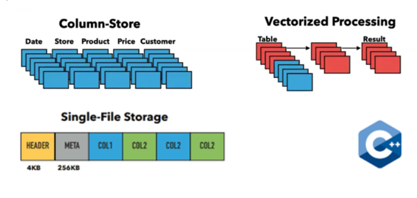
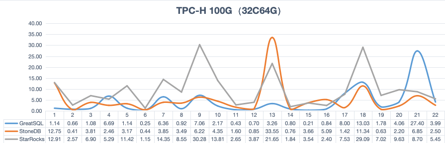

# Rapid引擎（Rapid Engine）
---

## Rapid引擎简述

从GreatSQL 8.0.32-25版本开始，新增Rapid存储引擎，该引擎使得GreatSQL能满足联机分析（OLAP）查询请求。

Rapid引擎采用插件（Plugin）方式嵌入GreatSQL中，可以在线动态安装或卸载。

Rapid引擎不会直接面对客户端和应用程序，用户无需修改原有的数据访问方式。它是一个无共享、内存化、混合列式存储的查询处理引擎，其设计目的是为了高性能的处理分析型查询。

## 使用Rapid引擎加速查询

###  启用Rapid引擎
想要使用Rapid引擎，需要安装Rapid plugin, 并且为表指定 `secondary_engine` 为Rapid引擎，然后将用户数据加载到Rapid引擎内存中。

首先，加载Rapid引擎这个Plugin：
```sql
greatsql> INSTALL PLUGIN Rapid SONAME 'ha_rapid.so';

greatsql> SHOW PLUGINS;
+----------------------------------+----------+--------------------+----------------------+---------+
| Name                             | Status   | Type               | Library              | License |
+----------------------------------+----------+--------------------+----------------------+---------+
| binlog                           | ACTIVE   | STORAGE ENGINE     | NULL                 | GPL     |
| mysql_native_password            | ACTIVE   | AUTHENTICATION     | NULL                 | GPL     |
...
| clone                            | ACTIVE   | CLONE              | mysql_clone.so       | GPL     |
| group_replication                | ACTIVE   | GROUP REPLICATION  | group_replication.so | GPL     |
| Rapid                            | ACTIVE   | STORAGE ENGINE     | ha_rapid.so          | GPL     |
+----------------------------------+----------+--------------------+----------------------+---------+
55 rows in set (0.00 sec)

greatsql> SHOW ENGINES;
+--------------------+---------+----------------------------------------------------------------------------+--------------+------+------------+
| Engine             | Support | Comment                                                                    | Transactions | XA   | Savepoints |
+--------------------+---------+----------------------------------------------------------------------------+--------------+------+------------+
...
| PERFORMANCE_SCHEMA | YES     | Performance Schema                                                         | NO           | NO   | NO         |
| InnoDB             | DEFAULT | Percona-XtraDB, Supports transactions, row-level locking, and foreign keys | YES          | YES  | YES        |
...
| Rapid              | YES     | Rapid storage engine                                                       | NO           | NO   | NO         |
...
+--------------------+---------+----------------------------------------------------------------------------+--------------+------+------------+
```
可以看到，Rapid引擎已经加载成功。

###  卸载Rapid引擎
执行下面的SQL命令即可卸载Rapid引擎：
```sql
greatsql> UNINSTALL PLUGIN rapid;
```
如果当前没有任何数据表加载到Rapid引擎中，则可以直接卸载成功。如果已有数据表加载到Rapid引擎中，则会有类似下面的提示：
```sql
greatsql> UNINSTALL PLUGIN rapid;
Query OK, 0 rows affected, 1 warning (0.00 sec)

greatsql> SHOW WARNINGS;
+---------+------+----------------------------------------------------+
| Level   | Code | Message                                            |
+---------+------+----------------------------------------------------+
| Warning | 1620 | Plugin is busy and will be uninstalled on shutdown |
+---------+------+----------------------------------------------------+
1 row in set (0.00 sec)
```
意思是当前Rapid引擎被使用中，还不能被卸载，这是需要将相关数据表从Rapid引擎中移除：
```sql
greatsql> ALTER TABLE t1 SECONDARY_ENGINE = NULL;
```

等到所有数据表都从Rapid引擎中移除后，再次执行 `SHOW ENGINES` 就能看到已经不再支持Rapid引擎了。查看日志，也能看到类似下面的内容：
```
[Note] [MY-010733] [Server] Shutting down plugin 'Rapid'
```

###  为InnoDB表加上Rapid辅助引擎
接下来对一个已存在的InnoDB引擎表，增加 `SECONDARY_ENGINE` 属性：
```sql
greatsql> CREATE TABLE `t1` (
  `id` int unsigned NOT NULL AUTO_INCREMENT,
  `c1` int unsigned NOT NULL DEFAULT '0',
  `c2` varchar(30) NOT NULL DEFAULT '',
  PRIMARY KEY (`id`)
) ENGINE=InnoDB;

greatsql> ALTER TABLE t1 SECONDARY_ENGINE = rapid;

-- 查看建表DDL，发现增加了 SECONDARY_ENGINE=rapid
greatsql> SHOW CREATE TABLE t1\G
*************************** 1. row ***************************
       Table: t1
Create Table: CREATE TABLE `t1` (
  `id` int unsigned NOT NULL AUTO_INCREMENT,
  `c1` int unsigned NOT NULL DEFAULT '0',
  `c2` varchar(30) NOT NULL DEFAULT '',
  PRIMARY KEY (`id`)
) ENGINE=InnoDB DEFAULT CHARSET=utf8mb4 COLLATE=utf8mb4_0900_ai_ci SECONDARY_ENGINE=rapid
```

从MySQL 8.0.18开始，为了支持`SECONDARY ENGINE`属性，新增选项 `show_create_table_skip_secondary_engine` 用于设置在执行 `SHOW CREATE TABLE` 显示表结构DDL时是否要同时显示`SECONDARY ENGINE`属性，其默认值是OFF，即默认要显示。此外，`mysqldump`中也新增相应选项 `show-create-table-skip-secondary-engine`，默认值是FALSE（和OFF一样），其作用相同。

接下来，执行下面SQL命令，写入一些数据：
```sql
greatsql> INSERT INTO t1 SELECT 0, RAND()*1024000, RAND()*1024000;
Query OK, 1 row affected (0.00 sec)
Records: 1  Duplicates: 0  Warnings: 0

-- 下面的SQL命令反复执行多次，构造一些数据
greatsql> INSERT INTO t1 SELECT 0, RAND()*1024000, RAND()*1024000 FROM t1;
Query OK, 1 row affected (0.00 sec)
Records: 1  Duplicates: 0  Warnings: 0

greatsql> INSERT INTO t1 SELECT 0, RAND()*1024000, RAND()*1024000 FROM t1;
Query OK, 2 rows affected (0.00 sec)
Records: 2  Duplicates: 0  Warnings: 0
...
greatsql> SELECT COUNT(*) FROM t1;
+----------+
| count(*) |
+----------+
|   131072 |
+----------+
1 row in set (0.00 sec)
```

然后将用户表数据一次性全量导入到Rapid引擎中：
```sql
greatsql> ALTER TABLE t1 SECONDARY_LOAD;

-- 查看表状态，确认已加载成功，关键字：SECONDARY_LOAD="1"
greatsql> SHOW TABLE STATUS like 't1'\G
*************************** 1. row ***************************
           Name: t1
         Engine: InnoDB
        Version: 10
     Row_format: Dynamic
           Rows: 0
 Avg_row_length: 0
    Data_length: 16384
Max_data_length: 0
   Index_length: 0
      Data_free: 0
 Auto_increment: NULL
    Create_time: 2024-01-25 17:33:07
    Update_time: NULL
     Check_time: NULL
      Collation: utf8mb4_0900_ai_ci
       Checksum: NULL
 Create_options: SECONDARY_ENGINE="rapid" SECONDARY_LOAD="1"
        Comment:
```

执行SQL命令 `ALTER TABLE ... SECONDARY_LOAD` 操作的过程是，先在辅助引擎中创建一个同名表，然后采用并行加载方式，将用户数据一次性全量导入到辅助引擎。

全量数据加载完毕后，后续的DML增量同步过程，由后台增量导入任务线程完成，详情参见后面的 **[3. 数据导入](./5-1-highperf-rapid-engine.md#3-数据导入)** 相关内容。

执行SQL命令 `ALTER TABLE ...  SECONDARY_UNLOAD` 操作会先判断辅助引擎中是否存在此表，是的话将其（从辅助引擎中）删除掉，但不会删除其（在主引擎中的）基本表。

###  利用Rapid引擎提升查询效率

将用户数据加载到Rapid引擎后，通过下面介绍的方式，即可使用Rapid引擎提升查询效率。

选项 `use_secondary_engine` 是使用Rapid引擎的总控制开关，有三个可选值：[OFF, ON,FORCED]（对应值是 [0, 1, 2]）， 默认值是0/OFF， 可以有两种方式使用Rapid引擎：

**方式一**
```sql
-- 设置use_secondary_engine=ON的时候，为保证查询语句能够使用rapid，
-- 通常需要设置secondary_engine_cost_threshold = 0，或一个较小的阈值
SET use_secondary_engine = ON;
SET secondary_engine_cost_threshold = 0; 
```

**方式二（不建议）**
```sql
-- 修改会话变量，设置强制使用Rapid引擎
SET use_secondary_engine = FORCED;

-- 或执行SQL查询时指定HINT
SELECT /*+ SET_VAR(use_secondary_engine=forced) */ * FROM t1;
```

上述两种方式的差别主要在报错信息上，对于不能使用secondary engine的SQL语句（例如查询的表没有指定secondary engine，或者没有先执行SECONDARY_LOAD）的情况，如果使用方式一，那么会直接使用主引擎进行查询，可通过查看计划来判断是否使用了secondary engine； 对于方式二，则总是强制使用secondary engine，但如果无法使用时，则会报错，具体报错信息见下例：
```sql
greatsql> CREATE TABLE t2 (c1 INT PRIMARY KEY, c2 INT);
Query OK, 0 rows affected (0.08 sec)

greatsql> INSERT INTO t2 VALUES (1,1);
Query OK, 1 row affected (0.01 sec)

-- 上面建表时没指定secondary engine，查询会报错
greatsql> SELECT /*+ SET_VAR(use_secondary_engine=FORCED) */ * FROM t2;
ERROR 3889 (HY000): Secondary engine operation failed. use_secondary_engine is FORCED but query could not be executed in secondary engine.

greatsql> SELECT /*+ SET_VAR(use_secondary_engine=ON) SET_VAR(secondary_engine_cost_threshold=0) */ * FROM t2;
+----+------+
| c1 | c2   |
+----+------+
|  1 |    1 |
+----+------+
1 row in set (0.00 sec)
```

接下来采用上面的方法查询表`t1`，体验Rapid引擎特性，查询时支持加上HINT语法：
```sql
-- 支持查询HINT用法，Extra列出现关键字：Using secondary engine RAPID
greatsql> EXPLAIN SELECT /*+ SET_VAR(use_secondary_engine=1) SET_VAR(secondary_engine_cost_threshold=0) */ * FROM t1\G
*************************** 1. row ***************************
           id: 1
  select_type: SIMPLE
        table: t1
   partitions: NULL
         type: ALL
possible_keys: NULL
          key: NULL
      key_len: NULL
          ref: NULL
         rows: 5
     filtered: 100.00
        Extra: Using secondary engine RAPID

-- 当已经设置 use_secondary_engine = 1或2 时
-- 表已经指定了Rapid辅助引擎，并且也已完成数据导入
-- 可以直接执行SELECT查询，能看到也可以直接用上Rapid引擎
greatsql> EXPLAIN SELECT * FROM t1\G
*************************** 1. row ***************************
           id: 1
  select_type: SIMPLE
        table: t1
   partitions: NULL
         type: ALL
possible_keys: NULL
          key: NULL
      key_len: NULL
          ref: NULL
         rows: 5
     filtered: 100.00
        Extra: Using secondary engine RAPID

-- 还支持设置不使用Rapid引擎查询，Extra列不再出现关键字：Using secondary engine RAPID
greatsql> EXPLAIN SELECT /*+ SET_VAR(use_secondary_engine=0) */ * FROM t1\G
*************************** 1. row ***************************
           id: 1
  select_type: SIMPLE
        table: t1
   partitions: NULL
         type: ALL
possible_keys: NULL
          key: NULL
      key_len: NULL
          ref: NULL
         rows: 5
     filtered: 100.00
        Extra: NULL
```
选项 `use_secondary_engine` 的详细解释参见下方 **[5.1 新增系统选项](./5-1-highperf-rapid-engine.md#51-新增系统选项)**。

看下面一个简单对比测试结果，对一个TPC-H 1G的表执行查询：
```sql
greatsql> SELECT /*+ SET_VAR(use_secondary_engine=0) */ COUNT(*) FROM lineitem;
+----------+
| count(*) |
+----------+
|  6001215 |
+----------+
1 row in set (2.18 sec)

greatsql> SELECT /*+ SET_VAR(use_secondary_engine=1) */ COUNT(*) FROM lineitem;
+----------+
| count(*) |
+----------+
|  6001215 |
+----------+
1 row in set (0.00 sec)
```
可以看到，查询速度提升效果非常明显。

还可以指定 `secondary_engine_cost_threshold` 选项，设置使用Rapid引擎的代价阈值：
```sql
-- 先查看执行计划的COST
greatsql> EXPLAIN FORMAT=TREE SELECT COUNT(*) FROM lineitem\G
*************************** 1. row ***************************
EXPLAIN: -> Aggregate: count(0)  (cost=1197779.30 rows=1)
    -> Table scan on lineitem in secondary engine RAPID  (cost=598889.90 rows=5988894)

-- 将 secondary_engine_cost_threshold 阈值调大到1197779
greatsql> SELECT /*+ SET_VAR(use_secondary_engine=1 SET_VAR(secondary_engine_cost_threshold=1197779) */ COUNT(*) FROM lineitem;
+----------+
| count(*) |
+----------+
|  6001215 |
+----------+
1 row in set (2.21 sec)
```
可以看到，虽然 `lineitem` 表已经加载到Rapid引擎中，但因为调大 `secondary_engine_cost_threshold` 阈值，实际上还是没用上。

###  Rapid引擎使用约束
在GreatSQL 8.0.32-25版本中，Rapid引擎支持的语句范围如下：

- 表类型：InnoDB引擎的normal表。

- SELECT stmt：不包含 `SELECT INTO, SELECT locking clause` 等语法。

- PREPARE stmt：仅支持 `PREPARE SELECT`查询。

其余类型的SQL语法暂时还不支持。

Rapid引擎暂时不支持表分区（partition），不支持外键（foreign key）。

## 数据导入

###  向Rapid引擎导入数据
当对表执行 `ALTER TABLE xxx SECONDARY_LOAD` 操作成功后，会将InnoDB主引擎中的数据全量加载到Rapid引擎中，这个过程称为全量导入。全量导入成功后，Rapid引擎中的数据是静态的，当向主引擎表中继续插入、删除、修改数据时，并不会导入到Rapid引擎中。

利用binlog特性，可以在全量导入成功后，启动增量导入任务。增量任务会读取自全量导入成功之后的binlog数据，将binlog解析并应用到rapid引擎中，这个过程称为**增量导入**。

不同于全量导入，增量导入会启动一个常驻的后台线程，实时读取和应用增量binlog数据。

###  增量导入数据的限制和需求
1. 需要设置表名大小写不敏感，即设置 `lower_case_table_names = 1`。
1. 需要开启GTID模式，即设置 `gtid_mode = ON` 和 `enforce_gtid_consistency = ON`。
1. 需要采用row格式的binlog event，不支持statement格式，即设置 `binlog_format = ROW`。增量任务运行过程中，检测到statement的DML event，可能会报错退出。
1. 需要关闭GIPKs特性，即设置 `sql_generate_invisible_primary_key = OFF`。用户表不能有 **invisible primary key**，如果表包含隐式不可见的主键，在全量导入过程中会报错；同时也不支持用户表中存在任何不可见列（**invisible column**）。
1. 需要先对表执行过一次全量导入后，才能启动增量导入任务，否则任务启动会报错。
1. 不支持 **PARTIAL_UPDATE_ROWS_EVENT** 类型的binlog，即不要设置 `binlog_row_value_options = PARTIAL_JSON`。
1. 不支持 `CREATE TABLE SELECT` 语句，增量任务运行过程中，检测到该语句产生的binlog event时可能会报错退出。
1. 不支持XA事务，运行过程中检查到XA事务会报错退出。

###  增量导入任务管理
新增两个系统函数用于管理增量导入任务，分别是 `START_SECONDARY_ENGINE_INCREMENT_LOAD_TASK()` 和 `STOP_SECONDARY_ENGINE_INCREMENT_LOAD_TASK()`。顾名思义，还是很好理解的，分别对应启动和停止任务。

#### 启动增量任务
执行SQL命令 `SELECT START_SECONDARY_ENGINE_INCREMENT_LOAD_TASK()` 即可启动增量任务，根据函数返回信息可以确认是否任务启动成功。如果启动失败，可以从错误日志中查看具体失败的原因。

该函数包含3个参数：
- db_name，必选项，指定增量导入任务对应的数据库名。
- table_name，必选项，指定增量导入任务对应的数据表名。
- gtid，可选项，指定开始增量导入任务的起始gtid_set值。默认不需要指定，任务会自动根据`ALTER TABLE ... SECONDARY_LOAD` 全量导入时刻的 `gtid_executed` 进行计算和判断。

启动增量导入任务后，每一个用户表会单独启动一个任务线程。

任务启动成功，会返回`success`；任务失败，会返回 `start task error`。具体失败的原因可以查看错误，或者查看 `information_schema.SECONDARY_ENGINE_INCREMENT_LOAD_TASK` 系统表。

不支持对视图（`view`）和 临时表（`temporary table`）启动增量导入任务。

```sql
-- 启动增量导入任务
greatsql> SELECT START_SECONDARY_ENGINE_INCREMENT_LOAD_TASK('tpch1g', 't1');
+------------------------------------------------------------+
| START_SECONDARY_ENGINE_INCREMENT_LOAD_TASK('tpch1g', 't1') |
+------------------------------------------------------------+
| success                                                    |
+------------------------------------------------------------+
1 row in set (0.00 sec)

-- 查看增量导入任务状态
greatsql> SELECT * FROM information_schema.SECONDARY_ENGINE_INCREMENT_LOAD_TASK\G
*************************** 1. row ***************************
           DB_NAME: tpch1g
        TABLE_NAME: t1
        START_TIME: 2024-01-26 14:54:41
        START_GTID: 4fb86f5b-b028-11ee-92b8-d08e7908bcb1:1-331
COMMITTED_GTID_SET: 4fb86f5b-b028-11ee-92b8-d08e7908bcb1:1-335
         READ_GTID: 4fb86f5b-b028-11ee-92b8-d08e7908bcb1:335
  READ_BINLOG_FILE: ./greatsql.000002
   READ_BINLOG_POS: 3589965
             DELAY: 0
            STATUS: RUNNING
          END_TIME:
              INFO:
1 row in set (0.00 sec)
```
如上所示，当前的增量导入任务正在运行中，任务开始的GTID位置是：`xxx:1-331`，当前最新GTID是：`xxx:1-335`，当前增量任务进度的GTID是：`xxx:335`，对应的binlog file & position分别是 **binlog.000002** 和 **3589965**。

也可以在启动增量导入任务时，指定初始的GTID位置，例如：
```sql
greatsql> SELECT START_SECONDARY_ENGINE_INCREMENT_LOAD_TASK('tpch1g', 't1', '4fb86f5b-b028-11ee-92b8-d08e7908bcb1:1-335');
```
增量导入任务会跳过GTID值为 1-335 区间的事务，从下一个事务开始继续增量导入。当binlog被意外清除时，默认方式（不带GTID参数）启动的增量导入任务可能会失败，这时就可以先停止增量导入任务，对该表执行一次全量导入，在全量导入完成后再次启动增量导入任务，启动任务时指定GTID参数即可。

#### 停止增量任务

执行SQL命令 `SELECT STOP_SECONDARY_ENGINE_INCREMENT_LOAD_TASK()` 即可停止增量任务，根据函数返回信息可以确认是否任务启动成功。如果启动失败，可以从错误日志中查看具体失败的原因。

该函数包含2个参数：
- db_name，必选项，指定增量导入任务对应的数据库名。
- table_name，必选项，指定增量导入任务对应的数据表名。

例如：
```sql
greatsql> SELECT STOP_SECONDARY_ENGINE_INCREMENT_LOAD_TASK('tpch1g', 't1');
+-----------------------------------------------------------+
| STOP_SECONDARY_ENGINE_INCREMENT_LOAD_TASK('tpch1g', 't1') |
+-----------------------------------------------------------+
| success                                                   |
+-----------------------------------------------------------+
1 row in set (0.65 sec)
```

#### 查看增量任务进度

执行SQL命令：`SELECT READ_SECONDARY_ENGINE_TABLE_LOAD_GTID('greatsql', 't1')` 即可查看任务当前导入的GTID进度。

该函数包含2个参数：
- db_name，必选项，指定增量导入任务对应的数据库名。
- table_name，必选项，指定增量导入任务对应的数据表名。

函数返回当前增量任务导入到的GTID位置，便于用户定位和主引擎的延迟等信息。也可以通过查看 `information_schema.SECONDARY_ENGINE_INCREMENT_LOAD_TASK`。

例如：
```sql
+-------------------------------------------------------+
| READ_SECONDARY_ENGINE_TABLE_LOAD_GTID('tpch1g', 't1') |
+-------------------------------------------------------+
| 4fb86f5b-b028-11ee-92b8-d08e7908bcb1:1-339            |
+-------------------------------------------------------+
1 row in set (0.00 sec)

greatsql> SELECT * FROM information_schema.SECONDARY_ENGINE_INCREMENT_LOAD_TASK\G
*************************** 1. row ***************************
           DB_NAME: tpch1g
        TABLE_NAME: t1
        START_TIME: 2024-01-26 15:14:31
        START_GTID: 4fb86f5b-b028-11ee-92b8-d08e7908bcb1:1-337
COMMITTED_GTID_SET: 4fb86f5b-b028-11ee-92b8-d08e7908bcb1:1-339
         READ_GTID: 4fb86f5b-b028-11ee-92b8-d08e7908bcb1:339
  READ_BINLOG_FILE: ./binlog.000002
   READ_BINLOG_POS: 3591515
             DELAY: 0
            STATUS: RUNNING
          END_TIME:
              INFO:
1 row in set (0.01 sec)
```

系统表 `information_schema.SECONDARY_ENGINE_INCREMENT_LOAD_TASK` 各个列解读如下：

- `DB_NAME`，`TABLE_NAME`：具体增量导入任务关联的用户表。
- `START_TIME`：增量导入任务启动的时间。
- `START_GTID`：增量导入任务启动时的GTID值。
- `COMMITTED_GTID_SET`：增量任务执行过程中，实时导入的GTID值。
- `READ_GTID`：该表增量导入任务读取到的最新GTID值。
- `READ_BINLOG_FILE`，`READ_BINLOG_POS`：增量任务执行过程中，实时导入的BINLOG位置信息。
- `DELAY`：增量任务执行过程中，实时的延迟时间，单位为秒。当增量导入任务不是在RUNNING状态，DELAY所显示延迟时长不准确，也无需再关注。
- `STATUS`：增量任务状态，是否在运行。
- `END_TIME`：增量导入任务如果退出，正常退出、或者异常退出，任务退出的时间点。
- `INFO`：显示任务退出、或者错误的信息。

当实际导入的GTID（`COMMITTED_GTID_SET`）和读取到的最新GTID（`READ_GTID`）相等时，表明增量导入任务已跟上最新进度，没有延迟。这时还能看到 `READ_BINLOG_FILE` 和 `READ_BINLOG_POS` 不再变化，并且 `DELAY` 值为0。如下例所示，说明表 `customer`、`nation`、`part`、`region`、`supplier` 已经跟上了最新事务进度：

```sql
greatsql> SELECT TABLE_NAME, STATUS, COMMITTED_GTID_SET, READ_GTID, READ_BINLOG_FILE, READ_BINLOG_POS, DELAY FROM information_schema.SECONDARY_ENGINE_INCREMENT_LOAD_TASK;
+------------+-------------+----------------------------------------------+--------------------------------------------+------------------+-----------------+-------+
| TABLE_NAME | STATUS      | COMMITTED_GTID_SET                           | READ_GTID                                  | READ_BINLOG_FILE | READ_BINLOG_POS | DELAY |
+------------+-------------+----------------------------------------------+--------------------------------------------+------------------+-----------------+-------+
| customer   | RUNNING     | 35e7b1d9-bf0c-11ee-b7ea-d08e7908bcb1:1-42701 | 35e7b1d9-bf0c-11ee-b7ea-d08e7908bcb1:42701 | ./binlog.000003  |       171177719 |     0 |
| lineitem   | RUNNING     | 35e7b1d9-bf0c-11ee-b7ea-d08e7908bcb1:1-42427 | 35e7b1d9-bf0c-11ee-b7ea-d08e7908bcb1:42428 | ./binlog.000001  |      1016454504 |  5528 |
| nation     | RUNNING     | 35e7b1d9-bf0c-11ee-b7ea-d08e7908bcb1:1-42701 | 35e7b1d9-bf0c-11ee-b7ea-d08e7908bcb1:42701 | ./binlog.000003  |       171177719 |     0 |
| orders     | RUNNING     | 35e7b1d9-bf0c-11ee-b7ea-d08e7908bcb1:1-42429 | 35e7b1d9-bf0c-11ee-b7ea-d08e7908bcb1:42430 | ./binlog.000002  |        27569846 |  5466 |
| part       | RUNNING     | 35e7b1d9-bf0c-11ee-b7ea-d08e7908bcb1:1-42701 | 35e7b1d9-bf0c-11ee-b7ea-d08e7908bcb1:42701 | ./binlog.000003  |       171177719 |     0 |
| partsupp   | RUNNING     | 35e7b1d9-bf0c-11ee-b7ea-d08e7908bcb1:1-42431 | 35e7b1d9-bf0c-11ee-b7ea-d08e7908bcb1:42432 | ./binlog.000002  |       231344911 |  5454 |
| region     | RUNNING     | 35e7b1d9-bf0c-11ee-b7ea-d08e7908bcb1:1-42701 | 35e7b1d9-bf0c-11ee-b7ea-d08e7908bcb1:42701 | ./binlog.000003  |       171177719 |     0 |
| supplier   | RUNNING     | 35e7b1d9-bf0c-11ee-b7ea-d08e7908bcb1:1-42701 | 35e7b1d9-bf0c-11ee-b7ea-d08e7908bcb1:42701 | ./binlog.000003  |       171177719 |     0 |
+------------+-------------+----------------------------------------------+--------------------------------------------+------------------+-----------------+-------+
8 rows in set (0.00 sec)
```

当增量导入任务停止后，查询状态结果如下所示：
```sql
greatsql> SELECT * FROM information_schema.SECONDARY_ENGINE_INCREMENT_LOAD_TASK\G
*************************** 1. row ***************************
           DB_NAME: tpch1g
        TABLE_NAME: t1
        START_TIME: 2024-01-26 15:14:31
        START_GTID: 4fb86f5b-b028-11ee-92b8-d08e7908bcb1:1-337
COMMITTED_GTID_SET: 4fb86f5b-b028-11ee-92b8-d08e7908bcb1:1-339
         READ_GTID: 4fb86f5b-b028-11ee-92b8-d08e7908bcb1:339
  READ_BINLOG_FILE: ./binlog.000002
   READ_BINLOG_POS: 3591515
             DELAY: 6
            STATUS: NOT RUNNING
          END_TIME: 2024-01-26 15:35:18
              INFO: NORMAL EXIT
1 row in set (0.00 sec)
```
#### 增量任务线程
1. 每一个用户表的增量导入任务对应一个后台线程，该线程只负责处理将该表的增量数据导入到Rapid。所以如果加载的Rapid表很多，可能会消耗较多线程资源。
2. 增量任务执行过程中，根据之前的测试，对于`UPDATE/DELETE` 语句在Rapid引擎中执行较慢，可能导致增量导入任务线程延迟加大。

###  辅助查询概述
由于用户表的主引擎可能产生实时变更的新数据，因此对于辅助引擎的查询，即使开启了增量导入任务，相对主引擎，Rapid引擎的数据也还是可能存在延迟。针对数据延迟问题，新增了如下5个 **SESSION/GLOBAL** 选项，标记在何种条件下仍旧通过Rapid引擎进行数据读操作。

| 选项名 | 类型 | 默认值 | 最小值 | 最大值 | 说明 |
| --- | --- | --- | --- | --- | --- |
|secondary_engine_read_delay_time_threshold|ULONG|60|0|ULONG_MAX|允许最大的读延迟时间|
|secondary_engine_read_delay_gtid_threshold|ULONG|100|0|ULONG_MAX|允许最大的读延迟事务数|
|secondary_engine_read_delay_wait_timeout|ULONG|60|0|ULONG_MAX|读延迟时最大等待超时时间|
|secondary_engine_read_delay_wait_mode|ENUM|WAIT_FOR_TRX|[WAIT_FOR_TRX, WAIT_FOR_DB]||读延迟时查询等待模式|
|secondary_engine_read_delay_level|ENUM|TABLE_START_INC_TASK|[ALL_TABLES, TABLE_START_INC_TASK]||读延迟级别|

几个选项分别解释如下：

- `secondary_engine_read_delay_time_threshold`：指定辅助引擎查询时，数据的最大允许延时时间，时间单位为秒。默认值为 **60**，可选范围为 **[0 ~ ULONG_MAX]**。如果选项值为0，表示不允许延迟，即如果Rapid擎相对主引擎的数据有延迟，都不允许查询。如果设置不为0，则实际延迟小于选项值，可以查询；否则不允许查询。
- `secondary_engine_read_delay_gtid_threshold`：执行辅助引擎查询时，允许延迟的最大事务数。默认值为 **100**，即允许100个事务内的延迟；可选范围为 **[0 ~ ULONG_MAX]**。如果选项值为0，表示不允许延迟，即如果辅助引擎相对主引擎的数据有延迟，都不允许查询。如果设置不为0，则实际延迟小于选项值，可以查询；否则不允许查询。
- `secondary_engine_read_delay_wait_timeout`：指定辅助引擎查询时，如果数据出现延迟，不管是时间延迟，还是基于GTID的事务延迟，此时是不允许查询的。本选项用于设置允许当出现这种状况时，指定一个查询超时时间，在触发超时之前，可以持续等待并检测延迟情况，如果延迟降低到允许范围内，则可以继续查询；否则，如果触发超时，则最后报错。时间单位为秒，默认值为 **60**，可选范围为 **[0 ~ ULONG_MAX]**。如果设置为0，则如果延迟超限，直接报错。如果设置不为0，则以实际的超时时间为准。
- `secondary_engine_read_delay_wait_mode`：本选项是对`secondary_engine_read_delay_wait_timeout`的补充，本选项指定了等待超时的模式，有两个可选值 **[WAIT_FOR_DB, WAIT_FOR_TRX]**，默认为 **WAIT_FOR_TRX**。如果设置为**WAIT_FOR_DB**，则在 `secondary_engine_read_delay_wait_timeout` 设定的超时范围内，每次都以主引擎最新状态进行对比；如果设置为 **WAIT_FOR_TRX**，则在`secondary_engine_read_delay_wait_timeout` 设定的超时范围内，每次都以查询语句/事务开启时的状态进行对比。所以，如果采用**WAIT_FOR_DB** 模式，并将 `secondary_engine_read_delay_wait_timeout` 设置为最大值，可能导致查询永远满足不了延迟条件的可能。
- `secondary_engine_read_delay_level`：指定辅助引擎查询时，支持延迟查询的表的严格级别。支持两个可选值 **[ALL_TABLES, TABLE_START_INC_TASK]**，默认为**TABLE_START_INC_TASK**。当设置为 **ALL_TABLES** 时，不管该表是否开启了增量导入任务，都需要检查延迟。如果设置为 **TABLE_START_INC_TASK**，则如果表没有开启增量导入任务、或者增量导入任务因任何原因停止，对该表查询时，不检查和主引擎的延迟。

## 解读Rapid引擎
###  体系结构
Rapid引擎整体架构如下图所示


- Rapid引擎的核心代码是采用C++11开发，该引擎没有任何其他的依赖。
- Rapid引擎适用于OLAP场景，它采用向量化计算技术，充分利用CPU SIMD技术。
- Rapid引擎内部采用DataBlocks存储结构，这是一种兼顾OLTP和OLAP的压缩存储结构。其数据存储的基本格式：RowGroup based Storage。存储引擎将一个表的数据按行划分为多个RowGroup的组合，每个RowGroup最大存储122880行，内部数据按列进行存储。
- Rapid内部是一个基于矢量化推送的模型（vectorized push-based model），在执行过程中，向量（vector）会在各个操作符之间流转，而不是一个个元组（tuple），采用了 Morsel驱动并行实现方式，将一个执行计划切分成多个管道（pipeline），每个管道采用 push-based的方式进行数据传递和调用。

启用Rapid引擎后，会在数据库主目录`datadir`中产生一些新文件/目录，主要有：

- `duckdb.data`，Rapid引擎数据文件，存储所有Rapid引擎表用户数据，类似InnoDB系统表空间文件ibdata*，已分配的磁盘空间可以重复使用，但在用户数据删除后不能回收归还操作系统。如果想要让Rapid引擎数据文件释放占用的磁盘空间，需要先卸载Rapid，而后即可删除相关文件，再次启用Rapid引擎即可。请参考 **[2.1 启用Rapid引擎](./5-1-highperf-rapid-engine.md#21-启用rapid引擎)** 和 **[2.2 卸载Rapid引擎](./5-1-highperf-rapid-engine.md#22-卸载rapid引擎)**。

- `duckdb.data.wal`，Rapid引擎的预写日志，在Rapid引擎运行过程中，对其的所有修改操作在提交之前，都会预先写入日志，以保证数据库系统的原子性和持久性。

- `duckdb.data.tmp`，Rapid引擎存放临时文件的目录。Rapid引擎运行时，在执行大查询请求或加载大量数据时，如果内存不足，则需要将运行过程中产生的数据先保存在临时文件中。

用户数据表加载到Rapid引擎中的过程简述如下：

1. 用户发起 `ALTER TABLE ... SECONDARY_LOAD` 操作；

1. 读取表数据，以Rapid引擎的数据结构写入到WAL预写日志文件中；

1. 如果表数据量特别大，无法完全装载到`rapid_memory_limit`设定的内存中，则会产生临时文件，临时文件存储在`rapid_temp_directory`目录下；

1. 表数据全部读取完成后，再以压缩方式回写到Rapid引擎数据文件`duckdb.data`中，在这个过程中逐步清理临时文件，相应的内存消耗也在逐步降低；

1. 全部写入完成后，自动清理WAL日志文件和临时文件。

###  支持的数据类型

Rapid引擎支持以下数据类型

| 大类 | 数据类型 | 备注 |
| --- | --- | --- |
|数字型|BOOL, BOOLEAN|布尔类型。存储为TINYINT(1)<br/>0为false，非0为true|
||TINYINT[(M)] [UNSIGNED] [ZEROFILL]|有符号，无符号，1字节|
||SMALLINT[(M)] [UNSIGNED] [ZEROFILL]|有符号，无符号，2字节|
||MEDIUMINT[(M)] [UNSIGNED] [ZEROFILL]|有符号，无符号，3字节|
||INT[(M)] [UNSIGNED] [ZEROFILL]<br/>INTEGER[(M)] [UNSIGNED] [ZEROFILL]|有符号，无符号，4字节|
||BIGINT[(M)] [UNSIGNED] [ZEROFILL]|有符号，无符号，8字节|
||FLOAT[(M,D)] [UNSIGNED] [ZEROFILL]|单精度浮点数|
||FLOAT(p) [UNSIGNED] [ZEROFILL]|p在[0, 24]中，是FLOAT<br/>p在[25, 53]中，是DOUBLE|
||DOUBLE[(M,D)] [UNSIGNED] [ZEROFILL]<br/>DOUBLE PRECISION[(M,D)] [UNSIGNED] [ZEROFILL]<br/>REAL[(M,D)] [UNSIGNED] [ZEROFILL]|双精度浮点数，若 `REAL_AS_FLOAT` 模式开启，REAL则变成FLOAT的别名|
||DECIMAL[(M[,D])] [UNSIGNED] [ZEROFILL]<br/>DEC[(M[,D])] [UNSIGNED] [ZEROFILL]<br/>NUMERIC[(M[,D])] [UNSIGNED] [ZEROFILL]<br/>FIXED[(M[,D])] [UNSIGNED] [ZEROFILL]|固定宽度与精度的数<br/>+-*/的运算结果按精度65算|
|日期时间型|DATE|日期|
||TIME[(fsp)]|时间；fsp可取[0, 6]|
||DATETIME[(fsp)]|日期+时间；fsp可取[0, 6]|
||TIMESTAMP[(fsp)]|时间戳<br/>存：当前时区转成UTC时区去存储<br/>取：UTC转成当前时区取出并显示|
||YEAR[(4)]|年|
|字符型|CHAR(n)|定长字符串|
||VARCHAR(n)|变长字符串|

## 运维管理
Rapid引擎相关的选项设置主要包括系统选项和插件选项两类：

- **系统选项**，开启使用Rapid引擎，设置Rapid引擎并行加载参数。
- **插件选项**，针对Rapid引擎内部的选项设置。

###  新增系统选项

| System Variable Name | Variable Scope |  Dynamic Variable | Permitted Values | Type | Default | Description |
| --- | --- | --- | --- | --- | --- | --- |
|use_secondary_engine|Session|YES|[ON/OFF/FORCED]|Boolean|OFF|是否使用secondary engine开关|
|secondary_engine_cost_threshold|Global, Session|YES|[0, DBL_MAX]|DOUBLE|100000.000000|使用secondary engine执行查询的代价阈值|
|secondary_engine_parallel_load_workers|Session|YES|[1, 32]|UINT|4|secondary engine全量加载并行写线程数目|
|secondary_engine_read_delay_gtid_threshold|Global, Session|YES|[0, ULONG_MAX]|ULONG|100|执行辅助引擎查询时，允许延迟的最大事务数|
|secondary_engine_read_delay_level|Global, Session|YES|[ALL_TABLES, TABLE_START_INC_TASK] |ENUM|TABLE_START_INC_TASK|指定辅助引擎查询时，支持延迟查询的表的严格级别|
|secondary_engine_read_delay_time_threshold|Global, Session|YES|[0, ULONG_MAX]|ULONG|60|指定辅助引擎查询时，数据的最大允许延时时间|
|secondary_engine_read_delay_wait_mode|Global, Session|YES|[WAIT_FOR_TRX, WAIT_FOR_DB]|ENUM|WAIT_FOR_TRX|指定辅助引擎查询时，读延迟时查询等待模式|
|secondary_engine_read_delay_wait_timeout|Global, Session|YES|[0, ULONG_MAX]|ULONG|60|指定辅助引擎查询时，读延迟时最大等待超时时间|

###  新增插件选项

新增以下插件选项，用于设定Rapid引擎相关选项。

| System Variable Name | Variable Scope |  Dynamic Variable | Permitted Values | Type | Default | Description |
| --- | --- | --- | --- | --- | --- | --- |
|rapid_memory_limit|Global|YES|[2^26, 2^39]|LONGLONG|1GB(2^30)|Rapid引擎运行过程中可使用的内存，默认值1G|
|rapid_worker_threads|Global|YES|[1, LONG_MAX]|LONG|4|Rapid引擎运行过程中可使用的线程数|
|rapid_hash_table_memory_limit|Global|YES|[10, 80]|LONG|10|Rapid引擎运行过程中hash table最大可使用memory_limit的比例|
|rapid_temp_directory|Global|NO||String|"duckdb.data.tmp"|Rapid引擎存放临时文件的目录。当启用Rapid引擎后，不支持修改；启用之前，可修改|
|rapid_checkpoint_threshold|Global|YES|[0, 2^39]|LONGLONG|16MB(2^24)|触发自动checkpoint操作的WAL大小阈值。WAL文件是Rapid引擎的预写日志，在Rapid引擎运行过程中，对其的所有修改操作在提交之前，都会预先写入日志，以保证数据库系统的原子性和持久性|

###  新增状态变量

新增状态变量 `Secondary_engine_execution_count` 用于统计辅助引擎表上执行查询的次数。例如：
```sql
-- 查看全局状态变量
greatsql> SHOW GLOBAL STATUS LIKE 'Secondary_engine_execution_count';
+----------------------------------+-------+
| Variable_name                    | Value |
+----------------------------------+-------+
| Secondary_engine_execution_count | 37    |
+----------------------------------+-------+

-- 查看session级状态变量
greatsql> SHOW STATUS LIKE 'Secondary_engine_execution_count';
+----------------------------------+-------+
| Variable_name                    | Value |
+----------------------------------+-------+
| Secondary_engine_execution_count | 0     |
+----------------------------------+-------+

-- 查看执行计划，确认可以走Rapid引擎
greatsql> EXPLAIN SELECT * FROM t1;
+----+-------------+-------+------------+------+---------------+------+---------+------+------+----------+------------------------------+
| id | select_type | table | partitions | type | possible_keys | key  | key_len | ref  | rows | filtered | Extra                        |
+----+-------------+-------+------------+------+---------------+------+---------+------+------+----------+------------------------------+
|  1 | SIMPLE      | t1    | NULL       | ALL  | NULL          | NULL | NULL    | NULL |   25 |   100.00 | Using secondary engine RAPID |
+----+-------------+-------+------------+------+---------------+------+---------+------+------+----------+------------------------------+
1 row in set, 1 warning (0.00 sec)

-- 执行一次查询
greatsql> SELECT * FROM t1;

-- 再次查看全局/session级状态变量，发现分别都增加了1
greatsql> SHOW GLOBAL STATUS LIKE 'Secondary_engine_execution_count';
+----------------------------------+-------+
| Variable_name                    | Value |
+----------------------------------+-------+
| Secondary_engine_execution_count | 38    |
+----------------------------------+-------+

greatsql> SHOW STATUS LIKE 'Secondary_engine_execution_count';
+----------------------------------+-------+
| Variable_name                    | Value |
+----------------------------------+-------+
| Secondary_engine_execution_count | 1     |
+----------------------------------+-------+
```

###  部分内存参数的使用说明

在GreatSQL实例启动加载Rapid引擎时，会读取Rapid引擎元数据，扫描到已经加载过的表，然后把这些表数据再次加载到内存中，实例启动完成后，无需再次手动加载，就正常使用Rapid引擎来提升查询效率了。

使用Rapid引擎时，倾向于将数据全部加载到内存来提高并行计算性能。

因此执行部分SQL查询时可能遇到报告内存不足的错误。如果出现这种情况，可以调整如下几个选项，尝试解决问题。

- 增加 `rapid_memory_limit`，在任何时候，增加Rapid引擎可使用的内存都是首选方案。

- 如果SQL查询的执行计划有多层hash join，可尝试适当调低 `rapid_hash_table_memory_limit`。

- 如果SQL查询的执行计划比较复杂（如大数据量+多重hash join+多重agg），可尝试适当调低 `rapid_worker_threads`。

选项 `rapid_hash_table_memory_limit` 是针对单个hash join算子的。因此如果SQL查询请求包含3重hash join，则保守估计这个选项最大只能设置为30，也就是hash join最大可消耗 `rapid_memory_limit * 30%` 内存资源。考虑到同时还有其他算子的对内存资源的占用，这个选项可能还要再适当调小一点。如果hash join的内存需求量超过了这个阈值，那么会改走磁盘完成查询，分批进行hash join，这时SQL查询效率就会降低很多。

另外，对于 `rapid_memory_limit` 这部分内存是随着SQL查询请求的执行向操作系统申请的，但它不会在SQL查询请求结束后自动释放归还给操作系统。若有需要，可手动执行 `SET GLOBAL rapid_memory_limit = N` 重新设置（调低）Rapid引擎的内存资源分配。

当数据量较大，但 `rapid_memory_limit` 设置较小时，可能导致SQL查询请求无法完成，并且报告类似下面的错误：

```sql
greatsql> SELECT ...
ERROR 3877 (HY000): Out of Memory Error: failed to pin block of size 262KB (234.2MB/134.2MB used)
```
在该SQL查询请求执行期间，还会产生较大临时文件，例如：
```
$ ls -lh duckdb.data.tmp/
-rw-r-----. 1 mysql mysql 277M Jan 30 02:38 duckdb_temp_storage-0.tmp
```

或者，当有个表需要一次性全量导入加载到Rapid引擎中时，也可能会产生较大的临时文件，例如：
```sql
-- 本例中，lineitem表大小1.4GB，有600万行数据
greatsql> ALTER TABLE lineitem SECONDARY_LOAD;
```

在另一个终端观察临时文件大小：
```
$ ls -lh duckdb.data.tmp/
-rw-r-----. 1 mysql mysql 860M Jan 30 02:47 duckdb_temp_storage-0.tmp
```
这种情况下，需要适当调大 `rapid_memory_limit` 的值。

当Rapid引擎的内存（`rapid_memory_limit`）可以容纳全部数据时，则不会启用临时文件；而当不够时，会启用临时文件，将部分数据存储在磁盘，并生成对应的tmp文件，临时文件所在目录由选项 `rapid_temp_directory` 定义，当Rapid引擎开始生成临时文件后，该选项值不可再被更改，否则会导致系统运行报错。

针对不同TPC-H应用数据量级，可能较为合适的建议配置参考如下。**注意**：这个不是最优参考设置，而是一个适合对应数据量的推荐值，用户可以从这个列表入手，微调找到自己合适的值。当然，理论上这些值都是越大越好的。

| TPC-H仓库大小 | rapid_memory_limit参考值 | rapid_hash_table_memory_limit参考值 | rapid_worker_threads参考值 |
| --- | --- | --- | --- |
| 10GB | 1GB | 30 | 8 |
| 100GB | 30GB | 30 | 16 |
| 1TB | 300GB | 30 | 64 |

最后还需要再补充的是，Rapid引擎内部还会额外使用一些小块内存，这部分内存不受 `rapid_memory_limit` 选项控制，这些小内存块的消耗与 `rapid_worker_threads` 以及并行执行SQL查询请求的数量正相关。因此Rapid引擎实际使用的内存通常会比 `rapid_memory_limit` 大一点。

###  统计信息
用户数据表的统计信息和索引统计信息，暂不支持Rapid引擎视图查看，只能查看主引擎相关视图：
```sql
-- 查看表统计信息
greatsql> SHOW TABLE STATUS LIKE 't1';

-- 查看索引统计信息
greatsql> SHOW INDEX FROM t1;
```

###  执行计划
查看查询是否使用了Rapid引擎，可通过 `EXPLAIN SELECT` 或者 `EXPLAIN FORMAT=TREE` 显示是否有Rapid关键字。

目前，`EXPLAIN FORMAT=TREE` 暂不支持显示Rapid引擎具体执行计划， 只可通过该方式来判断语句是否使用了Rapid引擎。

```sql
greatsql> EXPLAIN SELECT * FROM t1;
+----+-------------+-------+------------+------+---------------+------+---------+------+------+----------+------------------------------+
| id | select_type | table | partitions | type | possible_keys | key  | key_len | ref  | rows | filtered | Extra                        |
+----+-------------+-------+------------+------+---------------+------+---------+------+------+----------+------------------------------+
|  1 | SIMPLE      | t1    | NULL       | ALL  | NULL          | NULL | NULL    | NULL |    2 |   100.00 | Using secondary engine RAPID |
+----+-------------+-------+------------+------+---------------+------+---------+------+------+----------+------------------------------+
1 row in set, 1 warning (0.00 sec)

greatsql> EXPLAIN FORMAT=TREE  SELECT * FROM t1;
+--------------------------------------------------------------------+
| EXPLAIN                                                            |
+--------------------------------------------------------------------+
| -> Table scan on t1 in secondary engine RAPID  (cost=0.70 rows=2)
 |
+--------------------------------------------------------------------+
1 row in set, 1 warning (0.00 sec)
```

目前，Rapid引擎不支持 `EXPLAIN ANALYZE` 用法。

###  元数据

可以执行下面的SQL，查询当前有哪些表使用了Rapid引擎：

```sql
greatsql> SELECT * FROM information_schema.TABLES WHERE TABLE_SCHEMA = 'tpch100' AND CREATE_OPTIONS LIKE '%Rapid%';
+---------------+----------------+------------+------------+--------+---------+------------+------------+----------------+-------------+-----------------+--------------+-----------+----------------+---------------------+-------------+------------+--------------------+----------+---------------------------------------------+---------------+
| TABLE_CATALOG | TABLE_SCHEMA   | TABLE_NAME | TABLE_TYPE | ENGINE | VERSION | ROW_FORMAT | TABLE_ROWS | AVG_ROW_LENGTH | DATA_LENGTH | MAX_DATA_LENGTH | INDEX_LENGTH | DATA_FREE | AUTO_INCREMENT | CREATE_TIME         | UPDATE_TIME | CHECK_TIME | TABLE_COLLATION    | CHECKSUM | CREATE_OPTIONS                              | TABLE_COMMENT |
+---------------+----------------+------------+------------+--------+---------+------------+------------+----------------+-------------+-----------------+--------------+-----------+----------------+---------------------+-------------+------------+--------------------+----------+---------------------------------------------+---------------+
| def           | tpch100g_rapid | customer   | BASE TABLE | InnoDB |      10 | Dynamic    |   14854987 |            210 |  3124756480 |               0 |    330219520 |         0 |           NULL | 2024-01-30 21:23:08 | NULL        | NULL       | utf8mb4_0900_ai_ci |     NULL | SECONDARY_ENGINE="rapid" SECONDARY_LOAD="1" |               |
| def           | tpch100g_rapid | lineitem   | BASE TABLE | InnoDB |      10 | Dynamic    |  582868392 |            168 | 98148810752 |               0 |  30295408640 |         0 |           NULL | 2024-01-30 21:23:08 | NULL        | NULL       | utf8mb4_0900_ai_ci |     NULL | SECONDARY_ENGINE="rapid" SECONDARY_LOAD="1" |               |
| def           | tpch100g_rapid | nation     | BASE TABLE | InnoDB |      10 | Dynamic    |         25 |            655 |       16384 |               0 |        16384 |         0 |           NULL | 2024-01-30 21:23:08 | NULL        | NULL       | utf8mb4_0900_ai_ci |     NULL | SECONDARY_ENGINE="rapid" SECONDARY_LOAD="1" |               |
| def           | tpch100g_rapid | orders     | BASE TABLE | InnoDB |      10 | Dynamic    |  148492582 |            146 | 21699231744 |               0 |   3329179648 |   6291456 |           NULL | 2024-01-30 21:23:08 | NULL        | NULL       | utf8mb4_0900_ai_ci |     NULL | SECONDARY_ENGINE="rapid" SECONDARY_LOAD="1" |               |
| def           | tpch100g_rapid | part       | BASE TABLE | InnoDB |      10 | Dynamic    |   19943155 |            176 |  3525312512 |               0 |            0 |         0 |           NULL | 2024-01-30 21:23:08 | NULL        | NULL       | utf8mb4_0900_ai_ci |     NULL | SECONDARY_ENGINE="rapid" SECONDARY_LOAD="1" |               |
| def           | tpch100g_rapid | partsupp   | BASE TABLE | InnoDB |      10 | Dynamic    |   79832625 |            226 | 18117296128 |               0 |   3886923776 |         0 |           NULL | 2024-01-30 21:23:08 | NULL        | NULL       | utf8mb4_0900_ai_ci |     NULL | SECONDARY_ENGINE="rapid" SECONDARY_LOAD="1" |               |
| def           | tpch100g_rapid | region     | BASE TABLE | InnoDB |      10 | Dynamic    |          5 |           3276 |       16384 |               0 |            0 |         0 |           NULL | 2024-01-30 21:23:08 | NULL        | NULL       | utf8mb4_0900_ai_ci |     NULL | SECONDARY_ENGINE="rapid" SECONDARY_LOAD="1" |               |
| def           | tpch100g_rapid | supplier   | BASE TABLE | InnoDB |      10 | Dynamic    |     989416 |            186 |   184369152 |               0 |     20496384 |         0 |           NULL | 2024-01-30 21:23:08 | NULL        | NULL       | utf8mb4_0900_ai_ci |     NULL | SECONDARY_ENGINE="rapid" SECONDARY_LOAD="1" |               |
+---------------+----------------+------------+------------+--------+---------+------------+------------+----------------+-------------+-----------------+--------------+-----------+----------------+---------------------+-------------+------------+--------------------+----------+---------------------------------------------+---------------+
8 rows in set (0.01 sec)
```

执行下面的SQL，可以查询当前增量数据导入状态：
```sql
greatsql> SELECT * FROM information_schema.SECONDARY_ENGINE_INCREMENT_LOAD_TASK\G
*************************** 1. row ***************************
           DB_NAME: tpch1g
        TABLE_NAME: t1
        START_TIME: 2024-01-26 15:14:31
        START_GTID: 4fb86f5b-b028-11ee-92b8-d08e7908bcb1:1-337
COMMITTED_GTID_SET: 4fb86f5b-b028-11ee-92b8-d08e7908bcb1:1-339
         READ_GTID: 4fb86f5b-b028-11ee-92b8-d08e7908bcb1:339
  READ_BINLOG_FILE: ./binlog.000002
   READ_BINLOG_POS: 3591515
             DELAY: 6
            STATUS: NOT RUNNING
          END_TIME: 2024-01-26 15:35:18
              INFO: NORMAL EXIT
1 row in set (0.00 sec)
```

## 性能表现参考

###  TPC-H测试表现
GreatSQL Rapid引擎性能表现优异，在32C64G测试机环境下，TPC-H 100G测试中22条SQL总耗时仅需不到80秒。下面是和其他类似产品的对比数据，仅供参考（测试时间：2024.1.31）：


###  数据压缩比

下面是几个不同TPC-H数据量级的压缩比数据：

| TPC-H仓库大小 | InnoDB引擎数据文件大小 | Rapid引擎数据文件大小 | 压缩比 | 
| --- | --- | --- | --- |
| TPC-H 1GB | 2003026076 | 276574208 | 7.24 |
| TPC-H 100GB | 184570593436 | 28728373248 | 6.42 | 
| TPC-H 500GB | 1167795142848 | 146723045376 | 7.96 | 

## 构建专属AP查询服务器

可以利用主从复制或MGR组复制方式构建一个读写分离场景，主节点上仍采用InnoDB引擎，选择一个专属从节点响应AP查询请求，该从节点上的数据表加上Rapid辅助引擎，这样就可以在从节点利用Rapid引擎响应AP查询请求了。

但也要注意，此时如果主节点上执行了Rapid引擎不支持的SQL命令，例如`ADD COLUMN`、`TRUNCATE`等操作，会导致从节点复制报错。此时需要人为介入处理，先将该表移除Rapid辅助引擎，重启复制线程，使得复制线程正常工作。待到复制线程应用完事务后，再将该表加上Rapid引擎，继续响应AP查询请求。

我们还在持续优化Rapid引擎，以支持更多特性和应用场景。

## 注意事项

- 当前Rapid引擎的动态库文件仅支持运行在X86/ARM架构下的CentOS 7/8系统，或对应glibc版本分别是2.17和2.28，其他环境暂不支持。
- 用户数据表主引擎只能是InnoDB引擎，不支持MyISAM等其他引擎。
- 当前Rapid引擎还处于Alpha版本阶段，尚未达到GA（General Availability）阶段，重要线上生产环境中使用需谨慎。
- 数据库实例重启后，查询个别Rapid引擎表可能会提示无法使用Rapid引擎加速，这时可以尝试执行 `ALTER TABLE ... SECONDARY_LOAD` 将该表再次加载到Rapid引擎中，实际上无需重新加载一次，速度非常快，之后就可以使用Rapid引擎了。
- 由于底层存储结构的差异，用户从InnoDB主引擎和Rapid辅助引擎分别读取数据时，如果不加相同的排序规则，则读取到的数据顺序可能不一致。
- 运行 OLAP 类查询通常需要更多内存，运行结束后内存可能无法立即回收，导致再次执行 OLAP 查询时会报告类似下面的错误，这种情况下可以耐心再等一段时间后再执行查询，应该就可以了。如果还是会报错，可以尝试适当加大 `rapid_memory_limit` 选项值。
```
ERROR 3877 (HY000): Out of Memory Error: Failed to allocate block of 8192 bytes
```


- **[问题反馈 gitee](https://gitee.com/GreatSQL/GreatSQL-Manual/issues)**

- **扫码关注微信公众号**


