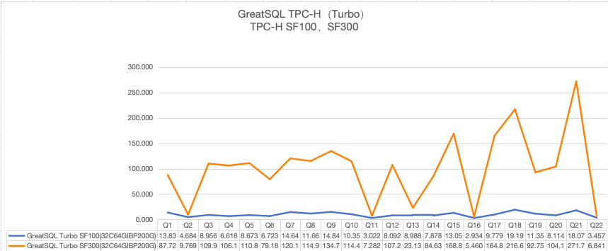

# 高性能Turbo引擎

## Turbo简述

Turbo是一个以插件形式存在的高性能的并行查询执行引擎，通过内嵌DuckDB，使GreatSQL具备多线程并发的向量化查询功能，在大大加速SQL查询速度的同时，保持对GreatSQL生态系统的兼容性。

相较于Rapid，Turbo不需要将数据加载到引擎中，而是在查询过程中，由GreatSQL并行抽取数据供Turbo引擎使用。

Turbo引擎采用插件（Plugin）方式嵌入GreatSQL中，可以在线动态安装或卸载。

在32C64G测试机环境下，TPC-H SF100测试中22条SQL总耗时214秒左右，下图展示了Turbo在SF100、SF300两种数据量下的测试结果，仅供参考：



备注：上述测试使用的是Turbo并发线程数不限的版本。

## 启用Turbo引擎

想要使用Turbo引擎，需要安装Turbo plugin：

```sql
INSTALL PLUGIN turbo SONAME 'turbo.so';
```

查看插件信息：

```sql
SHOW PLUGINS;
```

```shell{8}
+----------------------------------+----------+--------------------+----------------------+---------+
| Name                             | Status   | Type               | Library              | License |
+----------------------------------+----------+--------------------+----------------------+---------+
| binlog                           | ACTIVE   | STORAGE ENGINE     | NULL                 | GPL     |
...
| clone                            | ACTIVE   | CLONE              | mysql_clone.so       | GPL     |
| group_replication                | ACTIVE   | GROUP REPLICATION  | group_replication.so | GPL     |
| turbo                            | ACTIVE   | QUERY PLAN         | turbo.so             | GPL     |
+----------------------------------+----------+--------------------+----------------------+---------+
```

可以看到，Turbo引擎已经安装成功。

## 卸载Turbo引擎

执行下面的SQL命令卸载Turbo引擎：

```sql
UNINSTALL PLUGIN turbo;
```

卸载过程中，如果当前存在使用Turbo执行的未结束的查询，那么就需要等待执行结束完成后才能将插件完全卸载。

## 使用Turbo引擎

安装Turbo引擎后，通过下面介绍的方式，即可使用Turbo引擎提升查询效率。

参数 `turbo_enable` 是使用Turbo引擎的总控制开关，有三个可选值：[OFF, ON, FORCED]（对应值是 [0, 1, 2]）， 默认值是 OFF，可以有两种方式使用Trubo引擎：

**方式一**

1.先设置 `turbo_enable=ON`，为保证查询语句能够使用Turbo引擎;

2.再设置 `turbo_cost_threshold=0` 或一个较小的阈值。

其中配置参数 `turbo_cost_threshold` 指使用Turbo引擎执行查询的代价阈值。当前查询的代价小于等于此阈值，则不会使用Turbo引擎，这种情况下可通过调小阈值，使当前查询代价大于此阈值，即可使用Turbo引擎。若不调小 `turbo_cost_threshold` 阈值，则可通过下面的 **方式二**，强制使用Turbo引擎。

示例：
```sql
SET turbo_enable=ON;
SET turbo_cost_threshold=0;
```

```sql
EXPLAIN FORMAT=TREe SELECT /*+ SET_VAR(turbo_enable=ON) SET_VAR(turbo_cost_threshold=0) */ * FROM t1;
```

查询计划显示中带有 *Turbo scan* 关键字，则说明语句使用了Turbo引擎，如下：

```shell
+---------------------------------------------------------------------------+
| EXPLAIN                                                                   |
+---------------------------------------------------------------------------+
| -> Turbo scan
    -> Table scan on t1, column(c1,c2)  (cost=0.1, row=1)
+---------------------------------------------------------------------------+
```

**方式二**

1.修改会话变量，设置强制使用Turbo引擎。

2.执行SQL查询时指定HINT以使用Turbo引擎。

示例1：
```sql
SET turbo_enable=FORCED;
```

示例2：
```sql
SELECT /*+ SET_VAR(turbo_enable=FORCED) */ * FROM t1;
```

上述两种方式的差别主要在报错信息上，对于不能使用Turbo引擎的SQL语句（例如查询含有某些不支持的函数）的情况，如果使用方式一，那么会直接使用主引擎（如 InnoDB 引擎）完成查询，可通过查看计划来判断是否使用了Turbo引擎； 对于方式二，则总是强制使用Turbo引擎，但如果无法使用时，则会产生报错，具体报错信息见下例：

```sql
CREATE TABLE t1(c1 INT, c2 VARCHAR(10));
INSERT INTO t1 VALUES(1, 'Turbo');
```

由于目前不支持带参数的`RAND()`函数，查询会报错，如下：

```sql
SELECT /*+ SET_VAR(turbo_enable=FORCED) */ RAND(c1) FROM t1;
```

```shell
ERROR 8700 (HY000): turbo_enable is FORCED but query could not be executed in Turbo.
```

使用第一种方式，发现不支持的情况，则会直接使用主引擎进行查询，如下：

```sql
EXPLAIN FORMAT=TREE SELECT /*+ SET_VAR(turbo_enable=ON) SET_VAR(turbo_cost_threshold=0) */ RAND(c1) FROM t1;
```

```shell
+------------------------------------------+
| EXPLAIN                                  |
+------------------------------------------+
| -> Table scan on t1  (cost=0.35 rows=1)
+------------------------------------------+
```

对于上述查询，可通过打开配置参数 `turbo_enable_warning=ON`，然后执行`SHOW WARNINGS`查看详细的不支持的原因。

## Turbo引擎使用说明

### 语句支持类型描述

查询类型上，仅支持常规`SELECT`查询和`INSERT SELECT`，不支持`UPDATE/DELETE/ALTER`等。

#### SELECT查询

支持常规查询，不支持以下形式：

* SELECT ... INTO ...;

* SELECT locking语句（... INTO ...FOR UPDATE）;

* 不支持SELECT ... FETCH ... WITH TIES;

#### INSERT SELECT

不支持INSERT ... SELECT ... ON DUPLICATE KEY UPDATE语句。

### SELECT查询支持限制描述

针对常规的`SELECT`查询，有以下限制：

#### 多执行引擎并存限制

Turbo引擎不能与其他任何SECONDARY ENGINE共存（如Rapid引擎），同一时间只能使用一个。

如果已安装Turbo引擎，再安装Rapid引擎时会发出报错：

```sql
INSTALL PLUGIN rapid SONAME 'ha_rapid.so';
ERROR 3877 (HY000): rapid or turbo Plugins can't be installed at the same time
```

#### 执行计划支持限制

不支持CONST执行计划和不涉及到表扫描的执行计划。

```sql
CREATE TABLE t1 (c1 INT PRIMARY KEY, c2 INT);
INSERT INTO t1 VALUES (1, 1), (4, 2);
```

1.CONST执行计划，如主键列等值过滤

```shell
EXPLAIN FORMAT=TREE SELECT * FROM t1 WHERE c1=4;
+-------------------------------------------------------------+
| EXPLAIN                                                     |
+-------------------------------------------------------------+
| -> Rows fetched before execution  (cost=0.00..0.00 rows=1)  |
+-------------------------------------------------------------+
```

2.不涉及到表扫描的计划

```shell
EXPLAIN FORMAT=TREE SELECT * FROM t1 WHERE c1 is NULL;
+------------------------------------------------------------+
| EXPLAIN                                                    |
+------------------------------------------------------------+
| -> Zero rows (Impossible WHERE)  (cost=0.00..0.00 rows=0)  |
+------------------------------------------------------------+
```

#### 表支持限制

1.为了保证查询效率，一条查询语句中使用表个数不能超过20个。

2.查询语句中用到的表，仅支持InnoDB基本表和InnoDB分区表，不支持查询中包含系统表、视图（VIEW）、递归CTE、TABLE_FUNCTION，以及用户创建的临时表。

#### 列支持限制

1.不支持生成列/虚拟列（Generated Columns）。

2.不支持的列类型有：BIT、DECIMAL类型(总长度超过38或者为UNSIGNED)、UDT、ENUM、SET、SPATIAL DATATYPE、JSON、BLOB、TEXT。

#### 列字符集限制

1.要求所有列字符集为utf8mb4、Accent sensitive(as)、ci/cs。

2.不支持binary、koi8r、ucs2。

3.不支持pad space类型的字符集。

#### 函数及表达式支持说明

1.Turbo引擎支持的所有函数及操作符参考：[支持的函数及操作符](./5-1-highperf-ap-supported-functions.md)。

2.不支持的函数类型有：`BIT_AND`, `BIT_XOR`, `BIT_OR`, `WM_CONCAT`, `LISTAGG`, `GROUP_CONCAT`。

3.Window函数基础形式已经全面支持，但有以下几种形式目前尚不支持：

* Window函数不支持DISTINCT，不支持Window函数嵌套；

* 当 `windowing_use_high_precision=OFF` 的时候，聚集函数仅支持`MIN()`和`MAX()`；

* Window函数不支持KEEP语句，例句如下：

```sql
SELECT deptno,
      MAX(sal) KEEP(dense_rank FIRST ORDER BY sal) first_max,
      MAX(sal) KEEP(dense_rank LAST ORDER BY sal) last_max
FROM emp
GROUP BY deptno;
```

4.聚集函数：不支持的类型有`JSON_OBJECTAGG`, `JSON_ARRAYAGG`, `RATIO_TO_REPORT`, `ST_COLLECT()`及用户自定义函数。

5.不支持`ROW()`函数：`SELECT ROW(1, 'lilei', 25) AS person`。

6.不支持`ORDER BY @var`，其中 @var 是临时变量。这种用法将无法走Turbo引擎，但不会报告语法错误。

7.常量表达式中不支持`NAME_CONST()`函数，例如：`NAME_CONST('flag', 1)`。

8.不支持两个时间类字段的加减乘除（允许与常量加减），例如：`SELECT TO_DATE(f1, 'YYYY-MM-DD') - TO_DATE(f2,'YYYY-MM-DD') FROM t1;`。

9.不支持时间类函数`CAST(timestamp as bool)`，例如：`SELECT ...FROM ...WHERE DATE '1998-12-01' - INTERVAL '90' DAY;`。

10.不支持Oracle函数兼容行为。

11.不支持多列IN子查询，如下例所示

```sql
greatql> SELECT * FROM t1 WHERE (s1,s2) IN (SELECT s1,MAX(s1) FROM t2...);  
```

这种用法将无法走Turbo引擎，但不会报告语法错误。

#### 其他使用限制说明

1.时区不支持设置成含有夏令时的时区写法。

2.针对`PREPARE`和存储过程语句，需要开启 `turbo_enable_ps_and_sp` 参数，该参数默认为ON，可以根据需要关闭。

3.客户端协议类型为`Protocol::PROTOCOL_PLUGIN`时不支持。

4.开启强制访问控制的情况不支持，即当 `start_with_mandatory_access_control=ON` 时不支持。

5.开启 `sql_auto_is_null` 时不支持。`sql_auto_is_null` 是GreatSQL中的一个用于开启或关闭空值检测的参数。当参数值为ON时，空值检测被开启；当为OFF时，空值检测被关闭。此参数的设定值是全局的，可以控制SQL语句中对空值的检测是否被系统执行，设定值可在GreatSQL的配置文件中做出变更。

6.不支持设置 `max_join_size`。参数 `max_join_size` 是用来限制`SELECT`语句中JOIN操作的最大返回数据量。当JOIN操作返回的数据量超该参数设置的值时，GreatSQL会抛出错误，防止内存或者磁盘空间不足。如果设置了该参数，可能会出现语句不能正常报错的现象。

7.结果集顺序可能和查询主引擎存在差异。注意：Turbo内部会打乱行的顺序，因此对于不带`ORDER BY`的语句（尤其是`LIMIT`语句），其执行结果、执行结果的顺序可能和原生结果不同。这时候要根据实际SQL语句判定执行结果是否正确。

### EXPLAIN语句使用限制

`EXPLAIN FORMAT=TREE`和`EXPLAIN ANALYZE`操作的执行计划结果中包含Turbo关键字，而`EXPLAIN`操作仍显示为主引擎的计划信息。

EXPLAIN结果中显示的COST与原生EXPLAIN结果中的COST无关，不能作为不同查询方式COST值进行比较的依据，不具参考价值。

### 数据类型支持

数据支持精度范围有限制：

1.DATE：不支持不合法的日期，例如"0000-00-00"。month取值范围为[1, 12]，day取值范围为[1, 31]，day的取值范围上限视月份而定。

2.TIME：不支持负数范围的时间，不支持大于24:00:00.000000的时间。仅支持[00:00:00.000000, 24:00:00.000000]范围内的合法时间。不支持四舍五入的比较方式，会默认比较全部的6位小数部分。不受限制于字段的定义。

3.DATETIME/TIMESTAMP：其中的DATE部分，支持限制同上述的DATE类型；其中的TIME部分，支持限制同上述的TIME类型。

4.数值常量也只能支持在数据的精度范围内，例如：`id < -9223372036854775808`。

### 类型隐式转换

1.数据类型仅支持严格模式下的数据，非严格模式下的时间等类型均不支持。

2.字符串转换成数值类型，原生模式下如果出现Warnings将都不支持，例如：

```sql
greatsql> SELECT d FROM t1 WHERE d > 'A'; -- d列为DOUBLE类型
ERROR 1815 (HY000): Internal error: Conversion Error: Could not convert string 'A' to DOUBLE
```

3.常量数值转换成时间类型均不支持，例如：

```sql
greatsql> SELECT * FROM t1 WHERE t <> 20380119061407; -- t列为DATETIME类型
ERROR 8700 (HY000): execute turbo query failed: Conversion Error: Unimplemented type for cast (BIGINT -> TIMESTAMP)
```

4.YEAR 类型，负数字符串转换失败，例如：

```sql
greatsql> SELECT * FROM t1 WHERE t > '-1'; -- t列为YEAR类型
ERROR 8700 (HY000): execute turbo query failed: Conversion Error: Could not convert string '-1' to UINT16
```

### 慢日志使用限制

在开启慢日志之后，可以根据 `long_query_time` 的设置来确定Turbo执行的语句哪些为慢语句，同GreatSQL查询。

但是由于目前Turbo没有记录表扫描行数，所以当设置 `min_examined_row_limit` 值大于0时，就无法记录慢查询SQL请求了。

## 运维管理

### 新增插件参数

| System Variable Name | Variable Scope |  Dynamic Variable | Permitted Values | Type | Default | Description |
| --- | --- | --- | --- | --- | --- | --- |
|turbo_enable|Session|YES|[ON/OFF/FORCED]|ENUM|OFF|当前会话是否启用Turbo查询|
|turbo_compat_func|Session|YES|[ON/OFF]|Boolean|ON|Turbo中是否使用GreatSQL兼容项的函数，使用的话，可以支持更多的GreatSQL函数，但是性能有影响|
|turbo_enable_ps_and_sp|Session|YES|[ON/OFF]|Boolean|ON|Turbo允许运行在存储过程或者预处理语句中 |
|turbo_enable_warning|Session|YES|[ON/OFF]|Boolean|OFF|是否抛出内部的错误信息|
|turbo_max_temp_directory_size|Global|YES|[0, 549755813888]|ULONGLONG|1073741824|Turbo最大可使用的临时表空间大小|
|turbo_memory_limit|Global|YES|[67108864, 549755813888]|ULONGLONG|268435456|Turbo使用的内存最大上限|
|turbo_release_retries|Global|YES|[0, ULONG_MAX]|ULONG|600|卸载插件重试等待时间（ms)|
|turbo_retry_pause|Global|YES|[100, 31536000]|ULONG|1000|卸载插件重试次数|
|turbo_temp_directory|Global|NO|[100, 31536000]|String|duckdb_dp.data.tmp|临时目录名称，当启用Turbo引擎后，不支持修改；启用之前，可修改|
|turbo_worker_threads|Global|YES|[1, 512]|UINT|8|Turbo执行计划可以使用的线程总数|
|turbo_condition_pushdown|Session|YES|[ON/OFF]|Boolean|OFF|Turbo执行计划是否启用条件下推|
|turbo_cost_threshold|Session|YES|[0, DBL_MAX]|Double|100000.000000|使用Turbo执行查询的代价阈值|

InnoDB相关参数：

| System Variable Name | Variable Scope |  Dynamic Variable | Permitted Values | Type | Default | Description |
| --- | --- | --- | --- | --- | --- | --- |
|innodb_parallel_read_threads|Global|YES|[1, 256]|ULONG|4|对于单个sql语句中的单个表，开启n个线程执行扫描|
|innodb_parallel_max_read_threads|Global|YES|[128, 2048]|ULONG|256|数据库范围内所有sql语句开启的并行读线程数最大值|

### 新增状态统计信息

Turbo执行状态统计信息，可通过执行如下语句查看：

```sql
SHOW GLOBAL STATUS LIKE 'turbo%';
```

| Status Name | Values | Description |
| --- | --- | --- |
|turbo_memory_used|0|正在执行中Turbo占用的内存|
|turbo_statements|0|使用Turbo 的会话，包括prepare|
|turbo_runtime|0|使用Turbo正在执行中的语句数量|
|turbo_release|OFF|插件是否在卸载中|

### 部分内存参数的使用说明

相较于Rapid存储引擎，Turbo作为并行执行引擎，其并不做数据存储。使用Turbo时，GreatSQL并行抽取数据供Turbo执行并行计算，通过将数据加载到内存来提高并行计算性能。因此执行部分SQL查询时可能遇到报告内存不足的错误。如果出现这种情况，可以调整如下几个参数，尝试解决问题。

* 增加 `turbo_memory_limit`，在任何时候，增加Turbo引擎可使用的内存都是首选方案。

* 如果SQL查询的执行计划比较复杂（如大数据量 + 多重HASH JOIN + 多重agg），可尝试适当调低 `turbo_worker_threads`。

当数据量较大，但 `turbo_memory_limit` 设置较小时，可能导致SQL查询请求无法完成，并抛出Out of Memory Error.

### 执行计划

查看查询是否使用了Turbo引擎，可通过 `EXPLAIN FORMAT=TREE` 显示是否有Turbo关键字。

```sql
greatsql> EXPLAIN FORMAT=TREE SELECT * FROM t1;
+---------------------------------------------------------------------------+
| EXPLAIN                                                                   |
+---------------------------------------------------------------------------+
| -> Turbo scan
    -> Table scan on t1, column(c1,c2)  (cost=0.1, row=1)
+---------------------------------------------------------------------------+
```

Turbo支持 `EXPLAIN ANALYZE` 用法。

```shell
greatsql> EXPLAIN ANALYZE SELECT * FROM t1;
+-----------------------------------------------------------------------------------------------------+
| EXPLAIN                                                                                             |
+-----------------------------------------------------------------------------------------------------+
| -> Turbo scan
    -> Table scan on t1, column(c1,c2)  (cost=0.1, row=1) (actual time=109.298 rows=1 loops=1)
+-----------------------------------------------------------------------------------------------------+
```

## 注意事项

* 当前Turbo引擎的动态库文件仅支持运行在X86/ARM架构下的CentOS 7/8系统，或对应glibc版本分别是2.17和2.28，其他环境暂不支持。

* 由于并行计算、分组处理等操作的差异，在使用GreatSQL与Turbo计算时，如果不加相同的排序规则，则读取到的数据顺序可能不一致。

* 同一台服务器，多个不同GreatSQL实例共存时，需要为对应的Turbo执行引擎设置不同的临时文件目录( `turbo_temp_directory` )，避免交叉使用问题。


**扫码关注微信公众号**


