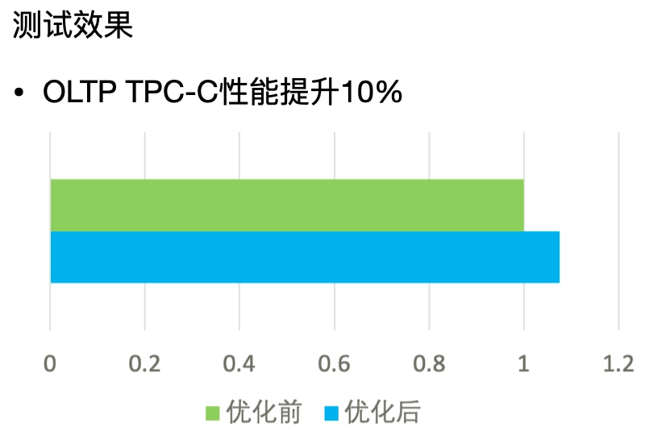

# GreatSQL高性能
---

GreatSQL高性能方面的主要提升有以下几点：

1. 支持类似MySQL HeatWave的大规模并行、高性能的内存查询加速AP引擎，可将GreatSQL的数据分析性能提升几个数量级。在32C64G测试机环境下，TPC-H 100G测试中22条SQL总耗时仅需不到80秒。更详细内容参考：[Rapid引擎]()。

1. 支持InnoDB并行查询，适用于轻量级OLAP应用场景，在TPC-H测试中平均提升15倍，最高提升40+倍。更详细内容参考：[InnoDB并行查询](5-1-highperf-innodb-pq.md)。

1. 优化InnoDB事务系统，实现了大锁拆分及无锁化等多种优化方案，OLTP场景整体性能提升约20%。

在MySQL社区版本实现中，使用了红黑树结构实现了事务ID到事务对象的快速映射关系。但是该数据结构在高并发应用场景中，大量的锁竞争会造成事务处理的瓶颈。

在GreatSQL中采用全新的无锁哈希结构，显著减少了锁的临界区消耗，提升事务处理的能力至少10%以上。

1. 支持并行`LOAD DATA`，适用于频繁导入大批量数据的应用场景，性能可提升约20+倍。更详细内容参考：[并行load data](5-1-highperf-parallel-load.md)。

1. 支持异步删除InnoDB大表，提高InnoDB引擎运行时性能的稳定性。更详细内容参考：[异步删除InnoDB大表](5-1-highperf-async-purge-big-table.md)。

1. 支持NUMA调度优化，通过将线程分类以及绑定CPU核心等方式，减少跨NUMA的访问，提升GreatSQL运行时性能的稳定性。更详细内容参考：[NUMA调度优化](5-1-highperf-numa-affinity.md)。

1. 支持线程池（thread pool），降低了线程创建和销毁的代价，保证高并发下，性能稳定不会明显衰退。

MySQL社区版的连接处理方法默认是为每个连接创建一个工作线程的one-thread-per-connection模式。这种模式下，由于系统的资源是有限的，随着连接数的增加，资源的竞争也增加，连接的响应时间也随之增加。对于数据库整体吞吐而言，则是在资源未耗尽时随着连接数增加，一旦连接数超过了某个耗尽系统资源的临界点，数据库整体吞吐就会随着各连接的资源争抢而下降。

在GreatSQL中采用线程池方案可以避免在连接数暴增时，因资源竞争而导致系统吞吐下降的问题。

线程池的基本原理为：预先创建一定数量的工作线程（worker线程）。在线程池监听线程（listener线程）从现有连接中监听到新请求时，从工作线程中分配一个线程来提供服务。工作线程在服务结束之后不销毁线程，而是保留在线程池中继续等待下一个请求来临。

以上内容引用自：[线程池详解 - 鹅厂架构师](https://zhuanlan.zhihu.com/p/425570523)。

**问题反馈**
---
- [问题反馈 gitee](https://gitee.com/GreatSQL/GreatSQL-Manual/issues)

**联系我们**
---

扫码关注微信公众号

