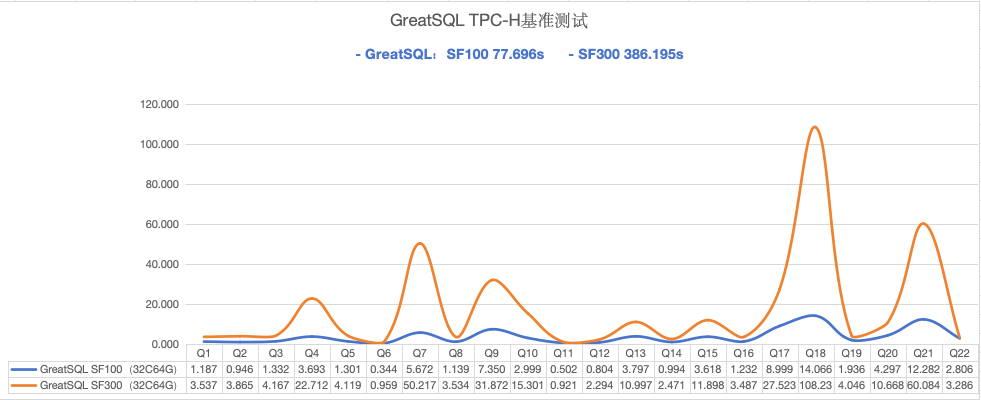
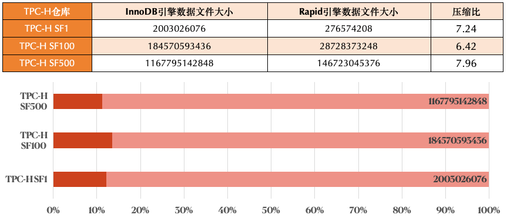

# GreatSQL 高性能
---

相对 MySQL 及 Percona Server For MySQL 的性能表现更稳定优异，支持 Rapid 引擎、事务无锁化、并行LOAD DATA、异步删除大表、线程池、非阻塞式DDL、NUMA 亲和调度优化 等特性，在 TPC-C 测试中相对 MySQL 性能提升超过 30%，在 TPC-H 测试中的性能表现是 MySQL 的十几倍甚至上百倍。

- 支持 [大规模并行、基于内存查询、高压缩比的高性能 Rapid 引擎](./5-1-highperf-rapid-engine.md)，可将数据分析性能提升几个数量级。在 32C64G 测试机环境下，TPC-H SF100 测试中 22 条 SQL 总耗时仅需不到80秒。并且针对 TPC-H 测试数据的压缩比平均可达到 7 倍多。

- 优化 InnoDB 事务系统，实现了大锁拆分及无锁化等多种优化方案，OLTP 场景整体性能提升约 20%。

在 MySQL 中使用了红黑树结构实现了事务ID到事务对象的快速映射关系。但是该数据结构在高并发应用场景中，大量的锁竞争会造成事务处理的瓶颈。

在 GreatSQL 中采用全新的无锁哈希结构，显著减少了锁的临界区消耗，提升事务处理的能力至少 10% 以上。

- 支持 [并行LOAD DATA](./5-1-highperf-parallel-load.md)，适用于频繁导入大批量数据的应用场景，性能可提升约20+倍；对于无显式定义主键的场景亦有优化提升。

- 支持 [异步删除大表](./5-1-highperf-async-purge-big-table.md)，提高InnoDB引擎运行时性能的稳定性。

- 支持 [线程池](./5-1-highperf-thread-pool.md)，降低了线程创建和销毁的代价，保证高并发下，性能稳定不会明显衰退。

- 支持 [非阻塞式 DDL](./5-1-highperf-nonblocking-ddl.md)，可以避免数据库因为必须尽快完成 DDL 操作而导致业务请求大量被阻塞的问题。

- 支持 [NUMA 亲和性优化](./5-1-highperf-numa-affinity.md)，通过 NUMA 亲和性调度优化，将前端用户线程和后台线程绑定到固定 NUMA 节点上以提升线程处理性能。

**扫码关注微信公众号**

