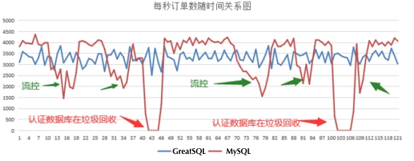

# MGR 全新流控算法
---

## 简介

原生MGR流控算法有较大缺陷，触发流控阈值后，会有短暂的流控停顿动作，之后继续放行事务，这可能会造成反复多次1秒的性能抖动，且没有真正起到持续流控的作用。

在GreatSQL中不再使用原生的利用机制，而是优化了流控算法。除了评估认证数据库队列大小因素，同时也评估大事务处理和主从节点的同步等多项因素，流控粒度更细致，不再出现原生MGR中每1秒小抖动问题。

优化后再启用流控，事务性能更平稳，没有特别大的起伏波动。优化前后效果如下图所示：


当系统参数 `group_replication_flow_control_mode` 设置为 **DISABLED** 时，表示关闭流控。当设置为 **QUOTA** 时，将开启流控并采用新的流控机制。

## 新增系统参数

新增选项 `group_replication_flow_control_replay_lag_behind` 用于控制MGR主从节点复制延迟阈值，当MGR主从节点因为大事务等原因延迟超过阈值时，就会触发流控机制。

| System Variable Name  | group_replication_flow_control_replay_lag_behind |
| --- | --- |
| Variable Scope        | global |
| Dynamic Variable      | YES |
| Type | Integer |
| Permitted Values |    [0, 86400] |
| Default       | 600 |
| Description   | 单位：秒。<br/>用于控制MGR主从节点复制延迟阈值，当MGR主从节点因为大事务等原因延迟超过阈值时，就会触发流控机制 |

该选项默认为600，可在线动态修改，例如：
```sql
SET GLOBAL group_replication_flow_control_replay_lag_behind=600;
```
正常情况下，该参数无需调整，使用默认值即可。

在GreatSQL的global status中，还新增了两个状态参数：
- `group_replication_flow_control_count`，表示流控被触发的累积次数。
- `group_replication_flow_control_time`，表示流控触发后累积等待时长（单位：微秒）。

根据这两个指标项，可以判断MGR流控的影响有多大。也可以通过监控某个时段内指标发生的变化，判断这段时间内的事务提交是否受到流控的影响。

## 注意事项

1. 在GreatSQL中，启用新的流控机制后（`group_replication_flow_control_mode=QUOTA`），只有 `group_replication_flow_control_replay_lag_behind` 参数有作用。原先关于流控的几个选项 `group_replication_flow_control*` 等都不再起作用，虽然仍可查看和修改。

2. 在 Percona 8.0.30 中对选项 `group_replication_flow_control_mode` 新增可选值**MAJORITY**，但并不起实质作用，和设置为**DISABLED**效果一样。


**扫码关注微信公众号**


