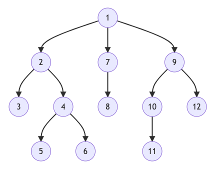

# Oracle兼容-语法-分层查询（Hierarchical Query）
---


GreatSQL支持分层查询（Hierarchical Query）。


## 1. 语法

```sql
{ CONNECT BY [ NOCYCLE ] condition [ START WITH condition ]
| START WITH condition CONNECT BY [ NOCYCLE ] condition
}
```

## 2. 定义和用法

- 1. 分层查询简介

为了查找父行的子行，需要计算父行的 `CONNECT BY` 条件的 `PRIOR` 表达式和表中每一行的另一个表达式。条件为真的行是父项的子项。`CONNECT BY` 条件可以包含其他条件以进一步过滤查询选择的行。

如果 `CONNECT BY` 条件导致层次结构中出现循环，则会返回错误。如果一行既是另一行的父项（或祖父项或直系祖先）又是子项（或孙项或直系后代），则会导致循环。

- 2. 对分层查询的处理方式如下：
  - 1.) 如果存在连接，首先会被评估，无论连接是在FROM子句中还是在WHERE子句中指定。
  - 2.) CONNECT BY条件被评估。
  - 3.) 任何剩余的WHERE子句谓语都被评估。

- 3. 对于分成查询的处理顺序为：
  - 1.) 选择层次结构的根行——那些满足 START WITH 条件的行。
  - 2.) 选择每个根行的子行。每个子行都必须满足与根行之一相关的 CONNECT BY 条件。
  - 3.) 择连续几代的子行。 选择在步骤 2 中返回的行的子项，然后是这些子项的子项，依此类推。
  - 4.) 如果查询包含没有连接的 WHERE 子句，那么会从层次结构中删除所有不满足 WHERE 子句条件的行。
  - 5.) 根据先序排列信息返回结果


示例：



## 3. Oracle兼容说明

- 1、查询表输出结果的排序和Oracle可能不一致
     
由于在遍历查询表数据方式与Oracle不一致，导致 `CONNECT BY` 单一层次内数据排序结果不一致。

```sql
-- 初始化测试表及数据
greatsql> CREATE TABLE student(
id INT NOT NULL,
name VARCHAR2(20) NOT NULL,
grade INT NOT NULL
);

-- 案例1：测试数据顺序写入
-- 顺序插入四条记录（id值顺序：1,2,3,4）
greatsql> INSERT INTO student VALUES (1, 'John', -1);
greatsql> INSERT INTO student VALUES (2, 'Paul', 1);
greatsql> INSERT INTO student VALUES (3, 'Nancy', 1);
greatsql> INSERT INTO student VALUES (4, 'Sarah', 2);

greatsql> SELECT * FROM student;
+------+-------+-------+
| id   | name  | grade |
+------+-------+-------+
|    1 | John  |    -1 |
|    2 | Paul  |     1 |
|    3 | Nancy |     1 |
|    4 | Sarah |     2 |
+------+-------+-------+

-- 此种情况下，GreatSQL和Oracle查询结果数据顺序一致
greatsql> SELECT id, name, grade, LEVEL FROM student CONNECT BY PRIOR id = grade;
+------+-------+-------+-------+
| id   | name  | grade | LEVEL |
+------+-------+-------+-------+
|    1 | John  |    -1 |     1 |
|    2 | Paul  |     1 |     2 |
|    4 | Sarah |     2 |     3 |
|    3 | Nancy |     1 |     2 |
|    2 | Paul  |     1 |     1 |
|    4 | Sarah |     2 |     2 |
|    3 | Nancy |     1 |     1 |
|    4 | Sarah |     2 |     1 |
+------+-------+-------+-------+
8 rows in set (0.00 sec)

-- 在Oracle中查询得到的结果如下，二者一致（建表和写入数据过程略过）
SQL> SELECT id, name, grade, LEVEL FROM student CONNECT BY PRIOR id = grade;

        ID NAME                      GRADE      LEVEL
---------- -------------------- ---------- ----------
         1 John                         -1          1
         2 Paul                          1          2
         4 Sarah                         2          3
         3 Nancy                         1          2
         2 Paul                          1          1
         4 Sarah                         2          2
         3 Nancy                         1          1
         4 Sarah                         2          1

8 rows selected.

-- 案例2：测试数据乱序写入
-- 清空表，调整数据写入顺序（id值顺序：3,4,1,2）
greatsql> TRUNCATE TABLE student;

greatsql> INSERT INTO student VALUES (3, 'Nancy', 1);
greatsql> INSERT INTO student VALUES (4, 'Sarah', 2);
greatsql> INSERT INTO student VALUES (1, 'John', -1);
greatsql> INSERT INTO student VALUES (2, 'Paul', 1);

greatsql> SELECT * FROM student;
+------+-------+-------+
| id   | name  | grade |
+------+-------+-------+
|    3 | Nancy |     1 |
|    4 | Sarah |     2 |
|    1 | John  |    -1 |
|    2 | Paul  |     1 |
+------+-------+-------+
4 rows in set (0.00 sec)

-- 此种情况下，GreatSQL和Oracle查询结果数据顺序不一致
greatsql> SELECT id, name, grade, LEVEL FROM student CONNECT BY PRIOR id = grade;
+------+-------+-------+-------+
| id   | name  | grade | LEVEL |
+------+-------+-------+-------+
|    3 | Nancy |     1 |     1 |
|    4 | Sarah |     2 |     1 |
|    1 | John  |    -1 |     1 |
|    3 | Nancy |     1 |     2 |
|    2 | Paul  |     1 |     2 |
|    4 | Sarah |     2 |     3 |
|    2 | Paul  |     1 |     1 |
|    4 | Sarah |     2 |     2 |
+------+-------+-------+-------+
8 rows in set (0.00 sec)

-- 在Oracle中查询得到的结果如下，二者不一致（建表和写入数据过程略过）
SQL> SELECT id, name, grade, LEVEL FROM student CONNECT BY PRIOR id = grade;

        ID NAME                      GRADE      LEVEL
---------- -------------------- ---------- ----------
         1 John                         -1          1
         3 Nancy                         1          2
         2 Paul                          1          2
         4 Sarah                         2          3
         3 Nancy                         1          1
         2 Paul                          1          1
         4 Sarah                         2          2
         4 Sarah                         2          1

8 rows selected.
```

可以看到，由于第一个层级查询结果排序不一致，导致分层查询的结果顺序不一致。
    
- 2、与 `LISTAGG` 结合使用输出组合顺序时，`LISTAGG` 的实现依赖 `ORDER BY`，因此在内部查询的时候会根据 `GROUP BY` 进行排序。
    
- 3、在 `ORACLE` 模式下，`SYSDATE` 的行为与Oralce一致，在 `DEFAULT` 模式下，循环查询可能导致错误。
    
- 4、与上一条类似，在自定义PACKAGE与FUNCTION中可能存在定义包含 `DETERMINISTIC` 的情况，也可能存在导致循环检查失效问题。
    
- 5、当 `CONNECT BY` 中存在永真的条件时，不管是否使用了 `PRIOR` 或 `CONNECT_BY_ROOT` 的条件，会报告死循环错误。
    
- 6、数据表中可能含有特殊的数据会产生死循环，或者单次遍历的子节点非常多，会根据 `cte_max_recursion_depth` 选项限制迭代数据大小。

- 7、与 `ROWNUM` 伪列结合使用的时候，`ROWNUM` 在 `WHERE` 中作为查询条件结果会产生差异，如下例所示：
     
与Oracle区别：`ROWNUM` 的值会根据在 `CONNECT BY` 排序后的结果保存，而不重新计算。

  - 示例1：

```sql
greatsql> SELECT LEVEL, ROWNUM FROM DUAL WHERE ROWNUM < 3 AND LEVEL = 2 CONNECT BY LEVEL <= 10;
+-------+--------+
| LEVEL | rownum |
+-------+--------+
|     2 |      2 |
+-------+--------+

-- 在Oracle中的执行结果如下
SQL> SELECT LEVEL, ROWNUM FROM DUAL WHERE ROWNUM < 3 AND LEVEL = 2 CONNECT BY LEVEL <= 10;

     LEVEL     ROWNUM
---------- ----------
         2          1
```

  - 示例2

```sql
greatsql> SELECT LEVEL, SYS_CONNECT_BY_PATH(ROWNUM, '->') FROM DUAL WHERE
 ROWNUM < 3 AND LEVEL = 2
 CONNECT BY LEVEL <= 10;
+-------+-----------------------------------+
| LEVEL | SYS_CONNECT_BY_PATH(ROWNUM, '->') |
+-------+-----------------------------------+
|     2 | ->1->2                            |
+-------+-----------------------------------+

-- 在Oracle中的执行结果如下
     LEVEL   SYS_CONNECT_BY_PATH(ROWNUM,'->')
----------  -------------------------------------
         2                                 ->1->1
```

- 8、在GreatSQL中，支持在 `CONNECT BY` 条件中含有 `BLOB` 列，而Oracle不支持。


## 3. 分层查询伪列

分层查询伪列（Hierarchical Query Pseudocolumns）

分层查询伪列仅在分层查询中有效，包括以下三个伪列。

### 3.1 分层查询伪列 `CONNECT_BY_ISCYCLE`

表示在分层查询中，当前数据是否会导致形成循环。即根据层次关系，当前层数据是否存在其叶子节点也是其父节点。该列只有在同时指定 `NOCYCLE` 关键字时才有意义，当前数据会导致形成环则结果为1，否则为0。

### 3.2 分层查询伪列 `CONNECT_BY_ISLEAF`

表示在分层查询中，当前数据是否是分层查询形成的树结构中的叶子节点。若是叶子节点值为1，否则为0。此信息指示是否可以进一步扩展给定行以显示更多层次结构。

### 3.3 分层查询伪列 `LEVEL`

表示在分层查询中，形成的树结构中的当前层数。该列值一直从1开始，即 `START WITH` 对应的数据的层数一直为1，之后子孙节点的LEVEL值依次递增。

下图显示了倒置树的节点及其LEVEL值：


## 4. 分层查询操作符  

GreatSQL提供如下两个标识符，可用于指定层次关系中的某个节点属性。

### 4.1 分层查询操作符 `PRIOR`

在分层查询中，`CONNECT BY` 条件中的一个表达式必须由 `PRIOR` 运算符限定。可以有多个 `PRIOR` 条件，但只有一个条件需要 `PRIOR` 运算符。`PRIOR` 操作符之后的参数将作为分层查询中的父节点。`PRIOR` 计算层次查询中当前行的父行的紧跟在后面的表达式。

`PRIOR` 使用列中父行的值。

`PRIOR` 最常用于使用相等运算符比较列值，`PRIOR` 关键字可以位于运算符的任一侧。

理论上，`CONNECT BY` 子句中可以使用等号 `=` 以外的运算符，但是其他运算符创建的条件可能会导致可能的组合出现无限循环。

### 4.2 分层查询操作符 `CONNECT_BY_ROOT`

`CONNECT_BY_ROOT` 是一元运算符，仅在分层查询中有效。当使用此运算符限定列时，将使用根行中的数据返回列值。

**注意：**

1. 只支持基础数据类型，不支持JSON、GEO等特殊的数据类型。

2. 参数不可以是虚拟列、层次查询函数、操作符、伪列及子查询。

3. 两个操作符 `PRIOR` 和 `CONNECT_BY_ROOT` 都不能在 `START WITH` 子句中使用。


## 5. 分层查询函数 `SYS_CONNECT_BY_PATH()`

### 5.1 语法

```sql
SYS_CONNECT_BY_PATH(column_name, DELIMITER)
```

其中 `DELIMITER` 表示分隔符。该函数将获取从根节点到当前节点的路径上所有节点名为column_name的值，中间用DELIMITER进行分隔开。`SYS_CONNECT_BY_PATH()`不能在 `CONNECT BY`、`START WITH` 和 `GROUP BY` 等几个子句中使用。

### 5.2 定义和用法

`SYS_CONNECT_BY_PATH()` 函数主要用于 **树查询(层次查询)** 以及 **多列转行**。

`SYS_CONNECT_BY_PATH()` 仅在分层查询中有效，它返回列值从根到节点的路径，对于 `CONNECT BY` 条件返回的每一行，列值由 `char` 分隔。

含有伪列的计算，并且存在 `WHERE` 过滤条件，`ROWNUM` 的值，根据在 `CONNECT BY` 排序后的结果将会保存，而不是重新计算，例如：

- GreatSQL运行结果：
```sql
greatsql> SELECT LEVEL, SYS_CONNECT_BY_PATH(ROWNUM, '->') FROM DUAL WHERE ROWNUM < 3 AND LEVEL=2 CONNECT BY LEVEL<=10;
+-------+--------+
| LEVEL | ROWNUM |
+-------+--------+
|     2 | ->1->2 |
+-------+--------+
```

- Oracle运行结果：
```sql
SQL> SELECT LEVEL, SYS_CONNECT_BY_PATH(ROWNUM, '->') FROM DUAL WHERE ROWNUM < 3 AND LEVEL=2 CONNECT BY LEVEL<=10;

     LEVEL    SYS_CONNECT_BY_PATH(ROWNUM,'->')
----------   ----------------------------------
         2                               ->1->1
```

## 6. 示例

初始化测试表及数据。

```sql
greatsql> CREATE TABLE student(
id INT NOT NULL,
name VARCHAR2(20) NOT NULL,
grade INT NOT NULL
);

greatsql> INSERT INTO student VALUES (1, 'John', -1), (2, 'Paul', 1), (3, 'Nancy', 1), (4, 'Sarah', 2);
```

几个示例。

```sql
greatsql> SELECT id, name, grade, LEVEL FROM student CONNECT BY PRIOR id = grade;
+------+-------+-------+-------+
| id   | name  | grade | LEVEL |
+------+-------+-------+-------+
|    1 | John  |    -1 |     1 |
|    2 | Paul  |     1 |     2 |
|    4 | Sarah |     2 |     3 |
|    3 | Nancy |     1 |     2 |
|    2 | Paul  |     1 |     1 |
|    4 | Sarah |     2 |     2 |
|    3 | Nancy |     1 |     1 |
|    4 | Sarah |     2 |     1 |
+------+-------+-------+-------+

greatsql> SELECT id, name, grade, PRIOR name FROM student CONNECT BY PRIOR id = grade;
+------+-------+-------+------------+
| id   | name  | grade | PRIOR name |
+------+-------+-------+------------+
|    1 | John  |    -1 | NULL       |
|    2 | Paul  |     1 | John       |
|    4 | Sarah |     2 | Paul       |
|    3 | Nancy |     1 | John       |
|    2 | Paul  |     1 | NULL       |
|    4 | Sarah |     2 | Paul       |
|    3 | Nancy |     1 | NULL       |
|    4 | Sarah |     2 | NULL       |
+------+-------+-------+------------+
8 rows in set (0.00 sec)

greatsql> SELECT id, CONNECT_BY_ROOT name FROM student CONNECT BY PRIOR id = grade;
+------+----------------------+
| id   | CONNECT_BY_ROOT name |
+------+----------------------+
|    1 | John                 |
|    2 | John                 |
|    4 | John                 |
|    3 | John                 |
|    2 | Paul                 |
|    4 | Paul                 |
|    3 | Nancy                |
|    4 | Sarah                |
+------+----------------------+
8 rows in set (0.01 sec)

-- 修改当前时间戳
greatsql> SET TIMESTAMP = 1;

greatsql> SELECT id, grade, NOW() FROM student CONNECT BY NOCYCLE PRIOR id = (grade + 1);
+------+-------+---------------------+
| id   | grade | NOW()               |
+------+-------+---------------------+
|    1 |    -1 | 1970-01-01 03:00:01 |
|    2 |     1 | 1970-01-01 03:00:01 |
|    3 |     1 | 1970-01-01 03:00:01 |
|    4 |     2 | 1970-01-01 03:00:01 |
|    3 |     1 | 1970-01-01 03:00:01 |
|    4 |     2 | 1970-01-01 03:00:01 |
|    4 |     2 | 1970-01-01 03:00:01 |
+------+-------+---------------------+
7 rows in set (0.00 sec)

greatsql> SELECT id, name, grade, CONNECT_BY_ISCYCLE FROM student CONNECT BY NOCYCLE PRIOR id = (grade + 1);
+------+-------+-------+--------------------+
| id   | name  | grade | CONNECT_BY_ISCYCLE |
+------+-------+-------+--------------------+
|    1 | John  |    -1 |                  0 |
|    2 | Paul  |     1 |                  1 |
|    3 | Nancy |     1 |                  0 |
|    4 | Sarah |     2 |                  0 |
|    3 | Nancy |     1 |                  0 |
|    4 | Sarah |     2 |                  0 |
|    4 | Sarah |     2 |                  0 |
+------+-------+-------+--------------------+
7 rows in set (0.01 sec)

greatsql> SELECT id, name, grade, CONNECT_BY_ISLEAF FROM student CONNECT BY NOCYCLE PRIOR id = (grade + 1);
+------+-------+-------+-------------------+
| id   | name  | grade | CONNECT_BY_ISLEAF |
+------+-------+-------+-------------------+
|    1 | John  |    -1 |                 1 |
|    2 | Paul  |     1 |                 0 |
|    3 | Nancy |     1 |                 0 |
|    4 | Sarah |     2 |                 1 |
|    3 | Nancy |     1 |                 0 |
|    4 | Sarah |     2 |                 1 |
|    4 | Sarah |     2 |                 1 |
+------+-------+-------+-------------------+
7 rows in set (0.01 sec)

greatsql> SELECT id, grade, LEVEL, SYS_CONNECT_BY_PATH(id ,'->'), PRIOR name, CONNECT_BY_ROOT id FROM student CONNECT BY PRIOR id = grade;
+------+-------+-------+-------------------------------+------------+--------------------+
| id   | grade | LEVEL | SYS_CONNECT_BY_PATH(id ,'->') | PRIOR name | CONNECT_BY_ROOT id |
+------+-------+-------+-------------------------------+------------+--------------------+
|    1 |    -1 |     1 | ->1                           | NULL       |                  1 |
|    2 |     1 |     2 | ->1->2                        | John       |                  1 |
|    4 |     2 |     3 | ->1->2->4                     | Paul       |                  1 |
|    3 |     1 |     2 | ->1->3                        | John       |                  1 |
|    2 |     1 |     1 | ->2                           | NULL       |                  2 |
|    4 |     2 |     2 | ->2->4                        | Paul       |                  2 |
|    3 |     1 |     1 | ->3                           | NULL       |                  3 |
|    4 |     2 |     1 | ->4                           | NULL       |                  4 |
+------+-------+-------+-------------------------------+------------+--------------------+
8 rows in set (0.00 sec)
```


- **[问题反馈 gitee](https://gitee.com/GreatSQL/GreatSQL-Manual/issues)**

- **扫码关注微信公众号**


