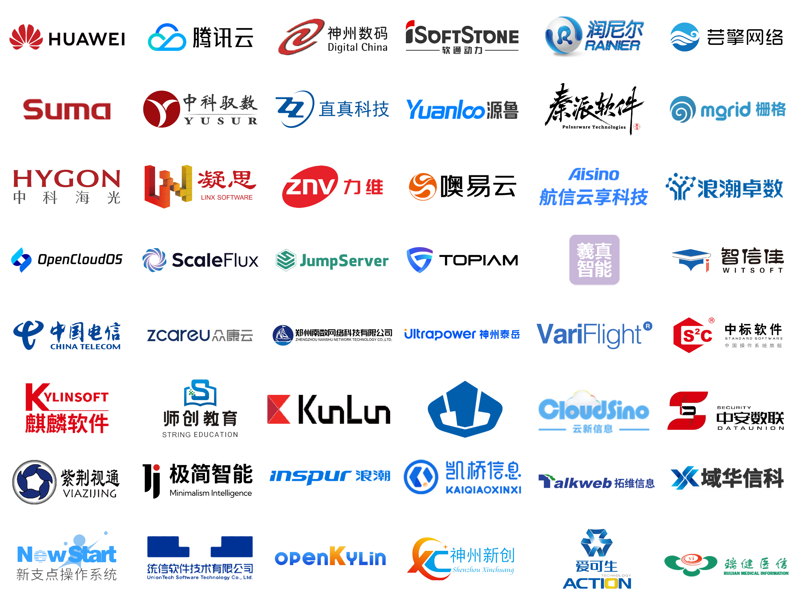

# 兼容性列表

GreatSQL 社区面向数据库产业生态上下游厂商，包括如操作系统、芯片、中间件、存储、服务器、应用软件等，提供包括产品兼容性的测试以及相应的产品适配认证。

通过兼容性测试的产品，将出具社区官方认证证书，并在本页面的“合作企业 LOGO墙”及“认证兼容列表”中更新。

## 如何申请适配

- 步骤 1：填写申请表 

请填写 [GreatSQL 数据库产品兼容互认申请表](https://wj.qq.com/s2/14712421/4055/)，提交产品兼容性适配认证申请。

- 步骤 2：下载测试

下载要适配的 [GreatSQL 数据库版本（推荐最新版本）](https://gitee.com/GreatSQL/GreatSQL/releases)，安装并进行适配测试。

- 步骤 3：提交材料 

将适配自测试报告/测试过程录屏视频（或完整过程关键截图），发邮件至：<greatsql-community@greatsql.cn>。 

- 步骤 4：出具证书 

    - 满足：双方适配。验证完成后，满足兼容性要求，出具《GreatSQL 产品兼容互认证明》。 

    - 未满足：在规定时间内对您的产品进行调整，达到适配兼容性互认要求为止。

    注：如您在规定时间内（15 个工作日）未调试成功或与未配合调整，本次适配工作终止。如需再次适配测试，请重新提交申请，重新开始适配测试工作。

- 步骤 5：盖章 

社区在出具纸质版的《GreatSQL 产品兼容性证明》时将一式两份加盖社区主体章，并通过快递邮寄至申请单位。由申请单位加盖申请单位主体章后，回寄给社区一份证书文件，双方各自存底保留。

- 步骤 6：官网展示

通过社区产品兼容性互认的申请单位，可提供一张 PNG 格式的 LOGO 图片，用于在下方 LOGO 墙中展示。

## 认证兼容列表

### 合作企业 LOGO墙

### 认证兼容列表

| 类别 | 产品名称 | 版本号 | 供应商 |
| :---: | :---: | :---: | :---: |
| 操作系统 | TencentOS Server | v2 | 腾讯云计算（北京）有限责任公司 |
| 操作系统 | TencentOS Server | v3 | 腾讯云计算（北京）有限责任公司 |
| 操作系统 | OpenCloudOS | v8 | OpenCloudOS操作系统开源社区 |
| 操作系统 | OpenCloudOS | v9 | OpenCloudOS操作系统开源社区 |
| 操作系统 | 凝思安全操作系统 | v6.0 | 北京凝思软件股份有限公司 |
| 操作系统 | 天鹤操作系统 | ISSEOS V22 | 软通动力信息技术（集团）股份有限公司 |
| 存储 | OceanStor Pacific 系列分布式存储 | -- | 华为技术有限公司 |
| 存储 | OceanStor 闪存存储 | -- | 华为技术有限公司 |
| 存储 | 参天存储引擎 | -- | 华为技术有限公司 |
| 存储 | ScaleFlux CSD 3000 NVMe SSD | -- | 锐开（北京）科技 有限公司 |
| CPU | 海光CPU | 7000 | 海光信息技术股份有限公司 |
| CPU | 海光CPU | 5000 | 海光信息技术股份有限公司 |
| CPU | 海光CPU | 3000 | 海光信息技术股份有限公司 |
| 服务器/CPU | KunLun服务器/鲲鹏芯片 | 2280、 2460、 5280 | 河南昆仑技术有限公司 |
| DPU | KPU CONFLUX-2200D 数据查询加速 DPU 卡 | -- | 中科驭数（北京）科技有限公司 |
| DPU | KPU SWIFT-2200N 超低时延 DPU 卡 | -- | 中科驭数（北京）科技有限公司 |
| 服务器 | Suma | R62 系列 | 中科可控信息产业有限公司 |
| 服务器 | Suma | R52 系列 | 中科可控信息产业有限公司 |
| 服务器 | Suma | R32 系列 | 中科可控信息产业有限公司 |
| 服务器 | Suma | R64 系列 | 中科可控信息产业有限公司 |
| 应用软件 | TOPIAM 企业数字身份管控平台 | -- | 济南源创网络科技有限公司 |
| 应用软件 | Mgrid 综合运维管理平台 | V1.0 | 深圳栅格信息技术有限公司 |
| 应用软件 | Mgrid 数据中心基础设施监控管理系统软件 | V3.0 | 深圳栅格信息技术有限公司 |
| 应用软件 | Mgrid 数据中心动力环境监控系统 | V5.0  | 深圳栅格信息技术有限公司 |
| 应用软件 | 动力环境监控系统软件 | V1.0 | 北京羲真智能科技有限公司 |
| 应用软件 | 基础设施集成管理系统软件 | V1.0 | 北京羲真智能科技有限公司 |
| 应用软件 | 基础设施运维管理系统软件 | V1.0 | 北京羲真智能科技有限公司 |
| 应用软件 | 校级开放式虚拟仿真教学及资源共享平台 UOWSLab | V2.0 | 北京润尼尔科技股份有限公司 |
| 应用软件 | 开放式实验教学与实验室管理系统 OpenLab | V2.0 | 北京润尼尔科技股份有限公司 |
| 应用软件 | 校级开放式实验教学及实验室综合管理平台 UOWMLab ETS | V1.0 | 北京润尼尔科技股份有限公司 |
| 应用软件 | 校级开放式虚拟仿真实训教学及资源共享平台 SOVSPTRSP | V1.0 | 北京润尼尔科技股份有限公司 |
| 应用软件 | JumpServer 开源堡垒机 | -- | 杭州飞致云信息科技有限公司 |
| 应用软件 | APS 低代码平台 | V1.10 | 航信云享科技有限公司 |
| 应用软件 | 源鲁内外网文件交换系统 | V1.0 | 山东源鲁信息科技有限公司 |
| 应用软件 | 恒生芸擎云收费交易管理软件 | -- | 杭州恒生芸擎网络科技有限公司 |
| 应用软件 | 秦派软件 ATOMDB 数据库管理客户端 | -- | 湘西极语言信息技术有限公司 |
| 应用软件 | 智慧社区综合信息平台 | -- | 浪潮卓数大数据产业发展有限公司 |
| 应用软件 | 力维 PEIM 平台 | -- | 深圳力维智联技术有限公司 |
| 应用软件 | 噢易多架构融合桌面云平台 | -- | 武汉噢易云计算股份有限公司 |
| 应用软件 | 故障管理系统 | -- | 北京直真科技股份有限公司 |
| 应用软件 | 神州数码 TDMP 数据脱敏系统 | -- | 北京神州数码云计算有限公司 |
| 应用软件 | 流程引擎能力中台系统 (Ultra-BPC) | V2.3.0 | 北京神州泰岳软件股份有限公司 |
| 应用软件 | 银河麒麟安全电子邮件系统 | V8 | 麒麟软件有限公司 |
| 应用软件 | 中标麒麟安全电子邮件系统 | V8 | 中标软件有限公司 |
| 应用软件 | 机场协同决策系统（A-CDM） | -- | 飞友科技有限公司 |
| 应用软件 | 本研一体化研究生管理系统 | V7.0 | 北京智信佳科技有限公司 |
| 应用软件 | 智慧研招系统 | V6.0 | 北京智信佳科技有限公司 |
| 应用软件 | 智慧实验室基础管理系统 | V6.0 | 北京智信佳科技有限公司 |
| 应用软件 | 国研智能送审系统 | V6.0 | 北京智信佳科技有限公司 |
| 应用软件 | 数据中台 | V1.0 | 郑州南数网络科技有限公司 |
| 应用软件 | 互联网医疗健康服务平台 | V4.0 | 重庆众康云科技有限责任公司 |
| 应用软件 | 基层一体化信息平台 | -- | 中电信翼康科技有限公司 |
| 应用软件 | 县域医共体平台 | -- | 中电信翼康科技有限公司 |
| 应用软件 | 师创教育智能化校园综合服务软件 | -- | 师创教育软件研究院（江苏）有限公司 |
| 应用软件 | 天地自动化智能化矿山基础信息平台 | V1.0 | 中国煤炭科工集团常州研究院有限公司 |
| 应用软件 | CloudSino DCM、CloudSino SAD、CloudSino iBSM | -- | 广州云新信息技术有限公司 |
| 应用软件 | 中安数联备份与恢复系统 | V1.0 | 陕西中安数联信息技术有限公司 |
| 应用软件 | 云视频平台软件 | V3.0 | 北京紫荆视通科技有限公司 |

## 联系我们

如果您在进行与 GreatSQL 数据库产品兼容性测试时遇到问题，请扫描下方二维码，添加 “GreatSQL 社区小助手” 联系我们。

**扫码关注微信公众号**

