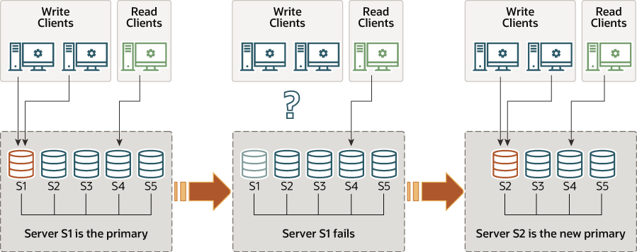
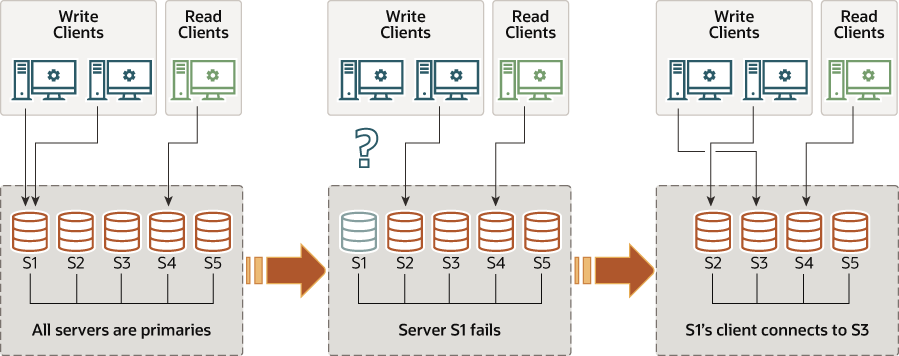
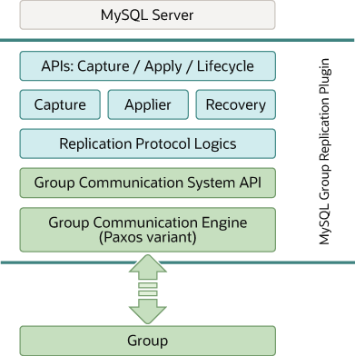

# MGR 简介

---

## 为什么是 MGR
MGR 是 MySQL Group Replication 的缩写，即 MySQL 组复制。

以往一般是利用 MySQL 的主从复制或半同步复制来提供高可用解决方案，但这存在以下几个比较严重的问题：
1. 主从复制间容易发生复制延迟，尤其是在5.6以前的版本，以及当数据库实例中存在没有显式主键表时，很容易发生。
2. 主从复制节点间的数据一致性无法自行实现最终一致性。
3. 当主节点发生故障时，如果有多个从节点，无法自动从中选择合适的节点作为新的主节点。
4. 如果采用（增强）半同步复制，那么当有个从节点因为负载较高、网络延迟或其他意外因素使得事务无法及时确认时，也会反过来影响主节点的事务提交。

因为上述几个明显的缺点，因此 GreatSQL 推出了全新的高可用解决方案——**组复制**，这是本系列文章要着重介绍的新特性。

MGR 是 MySQL 5.7.17 开始引入的。但 MySQL 5.7 已于 2020 年 10 月起不再做大的功能更新，仅提供安全补丁。因此，如果线上还有基于 MySQL 5.7 版本的 MGR 环境，建议尽快升级到 GreatSQL 8.0 版本。

进一步提醒，推荐 GreatSQL 8.0.22 及之后的版本，整体会更稳定可靠，也有些很不错的新功能（不只是 MGR 方面的）。

## MGR 技术概要
MGR 具备以下几个特点：
1. 基于 shared-nothing 模式，所有节点都有一份完整数据，发生故障时可以直接切换。
2. MGR 提供了数据一致性保障，默认是**最终一致性**，可根据业务特征需要自行调整一致性级别。
3. 支持在线添加、删除节点，节点管理更方便。
4. 支持故障自动检测及自动切换，发生故障时能自动切换到新的主节点，再配合 MySQL Router 中间件，应用层无需干预或调整。
5. 支持单节点、多节点写入两种模式，可根据架构或业务需要选择哪种方案，不过**强烈建议选用单主模式**。

MGR 可以选择单主（Single-Primary）模式

如上图所示，一开始S1节点是Primary角色，提供读写服务。当它发生故障时，剩下的S2-S5节点会再投票选举出S2作为新的Primary角色提供读写服务，而S1节点在达到一定超时阈值后，就会被踢出。

亦可选择多主（Multi-Primary）模式（再次**强烈建议选用单主模式**）

如上图所示，一开始S1-S5所有节点都是Primary角色，都可以提供读写服务，任何一个节点发生故障时，只需要把指向这个节点的流量切换下就行。

上述两种架构模式下，应用端通过 MySQL Router 连接后端在 MGR 服务，当后端节点发生切换时，Router 会自动感知，对应用端来说几乎是透明的，影响很小，架构上也更灵活。

## MGR 技术架构
首先来个 MGR 的技术架构图：

MGR 是以 Plugin 方式嵌入 GreatSQL，部署更灵活方便。

事务从Server层通过钩子（hook）进入MGR API接口层，再分发到各组件层，在组件层完成事务Capture/Apply/Recover，通过复制协议层（Replication Protocol Logics）传输事务，最后经由GCS协调事务在各节点的最终一致性。

MGR 节点间由组通信系统（GCS）提供支持，它提供了故障检测机制、组成员角色管理，以及安全且有序的消息传递，这些机制可确保在各节点间一致地复制数据。这项技术的核心是 Paxos 算法的实现，在 GreatSQL 里称之为 XCom，由它充当 MGR 的通信引擎。

对于要提交的事务，组中的多数派节点必须就全局事务序列中给定的事务顺序达成一致。各节点做出决定提交或中止事务的选择，但所有节点都要做出相同的决定。如果发生网络分区，导致节点间无法达成一致决定，则在网络恢复前，MGR 成员间无法通信，MGR 间复制也就无法正常工作。

MGR 支持单主和多主两种模式，在单主模式下，各节点会自动选定主节点，只有该主节点能同时读写，而其他（从）节点只能只读。在多主模式下，所有节点都可以进行读写。

相对于 MariaDB Galera Cluster（以及基于此技术的 Percona XtraDB Cluster，下面为了书写方便，都统称为 PXC），个人认为 MGR 具备以下几个优势：
1. PXC 的消息广播机制是在节点间循环的，需要所有节点都确认消息，因此只要有一个节点故障，则会导致整个 PXC 都发生故障。而 MGR 则是多数派投票模式，个别少数派节点故障时，一般不影响整体的可用性。这也是 PXC 存在的最大问题。
2. PXC 的节点间数据传输除了 binlog，还有个 gcache，这相当于是给 MySQL 又增加两个黑盒子。而 MGR 则都是基于原生 binlog 的，没有新增黑盒子，运行起来更可靠，需要排障时也更方便。
3. 发生网络分区时，整个 PXC 集群都不可用。而 MGR 则至少其成员节点还能提供只读服务（但是 MGR 间复制无法正常工作）。
4. PXC 的流控机制影响更大，一旦触发流控，所有节点都受到影响。而 MGR 触发流控后，只会影响本地节点，不影响远程节点。当然了，MySQL 的流控做的也比较粗糙，在 GreatSQL 中进一步完善和优化。
5. 执行 DDL 期间，整个 PXC 集群都不可同时执行 DML，也就是说不支持 Online DDL。而 MGR 是支持的，这也是很大的优势。

相对于传统主从复制（Replication），MGR 的优势有以下几点：
1. 主从复制非常容易产生复制延迟，尤其是当表中没有显式主键时。而在 MGR 里，要求表一定要有主键（或是可用作聚集索引的非空唯一索引），避免了这个问题。
2. 半同步复制中，一旦 slave 因为锁或其他原因响应慢的话，也会导致 master 事务被阻塞。MGR 是采用多数派确认机制，个别节点响应慢对 Primary 节点的影响没那么大（不要选用 AFTER 模式）。
3. 主从复制没有类似 MGR 那样提供事务数据的一致性保证。MGR 自带了事务数据一致性保障机制。

**扫码关注微信公众号**

