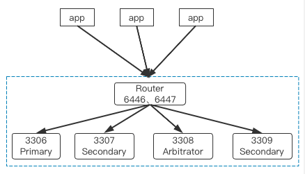

# 单机多实例高可用
---

本文档介绍如何在单机多实例环境下，构建 GreatSQL 数据库高可用架构方案。

注意，线上生产环境通常**不要采用单机多实例架构方案，本方案仅用于开发、测试环境**。

## 高可用方案选择

单机多实例上的高可用方案比较简单，一般可以选用以下几种：

1. lvs/haproxy。
2. MySQL Router 中间件。

本文重点讨论利用 MySQL Router 构建高可用的解决方案，lvs/haproxy 方案请自行搜索。

## 单机多实例部署 MGR 集群

首先，参考文档：[单机多实例](../6-oper-guide/5-multi-instances.md) 完成单机多实例环境部署，并构建 MGR 集群。
```sql
greatsql> SELECT MEMBER_ID,MEMBER_HOST,MEMBER_PORT,MEMBER_ROLE FROM performance_schema.replication_group_members;
+--------------------------------------+-------------+-------------+-------------+
| MEMBER_ID                            | MEMBER_HOST | MEMBER_PORT | MEMBER_ROLE |
+--------------------------------------+-------------+-------------+-------------+
| 62edd23f-07fa-11ed-aad1-00155d064000 | 127.0.0.1   |        3309 | SECONDARY   |
| 66c5a894-07e6-11ed-b1ff-00155d064000 | 127.0.0.1   |        3306 | PRIMARY     |
| 6e65ef68-07e6-11ed-a6d8-00155d064000 | 127.0.0.1   |        3307 | SECONDARY   |
| 6f367f17-07e6-11ed-825d-00155d064000 | 127.0.0.1   |        3308 | ARBITRATOR  |
+--------------------------------------+-------------+-------------+-------------+
```
这是一个单机 4 实例的 MGR 集群，其中包含 1 个 ARBITRATOR 节点。

## 部署 MySQL Router

在前文 [读写分离](../6-oper-guide/2-oper-rw-splitting.md) 中介绍过，MySQL Router 最好是和应用程序端部署在一起。

MySQL Router 的部署方法可以参考文档：[读写分离](../6-oper-guide/2-oper-rw-splitting.md)。

应用程序端只需连接到 Router 的读写分离端口，而无需关注后端数据库实际拓扑结构，当 Primary 节点发生切换时，或者某个 Secondary 节点下线时，都不影响应用程序端的使用。

此时高可用架构图大致如下所示：



在本案中，因为是单机多实例环境，因此直接把 MySQL Router 和数据库服务器部署在一起，没有分开。


**扫码关注微信公众号**


