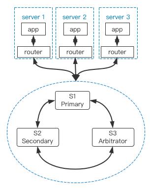

# 单 IDC 高可用
---

本文档主要介绍在单 IDC 场景中，如何基于 GreatSQL + MySQL Router 构建高可用架构。

## 单 IDC 高可用方案选择

单 IDC 场景下的高可用方案也比较简单，一般可以选用以下几种：

1. lvs/haproxy。
2. MySQL Router 中间件。

本文重点讨论利用 MySQL Router 构建高可用的解决方案，lvs/haproxy 方案请自行搜索。

## MySQL Router + GreatSQL MGR 实现单 IDC 内高可用

首先，构建一个三节点的 MGR 集群，该集群包含 Primary、Secondary、Arbitrator 三种节点。
```sql
greatsql> SELECT * FROM performance_schema.replication_group_members;
+---------------------------+--------------------------------------+--------------+-------------+--------------+-------------+----------------+
| CHANNEL_NAME              | MEMBER_ID                            | MEMBER_HOST  | MEMBER_PORT | MEMBER_STATE | MEMBER_ROLE | MEMBER_VERSION |
+---------------------------+--------------------------------------+--------------+-------------+--------------+-------------+----------------+
| group_replication_applier | af39db70-6850-11ec-94c9-00155d064000 | greatsql-01  |        3306 | ONLINE       | PRIMARY     | 8.4.4          |
| group_replication_applier | b05c0838-6850-11ec-a06b-00155d064000 | greatsql-02  |        3306 | ONLINE       | SECONDARY   | 8.4.4          |
| group_replication_applier | b0f86046-6850-11ec-92fe-00155d064000 | greatsql-03  |        3306 | ONLINE       | ARBITRATOR  | 8.4.4          |
+---------------------------+--------------------------------------+--------------+-------------+--------------+-------------+----------------+
```

还是老样子，把 MySQL Router 部署在应用服务器端而非数据库服务器端，这样就不需要针对 MySQL Router 部署高可用方案。

整体架构看起来像是这样：




**扫码关注微信公众号**


