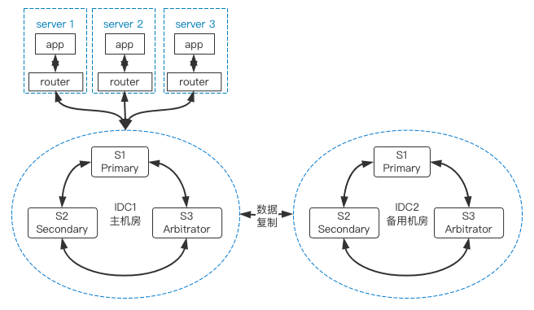
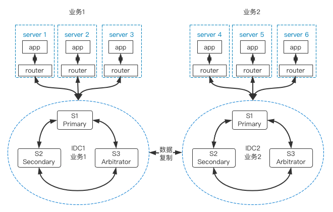
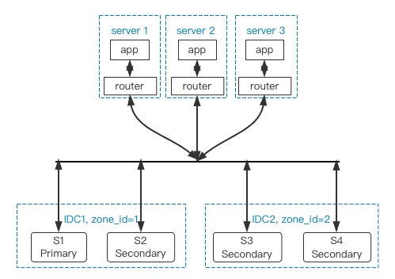

# 同城跨 IDC 高可用
---

本文档主要介绍在同城跨 IDC 场景中，如何基于 GreatSQL + MySQL Router 构建高可用架构。

同城多 IDC 的数据库架构，通常有以下几种方案可选：

## 主备架构方案

这里不是指 MySQL 的主从复制方案，而是指一个主 IDC 对业务提供服务，另一个 IDC 作为备用资源，在紧急情况下可以整体切换，并承担一部分只读业务。

## 垂直区分业务方案

两个 IDC 分别承担一部分业务，在架构设计层面，对业务做好垂直拆分，部分业务放在 A 机房，另一部分业务放在 B 机房，在两套数据库间建立数据复制通道，保证两边数据最终一致。当其中一个 IDC 发生故障时，只会影响一部分业务。在数据一致性有保障的前提下，还可以将故障 IDC 的业务切换到正常 IDC 中。

## 整体 MGR 方案

在两个 IDC 间构建一个跨 IDC 的 MGR 集群，这时候就要求两个 IDC 间的网络延迟不能太大，此时要求 Primary 节点所在本 IDC 有备用节点外，在另一个 IDC 也要保证能复制所有数据，这时可以利用 GreatSQL 的 **地理标签** 特性来保障。

**扫码关注微信公众号**

