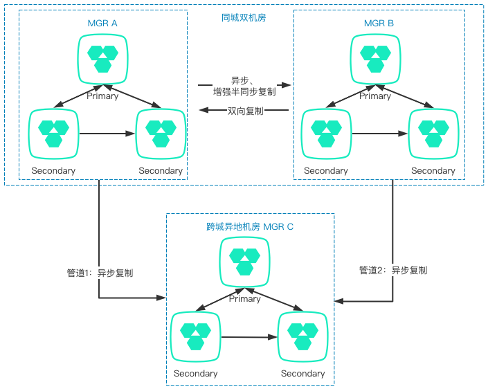

# 跨城多 IDC 高可用
---

本文档主要介绍在跨城多 IDC 场景中，如何基于 GreatSQL + MySQL Router 构建高可用架构。

跨城多 IDC 架构，基本上都是基于同城多 IDC 的数据库架构，再增加一个异地备用 IDC，在本地城市所有机房都发生重大故障时，在异地机房有一套备用系统，用于紧急情况下临时地、有损地响应业务需求。

此外，备用 IDC 可以利用 Async Replication Auto failover 特性，使得在主节点发生切换时，不需要有额外的运维操作。

整体架构图如下所示：

**扫码关注微信公众号**

